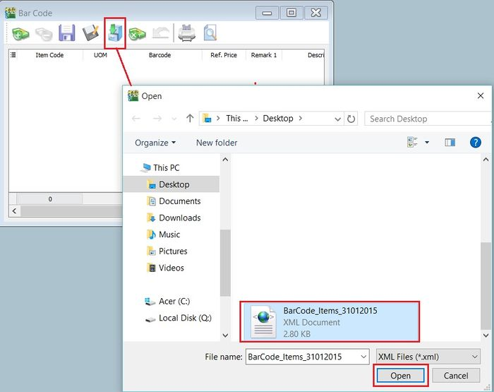

## Barcode

### How to Set Up Barcode

1. Download the GRN Barcode Report Template from the links below:

   1. Barcode Capture from Maintain Stock Item Barcode as Barcode.
      - Template: [GRN BarCode (20×40) Capture Item BarCode](https://www.sql.com.my/webstore/templates/template-detail/?id=4047)

   2. Barcode Capture from Maintain Stock Item as Barcode.
      - Template: [GRN BarCode (35×25) Capture Item Code](https://www.sql.com.my/webstore/templates/template-detail/?id=4058)

2. Steps to import the report into SQL Account:

    :::info
    Refer to this [guide](../../usage/tools/rtm/guide) for details.
    :::

   1. Log on to SQL Account.
   2. Go to **Tools > Report Designer > Import**.
   3. Change the file type from *Fast Report (\*.fr3)* to *SQL Reports (\*.rtm)*.
   4. Select the report downloaded in Step 1.

3. Go to **Purchase > Goods Received Note > Preview**.

    

   - Click on the blue link to enter Report Design.

4. Change the report type to **MM** because the barcode size is small.

    

5. Change barcode size: **File > Page Setup > Paper Size**.

    

   - Currently, this sample is Width = 35mm, Height = 25mm.

6. Click on **SubRptNorm : Document_Detail**.

    

   - **From here, you may change the Barcode layout.**

7. Click on **DBBarcode > Right click > Configure**.

    

   1. **Type**: Select 128.
   2. **Bar Width**: This is the barcode width.

8. GRN Barcode Event.

   - **View > Module > Click on Event Handlers > Procedure DetailBeforeDetail**.

   

    This step captures the item quantity. For example, if the quantity is 10, it will generate 10 barcode labels.

### How to Configure Cash Drawer Settings

- To define the cash drawer settings with a compatible device.

1. **Tools** > **Options** > **Barcode** > **Cash Drawer**.

### How to Configure Barcode Settings

- To define the barcode settings with a compatible device, e.g., a barcode printer.

1. **Tools** > **Options** > **Barcode** > **Barcode**.

## Print Barcode (Direct Printer)

- To print barcode labels using a Special Barcode Printer for items created in Maintain Stock Item.

### How to Configure Barcode Printer Settings

1. **Tools** > **Options** > **Barcode** > **Barcode**.
2. Insert the new barcode printer setting and template.

    
3. Click **OK** to exit.

### How to Print the Barcode Label

1. Click on the arrow beside the **Print** button. See the screenshot below.
2. You can choose either **Print to Printer** (barcode printer) or **Print To File** (output as text file).

## Print Barcode (Windows Printer)

- To print barcode labels using a Windows Printer for items created in Maintain Stock Item.

### How to Update Item Barcode Listing

1. First, update the item barcode in **Maintain Stock Item**.

    

2. Click the **+** button to insert items. See the screenshot below.

    

3. Click the **SAVE** button to save the item barcode listing. Type a file name (e.g., BarCode_Items_31122015) to save. See the screenshot below.

    

4. A message will prompt. Click **OK**.

### How to Load a Previous Item Barcode Listing

1. Click on the **Cabinet** button to load the previous file for the item barcode listing (e.g., BarCode_Items_31122015). Click **OPEN**.

    

2. A confirmation message will prompt. Click **OK** to load it. Click **NO** to cancel.

    

3. A "Load success" message will prompt. Click **OK** to proceed.

    

4. You can continue updating new items and save as a new file name.

    

### How to Preview/Print the Barcode Label

1. Click on **Preview** or **Printer** (to skip the preview).

    

2. After the preview, click the **Printer** button to print.

### How to Change the Label Size (mm) Measurement for the Barcode Label

1. Click on the **Report Name**. See the screenshot below.

    

2. To change the paper unit measurement, click on **Report > Units**, and choose **Millimeters**.

    

3. To change the paper size, click on **File > Page Setup...**

    

4. Click on the **Paper Size** tab, change the **Width** and **Height** to **35** and **25** respectively (mm), e.g., the label paper size is 35mm x 25mm.

    

5. Check the **Layout** tab to make sure **Columns** is set to **1**.

    

6. Check the **Margin** tab as well to make sure all **(Top, Bottom, Left, Right)** are set to **0**. Click **OK** to exit Page Setup.

    

7. To ensure each page contains 1 barcode of an item, right-click on the **Detail** band and select **Position**.

    

8. Set **Print Count** to **1**. Click **OK** to confirm.

    

9. Save the report with another name.

## Stock (Inventory)

### How to Batch Edit Values in Maintain Stock Item

:::tip
Allows you to update/edit field values in batches.
:::

1. Go to **Stock > Maintain Stock Items**.

2. For example, **change the output tax code from ZRL to SR** for ZRL items only.

3. Click on the first column (beside the item column).

4. Drag out the **Output Tax** column.

    

5. You will see the Output Tax column as shown in the screenshot below.

    

6. Click on the **Output Tax** filter.

7. Tick **ZRL**. All ZRL items will be filtered.

    

8. **Press Ctrl + A** to select all ZRL items.

9. Right-click on the highlighted items. Click on **Batch Edit Value**.

    

10. Tick **Output Tax** and select the tax code (**SR**).

11. Click **OK** to proceed with the changes.

    

12. Click **Yes** to confirm the update.

    

13. Click **OK**.

    

- **Result**

Items with the default output tax previously set to ZRL are **successfully changed to SR**.

### How to Set Up Costing Method

1. Go to **Stock > Maintain Stock Group**.

    

2. There are 3 methods you can assign:

   1. **FIFO** - Cost flow assumption that the first goods purchased are also the first goods sold.
   2. **Fixed Costing** – Fixed cost maintained under Maintain Stock Item.
   3. **Weighted Average** - Average cost of production for a product.

3. If you **change** your costing method (with existing transactions):

   1. Please remember to run **Analyse Data Integrity** (**Tools > Analyse Data Integrity**) before checking the costing report again.

   

   :::tip
   The system will automatically update transactions from the first date until the current date with the new costing method.
   :::

## Multi Location Module

- This module is used to manage multiple warehouses, inter-branch transfers, consignment, van sales, etc.

### How to Set Multiple Warehouses

:::info Case Study
HQ is helping the KL branch to order goods, and the goods shall be sent to the KL branch warehouse.
:::

1. When purchasing items from a supplier, you may choose your branch warehouse (KL) as your location in the purchase invoice.

    

2. When you sell the item, you may choose the location to sell from the branch warehouse (KL).

    

3. You will see stock in to the branch warehouse (KL) and stock out from the branch warehouse (KL) when you check your stock card report.

    

From the stock card report, you can see the item is stored in two locations: one is Default, and one is KL. The stock in and out transactions you performed will be reflected in location KL.

### How to Do Consignment

:::info Case Study
A batch of goods is consigned to your customer for selling without billing first. You will only bill them after they sell the goods.
:::

1. Open a stock transfer document to transfer the goods from your warehouse (Default) to the customer warehouse (Batu Caves).

    

2. The customer receives 1 box of goods (20 units) and sells 15 units. Then you can bill the customer for 15 units, where the goods are deducted from the customer location (Batu Caves).

    

3. You will see stock transferred out from your warehouse (Default) and into the customer warehouse (Batu Caves).

    

From the stock card report, you can see the item is sold out from your customer location (Batu Caves) after you create the billing.

## Stock Adjustment & Stock Take

- Allows users to key in quantities in and out of the system, similar to a combination of stock received and stock issued. It is normally used for stock-taking purposes. (**Stock > Stock Adjustment > New**).

### How SQL System Can Help During Stock Take

1. Go to **Stock > Print Stock Physical Worksheet**.

    

2. **Filter** by date, stock group, or other **information** for the stock take. Please **ensure that you have chosen the correct location and batch if you have these 2 modules.**

    

3. Click on **Apply and Preview**.

    

4. **Print out this Stock Physical Worksheet (Stock Take Sheet)** for the storekeeper to manually fill in the actual stock physical quantity at the warehouse. The storekeeper just has to **fill in the actual quantity into the Physical Qty column**.

5. After completing the stock take report, go to **Stock > Stock Adjustment > Drag Out Book Qty and Physical Qty.**

    

    

6. **Repeat Steps 1 & 2** to call out the Stock Physical Worksheet again. Open 2 screens simultaneously: one for Stock Adjustment and another for Stock Physical Worksheet. Then click on **Window > Tile Vertical**.

7. Click on the first item in **Stock Physical Worksheet**, press **Ctrl + A** on the keyboard to select all items. **Then Drag & Drop into Stock Adjustment**.

    

8. Based on the storekeeper’s Stock Take Report, **fill in the actual physical quantity** in your warehouse into the Stock Adjustment **Physical Qty column**. The system will calculate the variance based on the Book Qty and apply it to the Qty column.

:::info
**Book Qty** = Quantity recorded in the system.

**Physical Qty** = Actual Quantity at your warehouse.

**Qty** = Variance between Physical and Book Quantity. The system will automatically adjust and update accordingly. (Physical Qty – Book Qty)
:::

## Stock Price Tag Module

- This module is mainly used to set different pricing groups for different customers and suppliers. It is normally used to set different customer categories with different pricing. To apply individual customer pricing, you can group your customers into different price groups.

### How to Set Up Price Tag

1. Go to **Stock > Maintain Stock Price Tag**.

    

2. **Create a category** for the customer you want.

    

3. Edit Customer Price Tag.

   - After creating the customer category in Maintain Stock Price Tag, click on **Customer > Maintain Customer > Edit the Price Tag and assign it accordingly.**

    

4. Assign Customer Price Tag.

   - Click on **Stock > Maintain Stock Item > Edit and click on the Cust Price Tag, then assign accordingly**.

    

    :::info

    1. **Price Tag**: Select the price tag group you assigned under Maintain Customer.
    2. **Company**: Besides the price tag, you can set specific pricing for an individual customer.
    3. **Qty & UOM**: You can define the quantity to which you want to apply the price.
    4. **Unit Price**: The unit price you want to offer for those customers.
    5. **Discount**: You can follow the original unit price but give a discount, e.g., 5% or RM 5.
    6. **Note**: Additional remarks you can record, like "Year End Sales Promotion".
    7. **Date From & Date To**: The price validity date.

    :::

5. **Repeat** the same steps for Supplier if you want to apply it to the **Supplier Price**.

## Reorder Lvl & Qty

### How to Set the Reorder Level

:::info Definition
Reorder level (or reorder point) is the inventory level at which a company would place a new order or start a new manufacturing run.
:::

**Example:**

- For this item, Reorder Qty = 5. When Bal Qty is less than 5 units (e.g., 9-5 = 4), saving the document will prompt a dialog (**Stock Quantity Control**) to remind you to place an order.

:::tip
The Stock Quantity Control dialog can be turned on via **Tools > Options > Miscellaneous > Prompt Negative Stock Quantity Dialog Box > Checked**.
:::

### How to Set the Reorder Qty

:::info Definition
Reorder quantity is the point at which a business must buy more inventory so as not to run out of stock.
:::

**How to check if stock is running below the reorder level?**

1. **Stock > Print Stock Reorder Advice > Select any criteria if applicable > Apply**.

:::info
Criteria A: Options available:

1. On Hand Qty
2. On Hand Qty + PO
3. On Hand Qty – SO
4. On Hand Qty + PO – SO

VS

1. Reorder Level
2. Min Level
3. Max Level

:::

There is a faster way to create a Purchase Order (PO) with Reorder QTY. Please see the screen below:

Steps:

1. After getting the appropriate result from **Reorder Advice**, click on the **First Item**, press the **Shift Key** (Keyboard), and click on the **Last Item**.
2. **New PO > Select Supplier > Drag from Reorder Advice to PO Itemize** (as per picture). PO Qty = Reorder Qty.

## Serial No Module

### How to Set Up Control Serial Number

1. Go to **Stock > Maintain Stock Item > Edit > Check Serial No** if you would like to control the serial number for this item.

    

2. **Purchase > Goods Received Note > New**.

There are 3 methods to apply serial numbers:

- **Method 1: Manually Enter**

1. Click on **+ (Green Icon)** > Manually Enter in the Empty Box.

    

- **Method 2: Import from Notepad / Word**

1. Enter the Serial No in Notepad.

    

2. Click **Import**.

    

3. Select the Notepad file where you saved it.

    

4. Click **OK**.

    

- **Method 3: Generator**

1. Click on **Generator**.

    

2. **Format** = Serial No Format.

    **Start From** = What number you wish to start from.

    **Count** = How many units to generate.

    

3. Here is the output.

    

4. **Sales > Delivery Order > Click Add.**

    

    **+ (Green Color) Same method as Method 1**.
    **Import same method as Method 2**.

5. Tick **Serial No** > Press **OK**.

    

:::info
Stock Adjustment does not support serial numbers. You may use Stock Received and Stock Issue as a replacement.
:::

## Serial No Report

1. **Stock > Print Stock Physical Worksheet** – Will show all balance serial numbers that haven't been used.

2. **Stock > Print Stock Card** - Tick **Calculate Serial Number** before applying.

    :::info Note
    *Checked Calculate Serial No > Only Report : Stock Card – Location*
    :::

3. **Stock > Print Stock Month End Balance** – Tick **Calculate Serial Number** before applying.

4. **Stock > Print Stock Serial No Conflict**

    1. To check non-existent Serial No. Example: Purchase for this Item has serial number 555666, but when stocking out, the serial number is 222333.
    2. To check duplicate Serial Numbers received at the same location/batch for the same item. If returned to stock with the same serial number and out again, it will not be considered a conflict.

5. **Stock** > **Print Stock Outstanding Serial No**.

    1. For those documents Issued or Received without applying a serial number.

6. **Inquiry > Print Serial No Inquiry**.

    1. Check serial no movement.

7. **Sales > S/N Profit & Loss by Document**.

    1. This Report Cost captures exactly from Stock In Serial Number Cost.
    If DO transfers to IV, because DO has deducted the Serial number, there will be no result for this report.

### How to Use Access Rights for Serial No

1. **Group Stock > Always match Qty with Serial No**.

    - This access right means the serial no must match the Qty keyed in. E.g., 2 Qty must have 2 Serial Nos.
    - If this right is checked, Print Outstanding Serial No will show no results.

2. **Allow Non-Existent Serial No**.

    - This access right controls whether to allow stocking out a serial number without matching the serial number from purchase.
    Example: Purchase for this Item has serial number 555666, but when stocking out, the serial number is 222333. If you do not allow this, you may uncheck this access right.
    - If this right is unchecked, Print Stock Serial No Conflict will show no results.

## Stock Month End Balance

### Why can't I update the GL Stock Value at Stock Month End Balance?

- **Issue**
- Click the **Update** button at Stock Month End Balance, but no stock value is updated to GL Maintain Stock Value.

    

- **Solution**

1. Ensure all **stock groups** have defined a **Stock Account**.

    

2. Apply the Stock Month End again and click the **Update** button.

    

3. **GL > Maintain Stock Value**... Stock Value is now the same as Stock Month End Balance.
