## Barcode

### How to Setup Barcode

1. Download the GRN Barcode Report Template from the link below.

   1. Barcode Capture from Maintain Stock Item Barcode as Barcode.
      - Template: [GRN BarCode (20×40) Capture Item BarCode](https://www.sql.com.my/webstore/templates/template-detail/?id=4047)

   2. Barcode Capture from Maintain Stock Item as Barcode.
      - Template: [GRN BarCode (35×25) Capture Item Code](https://www.sql.com.my/webstore/templates/template-detail/?id=4058)

2. Steps to import the report into SQL.

    :::info
    Refer to this [guide](../../usage/tools/rtm/guide) for details
    :::

   1. Logon to SQL Account.
   2. Go to **Tools > Report Designer > Import**.
   3. Change the file type from *Fast Report(\*.fr3)* to  *SQL Reports(\*.rtm)*.
   4. Select the report downloaded from Step1.1 or 1.2.

3. Purchase > Goods Received Note > Preview.

    

   - Click on blue color link to enter into Report Design.

4. Change the report type to MM due to the barcode size is small.

    

5. Change barcode size - > File > Page Setup > Paper Size.

    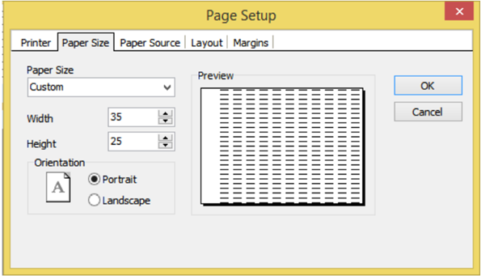

   - Currently this sample is Width = 35mm > Height = 25mm.

6. Click on SubRptNorm : Document_Detail.

    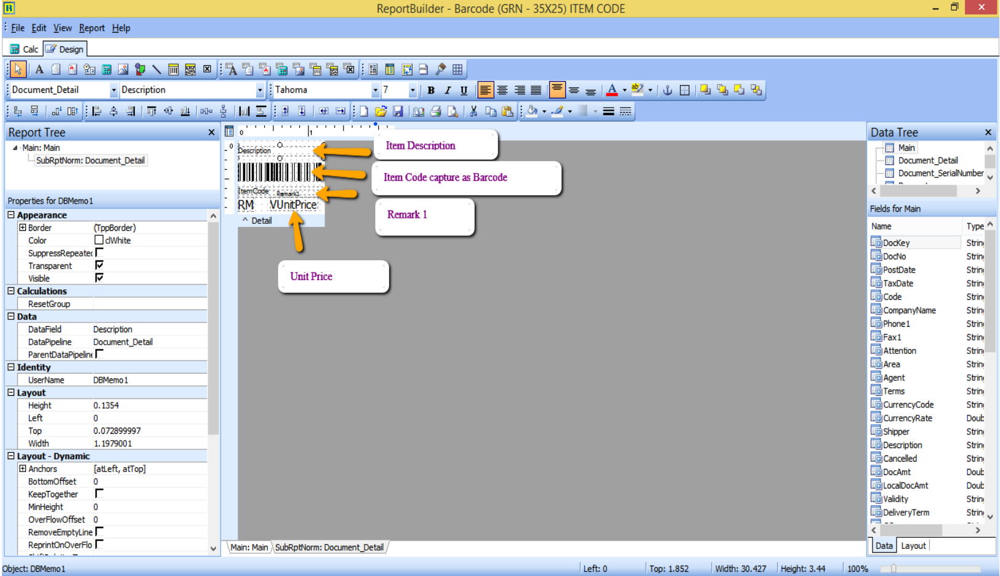

   - **From here you may change the Barcode layout.**.

7. Click on DBBarcode > Right click > Configure.

    

   1. Type : Select 128.

   2. Bar Width : This is barcode width.

8. GRN Barcode Event.

   - View > Module > Click on Event Handlers > Procedure DetailBeforeDetail.

   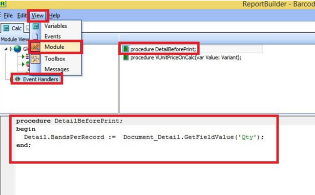

    This step captures the item quantity. For example, if the quantity is 10, it will generate 10 barcode labels.

### How to Do Cash Drawer Setting

- To define the cash drawer setting with a compatible device, eg. cash drawer.

1. **Tools** > **Options** > **Barcode** > **Cash Drawer**.

### How to Do Barcode Setting

- To define the barcode setting with a compatible device, eg. barcode printer.

1. **Tools** > **Options** > **Barcode** > **Barcode**.

## Print Barcode (Direct Printer)

- To print the bar code label using Special Bar Code Printer for the items created in Maintain Stock Item.

### How to Do Barcode Printer Setting

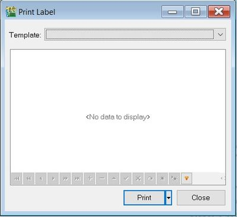

1. **Tools** > **Options** > **Barcode** > **Barcode**.
2. Insert the new barcode printer setting and template.

    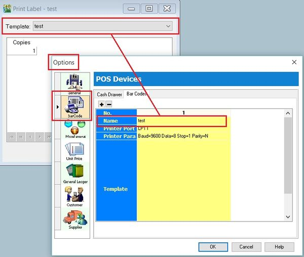
3. Click on OK to exit.

### How to Print the Barcode Label

1. Click on the arrow key-down beside the Print button. See the screenshot below.
2. You can choose either Print to Printer (barcode printer) or Print To File (output as text file).

## Print Barcode (Winodws Printer)

- To print the barcode label using a Windows Printer for the items created in Maintain Stock Item.

### How to Update Item Barcode Listing

1. At first, you can update the item bar code in the Maintain Stock Item.

    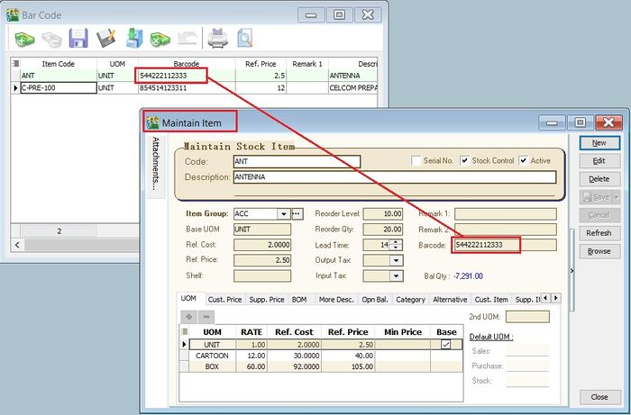

2. Click on + button to insert the items. See the screenshot below.

    

3. Click the SAVE button to save the item bar code listing. Type a file name (eg. BarCode_Items_31122015) to save. See the screenshot below.

    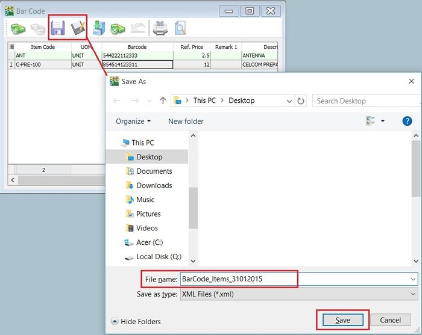

4. Message prompted. Click OK.

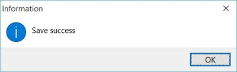

### How to Load the Previous Item Barcode Listing

1. Click on a Carbinet button to load the previous file for the item barcode listing (eg.BarCode_Items_31122015). Click on OPEN.

    

2. Confirmation message prompted. Click on OK to load it. Click on NO' to cancel it.

    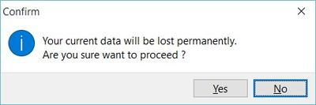

3. Message Load success prompted. Click on OK to proceed.

    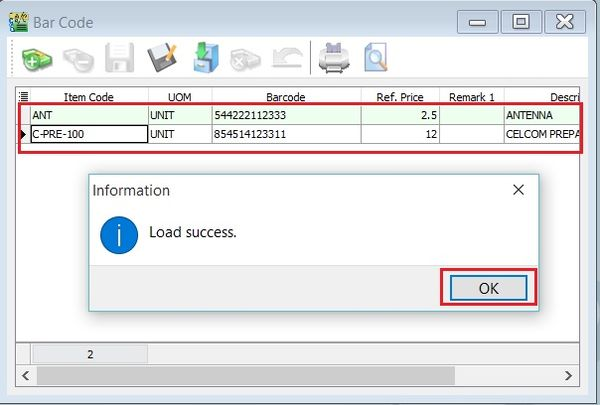

4. You can continue updating the new items and save as new file name.

    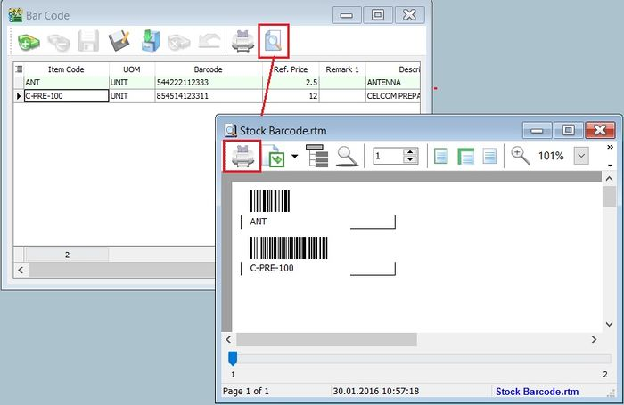

### How to Preview/Print the Barcode Label

1. . Click on Preview or Printer (to skip the preview).

    

2. After the preview, click on Printer button to print.

### How to Changing the Label Size (mm) Measurement for the Bar Code Label

1. Click on the **Report Name**. See the screenshot below.

    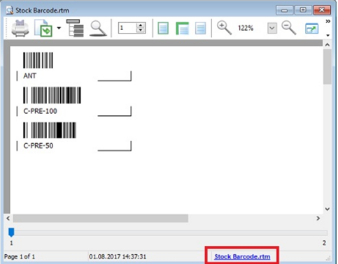

2. To change the paper unit measurement. Click on **Report > Units**, choose to **Millimeters**.

    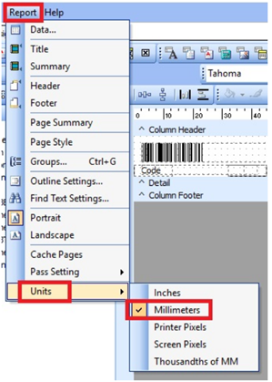

3. To change the paper size. Click on **File > Page Setup...**

    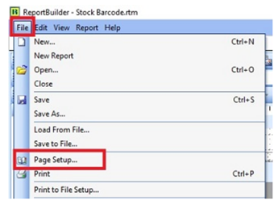

4. Click on **Paper Size** tab, change the **Width** and **Height** to **35** and **25** respectively (mm), eg. the label paper size is 35mm x 25mm.

    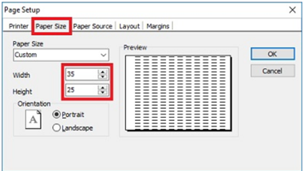

5. Check the **Layout** tab to make sure the **Columns** set to value = **1**.

    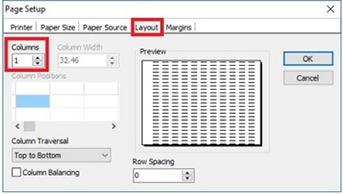

6. Check the **Margin** tab as well to make sure all **(Top, Bottom, Left, Right)** are set to value = **0** . Click **OK** to exit Page Setup.

    

7. To fix label each page contains 1 barcode of an item. Right click on **Detail** band, select **Position**.

    

8. Set **Print Count** to value = **1**. Click **OK** to confirm.

    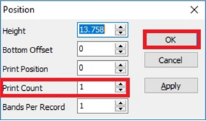

9. Save the report with another name.

## Stock (Inventory)

### How to Batch Edit Value in Maintain Stock Item

:::tip
Allow to update/edit the field value by batch.
:::

1. Go to **Stock > Maintain Stock Items**.

2. For example, **change the output tax code from ZRL to SR** for ZRL items only.

3. Click on the first column (beside the item column).

4. Tick out the Output Tax column.

    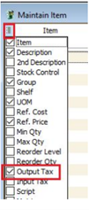

5. You will see the Output Tax column as per the screenshot below.

    

6. Click on Output Tax filter.

7. Tick ZRL. All ZRL items will be filtered.

    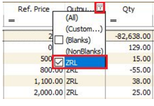

8. **Press Ctrl + A** to select all ZRL items.

9. Right click on the highlighted items. Click on **Batch Edit Value**.

    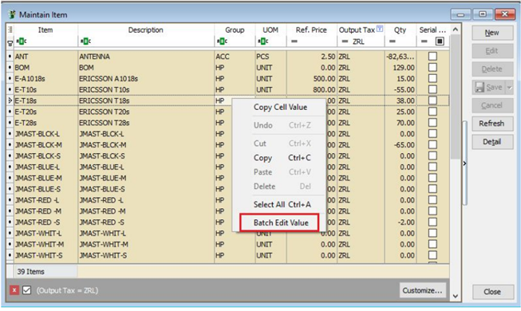

10. Tick Output Tax and select the tax code (SR).

11. Click Ok to proceed the changes.

    

12. Click **Yes** to confirm update.

    

13. Click **Ok**.

    

- **Result**

Items default output tax previously ZRL are **successfully changed to SR**.

### How to Setup Costing Method

1. Go to Stock > Maintain Stock Group.

    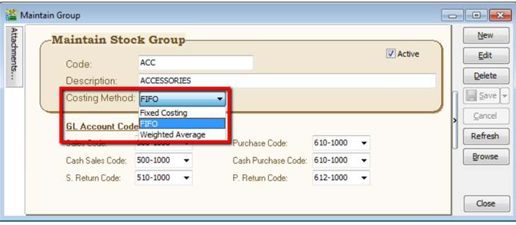

2. There have 3 method let you to assign.

   1. FIFO - cost flow assumption that the first goods purchased are also the first goods sold.
   2. Fixed Costing –fixed cost where had maintain under maintain stock item.
   3. Weighted Average -average cost of production to a product.

3. If you **change** your costing method (previously with transaction existing).

   1. Please remember must run **analyse data integrity** (tools | analyse data integrity) before you check the costing report again.

   

   :::tip
   System will auto update from first date until current date transaction with new costing
   method cost….
   :::

## Multi Location Module

- This module is to manage mulitple warehouse, inter-branch transfer, consignment, van-sales, etc.

### How to Set Multiple Warehouse

:::info Case studies
HQ is helping the KL branch to order goods and goods shall be sending to KL branch warehouse.
:::

1. When purchase the item from supplier, you may choose your branch warehouse (KL) as your location in purchase invoice.

    

2. When you sell out the item, you may choose the location to be sell out from branch warehouse (KL).

    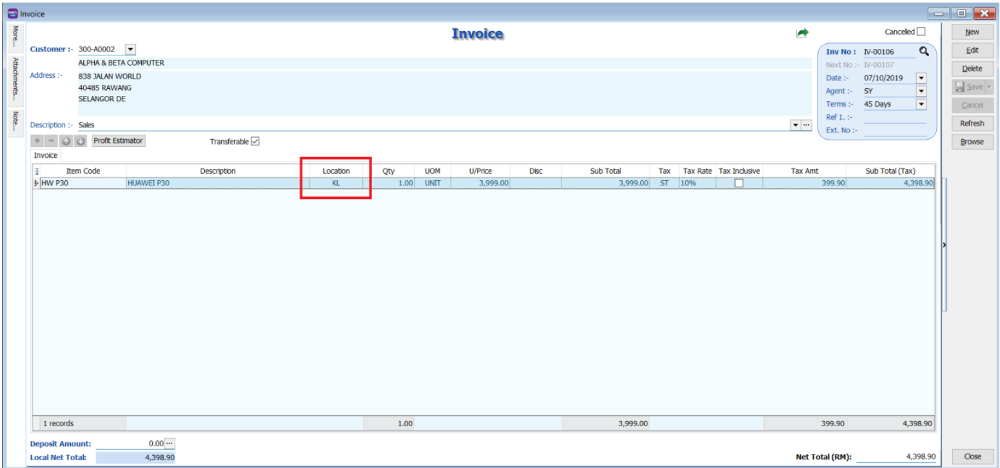

3. You will see stock in to branch warehouse (KL) and stock out from branch warehouse (KL) as well when you check your stock card report.

    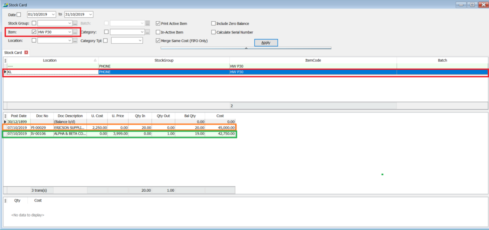

From the stock card report, you can see the item is store in two locations, one is default, one is KL, the stock in and out that previously u did will be in location KL.

### How to Do Consignment

:::info Case studies
A batch of goods is consigned to your customer side for selling without billing first, will only bill after they sell out the goods.
:::

1. Open a stock transfer documents to transfer the goods from your warehouse (Default) to customer warehouse (Batu Caves).

    

2. Customer received 1 box of goods (20 units) and sold out 15 units. Then you can bill customer 15 units in where the goods out from customer location (Batu Caves).

    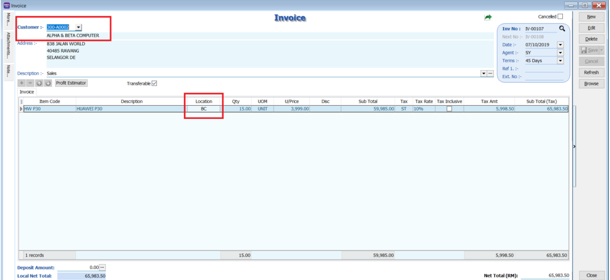

3. You will see stock transfer out from your warehouse (Default), and stock will transfer into customer warehouse (Batu Caves).

    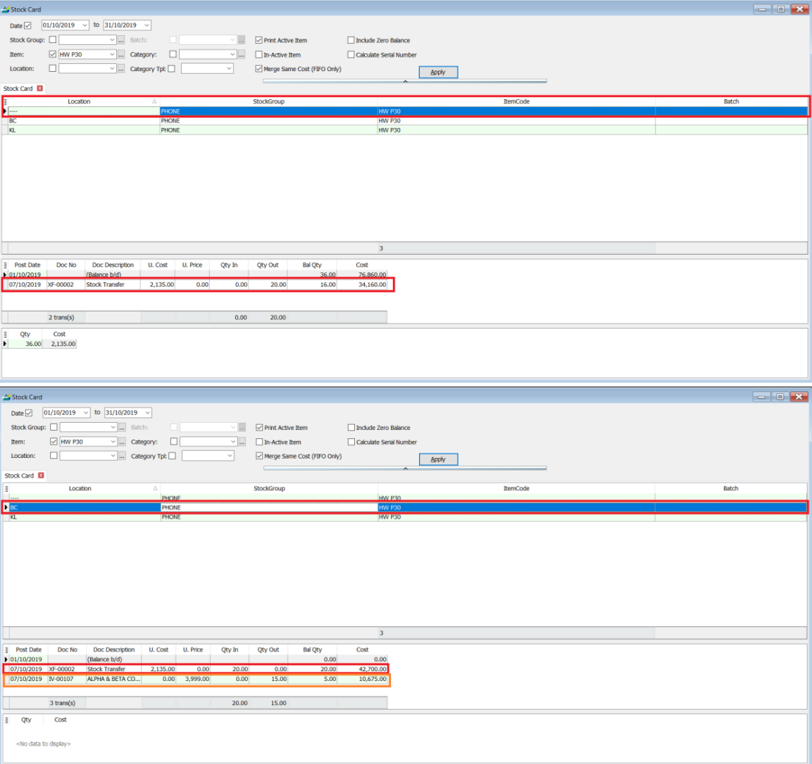

From the stock card report, you can see the item is sold out from your customer location (Batu Caves) after you make the billing.

## Stock Adjustment & Stock Take

- Allows users to key in quantities in and out of the system, similar to a combination of stock received and stock issued. It is normally used for stock-taking purposes. (Stock > Stock Adjustment > New).

### How SQL System can help during Stock Take ?

1. Go to **Stock > Print Stock Physical Worksheet**.

    

2. **Filter** the date, stock group or others **information** that you want to do for the stock take, please **ensure that you have chosen the correct location and batch if you have these 2 modules.**

    

3. Click on **Apply and Preview**.

    

4. **Print out this stock physical worksheet -stock take sheet** for stock keeper to manually fill in the actual stock physical quantity at warehouse, so stock keeper just have to **fill in the actual quantity into the physical qty column**.

5. After complete update the stock take report, click on **Stock > Stock Adjustment > Drag Out Book Qty and Physical Qty.**

    

    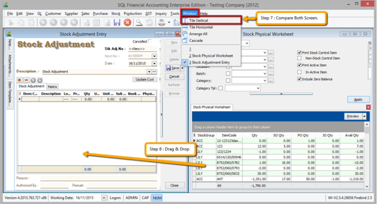

6. **Repeat the Step 1 & 2** to call out the Stock Physical Worksheet again, at the same time open 2 screen, one is stock adjustment another is stock physical worksheet, then click on **Window | Tile Vertical**.

7. Click on the first item in **Stock Physical Worksheet**, press on **Ctrl + A** on keyboard to select all items. **Then Drag & Drop into Stock Adjustment**.

    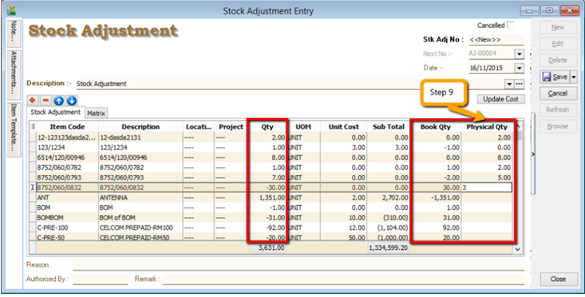

8. Based on the stock keeper’s Stock Take Report then **fill in the actual physical quantity** on your warehouse into the Stock Adjustment **Physical Qty column**, then system will base on Book Qty and calculate the variant then apply at Qty column.

:::info
**Book Qty** = Quantity that record in system.

**Physical Qty** = Actual Quantity at your warehouse.

**Qty** = Variant between Physical and Book Quantity, system will auto adjust then update accordingly.( Physical Qty – Book Qty )
:::

## Stock Price Tag Module

- This module is mainly used to set different pricing groups for different customers and suppliers. It is normally used to set different customer categories with different pricing. In order to do individual customer then you can group your customer into different price groups.

### How to Setup Price Tag

1. Go to **Stock > Maintain Stock Price Tag**.

    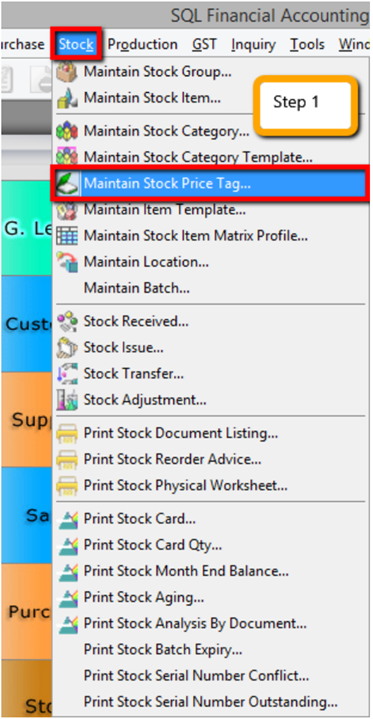

2. **Create category** of the customer that you want.

    

3. Edit Customer Price Tag.

   - After creating the customer category in Maintain Stock Price Tag, click on **Customer > Maintain Customer > Edit the Price Tag and assign it accordingly.**

    

4. Assign Customer Price Tag.

   - Click into **Stock > Maintain Stock Item > Edit and click in the Cust Price Tag then assign accordingly**.

    

    :::info

    1. **Price Tag** : Select the price tag which you have assign the group under Maintain Customer.
    2. **Company** : Beside of price tag, you can set a particular pricing to an individual customer.
    3. **Qty & UOM** : You can define the quantity that you want to apply the price.
    4. **Unit Price** : The unit price that you want to offer for those customer.
    5. **Discount** : You can set follow original unit price but you give discount more like 5% or RM 5.
    6. **Note** : Additional remark that you can record, like Year End sales promotion.
    7. **Date From & Date To** : The price validity date.

    :::

5. **Repeat** the same step on Supplier if you want apply on the **Supplier Price**.

## Reorder Lvl & Qty

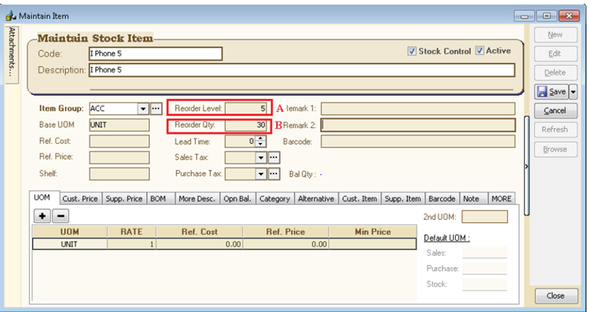

### How to Set the Reorder Level

:::info Definition
Reorder level (or reorder point) is the inventory level at which a company would place a new order or start a new manufacturing run.
:::

**Example:**

- For this item, Reorder Qty = 5, when Bal Qty less than 5 unit(Which is 9-5 = 4), saving document will prompt(Dialog : Stock Quatity Control) to remind you should place an order.

:::tip
Stock Quality Control dialog can choose to Turn On (Tools > Option > Miscellaneous > Prompt Negative Stock Quantity Dialog Box > Checked it).
:::

### How to Set the Reorder Qty

:::info Definition
Reorder quantity is the point at which a business must buy more inventory as to not run out of inventory.
:::

**How to check the stock is running out of reorder level ?**

1. Stock > Print Stock Reorder Advise > Select any criteria if have > Apply.

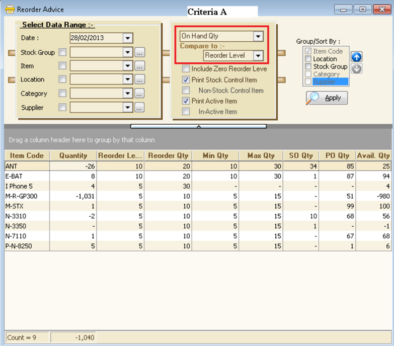

:::info
Criteria A : There have option :

1. On Hand Qty
2. On Hand Qty + PO
3. On Hand Qty – SO
4. On Hand Qty + PO – SO

VS

1. Reorder Level
2. Min Level
3. Max Level

:::

There is a faster way to create Purchase Order (PO) with Reoder QTY. Please see below Screen :

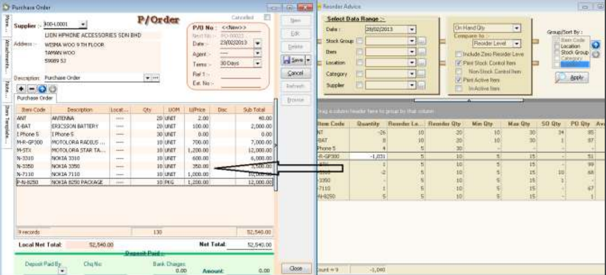

Step :

1. After get the appropriate result of Reoder Advise > Click on First Item > Press Shift Key(Keyboard) > Click on Last Item.
2. New PO > Select Supplier > Drag from Reorder Advise to PO Itemize (As per picture). PO Qty = Reorder Qty.

## Serial No Module

### How to Setup Control Serial Number

1. Go to **Stock > Maintain Stock Item > Edit > Checked Serial No** if you would like to control the serial number for this item.

    

2. **Purchase > Goods Received Note > New**.

There are 3 methods to apply serial no :

- **Method 1 : Manually Enter**

1. Click on + (Green Icon) > Manually Enter at Empty Box.

    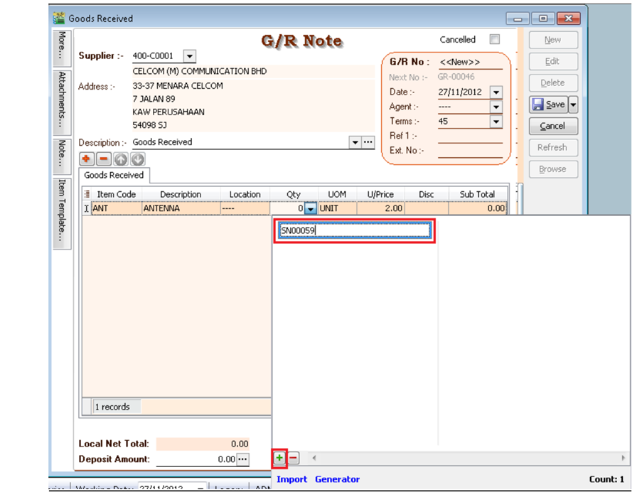

- **Method 2 : Import from Notepad / Word**

1. Enter the Serial No at the notepad.

    

2. Click Import.

    

3. Select Notepad where you have saved to.

    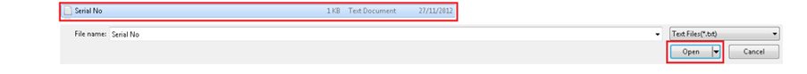

4. Click Ok.

    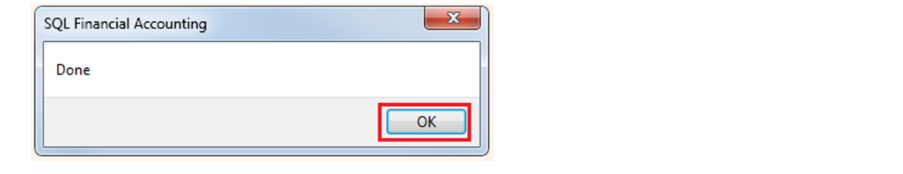

- **Method 3 : Generator**

1. Click on Generator.

    

2. Format = Serial No Format.

    Start From = What number you wish to start from.

    Count = How many units to generate.

    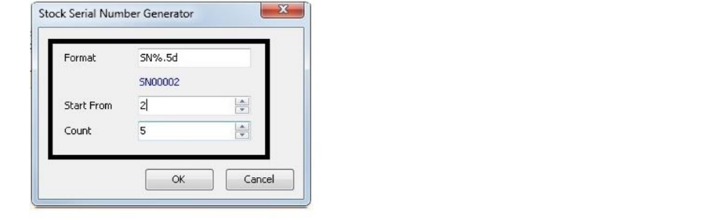

3. Here the output.

    

4. **Sales > Delivery Order > Click Add.**

    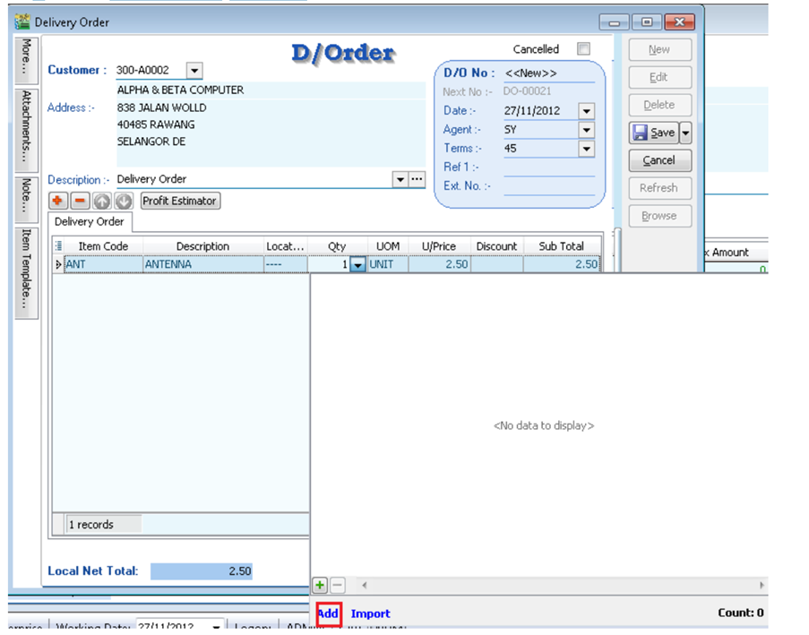

    **+ (Green Color) Same method as Method 1**.
    **Import same method as Method 2**.

5. Tick Serial No > Press Ok.

    

:::info
Stock Adjustment does not support serial no. You may use Stock Received and Stock Issue as a replacement.
:::

## Serial No Report

1. **Stock > Print Stock Physical Worksheet** – Will show all balance serial number haven’t use.

2. **Stock > Print Stock Card** - Tick Calculate Serial Number before apply.

    :::info Note
    *Checked Calculate Serial No > Only Report : Stock Card – Location*
    :::

3. **Stock > Print Stock Month End Balance** – Tick Calculate Serial Number before apply.

4. **Stock > Print Stock Serial No Conflict**

    1. To check non Existent Serial No. Example : Purchase for this Item the serial number is 555666, but when stock out stock the serial number is 222333.
    2. To check duplicate Serial Number received at the same location / batch for the same item. If return in the stock with same serial number and out again will not consider conflict.

5. **Stock** > **Print Stock Outstanding Serial No**.

    1. For those documents Issued or Received do no applying serial no.

6. **Inquiry > Print Serial No Inquiry**.

    1. Check serial no movement.

7. **Sales > S/N Profit & Loss by Document**.

    1. This Report Cost is capture exactly from Stock In Serial Number Cost.
    If DO transfer to IV, due to DO have deducted Serial number, so will not have any result for this report.

### How to USe Access Right for Serial No

1. **Group Stock >Always match Qty with Serial No**.

    - which mean this access right the serial no must match with Qty key in. Eg : 2 Qty must have 2 Serial No.
    - If checked this right, Print Outstanding Serial No will no result.

2. **Allow Non-Existent Serial No**.

    - Which mean this access right control if tick which will allow out stock the serial number without match the serial number when purchase.
    Example : Purchase for this Item the serial number is 555666, but when stock out stock the serial number is 222333. If you do not allow this, may uncheck this access right.
    - If unchecked this right, Print Stock Serial No Conflict will no result.

## Stock Month End Balance

### Why cannot update the GL Stock Value at Stock Month End Balance?

- **Issue**
- Click the Update button at Stock Month End Balance, but no stock value is updated to GL Maintain Stock Value.

    

- **Solution**

1. Ensure all the **stock group** has defined a **Stock Account**.

    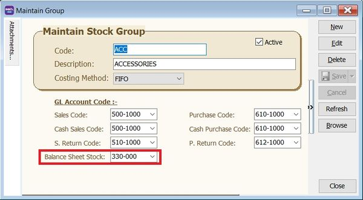

2. Apply the Stock Month End again and click **Update** button.

    

3. **GL | Maintain Stock Value**....Stock Value has same to Stock Month End Balance.
