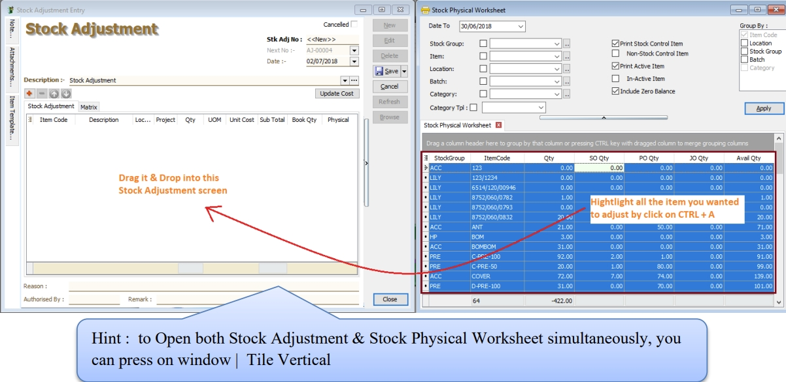
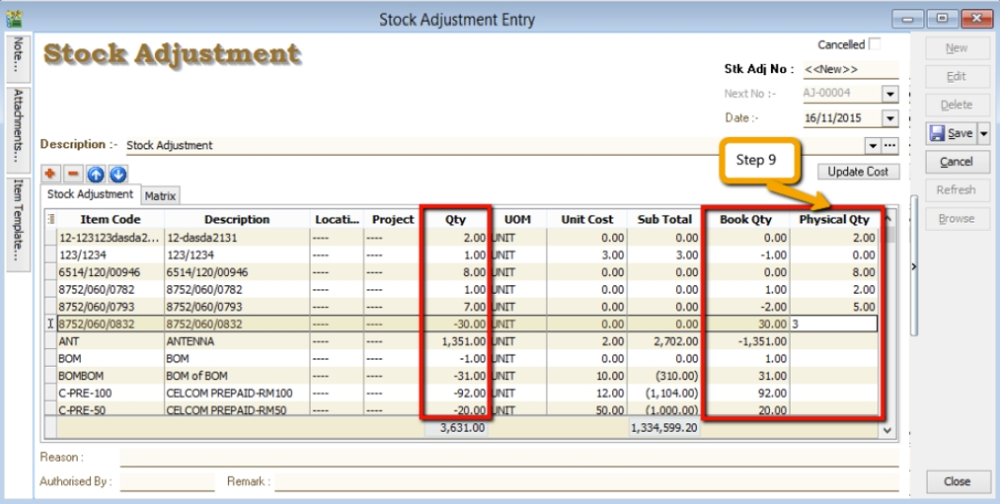

## Maintain Stock Group

1. **Stock** > **Maintain Stock Group**.

2. It is commonly used to categorize the stock based on the following considerations.
    - Brandings, e.g., **Apple, Sony, Samsung, LG**, etc.
    - Different **costing method**;
    - Product types, eg. **raw materials, trading products, manufactured products**;
    - To report different sales/purchase account in **Profit & Loss Statement**.

    

3. Maintain Stock Group form as shown in the screenshot below.

    

| **Field Name** | **Explanation & Properties** |
|----------------|------------------------------|
| **Code** | • Input the new Stock Group code   • Field type: Alphanumerical   • Length: 20 |
| **Description** | • Input the Stock Group description   • Field type: Alphanumerical   • Length: 200 |
| **Costing Method** | • Select an appropriate Costing Method for stock valuation   • Options: FIFO, Weighted Average, Fixed Costing |
| **Sales Code** | • Select a GL Account for Sales |
| **Cash Sales Code** | • Select a GL Account for Cash Sales |
| **S.Return Code** | • Select a GL Account for Sales Returns Inward |
| **Purchase Code** | • Select a GL Account for Purchase |
| **Cash Purchase Code** | • Select a GL Account for Cash Purchase |
| **P.Return Code** | • Select a GL Account for Purchase Returns Outward |

## Maintain Stock Item

1. **Stock** > **Maintain Stock Item**.

2. To set up the stock item list.

### Main Header

1. Maintain Stock Item entry form is shown in the screenshot below.

| **Field Name** | **Explanation & Properties** |
|----------------|-------------------------------|
| **Code** | • Input the new Stock Code   • Field type: Alphanumerical   • Length: 30 |
| **Description** | • Input the Stock Description (This usually appears in most of the documents printouts, e.g., invoices, purchase orders, etc...)   • Field type: Alphanumerical   • Length: 200 |
| **2nd Description** | • Input the 2nd Description, eg. size, alternative product name   • Field type: Alphanumerical   • Length: 200 |
| **Serial No.** | • Tick to enable serial control items (Requires Serial Number module)   • Field type: Checkbox |
| **Stock Control** | • Tick to enable stock control. The system will check availability to ensure the stock balance does not fall below zero or the reorder level.   • Field type: Checkbox |
| **Active** | • Tick for the stock in use   • Untick for discontinued stock   • Field type: Checkbox |
| **Item Group** | • Select an appropriate Stock Group |
| **Base UOM** | • Enter a base UOM for stock valuation, eg. UNIT |
| **Ref. Cost** | • Enter a standard cost |
| **Ref. Price** | • Enter a standard selling price |
| **Shelf** | • Enter a shelf/rank no., e.g., A-01, A-02, A-03 in location A |
| **Reorder Level** | • Enter a stock reorder level to alert new order   • Refer to menu: Stock \ Print Stock Reorder Advice... |
| **Reorder Qty** | • Enter a reorder qty (MOQ) |
| **Lead Time** | • Enter a lead time to receive the goods |
| **Output Tax** | • Enter a default Output Tax |
| **Input Tax** | • Enter a default Input Tax |
| **Remark 1** | • Free field to enter extra info |
| **Remark 2** | • Free field to enter extra info |
| **Barcode** | • Enter a barcode (represents base UOM) |
| **Tariff** | • Assign a tariff code   • Lookup from Maintain Tax   • Related Topic: Maintain_Customer#Tax , Maintain_Supplier#Tax |
| **Bal Qty** | • Display the latest qty balance |

### UOM

1. Allow to set multiple UOM, e.g., 1 carton = 12 units.
2. Besides that, you can set the default UOM for Sales, Purchase and Stock entry form.
3. See the screenshot below.

### Cust.Price

1. Allow to set **multiple pricing/contract prices** for customer.
2. You can use **price tag** to tag the price for a customer.
3. The **Multiple Pricing** module is required.
4. See the screenshot below.

### Supp.Price

1. Allow to set **multiple pricing/contract prices** for supplier.
2. You can use **price tag** to tag the price for a supplier.
3. The **Multiple Pricing** module is required.
4. See the screenshot below.

- Related Topic : [How is the Price Tag work?](https://sites.google.com/site/sqlestream/sql-financial-accounting/7-system-setting/7-20-how-is-the-price-tag-work)

### BOM

1. Allow to setup **recipes/ingredients** for a manufactured product.
2. The **Bill of Materials** module is required.
3. See the screenshot below.

### More Desc

1. Enter the product details or specifications.
2. See the screenshot below.

> **Tips:**
> Example view from Sales Tax Invoice:

### Opn Bal

1. Used to enter the opening stock quantity and value balances.

### Category

1. Used to set multiple stock categories for reporting purposes, e.g., country origins, brands, etc.
2. See the screenshot below.

### Alternative

1. Enable to identify the alternative items for replacement.

### Cust. Item

1. To enter the **customer item code** and **description**.
2. The purpose is to search for or print the customer item code and description in a tax invoice instead of using the original item description.

### Supp. Item

1. To enter the **supplier item code** and **description**.
2. The purpose is to search for or print the supplier item code and description in a purchase invoice instead of using the original item description.

### Barcode

1. To enter the barcode for different UOM.
2. See the screenshot below.

### Note

1. Others stock information.

| **Field Name** | **Explanation & Properties** |
|----------------|-------------------------------|
| **Item Creation Date** | • Item created date.   • Field type: Date |
| **Item Matrix** | • Required Stock Matrix module.   • Field type: Lookup |
| **Min Qty** | • Enter the minimum qty.   • Field type: Float |
| **Max Qty** | • Enter the maximum qty.   • Field type: Float |
| **Picture** | • Load a product picture.   • Recommended picture size (jpg or jpeg) less than 16kb.   • Field type: Picture |
| **Note** | • Enter the product additional information for internal view.   • Field type: Rich Text |

2. See the screenshot below.

> **Note:**
> Do not load the picture size more than 16kb. This is to avoid the database size growth bigger.

## Maintain Stock Category

1. It can be used to further categorize stock besides the stock group.
2. It allows to set multiple stock category for an stock item code.
3. Commonly used for:-
    1. Brandings, eg. Apple, Sony, Samsung, LG, etc;
    2. Country origins;
    3. Product types, eg. raw materials, trading products, manufactured products;
4. **Stock** > **Maintain Stock Category.**

    

5. Maintain Stock Category form as shown the screenshot below.

    

| **Field Name** | **Explanation & Properties** |
|----------------|-------------------------------|
| **Code** | • Input the new **Stock Category** code.   • Field type: Alphanumerical   • Length: 15 |
| **Description** | • Input the **Stock Category** description.   • Field type: Alphanumerical   • Length: 200 |

## Maintain Stock Category Template

1. It is a pre-defined the conditions for Stock Category use in reports.
2. It allows to set the conditions in **AND** or **OR** for stock category.
3. **Stock** > **Maintain Stock Category Template.**

    

4. Maintain Stock Category Template form as shown the screenshot below.

    

| **Field Name** | **Explanation & Properties** |
|----------------|-------------------------------|
| **Code** | • Input the new Stock Category code.   • Field type: Alphanumerical   • Length: 15 |
| **Description** | • Input the Stock Category description.   • Field type: Alphanumerical   • Length: 200 |
| **Template** | • To set the pre-defined conditions for stock category. |

### How To Set The Template

- Use **OR** condition

1. At the new **Maintain Category View**, click the + sign.
2. Drag the **stock category** selected over into the blank line.

    

3. You will see the stock category added in the template list as per the screenshot below.'

    

- Use **AND** condition

1. At the new **Maintain Category View**, click the **+** sign.
2. Select multiple stock category (**Hold CTRL** + click on **stock category**).
3. Drag the **stock category** selected over into the **blank** line.

    

4. You will see the stock category added in the template list as per the screenshot below.

    

    

## Maintain Item Template

1. It is usually used for sets or package items.
2. You can create a template consisting of selected items to use in Sales, Purchase, or Stock documents.
3. **Stock** > **Maintain Item Template**.

    

4. Maintain Item Template form as shown the screenshot below.

    

| **Field Name** | **Explanation & Properties** |
|----------------|-------------------------------|
| **Code** | • Input the new Item Template code.   • Field type: Alphanumerical   • Length: 20 |
| **Description** | • Input the Item Template description.   • Field type: Alphanumerical   • Length: 200 |
| **Description 2** | • Input the Item Template description 2.   • Field type: Alphanumerical   • Length: 200 |
| **Reference Price** | • Input the Reference Selling Price.   • Field type: Float |
| **Item Template** | • Insert the items details. |
| **Matrix** | • To load the Matrix profile.   • It requires Stock Matrix module. |

### How to Use The Template

  1. For example at the Sales Invoice, click on Item Template (Left Side Bar).
  2. Double click on the Item Template. See the screenshot below.

      

  3. List of items updated into the Sales Invoice detail. See the screenshot below.

    

## Maintain Item Matrix Profile

1. It is commonly used to organize coding requirements for generating item codes. It is frequently used in the following industries:
2. **Stock** > **Maintain Stock Item Matrix Profile**.

    

3. Example of the stock item matrix settings to generate the T-Shirt code with different sizes and colors.
4. See the requirement setting as shown in the screenshot below.

    

5. Matrix setting:-

| **Matrix** | **Setting** | **Length** | **Code** | **Note** |
|-------------|-------------|-------------|-----------|-----------|
| **Prefix** | 1 - 5 | 5 |  | To enter a prefix when generating the item code. |
| **Dimension 1 (Row)** | 7 - 10 | 4 | BLUE   YELL   BLCK   WHIT   RED_ | Preset code list. |
| **Dimension 2 (Column)** | 12 - 13 | 1 | _S   _M   _L   XL | Preset code list. |
| **Separator** | - | 1 |  | A separator between the prefix, dimension row, and column. |

> **Note:**
> Code length must follow as set in Matrix Settings constantly, especially the Dimension 1 (Row) and 2 (Column).

### How Does It Works

#### Generate Matrix Item Code

1. Go to Maintain Stock Item.
2. Right click the area below the **Detail** button.
3. Click on **Generate Item Code**. See the screenshot below.

    

4. Select the **Matrix Profile**,eg. **SHIRT**.
5. Enter a **Prefix**,eg. **CROC**.
6. Select an **Item Group**,eg. **T-Shirt**.
7. Press **Ok** to start generate.

    

8. List of CROC item code created in Maintain Stock Item.

    

#### Generate Invoice Using Matrix

1. At Sales Invoice, select one of the prefix item code, eg. **CROC**.

    

2. Click on **Matrix** tab. You can start enter the quantity in the dimension row and column.

    

3. Click back to Invoice tab. Item code will be inserted automatically.

    

## Maintain Location

1. It is used for warehouses, inter-branch transfers, consignment, van sales, etc.
2. The **Multiple Location (Warehouse)** module is required.
3. **Stock** > **Maintain Location**.

    

4. Maintain Location form as shown the screenshot below.

    

| **Field Name** | **Explanation & Properties** |
|----------------|-------------------------------|
| **Code** | • Input the new Location code.   • Field type: Alphanumerical   • Length: 20 |
| **Description** | • Input the Location description.   • Field type: Alphanumerical   • Length: 200 |
| **Description 2** | • Input the Location description 2.   • Field type: Alphanumerical   • Length: 200 |
| **Address Line 1** | • Input the Location Address Line 1.   • Field type: Alphanumerical   • Length: 60 |
| **Address Line 2** | • Input the Location Address Line 2.   • Field type: Alphanumerical   • Length: 60 |
| **Address Line 3** | • Input the Location Address Line 3.   • Field type: Alphanumerical   • Length: 60 |
| **Address Line 4** | • Input the Location Address Line 4.   • Field type: Alphanumerical   • Length: 60 |
| **Attention** | • Input the contact person name.   • Field type: Alphanumerical   • Length: 70 |
| **Phone 1** | • Input the Phone 1.   • Field type: Alphanumerical   • Length: 30 |
| **Phone 2** | • Input the Phone 2.   • Field type: Alphanumerical   • Length: 30 |
| **Fax 1** | • Input the Fax 1.   • Field type: Alphanumerical   • Length: 30 |
| **Fax 2** | • Input the Fax 2.   • Field type: Alphanumerical   • Length: 30 |
| **Email** | • Input the Email.   • Field type: Alphanumerical   • Length: 200 |
| **ISACTIVE** | • To make the location Active or Inactive.   • Field type: Checkbox |
| **Note** | • Input the Additional Note to describe the location.   • Field type: Rich Text |
| **Attachments** | • To insert attachment files, such as Excel, PDF, pictures... |

## Maintain Batch

1. **Batch number** is very useful and widely explore for alternative usage. Commonly usage are:
    - Trace the goods purchased from the suppliers;
    - Trace the returns goods come from which production batch;
    - Differentiate costing of the products;
2. **Stock** > **Maintain Batch**.

    

3. Fill-in the batch details. See the screenshot below.

    

    | **Field Name** | **Explanation & Properties** |
    |----------------|-------------------------------|
    | **Code** | • Input the new **Batch** code.   • Field type: Alphanumerical   • Length: 30 |
    | **Description** | • Input the **Batch** description.   • Field type: Alphanumerical   • Length: 160 |
    | **Expiry Date** | • Set an **Expiry Date**.   • Field type: Date |
    | **Manufacturing Date** | • Set a **Manufacturing Date**.   • Field type: Date |
    | **Remark 1** | • Free field.   • Field type: Alphanumerical   • Length: 200 |
    | **Remark 2** | • Free field.   • Field type: Alphanumerical   • Length: 200 |
    | **ISACTIVE** | • To make the batch **Active** or **Inactive**.   • Field type: Checkbox |

4. You can choose to lock the stock item to the batch number. Purpose is to avoid other user assign wrong batch number to an item code.

    

### Copy & Paste Function

#### Append Batch Existing Number

1. Click on **More** (arrow key down).
2. **Copy Stock Batch**.

    

3. Click on **New**.
4. Click on **More** (arrow key down).
5. **Paste Stock Batch**.

    

6. **Batch code** copied and will paste into new batch code as well.
7. Append the batch code and save it.

    

#### New Batch Number

1. Click on **More** (arrow key down).
2. **Copy Stock Batch**.

    

3. Click on **New**.
4. Click on **More** (arrow key down).
5. **Paste Stock Batch**.

    

6. **Batch code** copied and will paste into new batch code as well.
7. Remove the batch number.
8. Click on Save. System will assign a new batch number automatically.

    

## Stock Received

Allows user to increase stock quantity without purchasing. It is normally used when you have assembled or manufactured finished goods. Just key-in the item code, quantity IN and cost that you want.

1. **Stock** > **Stock Received** > **New**.

   

## Stock Issue

Allows user to **decrease stock quantity without selling**. It is normally used when you consume raw material during assembly or when manufacturing finished goods or even sometimes for internal usage. Just key-in the item code, quantity OUT and cost and you may also click on the Update Cost, then the system will auto-detect the actual costing base on your document date.

1. **Stock** > **Stock Issue** > **New**.

   

## Stock Transfer

**Stock Transfer** is an entry to handle the stock movement from one location to another location, **eg. location A to B**. Commonly used for:

- Consignment stock;
- Van sales location represent van;
- Inter branch transfer;
- Goods in transit;

1. Click on **New**.

    

2. Enter the **Description** to describe the stock transfer entry, eg. "Stock Transfer from BALAKONG TO BATU CAVE".
3. Add the items to be transferred.
4. You may enter the **reason, remark and authorised by** for future reference.

    

5. Click on **Save** to commit the stock movement between the locations.
6. For some circumstances, it is required to select the customer code and enter the unit price, tax code, tax amount and subtotal for consignment sales.

    

### Update Cost

1. You update the unit cost by click on **Update Cost** button.
2. System will based on the update cost method to retrieve the unit cost for each items. There are:

    

| **No.** | **Update Cost Method** | **Explanation** |
|----------|------------------------|-----------------|
| 1 | Use Ref.Cost When Qty &lt;= 0 (by default) | If qty balance below 0, unit cost will update with Reference Cost from Maintain Stock Item. |
| 2 | Use Strict Costing | Unit cost calculated from the Costing Method set in Maintain Stock Group. |
| 3 | Use Serial Number Costing | Unit cost will be based on the serial number. |

## Stock Adjustment

:::success[INFO]
Check out our new [stock take app](https://www.sql.com.my/sqlstocktake/)
:::

Allows users to key in quantity in and quantity out from the system, just like a combination of stock received and stock issue. Normally used for stock take purposes. **(Stock > Stock Adjustment > New)**

:::info
Watch tutorial video here: [youtube](https://www.youtube.com/watch?v=uEbCRAftQ4A&feature=youtu.be)
:::

1. Click on **Stock**

2. Choose **Print Stock Physical Worksheet**

3. **Filter** by date, stock group or others **information** that you want to do for the stock take, please **make sure that you choose the correct location and batch if you have these two modules**.

   

4. Click on Preview & choose your report format.

   

5. **Print out the “Stock Take Sheet”** for stock keeper.

   The stock keeper should manually **fill in the actual quantity into the “physical qty” column**.

   

6. After complete updating the stock take report by your stock-keeper, do your stock adjustment in system from **Stock** > **Stock Adjustment** > **and drag out Book Qty and Physical Qty**.

   

   

7. Click on the first item in **Stock Physical Worksheet**, press on **Ctrl + A** on the keyboard to select all items.

   **Then Drag & Drop into Stock Adjustment**.

   

8. Based on the stock keeper’s Stock Take Report, **fill in the actual physical quantity** in your warehouse into the Stock Adjustment **Physical Qty column**, the system will calculate the variance based on the Book Qty and apply a correction to the Qty column.

   :::info

   **Book Qty** = Quantity that is recorded in system.

   **Physical Qty** = Actual Quantity at your warehouse.

   **Qty** = Variance between Physical and Book Quantity, system will auto-adjust then update accordingly. (Physical Qty – Book Qty)

   :::
