## Print Stock Document Listing

- Print Stock Document Listing can be used to view all the stock adjustment documents that you have issued.
- You can see Stock Received Listing, Stock Issue Listing, Stock Transfer Listing, Stock Adjustment Listing.

### How to Print Stock Document Listing

1. **Stock** > **Print Stock Document Listing**

    

2. Select which Document listing you want to see. Follow the image

    

3. Press the Apply Button

    

4. Click Preview & Listing Report
5. Example of stock document listing report

    

### Print Document Style

1. Tick relevant check boxes

    

    | **Field Name** | **Explanation** |
    |----------------|----------------|
    | **Print Document Style** | Tick this checkbox to print out bulk report or send batch email |
    | **Include Cancelled Documents** | Tick this checkbox to include cancelled documents in the listing |

2. If you Tick Print Document Style , you will be able to choose a purchase document report format.

    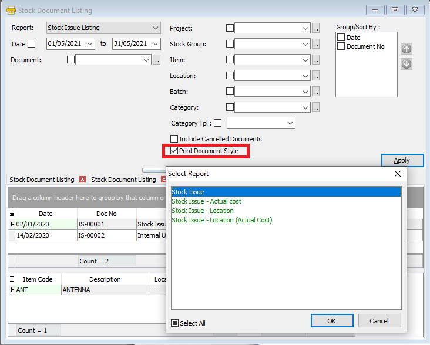

### Group/Sort By

1. You can filter your documents based on Project, location and Company Category

    

2. You can use the Group by/Sort by table to choose how you want to group your report listing

    

3. Here is an example of the report

    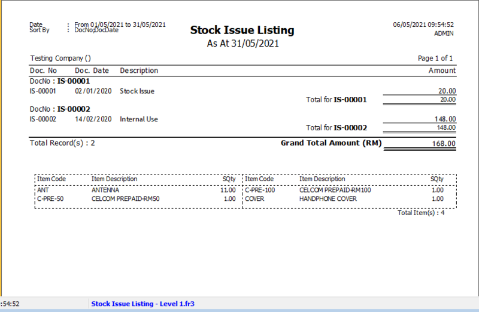

## Print Stock Reorder Advice

- Print Stock Reorder Advice can be used to check which items have quantities below the set reorder level (set in Maintain Stock Item)

### How to Print Stock Reorder Advice

1. **Stock** > **Print Stock Reorder Advice**

    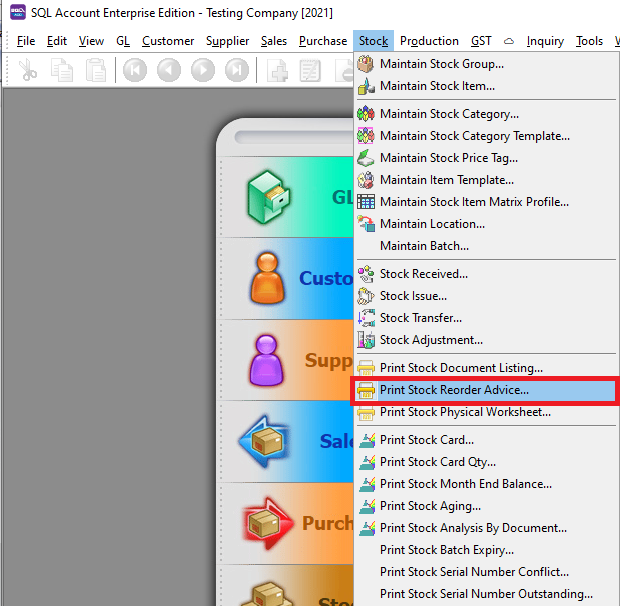

    

    

2. Press Apply Button

3. Click Preview & Listing Report
4. Example of stock reorder report

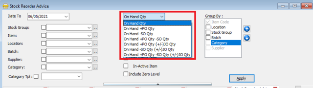

### Setting

1. Select what quantities you wish to compare against

    

    | **Field Name** | **Explanation** |
    |----------------|----------------|
    | **On Hand Qty** | Stock balance quantity |
    | **On Hand + PO Qty & SO Qty** | Stock balance quantity plus Purchase Order Quantity or Sales Order Quantity |
    | **On Hand + PO Qty - SO Qty** | Stock balance quantity plus Purchase Order Quantity minus Sales Order Quantity |
    | **On Hand + PO Qty (+/-) JO Qty** | Stock balance quantity plus Purchase Order Quantity plus Job Order Quantity |
    | **On Hand - SO Qty (+/-) JO Qty** | Stock balance quantity minus Sales Order Quantity plus Job Order Quantity |
    | **On Hand + PO Qty - SO Qty (+/-) JO Qty** | Stock balance quantity plus Purchase Order Quantity minus Sales Order Quantity minus Job Order Quantity |

2. After that, select the type of comparison. The balance quantities will be compared to the Max Value, Min Value or the Reorder Level. All set in Maintain Stock Item.

### Group/Sort By

1. You can filter your documents based on Item, Batch and Company Category

    

2. You can use the Group by/Sort by table to choose how you want to group your report listing

    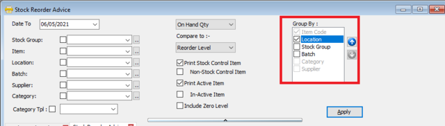

## Print Stock Physical Worksheet

1. Click on **Stock**

2. Choose **Print Stock Physical Worksheet**

3. **Filter** by date, stock group or other **information** for the stock take, please **make sure that you choose the correct location and batch if you have these two modules**.

   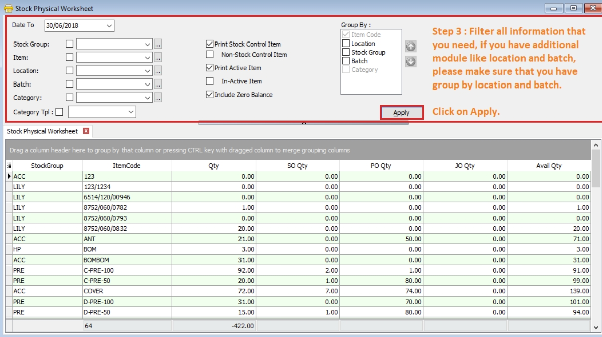

4. Click on Preview & choose your report format.

   

5. **Print out the “Stock Take Sheet”** for stock keeper.

   The stock keeper should manually **fill in the actual quantity into the “physical qty” column**.

   

6. After complete updating the stock take report by your stock-keeper, perform your stock adjustment in system by going to **Stock** > **Stock Adjustment** > **and dragging out Book Qty and Physical Qty**.

   

   

7. Click on the first item in **Stock Physical Worksheet**, press on **Ctrl + A** on the keyboard to select all items.

   **Then Drag & Drop into Stock Adjustment**.

   

8. Based on the stock keeper’s Stock Take Report, **fill in the actual physical quantity** in your warehouse into the Stock Adjustment **Physical Qty column**, the system will calculate the variance based on the Book Qty and apply a correction to the Qty column.

   :::info

   **Book Qty** = The quantity recorded in the system.

   **Physical Qty** = Actual Quantity at your warehouse.

   **Qty** = The variance between Physical and Book Quantity. The system will automatically adjust and update accordingly. (Physical Qty – Book Qty)

   :::

## Print Stock Card & Print Stock Card Qty

- Print Stock Card can be used to view your stock movement and stock cost during a certain period of time.
- You can see your stock movement based on location and batch.

### How to Print Stock Card

1. **Stock** > **Print Stock Document Listing**
print-stock-card
    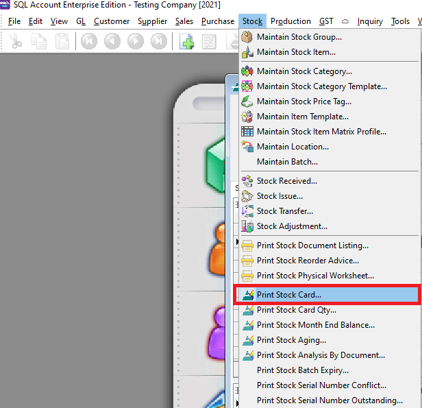

    

2. Press Apply Button
3. Click Preview & Listing Report
4. Example of stock card report

### How to Print Stock Card Qty

- Similar to Print Stock Card, but this report only shows the quantity.

## Print Stock Month End Balance

- Print Stock Month End Balance can be used to view your month end stock quantity and total cost .

### How to Print Stock Month End Balance

1. **Stock** > **Print Stock Month End Balance**

    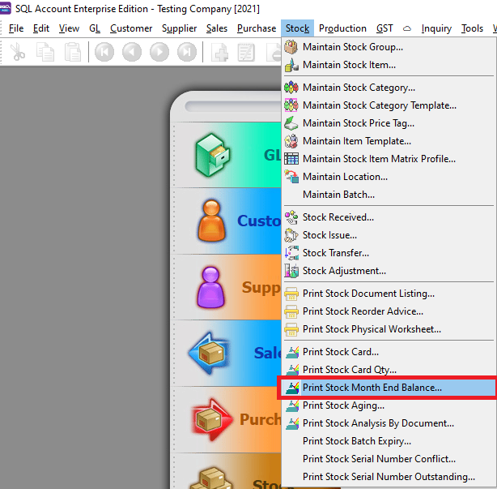

2. Set the date and press the Apply button.

    

3. You can set your filters to filter your stock month end by location, stock group and item

    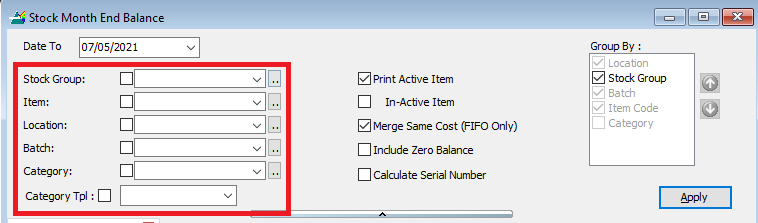

4. Press Preview button
5. Click Preview& Listing Report
6. Example of stock month end report

    

## Print Stock Aging

- Print Stock Aging is used to view the quantity of a certain stock on hand and how much of that stock has been sold.

print-stock-aging

   

### How to Print Stock Aging

1. **Stock** > **Print Stock Aging**
2. Set your filter option and group by options

    

    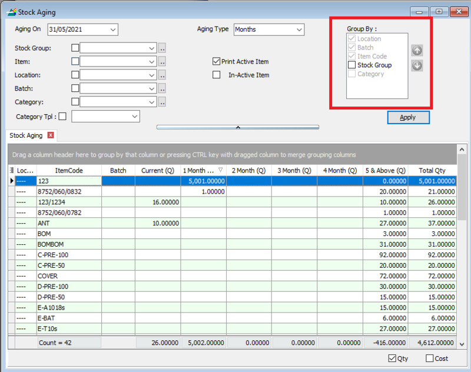

3. Tick Qty and/or Cost if you want to see the aging for both or either

    

4. Set stock aging type

    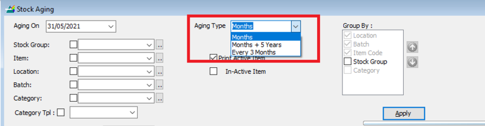

5. Months = Aging calculated for every 1 months
6. Months + 5 Years = Aging calculated for every month and also above 5 years
7. 3 months = Aging calculated every 3 months
8. Press Apply Button
9. Click Preview

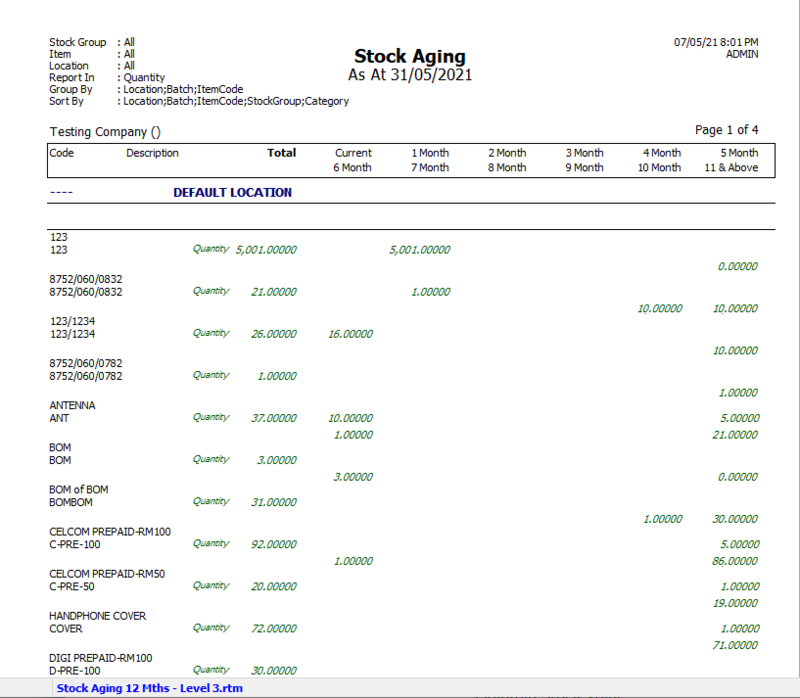

## Print Stock Analysis By Document

- Print Stock Analysis By Document can be used to view your stock movement quantity for each document type like Invoice, Cash sales, Purchase Invoice, etc.

### How to Print Stock Analysis By Document

1. **Stock** > **Print Stock Analysis By Document**

    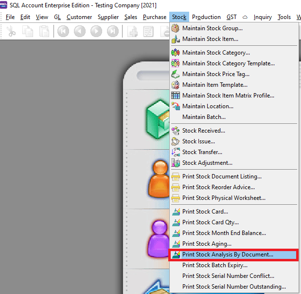

    

2. Press Apply Button
3. Click Preview
4. Example of stock analysis by document report

    

## Print Stock Batch Expiry

- Print Stock Batch Expiry can be used to view all the items in your batches along with their manufacturing and expiry dates.

### How to Print Stock Batch Expiry

1. **Stock** > **Print Stock Batch Expiry**

    

2. Press Apply Button

    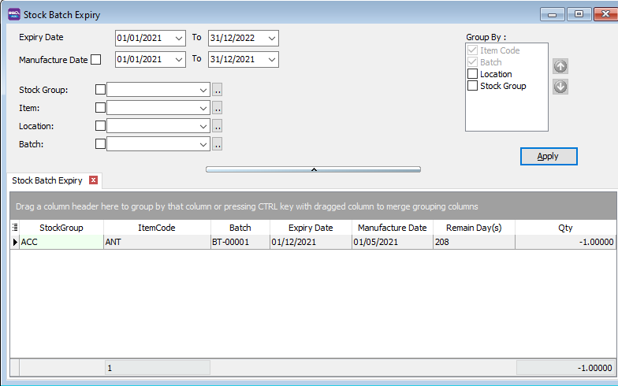

3. Click Preview
4. Example of stock batch expiry report

    

### How to Assign Batch to Your Stock Item

- For example, After creating your batch codes and assigning the items at "Maintain Batch", go to Sales Invoice. Select the stock item and select the batch

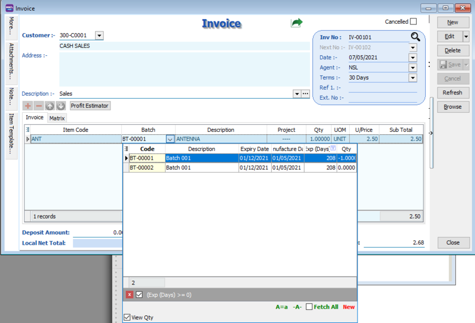

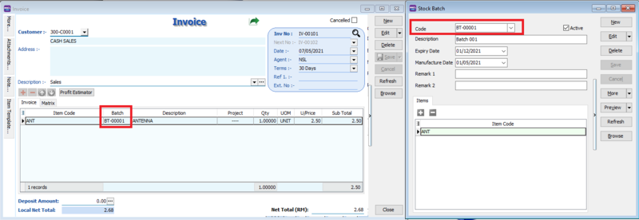

## Print Stock Serial Number Conflict

- Print Stock Serial Number Conflict an be used to view
- SN items issued out without receiving SN
- Duplicate SN received at the same location and batch

### How to Print Stock Serial Number Conflict

1. **Stock** > **Print Stock Serial Number Conflict**

    

2. Press Apply Button

    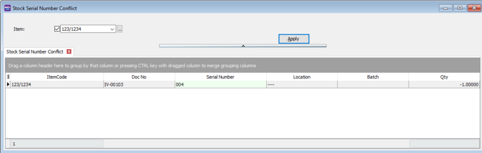

3. Click Preview
4. Example of stock batch expiry report

    

### How to Assign Serial to Your Stock Item

1. First go to Maintain Stock Item an tick the serial number check box

    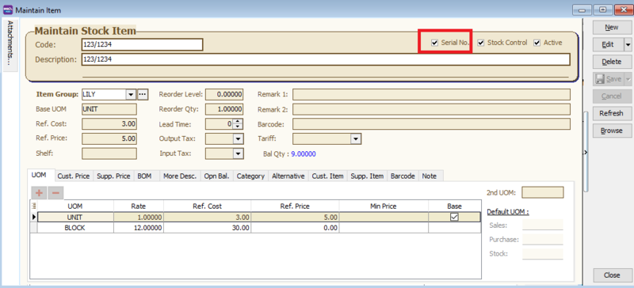

2. At your purchases, assign Serial number to your stock item, you can key it in, import it in from a text file, or automatically generate it .

### How to Automatically Generate Serial Number for Your Stock Item

1. Click the generator button, set your number format, and press OK.

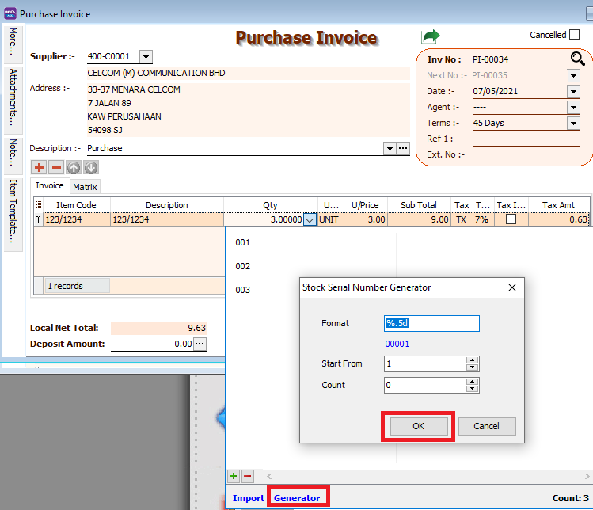

### How to Import Serial Number for Text File for Your Stock Item

1. Click the import button, select your text file, and press OK.

    

2. Your serial number has been successfully imported

## Print Stock Serial Number Outstanding

- Print Stock Serial Number Outstanding can be used to check if you did not assign any serial number to you purchased stock items.
- An example of a missing serial number can be seen in this purchase invoice.
print-stock-serial-number-outstanding
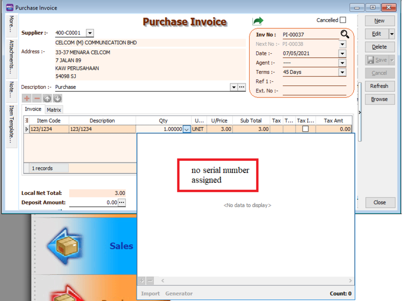

### How to Print Stock Serial Number Outstanding

1. **Stock** > **Print Stock Serial Number Outstanding**

    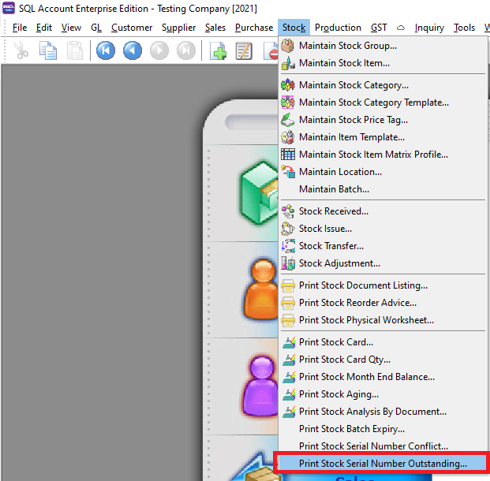

2. Press Apply Button

    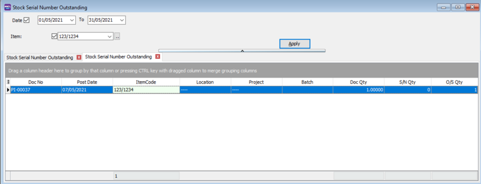

3. Click Preview

    
