## Maintain Supplier

Maintain supplier profile data such as addresses, phone numbers, fax, email, contact persons, credit limits, credit
terms, etc. In other words, this is your supplier contact list.

### New Supplier

To create a new supplier, click the **New** button. See the screenshot below.

You will get a blank form to be filled in with the supplier data.

You can start entering data into the following fields:

| **Field Name**                | **Field Type**                                                         | **Length** | **Explanation**                                                                                               |
| ----------------------------- | ---------------------------------------------------------------------- | ---------- | ------------------------------------------------------------------------------------------------------------- |
| Company                       | Alphanumerical                                                         | 100        | Input the supplier billing company name.                                                                      |
| Control A/c                   | Lookup from Maintain Accounts (Special Type: Supplier Control Account) | 10         | Select an appropriate Supplier Control Account to be posted to GL when supplier documents are created.        |
| Description 2 (under Company) | Alphanumerical                                                         | 100        | An optional field where you can enter Chinese translated name, former company name, company register no, etc. |
| Code                          | Alphanumerical                                                         | 10         | Automatically or manually generate the Supplier Code.                                                         |
| Cust Category                 | Lookup from Maintain Company Category                                  | 15         | Categorize your supplier for reporting purposes.                                                              |

#### General

| **Field Name**    | **Field Type**                       | **Length**     | **Explanation**                                                                                                |
| ----------------- | ------------------------------------ | -------------- | -------------------------------------------------------------------------------------------------------------- |
| Branch Name       | Alphanumerical                       | 100            | You can maintain multiple sets of addresses by using different Branch Names. Default Branch Name: BILLING |
| Address (4 lines) | Alphanumerical                       | 40 (each line) | Enter the company addresses.                                                                                   |
| Attention         | Alphanumerical                       | 70             | Enter the contact person's name.                                                                               |
| Phone 1 & 2       | Alphanumerical                       | 30             | Enter the telephone number.                                                                                    |
| Fax 1 & 2         | Alphanumerical                       | 30             | Enter the fax number.                                                                                          |
| Email             | Alphanumerical                       | 60             | Enter the email address.                                                                                       |
| Area              | Lookup from Maintain Area            | 10             | Select a default Area.                                                                                         |
| Agent             | Lookup from Maintain Agent           | 10             | Select a default Agent.                                                                                        |
| Currency          | Lookup from Maintain Currency        | 6              | Select a default Currency.                                                                                     |
| Credit Terms      | Lookup from Maintain Terms           | 10             | Select a default Terms.                                                                                        |
| Credit Limit      | Numeric                              | —              | Set the credit limit.                                                                                          |
| Statement         | Option                               | —              | Select a default statement type, e.g., Open Item or Brought Forward.  Default: Open Item                  |
| Aging On          | Option                               | —              | Select a default Aging type, e.g., Invoice Date or Due Date. Default: Invoice Date                             |
| Price Tag         | Lookup from Maintain Stock Price Tag | 10             | Set the price tag for the items.                                                                               |

#### Note

| **Field Name**    | **Field Type** | **Length** | **Explanation**                                                                              |
| ----------------- | -------------- | ---------- | -------------------------------------------------------------------------------------------- |
| Account Open Date | Date           | —          | Creation date.                                                                               |
| Remark            | Alphanumerical | 80         | This remark will show in Inquiry → Account Inquiry.                                          |
| Biz Nature        | Alphanumerical | 100        | Enter the supplier's business nature. For example, Chemical Manufacturing, Car Service, etc. |
| Note              | Alphanumerical | Rich Text  | Record the supplier knowledge base. You can use the "Date Stamp".                            |
| Status            | Option         | —          | See **Status Options** table below.                                                          |

| **Status** | **Explanation**                                                                                   |
| ---------- | ------------------------------------------------------------------------------------------------- |
| Active     | Allows the creation of official documents and selection to print Supplier Statement.              |
| Inactive   | Does not allow the creation of official documents, and cannot select to print Supplier Statement. |
| Suspend    | Does not allow the creation of official documents, but can select to print Supplier Statement.    |
| Prospect   | Allows the creation of official documents and selection to print Supplier Statement.              |
| Pending    | Allows the creation of official documents and selection to print Supplier Statement.              |

#### Tax

| **Field Name** | **Explanation & Properties**                                  |
| -------------- | ------------------------------------------------------------- |
| Default Tax    | Select a default tax code based on supplier.                  |
| Tax Area       | Not applicable to Malaysia/Singapore.                         |
| Exemption No   | • Input the Tax Exemption number applicable to your supplier. |
|                | • Field type: Alphanumerical.                                 |
|                | • Length: 50                                                  |
| Expiry Date    | Set an expiry date.                                           |
|                | • This will be tax exempted before the expiry date.           |
|                | • Field type: Date.                                           |

**Tariff Code Setting**
This setting set the supplier who has supply the taxable goods under the Sales Tax (Person Exempted from Payment of Tax) Order 2018.

| **Field Name** | **Explanation & Properties**                                                                                               |
| -------------- | -------------------------------------------------------------------------------------------------------------------------- |
| Tariff         | • Add tariff code of taxable goods to be sold in exemption.                                                                |
|                | • Lookup: [Maintain Tariff](../../usage/tools/guide#maintain-tariff)                                                       |
|                | • Related Topic: [Maintain Stock Item → Main Header](../../usage/stock/guide#maintain-stock-item)                    |
| Tax            | • Select an appropriate tax code that falls under the Person Exempted in **Schedule C ONLY** (must be declared in SST-02). |
|                | • Schedule C tax code: PEC1, PEC2, PEC3, PEC4, PEC5                                                                        |
|                | • Lookup: [Maintain Tax](../../usage/gst/gst-maintain-tax.md)                                                         |

#### Bank Account

| **Field Name** | **Explanation & Properties**         |
| -------------- | ------------------------------------ |
| Bank           | Select the correct bank.             |
| Account No     | Enter the supplier's account number. |
| Account Name   | Enter the name.                      |
| ID Type        | Select the desired ID type.          |
| ID             | Enter the ID.                        |
| Active         | • Check this box if active.          |
|                | • Uncheck this box if inactive.      |

### Edit Supplier

To edit a supplier, click the EDIT button. See the screenshot below.

:::note

1. Users can edit supplier data depending on the access rights granted.
2. All edits are audited and logged by the system.

:::

### Save Supplier

You must save the supplier data before it can be used. See the screenshot below.

### Delete Supplier

You can delete unwanted supplier data. See the screenshot below.

:::note

1. Users can delete supplier data depending on the access rights granted.

:::

### Supplier Code Format

The supplier code can be automatically generated or manually overwritten. See the screenshot below.

:::note Important

1. Every supplier code is unique.
2. If a duplicate code is detected during saving, a warning message will be displayed.

:::

You can set the supplier code format via Tools | Options...(Supplier). See the screenshot below.

Explanation of the Supplier Code Format:

For example,

| **Company Name** | **Customer Control Acc** | **Format**    | **Result**     |
| ---------------- | ------------------------ | ------------- | -------------- |
| ABCD SDN BHD     | 401-000                  | %.1s-%.1s%.1d | 4-A-1          |
| ABCD SDN BHD     | 401-000                  | %.2s-%.2s%.2d | 40-AB-01       |
| ABCD SDN BHD     | 401-000                  | %.3s-%.3s%.3d | 401-ABC-001    |
| ABCD SDN BHD     | 401-000                  | %.4s-%.4s%.4d | 401--ABCD-0001 |

## Supplier Invoice (SI)

- General invoices received from suppliers, such as for services, insurance, stationery, or any non-stock control billing.
- Additionally, you can check invoice statuses, including outstanding balances and payment history.

### Basic Entry (SI)

1. Click the **New** button.
2. See the New Supplier Invoice entry form screenshot below.

    

3. Select the Supplier Code. You can directly enter and search by either the supplier code or name.
4. Enter the Purchase Account and the amount to be debited.
5. Below is an example of the entry created:

    

    | Account                  | DR (RM) | CR (RM) |
    | ------------------------ | ------- | ------- |
    | Stationery               | 500.00  |         |
    | Supplier Control Account |         | 500.00  |

### Project (SI)

- There are two types of projects to note:
    1. Document Project
    2. Detail Project
- For document projects, go to the More section on the left sidebar.
- For detail projects, add the project column using the Field Chooser.

| **Label** | **Types**        | **Explanation**                                                    |
| --------- | ---------------- | ------------------------------------------------------------------ |
| A         | Document Project | It represents the project for a document to be credited.           |
| B         | Detail Project   | It represents the project for individual GL Account to be debited. |

### Attachment (SI)

- Attaching supporting documents to an invoice is very useful.
- This allows you to easily retrieve and refer to the attached files in the future.

1. Go to the attachment section.
2. Click the (+) button to insert the file path.
3. See the sample screenshot below.

### Note (SI)

1. Click the Note section on the left sidebar.
2. Right-click to open the Rich Text Editor.
3. You can start entering the note. See the example screenshot below.
4. Click the **X** button to save and exit the Rich Text Editor.

    

5. A "Save changes?" prompt will appear. Click **Yes** to save it.

    

### Invoice description (SI)

1. This shows the document description in the Supplier Statement, e.g., Purchase-Stationery April 2015.

    

2. Sample of supplier statement screenshot below.

    

## Supplier Payment (SP)

- Record payment amounts to suppliers.
- Offset payments against outstanding supplier invoices.

### Basic Entry (SP)

1. Click the New button.
2. See the New Supplier Payment entry form screenshot below.

    

3. Select the Supplier Code. Directly enter and search by either the supplier code or name.
4. Select the Payment Method (bank or cash account) in Payment By.
5. Enter the Paid Amount (following the bank account currency).
6. Below is an example of the entry created:

    

    **Double Entry will be:-**

    | **Account**          | **DR (RM)** | **CR (RM)** |
    | -------------------- | ----------- | ----------- |
    | Supplier Control Acc | 2,500.00    |             |
    | Bank Account         |             | 2,500.00    |

7. Enter bank charges if applicable.

    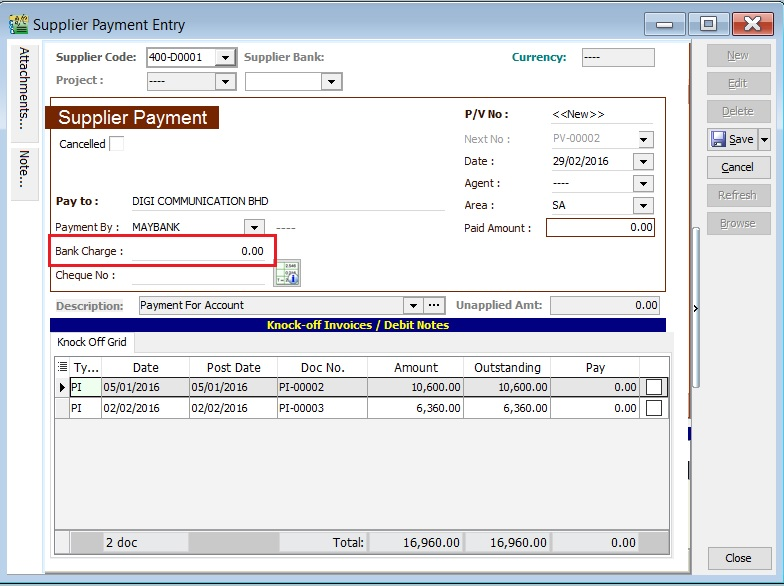

8. The following double entry will be automatically posted:

    | **Account**  | **DR (RM)** | **CR (RM)** |
    | ------------ | ----------- | ----------- |
    | Bank Charges | 2.00        |             |
    | Bank Account |             | 2.00        |

9. Enter the cheque number, cash, or TT into the Cheque No. field.

    

### Knock-Off (SP)

Purpose of knocking off invoices:

1. To display outstanding invoices in the Supplier Aging Report.
2. To indicate which invoices the payment offsets in the Supplier Statement.
3. To remove or recover GST Bad Debt Relief for items outstanding for more than six months.

#### Partial Knock-Off (SP)

1. Enter the knock-off amount in the Pay column (it will be automatically checked).
2. The Unapplied Amount will be reduced by the entered knock-off amount.

    

#### Document Knock-Off (SP)

1. Check the boxes for the outstanding documents.
2. The Unapplied Amount will be reduced by the total of the selected documents.

    

#### Random Knock-Off (SP)

1. Clicking the Pay column will automatically select the outstanding documents.
2. The Unapplied Amount will be reduced based on the outstanding balance.

    

:::note
The unapplied amount represents the supplier payment that has not yet been allocated or knocked off against outstanding invoices or debit notes.
:::

### Attachment (SP)

- Attaching supporting documents is very useful.
- This allows you to easily retrieve and refer to the attached files in the future.

1. Go to the attachment section.
2. Click the (+) button to insert the file path.
3. See the sample screenshot below.

    

### Note (SP)

1. Click the Note section on the left sidebar.
2. Right-click to open the Rich Text Editor.

    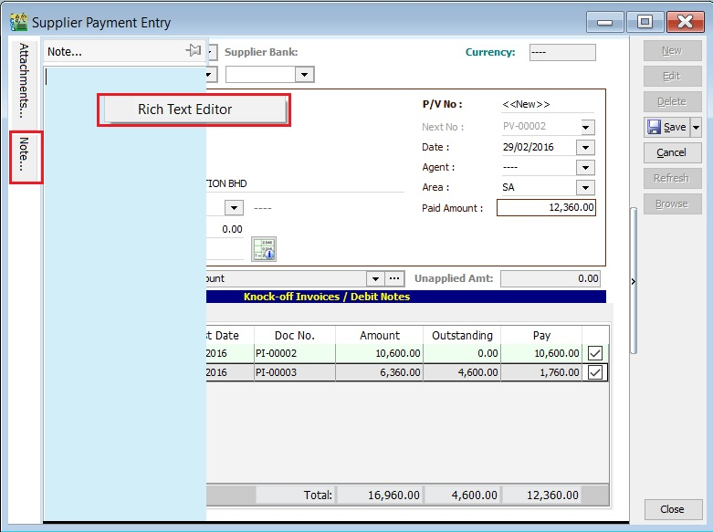

3. You can start entering the note. See the example screenshot below.
4. Click the X button to save and exit the Rich Text Editor.

    

5. A "Save changes?" prompt will appear. Click YES to save it.

    

### Description (SP)

This shows the supplier payment description in the Supplier Statement, e.g., Payment For Jan & Feb 2016.

Sample of Supplier statement screenshot below.

## Supplier Debit Note (SDN)

- General debit notes received from suppliers, such as adjustments for undercharged stationery, services, insurance, or any non-stock control billing.
- Additionally, you can check the status of debit notes, including outstanding balances and payment history.

### Basic Entry (SDN)

1. Click the New button.
2. See the New Supplier Debit Note entry form screenshot below.

    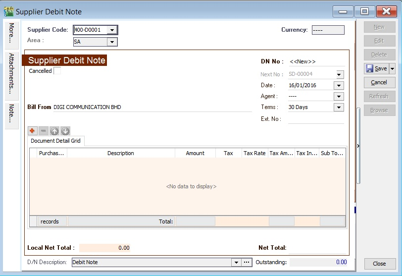

3. Select the Supplier Code. You can directly enter and search by either the supplier code or name.
4. Enter the Purchase Account and the amount to be debited.
5. Below is an example of the entry created:

    

    **Double Entry will be:-**

    | **Account**              | **DR (RM)** | **CR (RM)** |
    | ------------------------ | ----------- | ----------- |
    | Stationery               | 500.00      |             |
    | Supplier Control Account |             | 500.00      |

### Project (SDN)

- There are two types of projects to note:
    1. Document Project
    2. Detail Project
- For document projects, go to the More section on the left sidebar.
- For detail projects, add the project column using the Field Chooser.

| **Label** | **Types**        | **Explanation**                                                    |
| --------- | ---------------- | ------------------------------------------------------------------ |
| A         | Document Project | It represents the project for a document to be credited.           |
| B         | Detail Project   | It represents the project for individual GL Account to be debited. |

### Attachment (SDN)

- Attaching supporting documents to a debit note is very useful.
- This allows you to easily retrieve and refer to the attached files in the future.

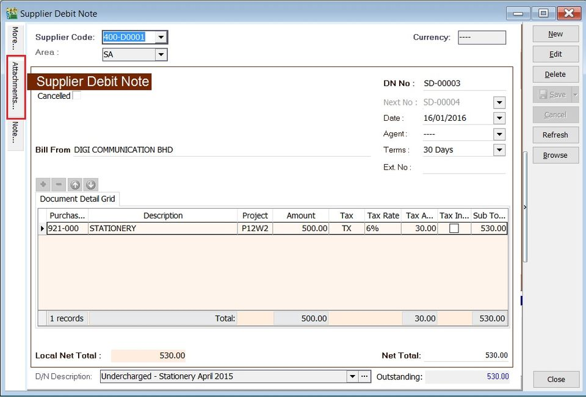

1. Go to the attachment section.
2. Click the **(+)** button to insert the file path.
3. See the sample screenshot below.

    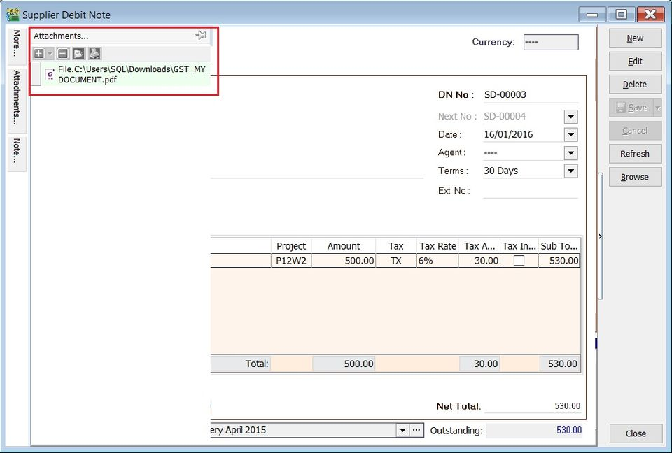

### Note (SDN)

1. Click the Note section on the left sidebar.
2. Right-click to open the Rich Text Editor.
3. You can start entering the note. See the example screenshot below.
4. Click the **X** button to save and exit the Rich Text Editor.

    

5. A "Save changes?" prompt will appear. Click Yes to save it.

    

### D/N Description (SDN)

1. This shows the document description in the Supplier Statement, e.g., Undercharged-Stationery April 2015.

    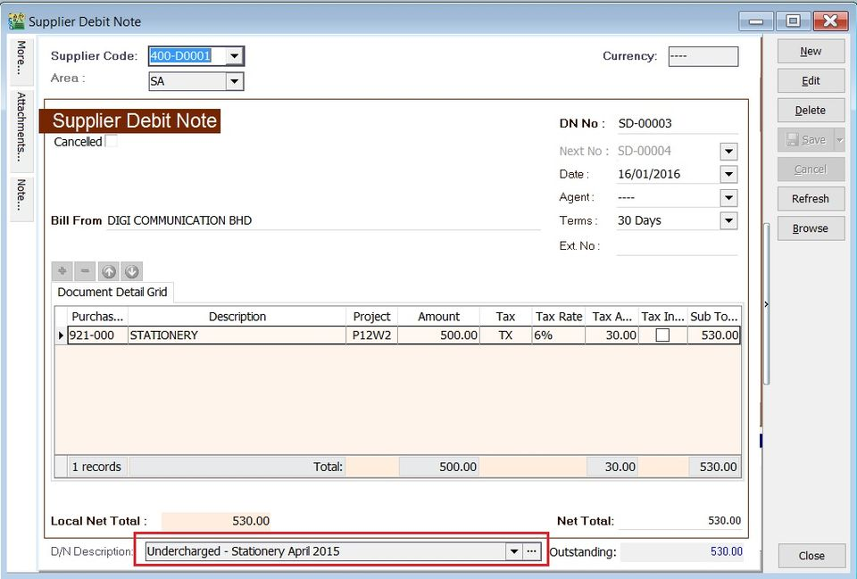

2. Sample of supplier statement screenshot below.

    

## Supplier Credit Note (SCN)

- Credit notes are used to reduce and offset outstanding invoices or debit notes.
- For credit notes created in the Purchase module, you must offset them against outstanding invoices or debit notes here.
- You can check for any unapplied amounts on a credit note. An unapplied amount means the credit note must be matched with an invoice or debit note to be knocked off.

### Basic Entry (SCN)

1. Click the New button.
2. See the New Supplier Credit Note entry form screenshot below.

    

3. Select the Supplier Code. You can directly enter and search by either the supplier code or name.
4. Enter the Purchase Account and the amount to be credited.
5. Below is an example of the entry created:

    

    **Double Entry will be:-**

    | **Account**          | **DR (RM)** | **CR (RM)** |
    | -------------------- | ----------- | ----------- |
    | Supplier Control Acc | 500.00      |             |
    | Purchase Returns     |             | 500.00      |

### Unapplied Amount (SCN)

- The unapplied amount represents the credit note amount that has not been allocated or knocked off against outstanding invoices or debit notes.
- It will remain in the Supplier Aging Report as a negative amount (-).

### Knock-Off Outstanding (SCN)

- To knock off an outstanding invoice or debit note, check the box next to the Pay column.
- You can directly enter the payment amount in the Pay column.

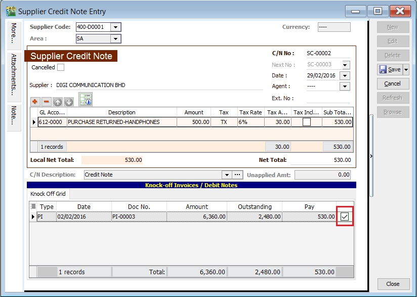

### Project (SCN)

- There are two types of projects to note:
    1. Document Project
    2. Detail Project
- For document projects, go to the More section on the left sidebar.
- For detail projects, add the project column using the Field Chooser.

| **Label** | **Types**        | **Explanation**                                                     |
| --------- | ---------------- | ------------------------------------------------------------------- |
| A         | Document Project | It represents the project for a document to be debited.             |
| B         | Detail Project   | It represents the project for individual GL Account to be credited. |

### Attachment (SCN)

- Attaching supporting documents to a credit note is very useful.
- This allows you to easily retrieve and refer to the attached files in the future.

1. Go to the attachment section.
2. Click the (+) button to insert the file path.
3. See the sample screenshot below.

    

### Note (SCN)

1. Click the Note section on the left sidebar.
2. Right-click to open the Rich Text Editor.
3. You can start entering the note. See the example screenshot below.
4. Click the **X** button to save and exit the Rich Text Editor.

    

5. A "Save changes?" prompt will appear. Click **Yes** to save it.

    

### C/N Description (SCN)

1. This shows the document description in the Supplier Statement, e.g., Overcharged-Stationery April 2015.

    

2. Sample of supplier statement screenshot below.

    

### Foreign Exchange Currency Gain/Loss (SCN)

- Differences in foreign currency exchange rates will automatically post FOREX Gain/Loss entries to the General Ledger.
- The posting date can be adjusted to reflect the FOREX Gain/Loss for a specific month.

## Supplier Refund (SR)

- Receive a refund for an overpayment made to a supplier.
- Offset against the unapplied amounts of Supplier Payments and Credit Notes.

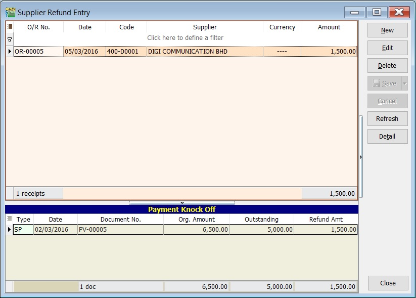

### Basic Entry (SR)

1. Click the New button.
2. See the New Supplier Refund entry form screenshot below.

    

3. Select the Supplier Code. Directly enter and search by either the supplier code or name.
4. Select the Payment Method (bank or cash account) in Received In.
5. Enter the Refund Amount (following the bank account currency).
6. Below is an example of the entry created:

    

    **Double Entry will be:-**

    | **Account**          | **DR (RM)** | **CR (RM)** |
    | -------------------- | ----------- | ----------- |
    | Bank Acc             | 3,590.00    |             |
    | Supplier Control Acc |             | 3,590.00    |

7. Enter bank charges if applicable.

    

8. For example, if bank charges are RM2.00, the double entry posting will be:

    | **Account**  | **DR (RM)** | **CR (RM)** |
    | ------------ | ----------- | ----------- |
    | Bank Charges | 2.00        |             |
    | Bank Account |             | 2.00        |

9. Enter the cheque number, cash, or TT into the Cheque No. field.

    

### Knock-off (SR)

Purpose of knocking off invoices:

1. To display outstanding invoices in the Supplier Aging Report.
2. To indicate which invoices the payment offsets in the Supplier Statement.

#### Partial Knock-Off (SR)

1. Enter the knock-off amount in the Pay column (it will be automatically checked).
2. The Unapplied Amount will be reduced by the entered knock-off amount.

    

#### Document Knock-Off (SR)

1. Check the boxes for the outstanding documents.
2. The Unapplied Amount will be reduced by the total of the selected documents.

    

#### Random Knock-Off (SR)

1. Clicking the Pay column will automatically select the outstanding documents.
2. The Unapplied Amount will be reduced based on the outstanding balance.

    

    :::note
    The Refund Unapplied amount shows the supplier refund that has not been allocated or knocked off against any unapplied amounts in supplier payments or credit notes.
    :::

### Attachment (SR)

- Attaching supporting documents is very useful.
- This allows you to easily retrieve and refer to the attached files in the future.

1. Go to the attachment section.
2. Click the (+) button to insert the file path.
3. See the sample screenshot below.

    

### Note (SR)

1. Click the Note section on the left sidebar.
2. Right-click to open the Rich Text Editor.

    

3. You can start entering the note. See the example screenshot below.
4. Click the **X** button to save and exit the Rich Text Editor.

    

5. A "Save changes?" prompt will appear. Click YES to save it.

    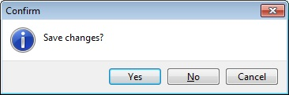

### Description (SR)

This shows the supplier refund description in the Supplier Statement, e.g., Refund For SC-00002 & PV-00004.

Sample of supplier statement screenshot below.

## Supplier Contra (SC)

- Settle outstanding balances between supplier and customer accounts without monetary transactions.
- This process uses an intermediate account known as a Contra Account, which must have a zero balance.

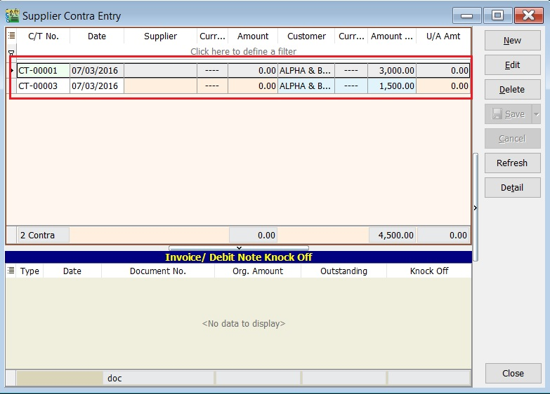

### Basic Entry (SC)

Assuming you have created a [Customer Contra](../../usage/customer/guide#customer-contra), the same contra number will appear in the Supplier Contra.

1. Highlight the Contra No to edit. Click the Edit button.
2. See the Supplier Contra entry from screenshot below.

    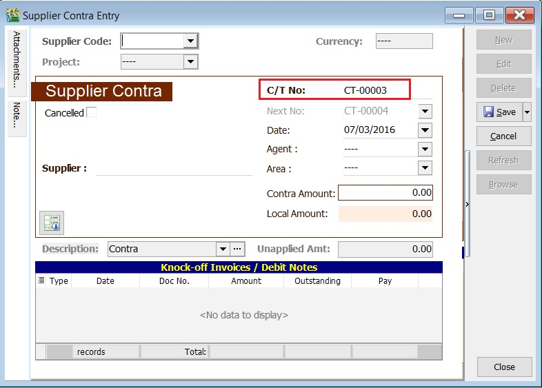

3. Select the Supplier Code. Directly enter and search by either the supplier code or name.
4. Enter the Contra Amount (following the supplier currency).
5. Below is an example of the entry created:

    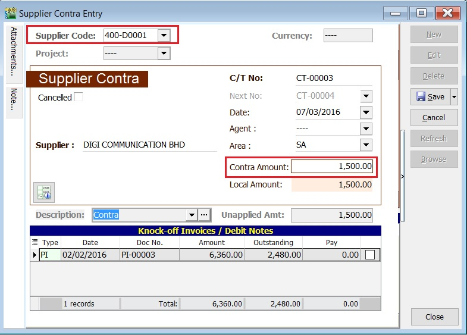

    **Double Entry will be:-**

    | **Account**          | **DR (RM)** | **CR (RM)** |
    | -------------------- | ----------- | ----------- |
    | Supplier Control Acc | 1,500.00    |             |
    | Contra Acc           |             | 1,500.00    |

:::note TIPS

Ensure the contra account is set up correctly. [Contra Account](../../usage/tools/guide#options)

:::

### Knock-off (SC)

Purpose of knocking off invoices:

1. To display outstanding invoices in the Supplier Aging Report.
2. To indicate the contra knock-off the invoices in Supplier Statement.

#### Partial Knock-Off (SC)

1. Enter the knock-off amount in the Pay column (it will be automatically checked).
2. The Unapplied Amount will be reduced by the entered knock-off amount.

    

#### Document Knock-Off (SC)

1. Check the boxes for the outstanding documents.
2. The Unapplied Amount will be reduced by the total of the selected documents.

    

#### Random Knock-Off (SC)

1. Clicking the Pay column will automatically select the outstanding documents.
2. The Unapplied Amount will be reduced according to the outstanding balance.

    

    :::note

    The refund unapplied amount shows the supplier contra amount that has not been allocated or knocked off against any outstanding supplier invoices or debit notes.

    :::

### Attachment (SC)

- Attaching supporting documents is very useful.
- This allows you to easily retrieve and refer to the attached files in the future.

1. Go to the attachment section.
2. Click the (+) button to insert the file path.
3. See the sample screenshot below.

    

### Note (SC)

1. Click the Note section on the left sidebar.
2. Right-click to open the Rich Text Editor.

    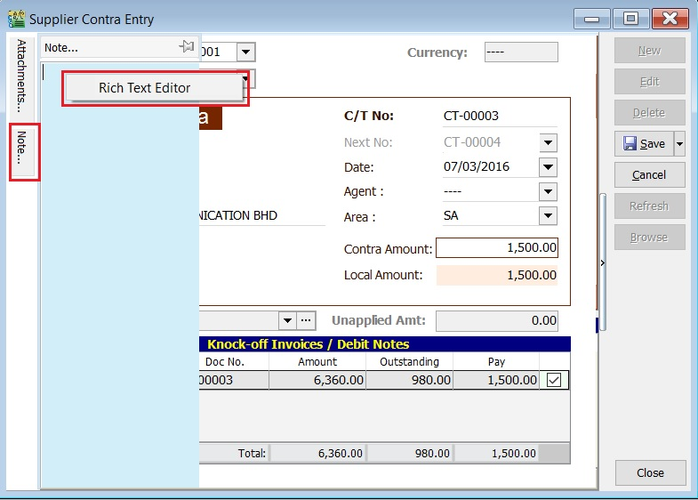

3. You can start entering the note. See the example screenshot below.
4. Click the **X** button to save and exit the Rich Text Editor.

    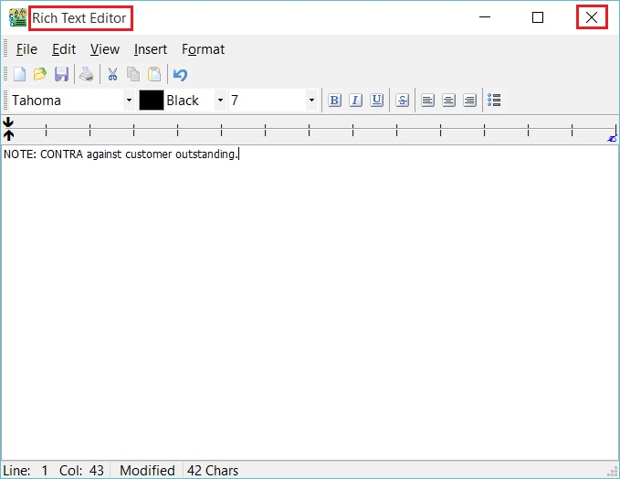

5. A "Save changes?" prompt will appear. Click **Yes** to save it.

    

### Description (SC)

This shows the supplier contra description in the Supplier Statement, e.g., Contra IV-00005.

Sample of supplier statement screenshot below.

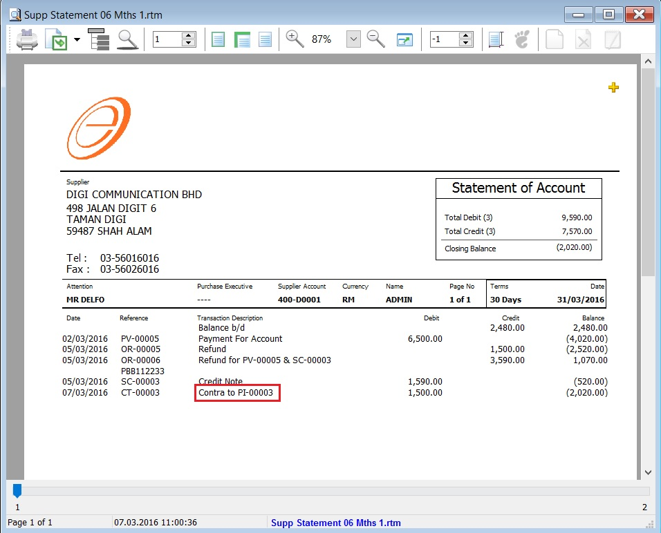

### GL Ledger - Contra Account

1. Select the date range.
2. Select the account code, e.g., 450-000 CONTRA ACCOUNT.
3. Check the box for General Ledger.
4. Click the Apply button.
5. An example of the Contra Account ledger is shown below.

    

## InterBank GIRO Module

To use the **Interbank GIRO** feature, you must have the **Interbank GIRO** module enabled in SQL Account.

### Bank File Format

The following list shows the currently supported bank file formats.

### Payment Method

1. Click the **Bank Info** button.

    

2. Choose a **bank**.

    

3. Click the **OK** button.

    

4. The selected bank may have **more than one file format**; please ensure you have selected the **correct file format**.

    

5. Enter the **bank information**, click **OK**, and then click **Save**.

    

### Supplier Bank Account

1. Add a **bank account**, then click **Save**.

    

### Supplier Payment Method

1. Select **Supplier Bank** from the drop-down list.

    

2. Choose the **payment method** that contains **bank information**, then click **Save**.

    

### Print Supplier Document (Interbank GIRO) Listing

1. Click the **GIRO** button.

    

2. Enter additional information, then click the **Save** button.

    

3. You can now upload the bank instruction file to the bank host.

### Excel Format

By default, the system saves Excel files in XLSX format. However, some banks (**Alliance Bank, Public Bank, RHB**) require the XLS format. To use this, you must have **Microsoft Excel 2007** or a later version installed on your machine.

Then, **open** the Excel file and **save it in XLS** format.
