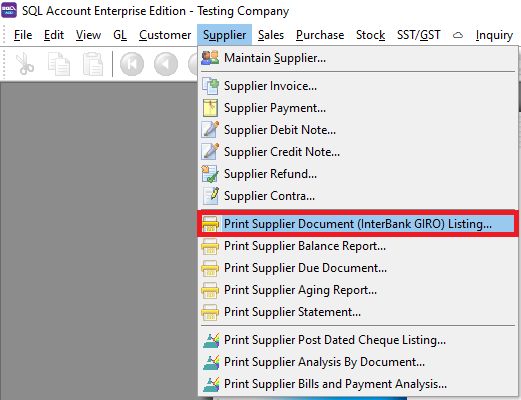
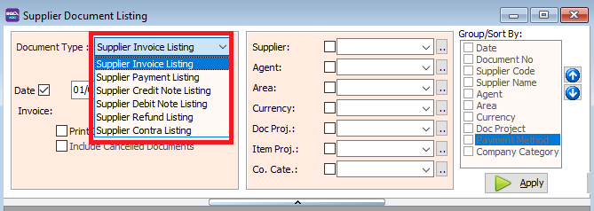
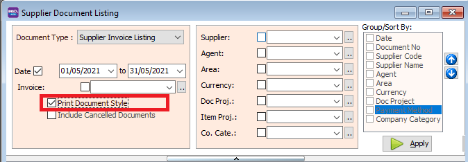
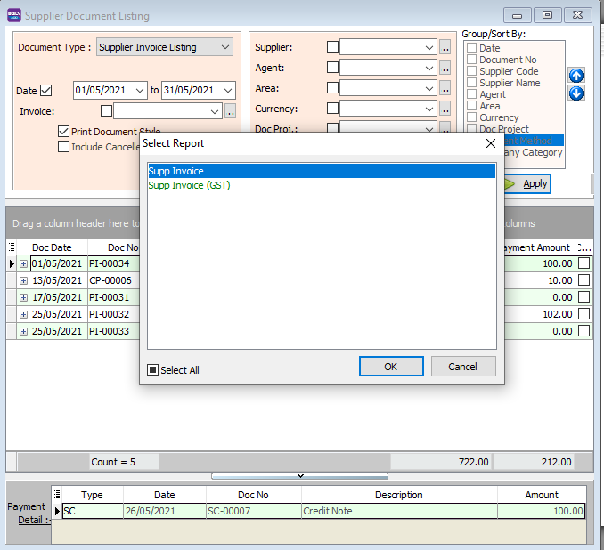
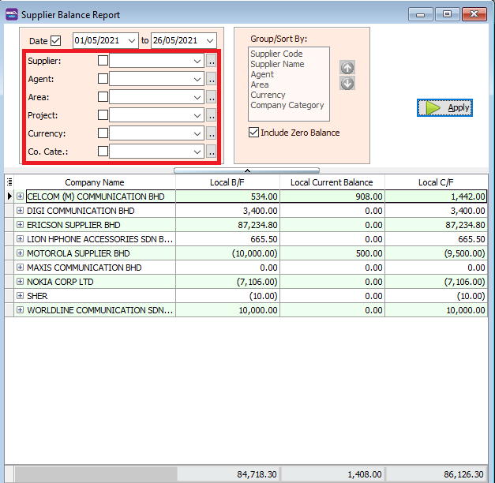
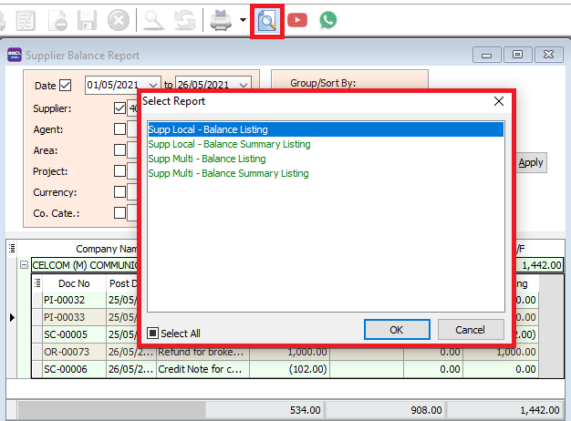
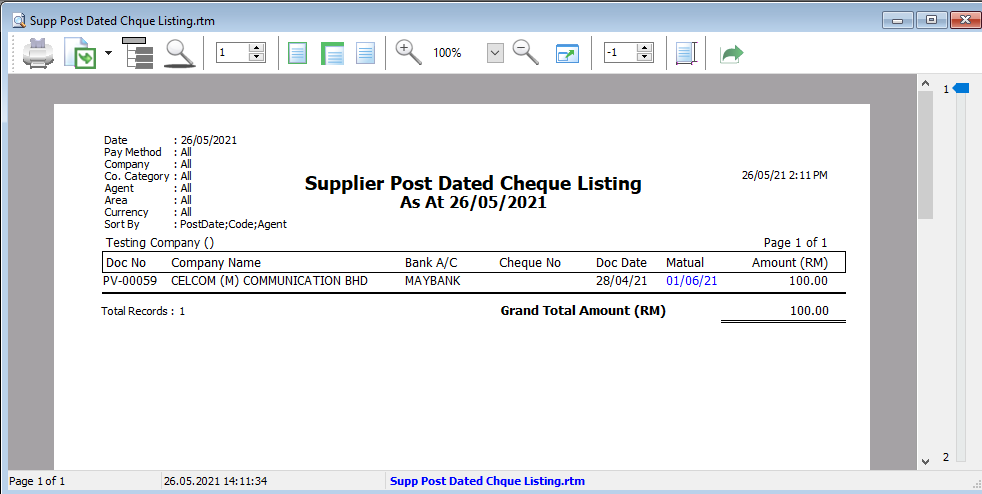
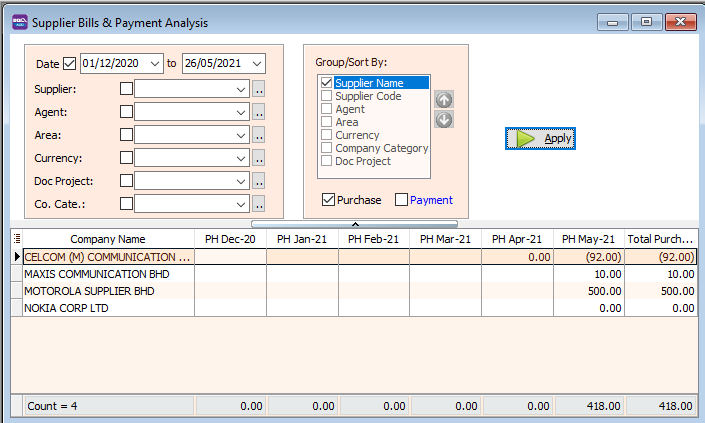
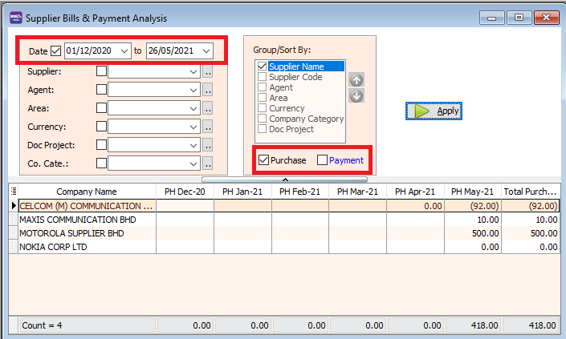
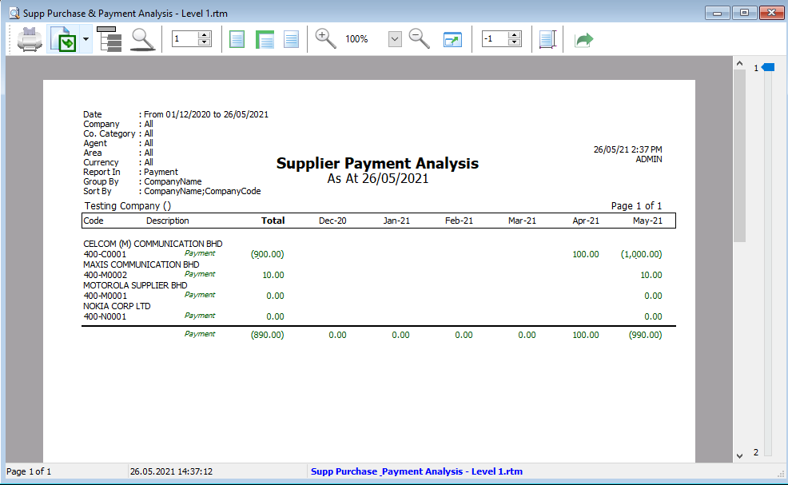

## Print Supplier Document (InterBank GIRO) Listing

- Print Supplier Document (InterBank GIRO) Listing can be used to see all the supplier transactions that you have entered into this system
- You can see Supplier Invoice, Supplier Payment, Supplier Credit Note, Supplier Debit Note, Supplier Refund, and Supplier Contra listings.
- You can use Document Listing to batch print and batch email your Supplier's documents.
- At the bottom of the screen, you can see the payment details for each document

### How to Print Document Listing

- Select which Document Listing you want to see. Follow the image below :

- Press the Apply Button
- Click Preview & Listing Report
- Example of supplier invoice listing report

### Print document Style

- Tick the relevant check boxes

| **Field Name**              | **Explanation**                                                   |
| --------------------------- | ----------------------------------------------------------------- |
| Print Document Style        | Tick this checkbox to print out bulk report or send batch email.  |
| Include Cancelled Documents | Tick this checkbox to include cancelled documents in the listing. |

- If you Tick Print Document Style , you will be able to choose supplier invoice report format.

### Group/Sort By

- You can filter your documents based on Supplier, Agent, Area, Currency, and Project

- You can use the Group/Sort By table to choose how you want to group your report listing

- For example, you can group the report by "Supplier Code"

- Select the Listing Report
- Here is an example of the report

## Print Supplier Balance Report

- Print Supplier Balance Report allows you to **see all the supplier's balance**.

### How to Print Supplier Balance Report

- Select the date period for the balance report.

- You can filter the report selecting the supplier, agent, area, project of the transaction.

- For example, filtering by supplier name.

- You can click on the small + icon to expand the row and see the transactions details.

- Press the Preview icon to preview and print the report

## Print Supplier Due Document

- Print Supplier Due Document allows you to see all the supplier's overdue and undue balance.

### How to Print Supplier Due Document Report

- Set the date. Select if you want to see Overdue or Undue documents.

- Select which documents you want to see.

- You can also filter the listing based on supplier, agent, area, or currency

## Print Supplier Aging Report

- Print Supplier Aging to see unpaid invoice balances along with the duration for which the supplier has been outstanding.

### How to Print Supplier Aging Report

- Select the report name. Then click the Apply button.

- Select the Preview icon to view and print the report

### Set Aging

| **Field Name** | **Explanation**                                                 |
| -------------- | --------------------------------------------------------------- |
| Default Aging  | Follow aging that has been set at Maintain Supplier "Aging On". |
| Document Date  | Aging based on invoice date.                                    |
| Due Date       | Aging based on after due date (terms).                          |

## Print Supplier Statement

A statement of account, also known as an account statement or Supplier Statement, is a document that outlines the transactions between a buyer and a seller.

- We use Supplier Statement to :
    1. Calculate an outstanding account balance
    2. Check which Supplier accounts balance we need to settle
    3. Avoid disputes with suppliers.

### Statement Type

- Select the Statement Type.

| **Field Name**            | **Explanation**                                    |
| ------------------------- | -------------------------------------------------- |
| Default Statement Type    | Follow the statement type set in Maintain Supplier |
| Open Item Statement       | Detail Statement                                   |
| Brought Forward Statement | Summary Statement                                  |

### Sample Supplier Statement

## Print Supplier Post Dated Cheque Listing

- We use this report to see the post date cheques issued by that date

- Set the date
- Select your Payment Method

- Press Apply
- Preview report.
- Here is a sample of the report

### How to set Post Dated Cheque

- At your supplier payment, you can RIGHT-CLICK at the white area and select "Posting Date"

- Key in your posting date and press OK.

## Print Supplier Analysis By Document

- We use this report to see the total of all your supplier's invoices, credit/debit notes and contra amounts.

- Set the date
- Select how you want to group your report by ticking the checkboxes at the Group/Sort By.

- Click the preview icon and view/print your report.

## Print Supplier Bills and Payment Analysis

- We use this report to see the monthly payment and purchases for your supplier.

- Set the date
- Tick the checkbox to indicate if you want to see the total payment, purchases or both.

- If you tick "Payment" Click the preview icon and view/print your collection report.

- If you tick "Purchase" Click the preview icon and view/print your sales analysis report.

