## Maintain User

### Create New User

1. Select **Tools** > **Maintain User** > **New**

2. Enter the **Code and Name** (both can be the same e.g. Code = ALI, Name = ALI)

3. Click on **More** Options and look for **Change Password**

   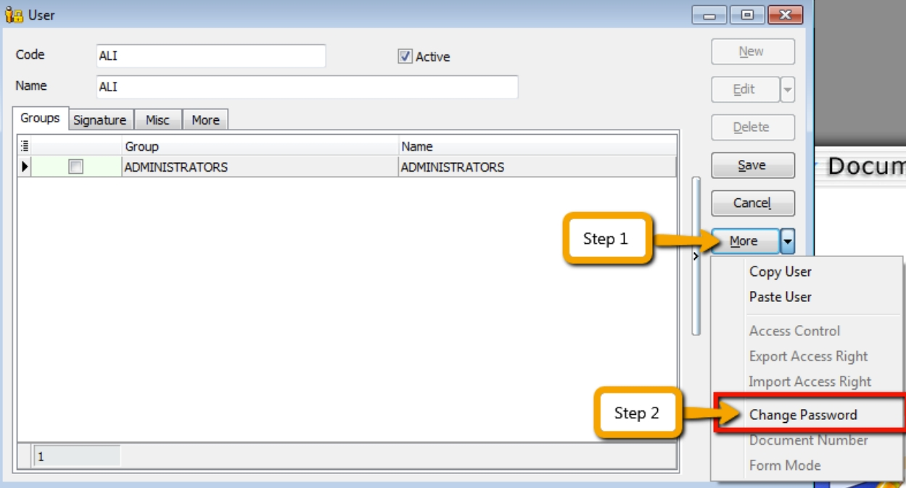

4. Click Save. Your new user account is now created.

:::info info
    SQL User license is per concurrent basis (i.e. how many users can login to the system at the same time). This mean that if you have 5 staffs in the office who can access SQL but you only 3 license for 3 concurrent users, you can still maintain all 5 users in the system but only 3 users can login and access at the same time.
:::

### User Access Right

:::info Video Guide
Watch tutorial video here: [Youtube](https://www.youtube.com/watch?v=t_TJKdOihfw&feature=youtu.be)
:::

Not every user is going to have the same access rights as ADMIN, and ADMIN user might want to set security control settings in system.

1. Select **Tools** > **Maintain User** > **Edit for the user that you want to set the access right for**.

2. Click on **More** Options and look for **Access Right**.

3. You need to check the transactions / functions (row), compare with the user (column) and **tick = Allowed** or **untick = Disallowed**, the action for a particular user for particular transactions. For example, base on the settings in the following images, the user is not allowed to delete Customers or to view Customer Payments.

   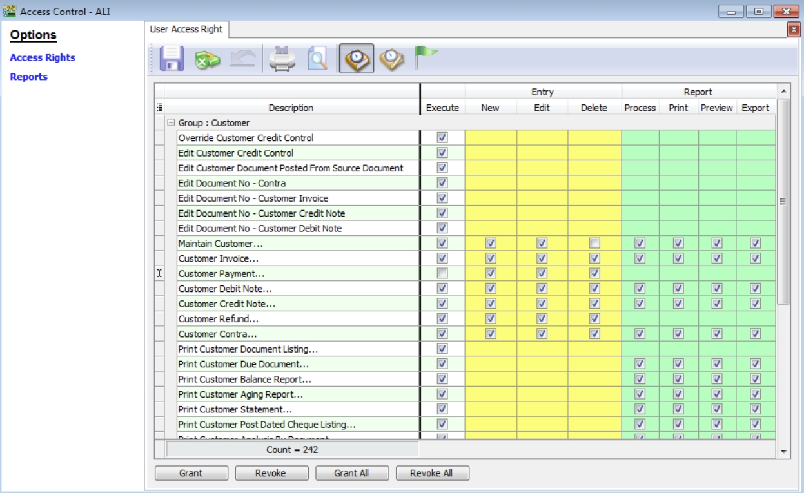

### Bar Navigator

*Tools | Maintain User... | More | Bar Navigator*

This function is to allow user to **customize** the buttons at the Main Application by user.

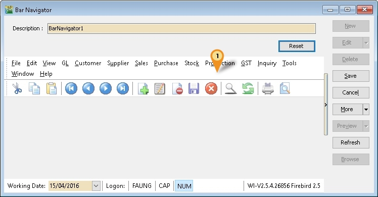

| **Field Name**   | **Properties**                                      |
|------------------|-----------------------------------------------------|
| **Description**  | Definition: Navigator Full Description; Field Type: Alphanumerical; Length: 160 |
| **Reset Button** | To restore to Default Layout                        |

1. Right Click here

      

2. Select Customize...

      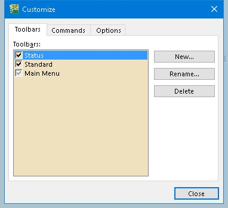

   | **Field Name**   | **Properties**                       |
   |------------------|---------------------------------------|
   | **Toolbars**     | Show list of available Toolbars       |
   | **New... button**| Create New Toolbar                    |
   | **Rename...button** | Rename the highlighted Toolbar     |
   | **Delete**       | Delete highlighted Toolbar            |

3. Select Commands tab

      

   | **Field Name** | **Properties**                                   |
   |----------------|--------------------------------------------------|
   | **Categories** | List of Available Buttons Category               |
   | **Commands**   | List of Available Buttons on the Selected Category |

      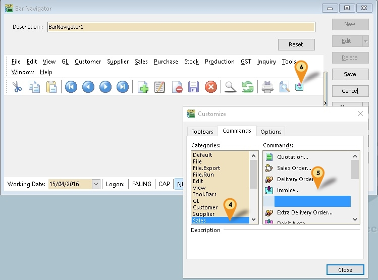

4. Select Categories (eg Sales)
5. Select Commands (eg Invoice...)
6. Drag from Step 5 to here
7. Click Close
8. Click Save
9. Click Browse
10. Click More | Navigator vs User

      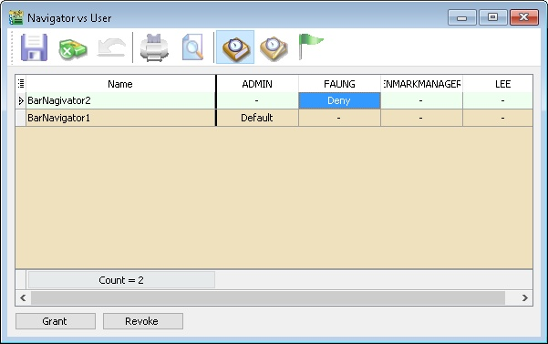

      | **Options** | **Properties**                                |
      |-------------|-----------------------------------------------|
      | –           | No setting is set                             |
      | **Default** | Set the setting                               |
      | **Deny**    | Not allowed to use (Not used in this function) |

11. Set the User to use the Toolbar.
12. Click Save (Blue Disc Icon button)

## Maintain Document Number

You can maintain document number format and next number.

:::info
Watch tutorial video here: [Youtube](https://www.youtube.com/watch?v=hFR6TfqxnRU&feature=youtu.be)
:::

1. **Tools** > **Maintain Document Number**.

2. Insert **description** for the particular set of document and select a **document type** (e.g. Payment Voucher)

3. The system’s defaults is the **Format** %.5d, where “%” is the formula which allows the function to auto-run for the document number while 5d stands for 5 digits.

   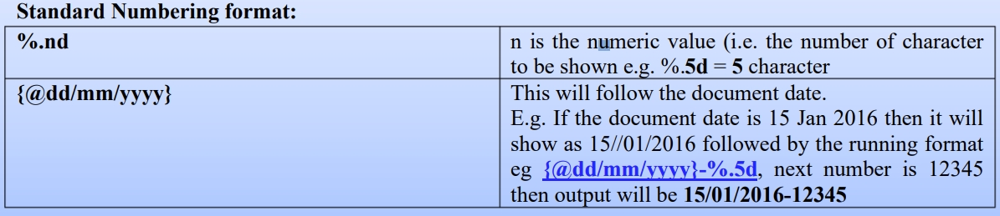

4. You can select the **Frequency** option as Never Reset or others.

5. Set the **Next Number** for this document.

   

## Maintain Acceptable Transaction Date

:::info
SQL do not need to perform year end, it will cut off automatically. Once account closed, if you wish to block the period to avoid your users changed the account figure, you may apply this setting.
:::

Maintain Acceptable Transaction Date allows you to control which documents you are allowed to maintain (New, Edit) based on their dates.

- Any document which date falls **within** the allowed transaction dates **can** be edited.

- Any document which date falls **outside** the allowed transaction dated **cannot** be edited/created.

### New Acceptable Transaction Date

1. **Tools** > **Maintain Acceptable Transaction Date**

    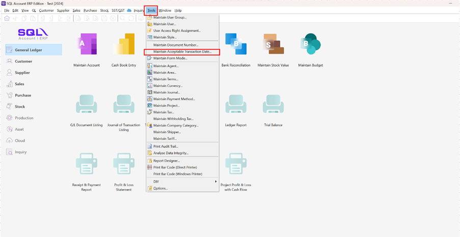

2. Click on **Append** (Icon with + symbol)

    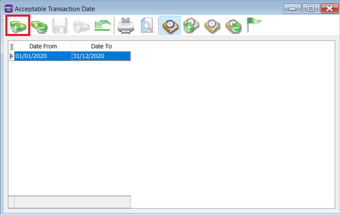

3. Choose the period which you want to **allow transactions**

4. **Save**.

    

5. Result:

    It will show the message if users try to save a document that are not in acceptable transaction period

    

    If the user click "**Yes**" a dialogue box will request override permission by ID/PW with rights to override it.

    :::info
    The default setting grants users override permission. Refer to the following section for instructions on revoking this privilege from a specific user.
    :::

### Override Acceptable Transaction Date

   To override i.e. save a document that falls outside the acceptable transaction dates, you will need to be logged-in as a user with the right to override acceptable transactions dates.

   1. **Tool** > **Maintain User**. Double click on the user that you want to **edit**.

       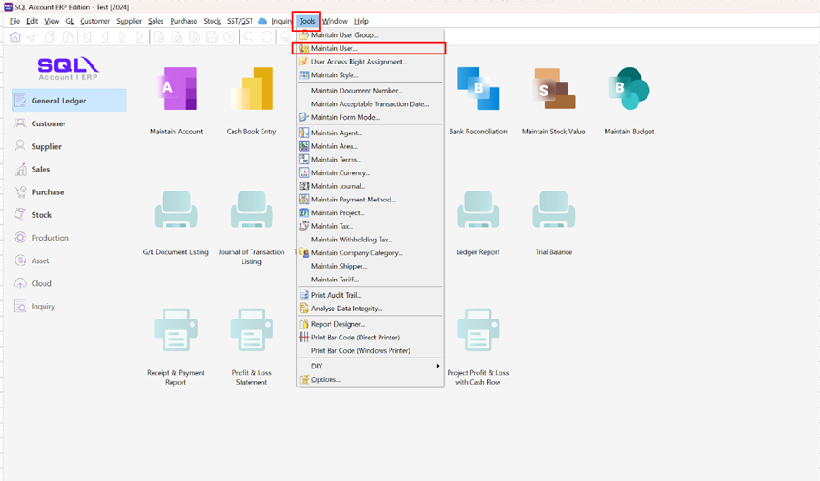

   2. Click on **More** > **Access Control**

       

   3. Under **Group Tools**, tick or untick the option of **Override Acceptable Transaction Date** to allow or deny the user from having the overriding right to save a document out of the acceptable transaction period.

   4. **Save** the access right.

        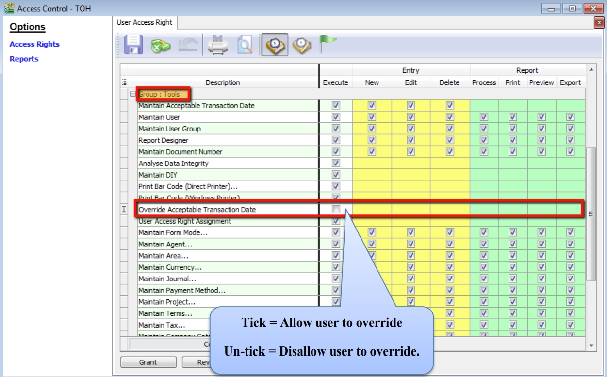

    5. Result:

        If the user Is not permitted to override, the system will prompt the following dialog and you can choose either

        - **OK = cancel saving**
        - **Override = Enter user the ID and password of a user who can override then save the transaction.**

        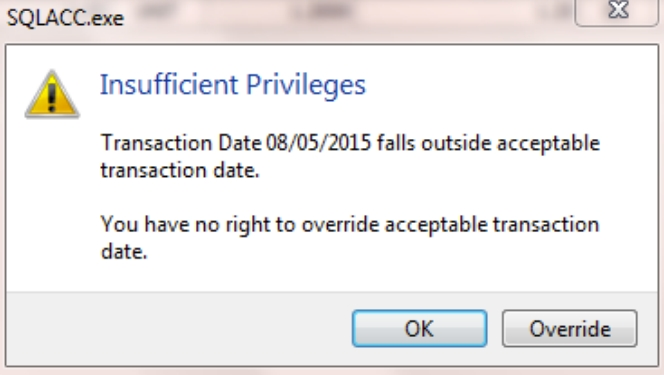

        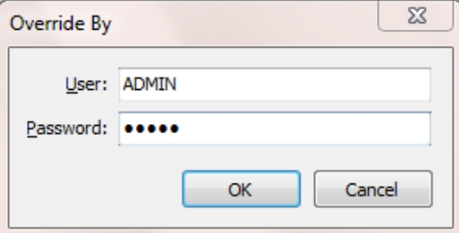

### SQL Global Price Change

SQL Global Price Change will help you **mark down price** for all items with few clicks

:::info
This is a **paid module**. Contact your SQL Service to get this standalone application.
:::

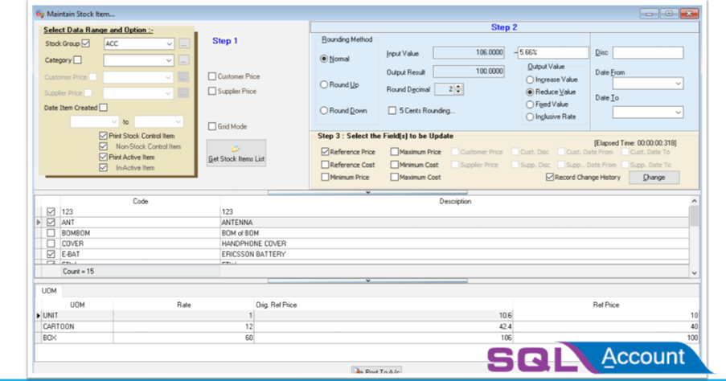

### Setup

1. Select your group of item

   1. You can select on certain stock group/ category, if you want all items, then leave stock group and category blank
   2. You can also choose only active item
   3. Once your group of item selected, click on Get Stock Items List

    

2. Setting on value to be adjust

  :::info note
    Scenario: You are trying to reduce price due to removal of GST (6% > 0%)
  :::

    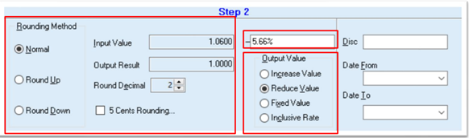

    - Rounding Method (Assuming Round Decimal is 2)
      1. Normal : Example : 0.1234 => 0.12
      2. Round Up : Example : 0.1234 => 0.13
      3. Round Down : Example : 0.1274 => 0.12

    - Input Value = Sample Value
    - Output Result = Sample Result
    - Round decimal = No. of Decimal Point

    It may looks like a **6%** reduction but it is actually **5.66%**

    Example:

    Item price = RM 100

    With 6% GST = RM 100 * 1.06 = RM 100 + 6% = RM 106
    Removal of 6% GST = RM 106 / 1.06 = RM 106 - 5.66% = RM 106

    - Mark down = 5.66 %
    - Why 5.66% instead of 6% ?
    - 30 May 2018 selling price = RM 106 GST Inclusive
    - 01 June 2018 selling Price RM 106 – 5.66% = RM 100
    - **NOT RM 106 – 6% = RM 99.64**

3. Select fields to be update

    

    - Tick on which option you want to adjust / update eg : Reference Price
    - You can also tick Record change history then system will update this changes history in your note
    - Once you complete the setting, click on Change

 4. Check & Post


## Maintain Form Mode

Form Mode helps filter data based on defined criteria. It is used to restrict users to view only specific sets of data for a certain document. For example, agent **Lip Fong can view and access the sales invoices belonging to his agent code** LF ONLY.

### New Form Mode

:::info
Watch tutorial video here: [Youtube](https://www.youtube.com/watch?v=bqSDZlAhM5I&feature=youtu.be)
:::

1. **Tools** > **Maintain Form Mode** > **New**.

2. **Enter Code & Select the document** form that you want to filter, e.g. Invoice

   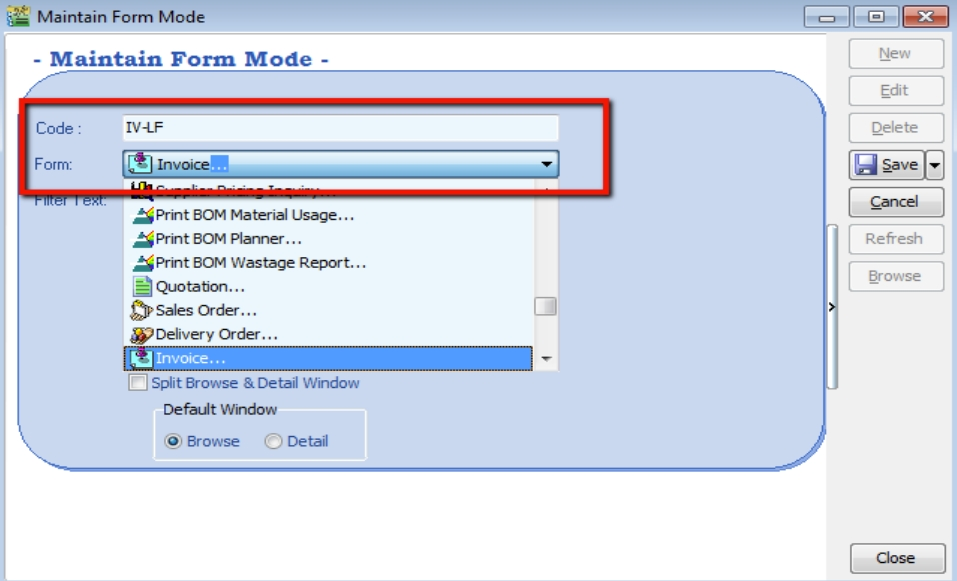

3. Click on the **Customize Filter** and then click on the **press the button to add a new condition**.

   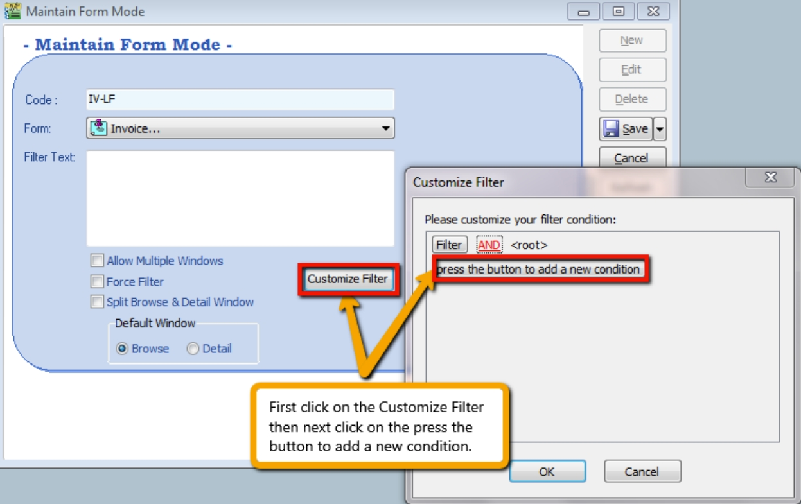

4. Change the **“SL_IV.DOCKEY” to “SL_IV.Agent”** because right now I need to filter based on sales invoice agent field, then change **the “= equals” to “like”** after that **enter the agent code** that you want to filter and click on **OK**.

   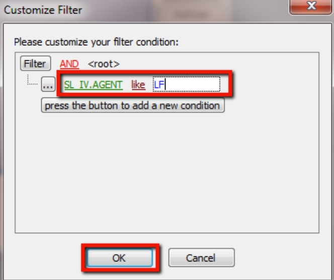

5. Make sure the info is updated correctly then you can **Save**.

   

6. Other optional setting:

   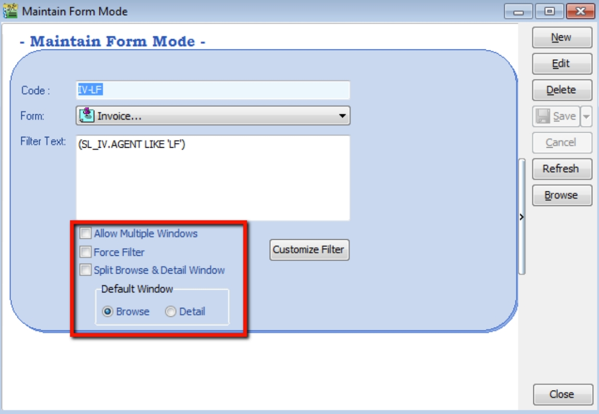

   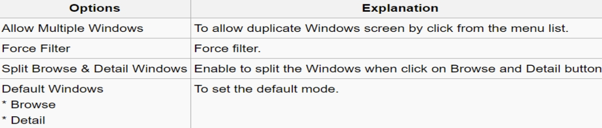

7. If you have set **more than 1 form mode**, once you click **Sales** > **Invoice** > you will get the prompt browse mode to choose which form mode that you want to apply.

   

### Form Mode VS User

   How do I apply the format mode on a specific user?

   1. **Tools** > **User Access Right Assignment…**

   2. Under the list of security, click on **form mode**

   3. Select the user, eg: user code: LF (Lip Fong)

   4. Tick to apply the **form mode**, e.g. tick **form mode: IV-LF** and click Save

      

## Maintain Terms

Maintain Terms allows the user to maintain their Customer and Supplier terms. In SQL there are 3 types of different terms for you to assign.

1. **Tools** > **Maintain Terms** > **New**

2. **Insert Code, Description and allocated Term Type.**
   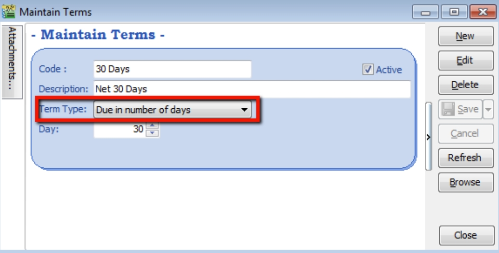

   - **Due in number of days** – Means how many days until document is due, e.g. if you set 30 days then the document will be due on the 30th day from the document date.

   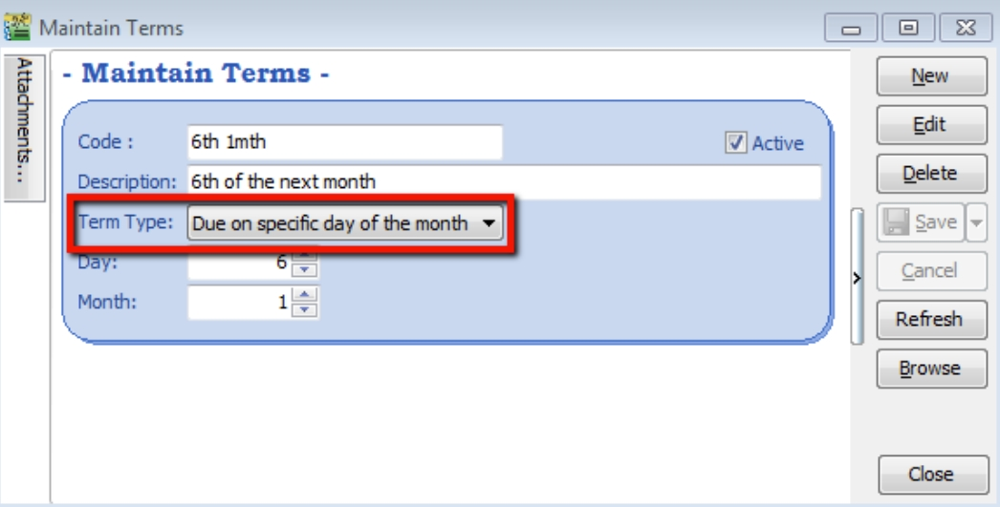

   - **Due on specific day of the month** – Means how many months and which day the document is due, e.g. if you set it as 1 Month 6 Days the document will be due on the 6th of the next month.

   

   - **Due in the month end** – Means how many months until the document is due at the end of the final month, e.g. if you set it as 2 months, the document will be due at the end of 2nd month.

## Maintain Currency

### New Foreign Currency

:::info
Watch tutorial video here: [Youtube](https://www.youtube.com/watch?v=qfhtlAjW4As&feature=youtu.be)
:::

You can bill overseas customers & suppliers in foreign currencies e.g. USD, SGD, Euro & etc. **(Prof Package Inclusive)**

1. **Tools** > **Maintain Currency** > **New**

   

2. **Maintain Customer / Supplier to assign the currency**

   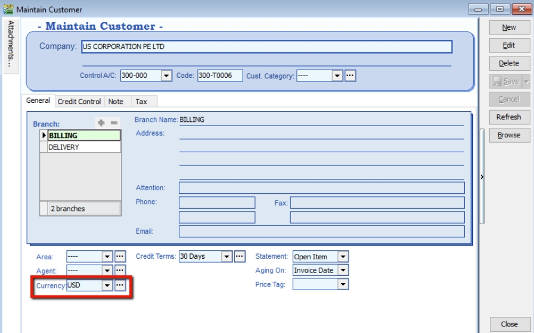

3. Sales document, select the customer, sample as below:

   1. Currency Rate will follow your setting from Tools > Maintain Currency, but it is still changeable in this invoice.

   2. Unit Price entered is in based on Customer’s currency eg this customer is in USD.

   3. system will auto converted into default currency RM on right bottom Local Net Total column.

      

### Payment from Foreign Customer

#### Scenario 1

:::note
Customer Invoice **invoice billing in USD**, but **payment paid in your local RM bank**
:::

   1. **Customer** > **Customer Payment** > **New**

   2. Select your Customer

   3. Choose your RM Bank

   4. Enter your RM Amount

   5. Knock off the invoice and the rate will be update automatically by system. Foreign gain loss will be auto calculated and post to account accordingly. (you can call out Rate & Gain Loss column from the hidden field).

      

#### Scenario 2

:::info note
Customer Invoice **billing in USD, Payment paid in your Foreign USD Bank**

*([Advance Currency](../../usage/tools/faq#advanced-currency-module) modules required)*
:::

   1. Go to Tools > Maintain Payment > edit your USD Bank

   2. **Currency**: You can assign the currency for the particular payment method, so that the payment method will be in foreign currency payment.

   3. **Bank Charge Acc**: You can pre-set bank charges account to the payment method accordingly.

   4. **OR & PV Number Set**: Set default running document number for the particular payment method (optional)

   5. **Bank Info**: able to set Giro info & make payment thru Giro (refer [Interbank Giro](docs/additional-module/interbank-giro.md) Topic for more detail)

      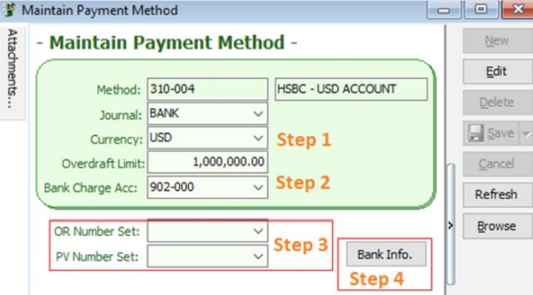

      Select your payment received in your **Foreign USD Bank**, enter your **paid Amount in USD, Enter your USD Rate** & Knock off the invoice, foreign gain loss will be auto calculated by system.

      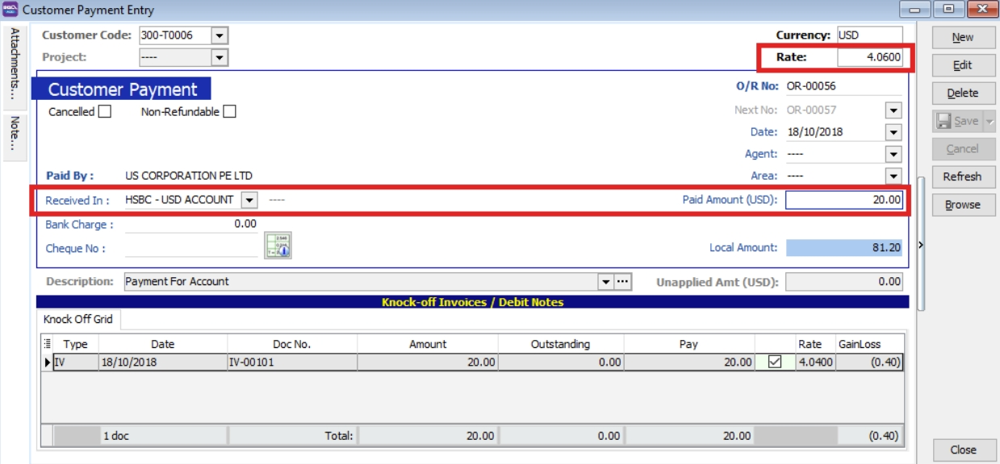

#### Scenario 3

:::info note
Customer Invoice **billing in USD**, but **payment in others currency** eg SGD / RMB / EURO
:::

   1. Select your Bank eg you received in SGD Bank, enter your SGD Amount & SGD Rate.

   2. Knock off your USD Invoice.

   3. USD rate will be auto calculated & foreign gain loss will auto calculated and posting to account accordingly

      

## Maintain Project (Required Project Module)

:::info note
This is an extra module , which means have to buy , may contact customer support to purchase.
:::

This module allows the user to maintain the project accounting on a branch or departmental basis, the user can use this module for simple construction business as they get to view Profit and Loss / Balance Sheet by Project.

1. Click on **Tools** > **Maintain Project**.

   

2. Insert **Project Code & Description**. Project Value and Project Cost is not compulsory fields to fill in, if you have filled in then it is for remark purpose.

   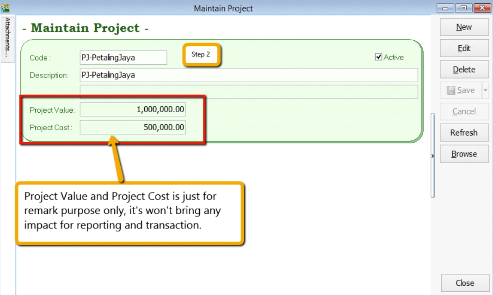

3. Click on **Tools** > **Options**.

   

4. Then look for **Miscellaneous** > Make sure the option **“Show Document Project”** is ticked.

   

5. During **sales and purchase** transactions, make sure you can **the project column**, then **update** accordingly.

   

   When keying-in a transaction, some users will ask why is there a project at item detail and another beside the Customer. Duplicate tab?

   **What is the difference between More > Project >(Document Project) and Item Detail > Project (Item Project )?**

   

   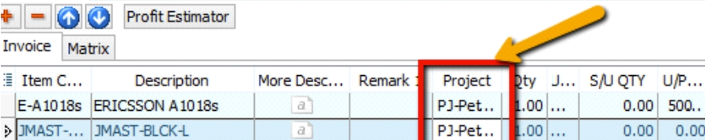

   

   **The project feature is also available for GL > Cash Book Entry.**

   After updating the document with project, how to view report with project and compare by project? For example: **GL > Print Profit & Loss Statement**.

6. Filter by the date that you want to view for the P&L report, then if you want to perform a project-to-project comparison then choose **“Comparison – Project (6 columns)”**

   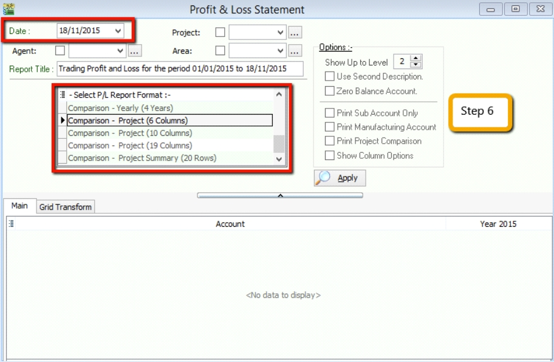

   :::info note

   6 Columns = up to 6 projects

   10 Columns = up to 10 projects

   19 Columns = up to 19 projects.

   :::

7. Criteria

   1. After selecting the report that you need, make sure to tick the **“Show Column Options”**, then the top of the report will show column options.

   2. You may change the period that you want to view, e.g. by default it will be **“Current Month”**.

      If you want to view the whole year figures, then you have to **change to “Current Year”**.

      

8. After changing the column options, you have to **tick the “Print Project Comparison”**, then the project tab will appear on the **right hand site**, you can select which project that you want to view then click on **Add**.

   

9. Click on **Apply** and you will see the result. The P&L report will compare each project that you select.

   

### 5 Cents Rounding

We can pre-set the system to automatically round your invoice or cash sales amounts to the nearest 5 cents.

:::info

Watch tutorial video here: [Youtube](https://www.youtube.com/watch?v=VSnX55l_3xw&feature=youtu.be)

:::

1. **Tools** > **Options** > **Customer**

2. **Tick 5 Cents Rounding** for Sales Invoice/ Cash Sales

   

   

### Online Mobile Approval

### How it works?

For example : If we set Credit Limit over RM30,000 will required override

1. A Dialog box will be prompted after *Save Invoice*, ***‘Do You want to override?’*** > Click ***Yes***

    

2. Click on ***Online Approval***

    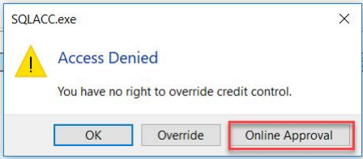

   1. Tick the ID that you choose to get approval

   2. You can choose to send by **Whatsapp**, **Send by Email** or **Send by Whatsapp & Email**

       

3. You will receive a message at **Whatsapp** message or **email sent by system**

   - **Senario 1 : Send By Whatsapp**

        You will receive a message > Click the link

        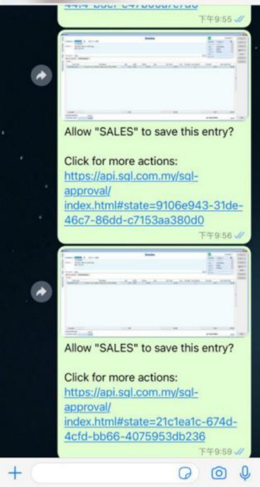

   - **Senario 2 : Send By Email**

        You will receive an email > Click **'CLICK HERE FOR MORE ACTIONS'**

        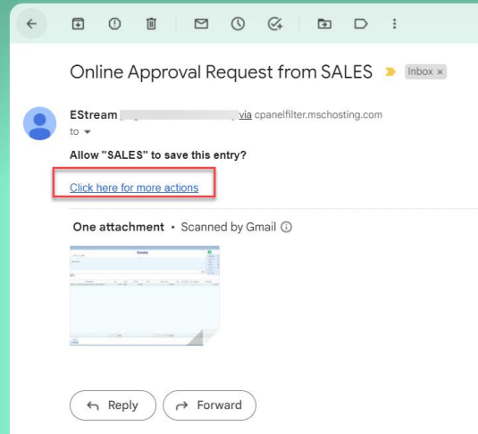

4. Login **Gmail Address** that you set in maintain user **Open ID (Google)**

   :::info[note]

      - This step is for those send by **whatsapp** and **not use Gmail** to receive notification
      - Those use **Gmail Address** to receive notification and approve can jump to **Step 6**

   :::

   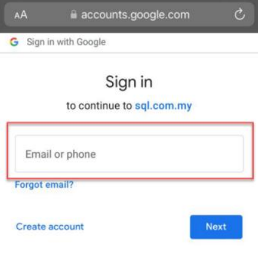

5. Enter your Gmail Password

    

6. After Login Gmail you will see this window

    

7. You can click on **Doc Detail** and **ScreenShot** to see the detail

   1. **Doc Detail** : To show Customer Code, the reason why need override

   2. **ScreenShot** : To see the transaction screen

   3. **Reply** : You can left a message and click Approve or Reject

        

    :::info[note]
    After Approve or Reject you can go back SQL Accounting, you will see below possible scenario
    :::

     - **Scenario 1 : Approve Override**

         >a. Message : Approve Message
         >
         >b. The green tick will appear after approve
         >
         >c. Click **OK** to save that transaction

         

     - **Scenario 2 : Reject Override**

         >a. Message : Reject Message
         >
         >b. The cross will appear after reject
         >
         >c. **OK** button is disabled after reject, click **Cancel**

         

         After Click Cancel System will Prompt back to this dialog box :

         

### When to use?

These **ALL** can use Online Approval for user :

| Module          | Action                                                                                     |
|---------------|-----------------|
| Logon Screen    | - No access right to change password                                                      |
| All Module      | - All Document entry without Execute / Print / Preview / Export access rights               |
|                 | - Unable to Save and Manage Grid Layout                                                    |
|                 | - Unable to Grid Export                                                                    |
|                 | - Save Document Fall Outside Acceptable Trans Date                                         |
| Customer Inovice| - Fast entry save Invoice                                                                  |
| SL&PH           | - Prompt Stock Qty Control Dialog                                                          |
|                 | - Prompt change unit price                                                                 |
|                 | - Save price below cost (fmSLPriceControl)                                                  |
|                 | - Override Credit Control                                                                  |
| GL              | - Bank Recon Entry form to Check Bank Recon Listing                                         |
| Stock           | - Update GL stock value from other stock month end report                                   |
|                 | - Stock Report with Execute access right but without Process right                          |
| Inquiry         | - Hide Dashboard                                                                           |

### 1. Maintain User

1. Tools > Maintain User

    

### 2. Edit User

1. Double click the user that you want to setting > Edit

    

    

### 3. Set Approval Person

- Setting The Detail For Approval Person (ONLY GMAIL CAN LOGIN TO APPROVE OR REJECT)

  1. Mobile number - To which whatsapp number to get notification for approval only

  2. Email - To which email address to get notification for approval only

  3. Open ID (Google) - Gmail for approve or reject

    :::info[note]
    If receive notification email and approve email is Gmail, do setting only at **3.OPEN ID (Google)** and leave **2.Email** column blank
    :::

    

    For Example :

       - **Senario 1 : Use Same Gmail to Receive Notification and Give Approval**

            Your Gmail address is : `XXXXXX@gmail.com`

            1. Open ID (Google) : `XXXXXX@gmail.com`
            2. Email : **Left as blank**

         

        - **Senario 2 : Use Different email to received notification and give approval**

            - To Give Approval Gmail Address is : `XXXXXX@gmail.com`
            - To Received notification Address is : `XXXXXX@estream.com`

               1. Open ID (Google) : Put your gmail address `XXXXXX@gmail.com`
               2. Email : `XXXXXX@estream.com`

          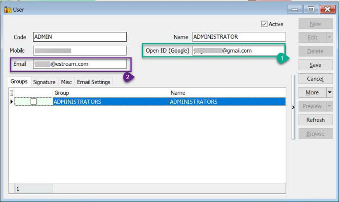

### 4. Setting SMTP

:::info[note]

- This Setting is for user who want to **use Email to send Notification**
- If use whatsapp to send approval can skip this step

:::

1. Make Sure you had create App Password
   - If you are using Gmail , you can [CLICK HERE](https://support.google.com/accounts/answer/185833?hl=en) to follow the steps to create your App Password
   - After getting your App Password, return to your SQL Accounting

2. Click on Email Setting
3. Your Email SMTP Host
4. Your Email SMTP Port
5. Your Email SMTP Connection Security
6. Your Email Address
7. Your Apps Password
8. Your Email Sender Name
9. Afte done setting click Save

    

## Maintain Journal

- Journal is mostly utilized to categorize document kinds while analyzing reports by journal.


### Create New Journal

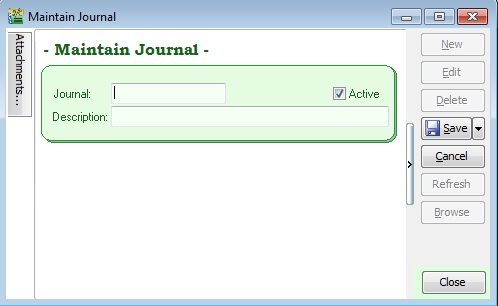

| **Field Name** | **Explanation & Properties** |
|----------------|------------------------------|
| **Journal** | - Input the new Journal code
- **Field type:** Alphanumerical
- **Length:** 10 |
| **Description** | - Input the Journal description
- **Field type:** Alphanumerical
- **Length:** 80 |
| **Active** | - Checked = Active
- Unchecked = Inactive |                                          |

### Journal Setting

1. Lets said you have create a new Journal named "Sales-DN". See below screenshot.

      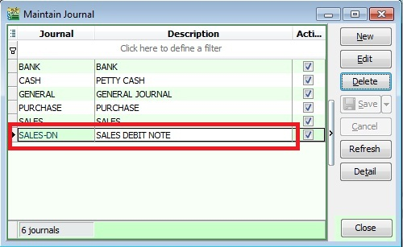

2. You have to set the Journal at Tools | Options...
3. At the General Ledger tab, you can link the Journal to a default Journal.
4. For example, "Sales-DN" Journal link to a default Journal "Customer Debit Note". See below screenshot.

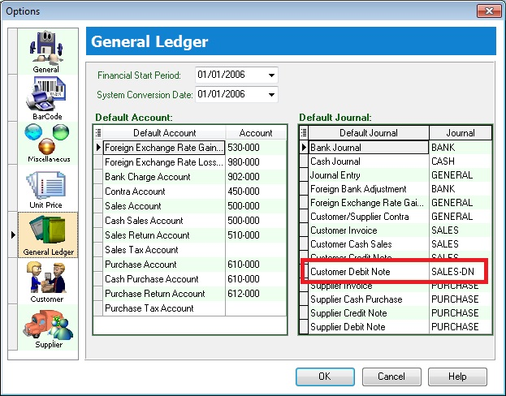

### Reporting by Journal

GL | Print Journal of Transaction Listing...See below screenshot :

 


2. You can select the Journal lookup as shown in the above screenshot.
3. System will list out the double entry posted from the Sales/Customer Debit Note.

## Maintain Style

 *Menu: Tools | Maintain Style*

  >To display the document details in different font type (currently not supported) and size.
  >For example the document detail font size is 10, see the below screenshot:
  >

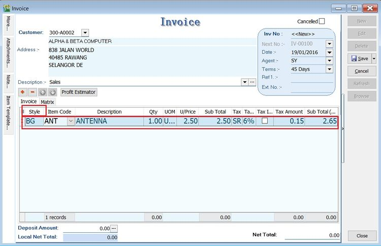

### Create New Style


| Field Name         | Explanation & Properties                                                         |
|--------------------|----------------------------------------------------------------------------------|
| **Style ID**       | - Input the new Style ID.<br />- **Field type:** Alphanumerical<br />- **Length:** 5 |
| **Font**           | - Always tick and click on the Font button to select the font size.<br />- **Field type:** Checkbox |
| **Background - Color** | - Not supported                                                              |
| **Background - Image** | - Not supported                                                              |

## Maintain Commision

- Menu: Tools | Maintain Commission Script...

1. To execute a simple commission script to determine the commission rate based on the payment age (Payment Date - Invoice Date).
2. Sales Commission Script module is required.

Browse mode in Maintain Style. See the below screenshot:

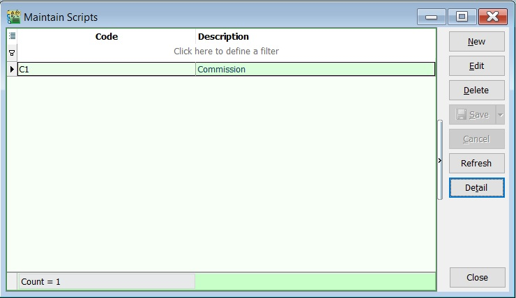

### Create New Commission Script

1. Click on NEW. See the below screemshot.

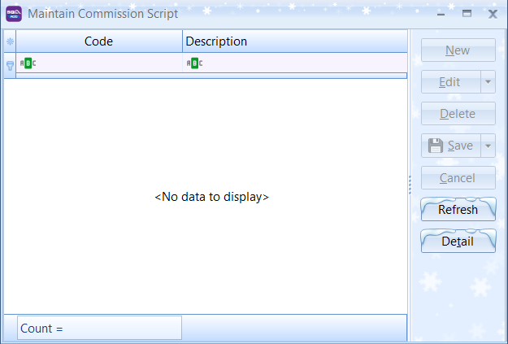

      | Field Name   | Explanation                              |
      |--------------|------------------------------------------|
      | **Code**     | Input the new code.                      |
      | **Description** | Input the commission script description. |
      | **Script**   | Load the commission script.              |

2. Example of the scripts:

   a. Script 1

<details>
   <summary>Commission Script</summary>

```sql
procedure CalculateCommission(AKODocAmt, AAge: variant; var Value: variant);
begin
  if AAge < 10 then
    Value := AKODocAmt * 0.05
  else if AAge < 20 then
    Value := AKODocAmt * 0.03
  else if AAge < 30 then
    Value := AKODocAmt * 0.02
  else
    Value := AKODocAmt * 0.005;
end;
```

</details>

## Maintain Agent

*Menu: Tools | Maintain Agent...*

1. An agent is the sales person or sales representative.
2. It is very useful when you are trying to apply the reports by an Agent.
3. You can create/edit the agent or sales person code here.

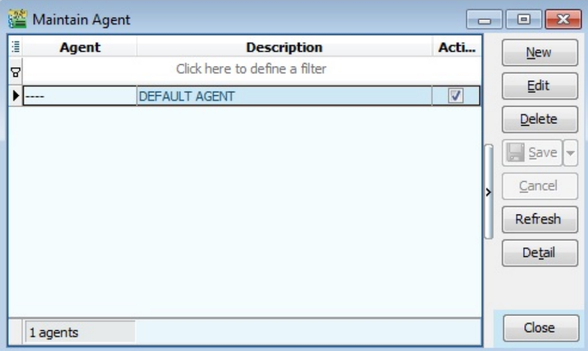

### Create New Agent 


| Field Name   | Explanation & Properties |
|--------------|---------------------------|
| **Code**     | - Input the new Agent code - Field type: Alphanumerical - Length: 10 |
| **Description** | - Input the Agent Name - Field type: Alphanumerical - Length: 80 |
| **Active**   | - Checked = Active - Unchecked = Inactive |

## Maintain Area

- Menu: Tools | Maintain Area...

>1. Area can be the state, country or regions.
>2. It is very useful when you are try to apply the reports by Area.
>3. You can create/edit the area or country code here.
>

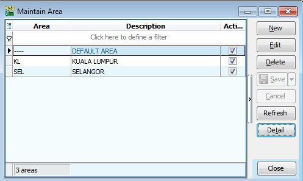

### Create New Area

- Below is Area entry form 


## Maintain Withholding Tax

*Menu : Tools | Maintain Withholding Tax...*

### Create Withholding Tax Code

1. Click New.
2. Input the following data:

   | Field Name        | Explanation                                  | Remark                                                                 |
   |-------------------|----------------------------------------------|------------------------------------------------------------------------|
   | **Code**          | Set a code                                   | WTH-TAX15                                                              |
   | **Description**   | Describe the meaning/usage of this code       | Withholding Tax 15%                                                    |
   | **Tax Rate**      | Withholding Tax Rate                         | 15%                                                                    |
   | **Tax Account (DR)** | Set to Withholding Tax Expense account       | At GL\Maintain Account, create the Withholding Tax Expense account under **Expenses** |
   | **Tax Account (CR)** | Set to Withholding Tax Payable account       | At GL\Maintain Account, create the Withholding Tax Payable account under **Current Liabilities** |

   

3. Click on Save.

## Maintain Company Category

*Menu: Tools | Maintain Company Category...*

1. Company Category usually use to categorize the customer/supplier. For example, 3rd Parties-Domestic, 3rd Parties-Export, Intercompany, etc.
2. It is very useful when you are try to apply the reports by Company Category.
3. You can create/edit the Company Category or sales person code here.


### Create New Company Category

- Screenshot below is the Company Category entry form.

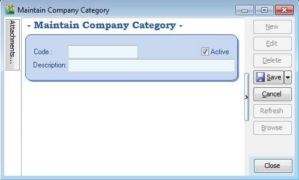

| Field Name  | Explanation & Properties                         |
|-------------|--------------------------------------------------|
| **Code**    | Input the new Company Category code  *Field type:* Alphanumerical  *Length:* 10 |
| **Description** | Input the Company Category Name.  *Field type:* Alphanumerical  *Length:* 80 |
| **Active**  | Checked = Active  Unchecked = Inactive        |

### Use of Company Category

- You can link the Company Category to the Customer or Supplier.


Reports by Company Category

1. You can apply the following reports by Company Category.

   <details>
   <summary><b>Customer</b></summary>

      a. Print Customer Document Listing...

      b. Print Customer Balance Report...

      c. Print Customer Due Document...

      d. Print Customer Aging Report...

      e. Print Customer Statement...

      f. Print Customer Post Dated Cheque Listing...

      g. Print Customer Analysis By Document...

      h. Print Customer Sales and Collection Analysis...

   </details>

   <details>
   <summary><b>Supplier</b></summary>

   a. Print Supplier Document Listing...

   b. Print Supplier Balance Report...

   c. Print Supplier Due Document...

   d. Print Supplier Aging Report...

   e. Print Supplier Statement...

   f. Print Supplier Post Dated Cheque Listing...

   g. Print Supplier Analysis By Document...

   h. Print Supplier Sales and Collection Analysis...

   </details>

   <details>
      <summary><b>Sales</b></summary>

   a. Print Sales Document Listing...

   b. Print Outstanding Sales Document Listing...

   c. Print Sales Price History...

   d. Print Profit & Loss by Document...

   e. Print Sales Analysis by Document...

   f. Print Yearly Sales Analysis...

   </details>

   <details>
      <summary><b>Purchase</b></summary>

   a. Print Purchase Document Listing...

   b. Print Outstanding Purchase Document Listing...

   c. Print Purchase Price History...

   d. Print Purchase Analysis by Document...

   e. Print Yearly Purchase Analysis...

   </details>

2. Example of Print Customer Aging Report screenshot.


## Maintain Shipper

*Menu: Tools | Maintain Shipper...*

1. To maintain the shipper profile such as **name**, **address**, **phone**, **account**, etc. It is easy to trace the shipper name who ship the goods or service.
2. Sometimes, you can use as "**Global Delivery**" where you can apply to both sales / purchase documents.

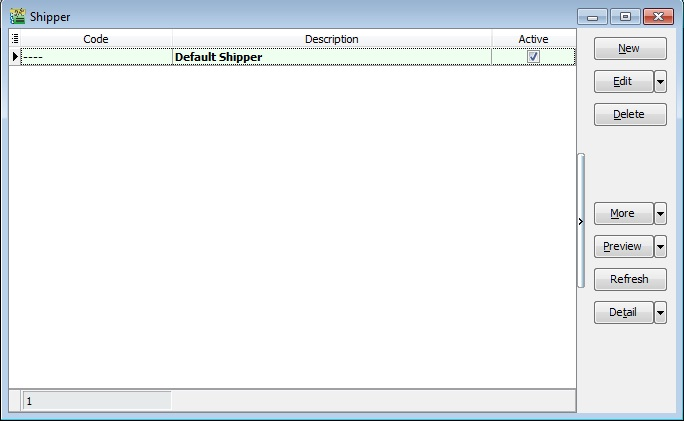

### Create New Shipper

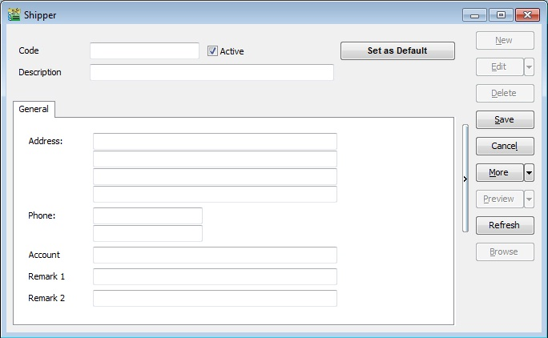

<details>
  <summary><b>Shipper Fields</b></summary>

  | **Field Name** | **Explanation** | **Properties** |
  |----------------|-----------------|----------------|
  | Code          | Input the new Shipper code | Alphanumerical, Length: 30 |
  | Description   | Input the Shipper name | Alphanumerical, Length: 160 |
  | Address       | Input the Shipper Address | Alphanumerical, Length: 60 per line |
  | Phone         | Input the Shipper Phone | Alphanumerical, Length: 20 per line |
  | Account       | Input the Shipper Account | Alphanumerical, Length: 40 |
  | Remark 1      | Input any remark (free field) | Alphanumerical, Length: 200 |
  | Remark 2      | Input any remark (free field) | Alphanumerical, Length: 200 |
  | Description   | Input the Shipper name | Alphanumerical, Length: 160 |
  | Active        | Checked = Active, Unchecked = Inactive | Boolean |

</details>

### Use of Shipper

1. Both Sales / Purchase documents, you can select the shipper by clicking on the **MORE** tab (LEFT side bar)
2. Example of Sales Delivery Order screenshot


### Report by Shipper

1. You can apply the Sales report by Shipper, especially the reports from **Sales | Print Sales Price History**.
2. Example of Sales Price History report screenshot


## Maintain Tariff

*Menu: Tools | Maintain Tariff...*

- Tariff classification is a complex yet extremely important aspect of **cross-border trading**.

- **Goods imported** from or to Malaysia are classified by the Harmonized Tariff Schedule (HTS) or commonly referred to as **HS Codes**.

- The codes, created by World Customs Organization (WCO), categorize up to 5,000 commodity
HS Codes are made of **6-digit numbers** that are recognized internationally, although different countries can extend the numbers by two or four digits to define commodities at a more detailed level.

[Click here to search for tariff rates on products](https://ezhs.customs.gov.my/) to search the tariff code list from Kastam system.

### Create New Tariff


| **Field Name** | **Explanation** | **Properties** |
  |----------------|-----------------|----------------|
  | Code          | Input the new Tariff Code | Alphanumerical, Length: 20 |
  | Description   | Input the Tariff Description | Alphanumerical, Length: 160 |
  | Active        | Checked = Active, Unchecked = Inactive | Boolean |

## Print Audit Trail

*Menu: Tools | Print Audit Trail...*

> All questions regarding who created, edited, or deleted the data, and when, can be answered through the Print Audit Trails.

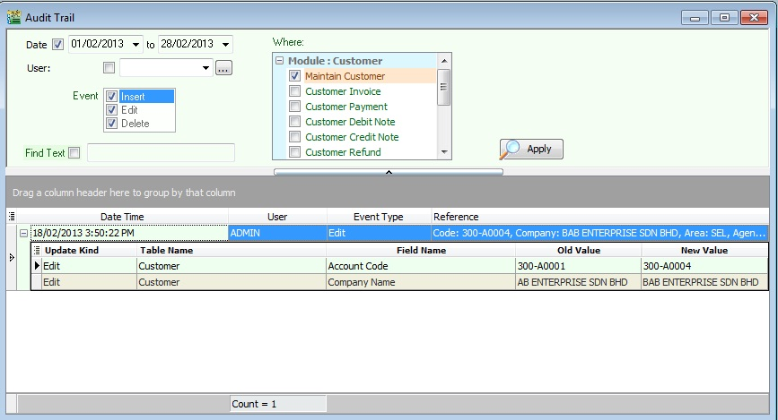

| Field Name | Explanation & Properties |
|------------|---------------------------|
| Date       | Input the date range to be audited. |
| User       | Select the user to be audited. |
| Event      | Insert = Check who/when the data was created.Edit = Check who/when the data was modified.Delete = Check who/when the data was deleted. |
| Where      | Tick the modules to be audited. |
| Find Text  | Input the specific keyword to be audited, e.g., invoice no., customer code, etc. |

### Advanced Options

  > If you wish to audit the Sales/Purchase/Stock documents details, you must enable this "Post Audit Trail for Stock/Sales/Purchase Detail". See below screenshot:

  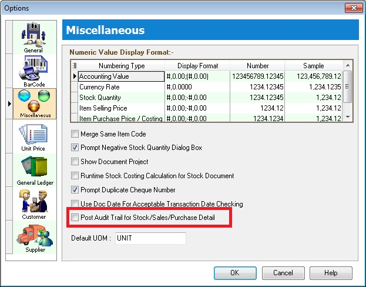

## Analyse Data Integrity

  Menu: Tools | Analyse Data Integrity...

:::warning
RUN Analyse Data Integrity ONLY when you have at least **1-3 hours** for operations in company and SQL Account to be **fully stop**...
:::

  To analyse the data integrity check. It is recommended to perform this action **weekly** or **monthly**
  > (before month end closing).

Reason to run this may due to the following unpredictable matters:

>1. malfunction/glitch from hardware such as network switch, computer, server, etc.
>2. Network stability, such as wireless lost connection.
>3. Power failure
>4. Operating System failure
>

<details>
  <summary>Parts of Analyse Data Integrity - click to expand</summary>

There are 3 parts of analyse data integrity :

a. Regular Data Integrity (Default)

- Check AP Knock Off Integrity
- Check AR Knock Off Integrity
- Update Customer Outstanding
- Check Document Integrity
- Check Document Transfer Integrity
- Check Delivery Order/Invoice/Cash Sales to Credit Note Posting Date
- Check Production Document Transfer Integrity
- Check GL Opening Balance
- Check GST DO -> IV Posting Integrity
- Repost Stock Transactions
- Calculate Stock Costing
- Compress Stock Item Pictures
- Update Stock Balance Quantity
- Update Supplier Outstanding
- Resequence Table Fields
- Regenerate Views
- Remove Temporary Table

b. Reposting (Optional)

- Repost AR Documents
- Repost AP Documents
- Repost GL Documents
- Repost PH Documents
- Repost SL Documents

</details>

:::info NOTE:

1. Reposting might took longer time to perform repost for the documents selected.

2. Recommended to run at the server side.
:::

  

### To Start Analyse

1. Tick the Analyse Items required to analyse, otherwise skip this step 1.
2. Click on Start Analyse.

   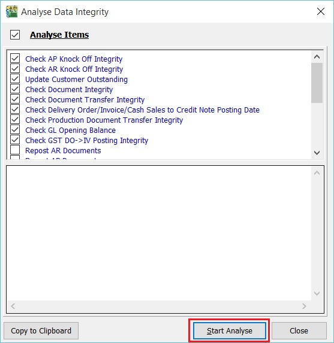

3. Prompt the message to inform you the total tasks ticked has analyse completed.

   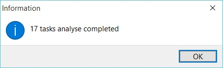

4. You can copy the analyse log detail by click on Copy to Clipboard.

   

5. Open notepad or Microsoft Words. Paste it.

   

## Print Bar Code (Direct Printer)

*Menu: Tools | Print Bar Code (Direct Printer)*

- To print the bar code label using Special Bar Code Printer for the items created in Maintain Stock Item.

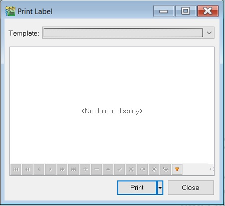

### Bar Code Printer Setting 

*Menu: Tools | Options...(BarCode)*

1. Insert the new barcode printer setting and template.

   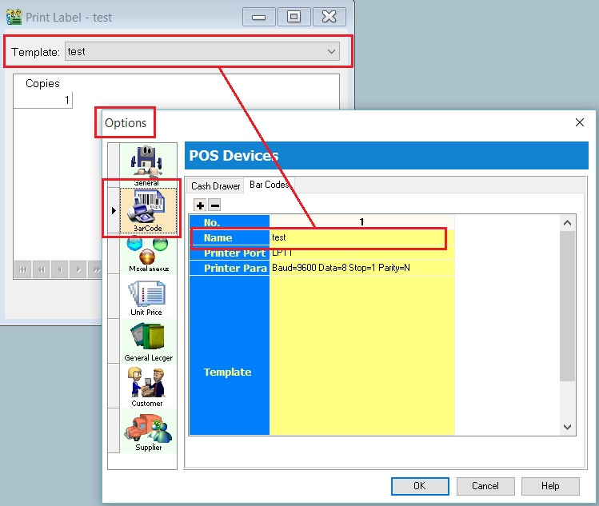

2. Click on OK to exit.

### Print the Bar Code Label

1. Click on the arrow key-down beside the Print button. See the screenshot below.
2. You can choose either Print to Printer (barcode printer) or Print To File (output as text file).


## Print Bar Code (Windows Printer)

*Menu: Tools | Print Bar Code (Windows Printer)*

- To print the bar code label using Windows Printer for the items created in Maintain Stock Item.

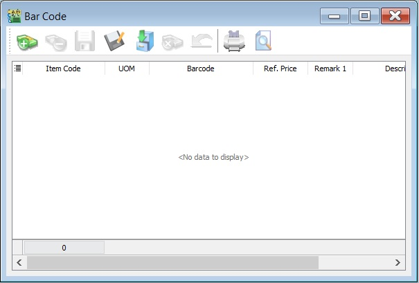

### Update Item Bar Code Listing 

1. At first, you can update the item bar code in the Maintain Stock Item.

   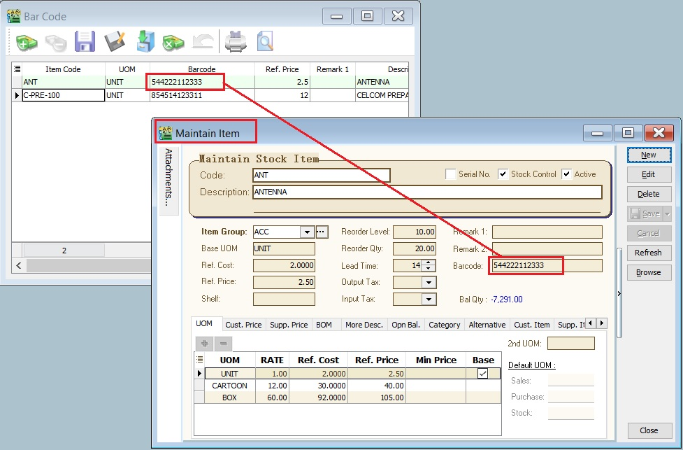

2. Click on + button to insert the items. See the screenshot below.

   

3. Click the SAVE button to save the item bar code listing. Type a file name (eg. BarCode_Items_31122015) to save. See the screenshot below.

   

4. Message prompted. Click OK.


### Load the Previous Item Bar Code Listing

1. Click on a Carbinet button to load from the previous file for item bar code listing (eg.BarCode_Items_31122015). Click on OPEN.

   

2. Confirmation message prompted. Click on OK to load it. Click on NO' to cancel it.

   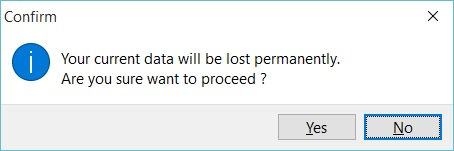

3. Message Load success prompted. Click on OK to proceed.

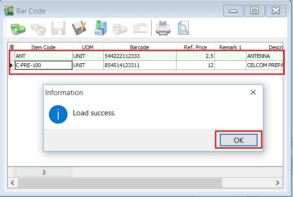

### Preview/Print the Bar Code Level

1. Click on Preview or Printer (to skip the preview).

   

2. After the preview, click on Printer button to print.

### How to Change the Label Size (mm) Measurement for the Bar Code Label

1. Click on the Report Name. See the screenshot below.

   

2. To change the paper unit measurement. Click on Report | Units, choose to Millimeters.

   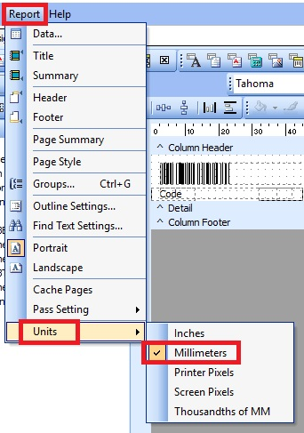

3. To change the paper size. Click on **File | Page Setup...**

   

4. Click on Paper Size tab, change the Width and Height to 35 and 25 respectively (mm), eg. the label paper size is 35mm x 25mm.

   

5. Check the Layout tab to make sure the Columns set to value = 1.

   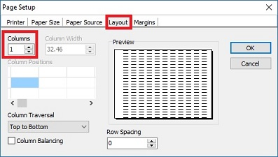

6. Check the Margin tab as well to make sure all (Top, Bottom, Left, Right) are set to value = 0 . Click OK to exit Page Setup.

   

7. To fix label each page contains 1 barcode of an item. Right click on Detail band, select Position.

   

8. Set Print Count to value = 1. Click OK to confirm.

   

9. Save the report with **another name**.

## Options

<details>
   <summary>Options (Acc) - click to expand</summary>

*Menu: Tools | Options...*

Settings for the following:

1. General
2. BarCode
3. Miscellaneous
4. Unit Price
5. General Ledger
6. Customer
7. Supplier

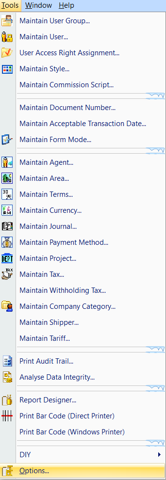

### General

- Automation Server Registration - Use to register/communicate to the external application via Windows platform.

 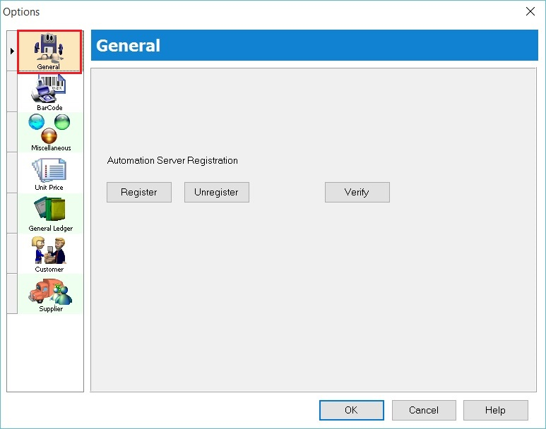

### Bar Code

- To define the cash drawer setting with a compatible device, eg. cash drawer.


- To define the barcode setting with a compatible device, eg. barcode printer.

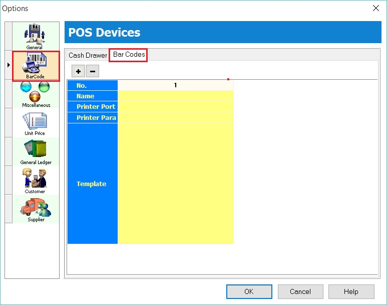

### Miscellaneous

Others setting.


#### To set the display format

- To understand the display format. See the below picture:


| Numbering Type              | Display Format     | Example |
|-----------------------------|--------------------|---------|
| Accounting Value            | #,0.00;(#,0.00)   | <div>Amount/DR/CR display format<br/>Positive value = 1,000.00<br/>Negative value = (1,000.00)</div> |
| Currency Rate               | #,0.0000          | <div>Exchange Rate display format, e.g. 1 USD = 4.2334 MYR</div> |
| Stock Quantity              | #,0.00;-#,0.00    | <div>Qty display format<br/>Qty In = 2.00 units<br/>Qty Out = -2.00 units</div> |
| Item Selling Price          | #,0.00;-#,0.00    | <div>Sales Unit Price display format, e.g. unit selling price = 25.53</div> |
| Item Purchase Price / Costing | #,0.00;-#,0.00  | <div>Purchase Unit Price and Total Cost display format, e.g. unit purchase price = 15.33</div> |

#### Merge Same Item Code

1. Tick this option to merge same items quantity and amount when you print the documents, eg. sales invoice, cash sales, etc.
2. Conditions:

- a. Same item Code;
- b. Same UOM;
- c. Same Unit Price;
- d. Sames Disc;
- e. Same Tax Code.


#### Prompt Negative Stock Quantity Dialog Box

- Tick this option the system will prompt alert message if the stock below quantity on hand or below re-order level or below minimum quantity in the sales documents.


#### Show Document Project

1. Tick this option to enable to select the document project.
2. See the example in the screenshot below.

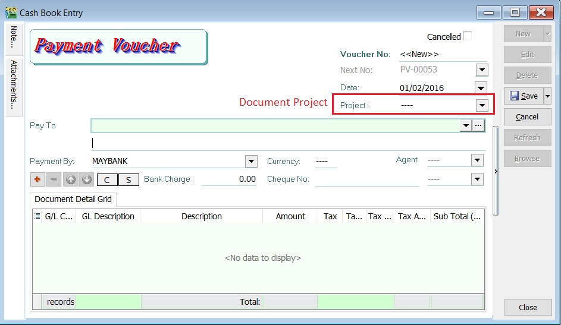

#### Runtime Stock Costing Calculation for Stock Document

1. To enable to execute the costing calculation when print the stock documents reports (report name ended with Actual Cost) in the Stock Issue, Stock Adjustment and Stock Transfer (available in multiple warehouse module).
2. See the example of stock issue as shown in the screenshot below.

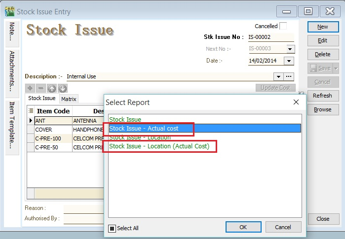

#### Prompt Duplicate Cheque Number

- To alert a message if duplicate cheque number are try to save in Payment Voucher/Official Receipt.

 

#### Use Doc Date For Acceptable Transactions Date Checking

1. System will use document date instead of post date to check and allow to save the document based on the allow date set in Maintain Acceptable Transaction Date.
2. For instance, the document date = 01/01/2016 and post date = 17/02/2016. System will not allow to save this document fall outside the acceptable transaction date (ie. 01/02/2016 - 29/02/2016). See the screenshot below.

 

#### Post Audit Trail for Stock/Sales/Purchase Detail

- To audit log the changes has been made in Sales and Purchase detail.


#### Default UOM

- Default the base UOM when create new item in Maintain Stock Item.


### Unit Price

- To set the unit price priority apply to the sales/purchase/stock documents when select the item code for a customer/supplier.

- Sales


- Purchase


- Stock

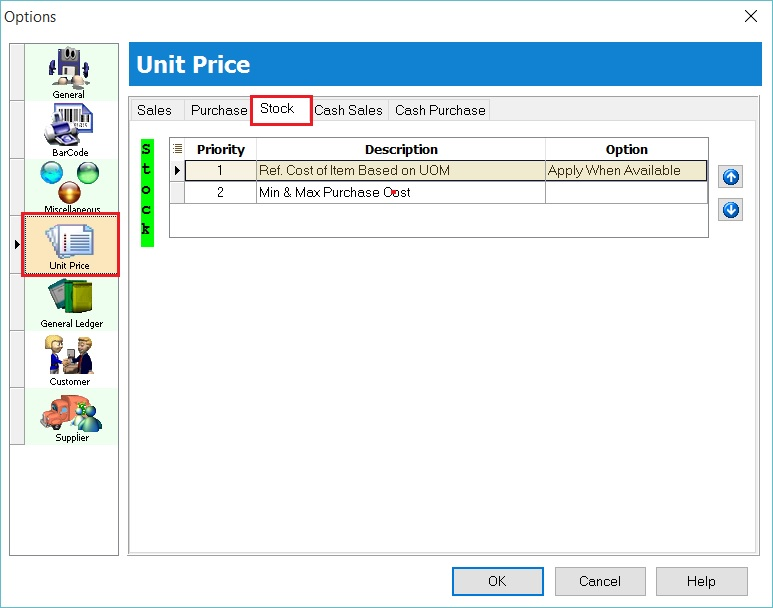

- Cash Sales

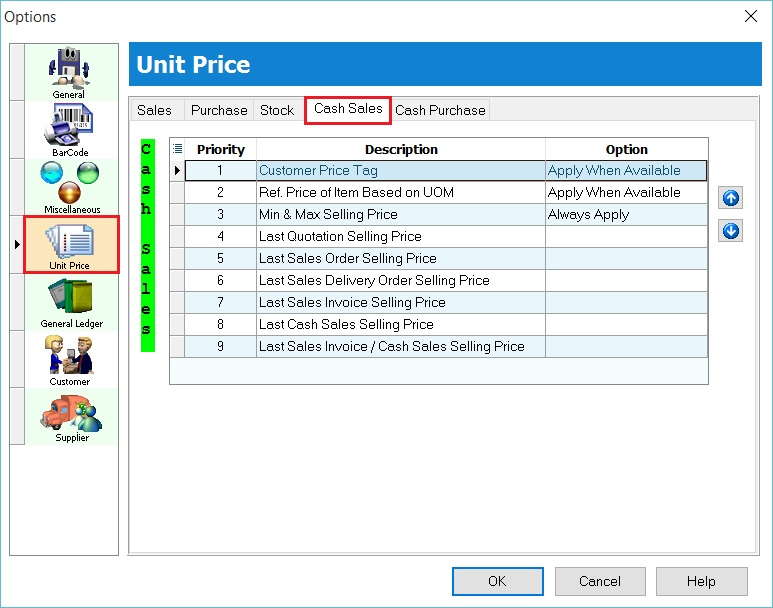

- Cash Purchase


### General Ledger (GL)

- It is important to define the setting correctly in the new database created.


**Financial Start Period**
   To define the company Financial Start Date, eg. 01/01/2016 (system will be notified New Financial Start Date at 1st January every year).

**System Conversation Date**
   System conversation date from other system or new company database setup.

**Default Account**
   Default account use to auto posting by the system.

| Default Account                      | Account   | Explanation                                                                 |
|--------------------------------------|-----------|-----------------------------------------------------------------------------|
| Foreign Exchange Rate Gain Account   | 530-000   | Foreign Exchange Rate Gain auto posting from Customer and Supplier Payment. |
| Foreign Exchange Rate Loss Account   | 980-000   | Foreign Exchange Rate Loss auto posting from Customer and Supplier Payment. |
| Bank Charge Account                  | 902-000   | Bank charge auto posting from GL Cash Book Entry, Customer and Supplier Payment if entered in the bank charge field. |
| Contra Account                       | 450-000   | Applicable to Customer and Supplier Contra.                                 |
| Sales Account                        | 500-000   | Default sales account in Sales Invoice and Debit Note if empty item code.   |
| Cash Sales Account                   | 500-000   | Default cash sales account in Sales Cash Sales if empty item code.          |
| Sales Returns Account                | 510-000   | Default sales returns account in Sales Credit Note if empty item code.      |
| GST-Output Tax Prepaid               | GST-103   | Applicable to 21 Days Rules and Non-Refundable Deposit.                     |
| GST-Sales Deferred Tax               | GST-202   | Applicable to Bad Debt Relief and Bad Debt Recovered related to Customer.   |
| Purchase Account                     | 610-000   | Default purchase account in Purchase Invoice and Debit Note if empty item code. |
| Cash Purchase Account                | 610-000   | Default cash purchase account in Purchase Cash Purchase if empty item code. |
| Purchase Return Account              | 612-000   | Default purchase returns account in Purchase Returns if empty item code.    |
| GST-Purchase Deferred Tax            | GST-102   | Applicable to Bad Debt Relief and Bad Debt Recovered related to Supplier.   |
| GST-Payable (Kastam)                 | GST-KASTAM| RMCD accounts.                                                              |
| Unclaimable GST Account              | GST-301   | Applicable to Mixed Supplies only.                                          |

#### Default Journal

1. To classify the transactions into the Journal created in Maintain Journal. Usually leave it as default.
2. It is very useful for applying the Journal of Transactions Listing and Summary report.

   

3. Below is the default journal list:-

| Default Journal                  | Journal   |
|----------------------------------|-----------|
| Bank Journal                     | BANK      |
| Cash Journal                     | CASH      |
| Journal Entry                    | GENERAL   |
| Foreign Bank Adjustment          | BANK      |
| Foreign Exchange Rate Gain/Loss  | GENERAL   |
| Customer/Supplier Contra         | GENERAL   |
| Customer Invoice                 | SALES     |
| Customer Cash Sales              | SALES     |
| Customer Credit Note             | SALES     |
| Customer Debit Note              | SALES     |
| Supplier Invoice                 | PURCHASE  |
| Supplier Cash Purchase           | PURCHASE  |
| Supplier Credit Note             | PURCHASE  |
| Supplier Debit Note              | PURCHASE  |

### Customer

- It is important to define the Customer setting in the new database created.

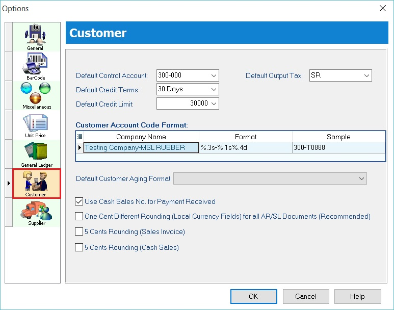

**Default Control Account**
   Default control account when create new customer in Maintain Customer.

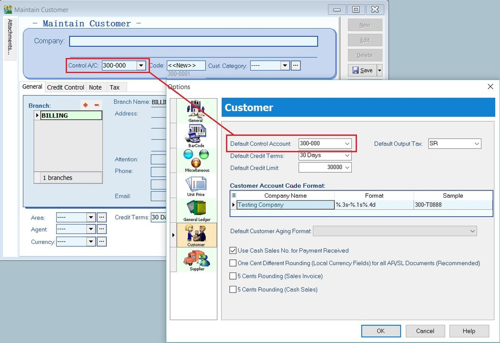

**Default Credit Terms**
   Default credit terms when create new customer in Maintain Customer.

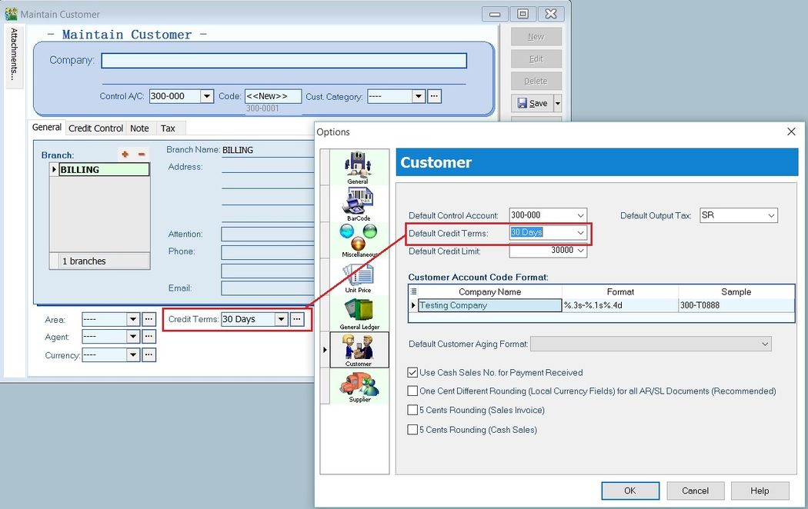

**Default Credit Limit**
   Default credit limit value when create new customer in Maintain Customer.

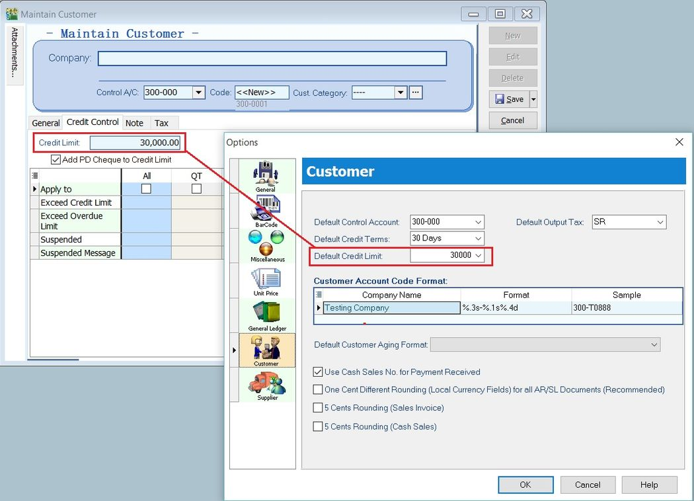

**Default Output Tax**
   Default output tax code when create new customer/sales documents entry, eg. customer invoice, customer debit note, etc.

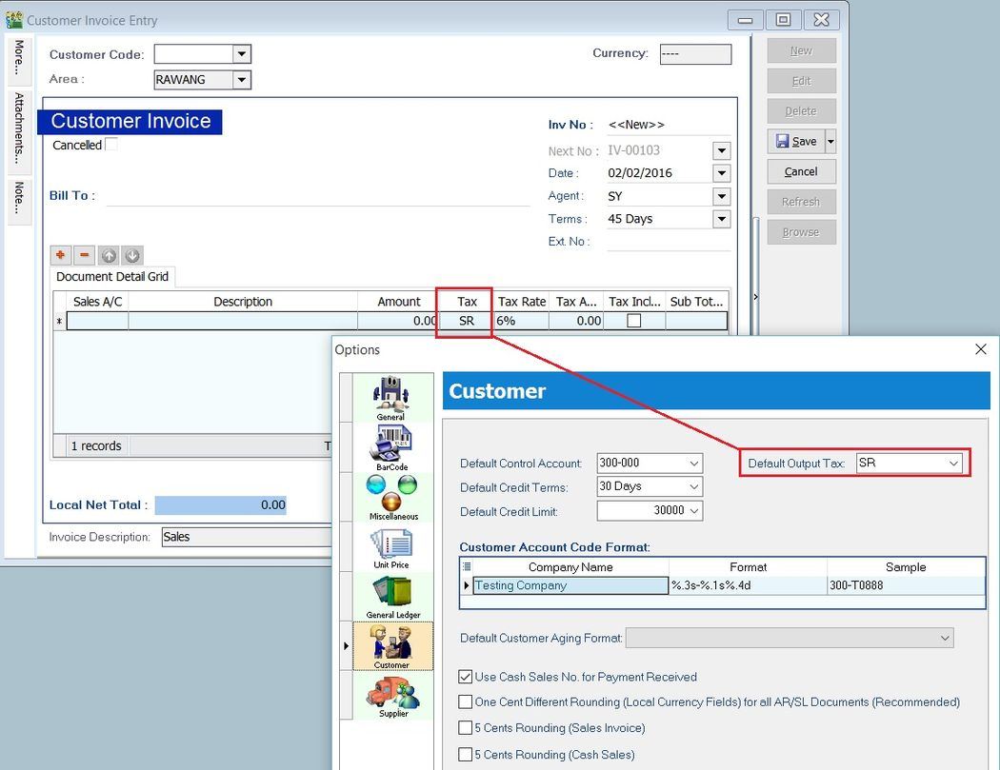

#### **Customer Account Code Format**

1. To Define the customer code format.
2. Format explanation as per below.

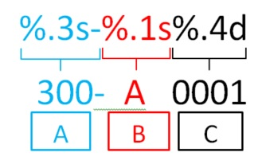

| Ref | Code Format | Explanation                                                        |
|-----|-------------|--------------------------------------------------------------------|
| A   | %.3s-       | First number of digits from Customer Control Account code.         |
| B   | %.1s        | First character from Customer Name.                                |
| C   | %.4d        | Sequence running number.                                           |

**Example 1:**
   a. Customer Control Account = 300-000
   b. Customer Name = ALI BABA SDN BHD

      | Code Format | Result |
      |-------------|--------|
      | %.3s-       | 300-   |
      | %.1s        | A      |
      | %.4d        | 0001   |
   c. Customer Code = 300-A0001

**Example 2:**
   a. Customer Control Account = 3001-0000
   b. Customer Name = ALI BABA SDN BHD

      | Code Format | Result |
      |-------------|--------|
      | %.4s/       | 3001/  |
      | %.2s        | AL     |
      | %.2d        | 01     |
   c. Customer Code = 3001-AL01

#### **Exceptional Customer Code Format (Regular Expression)**

1. Copy and paste the below regular express line into Customer Format field (see the screenshot below).

         ```sql

         "%.3s"-"(?i)\b(?!sykt\b|persatuan\b)(?![-.,\s]).{1,1}""%.4d"

         ```


**Example 1:**
   a. Customer Name: SYKT ALI
   b. Keyword excluded: sykt (non-case sensitive)
   c. Customer Code= 300-A0001

**Example 2:**
   a. Customer Name: PERSATUAN KLANG
   b. Keyword excluded: persatuan (non-case sensitive)
   c. Customer Code= 300-K0001

#### Default Customer Aging Format

1. Set a default customer aging format to show the aging result at **Inquiry | Account Inquiry (Customer)**.

2. Customer aging format list:
   a. Cust-Multi-F1-06 Mths Statement-Current,1 Mth,...
   b. Cust-Multi-F2-06 Mths Statement-Current,1 Mth,...
   c. Cust-Multi-F1-12 Mths Statement-Current,1 Mth,...
   d. Cust-Multi-F2-12 Mths Statement-Current,1 Mth,...


**Use Cash Sales No. for Payment Received**
   Use Cash Sales No as the official receipt no for cash sales only.


#### Perform Tax / Local Amount Rounding

1. Choose a method to calculate the tax amount consistently.
2. By default, it is always **untick**.
   A. Once Cent Different: Untick (by Default)

      It is **total of tax amount from each detail amount** multiply by GST 6%.
      **Total Tax Amount** = 20.00 + 24.62 + 0.73 + 7.39 +1.94 = 54.68

      | Items  | Amount | Tax | Tax Amount | Total  |
|--------|--------|-----|------------|--------|
| Item 1 | 333.33 | SR  | 20.00      | 353.33 |
| **Item 2** | **410.37** | **SR**  | **24.62**      | **434.99** |
| Item 3 | 12.13  | SR  | 0.73       | 12.86  |
| Item 4 | 123.15 | SR  | 7.39       | 130.54 |
| Item 5 | 32.26  | SR  | 1.94       | 34.20  |
| **Total** | **911.24** |     | **54.68**   | **965.92** |

B. One Cent Different: Tick
   It is based on **total document amount** to multiply with GST 6%.
   **Total Tax Amount based on itemized** = 20.00 + 24.62 + 0.73 + 7.39 + 1.94 = **54.68**
   **Total Tax Amount based on total amount** = 911.24 x 6% = 54.67
   Differences = 54.68 - 54.67 = **0.01**
   Therefore, the system will perform **auto rounding mechanism** to the largest value (ie. item 2 = 24.62-0.01 = **24.61**).

| Items     | Amount  | Tax | Tax Amount | Total   |
|-----------|---------|-----|------------|---------|
| Item 1    | 333.33  | SR  | 20.00      | 353.33  |
| **Item 2** | **410.37** | **SR** | **24.61**    | **434.98** |
| Item 3    | 12.13   | SR  | 0.73       | 12.86   |
| Item 4    | 123.15  | SR  | 7.39       | 130.54  |
| Item 5    | 32.26   | SR  | 1.94       | 34.20   |
| **Total** | **911.24** |     | **54.67**   | **965.91** |

**5 Cents Rounding (Sales Invoice)**
   This option will auto insert an items code **RTN5Cents** to adjust the total invoice amount if found the total amount not in simple rounding.


**5 Cents Rounding (Cash Sales)**
   This option will auto insert an items code **RTN5Cents** to adjust the total cash sales amount if found the total amount not in simple rounding.


### Supplier
<details>
   <summary>Supplier - click to expand</summary>

- It is important to define the Supplier setting in the new database created.

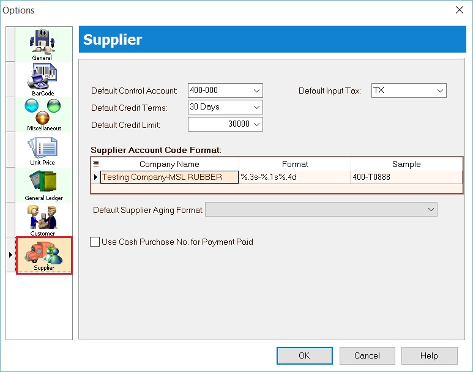

**Default Control Account**
   Default control account when create new supplier in Maintain Supplier.


**Default Credit Terms**
   Default credit terms when create new supplier in Maintain Supplier.

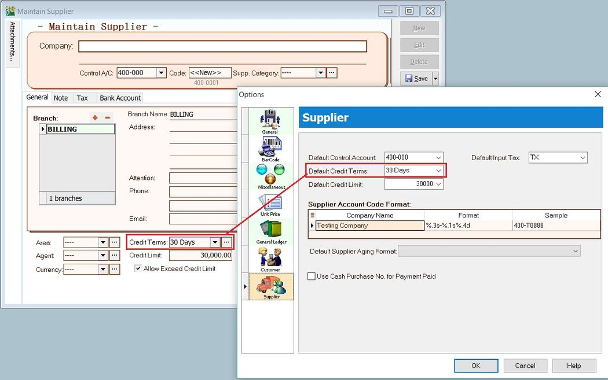

**Default Credit Limit**
   Default credit limit value when create new supplier in Maintain Supplier.

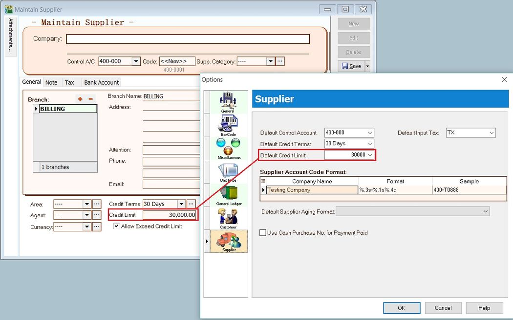

**Default Input Tax**
   Default input tax code when create new supplier/purchase documents entry, eg. supplier invoice, supplier debit note, etc.


#### Supplier Account Code Format

   1. To Define the supplier code format.
   2. Format explanation as per below.

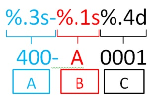

| Ref | Code Format | Explanation                                                  |
|-----|-------------|--------------------------------------------------------------|
| A   | %.3s-       | First number of digit from **Supplier Control Account code**.    |
| B   | %.1s        | First number of characters from **Supplier Name**.               |
| C   | %.4d        | Sequence running number.                                     |

**Example 1:**

1. Supplier Control Account = **400-000**
2. Supplier Name = **ALI BABA SDN BHD**

   | Code Format | Result |
   |-------------|--------|
   | %.3s-       | 400-   |
   | %.1s        | A      |
   | %.4d        | 0001   |

3. Supplier Code = **400-A0001**

**Example 2:**

1. Supplier Control Account = **4001-0000**
2. Supplier Name = **ALI BABA SDN BHD**

   | Code Format | Result |
   |-------------|--------|
   | %.4s/       | 4001/  |
   | %.2s        | AL     |
   | %.2d        | 01     |

3. Supplier Code = **4001-AL01**

#### Exceptional Supplier Code Format (Regular Expression)

   1. Copy and paste the below regular express line into Supplier Format field (see the screenshot below).

            ```sql
               "%.3s"-"(?i)\b(?!sykt\b|persatuan\b)(?![-.,\s]).{1,1}""%.4d"
            ```

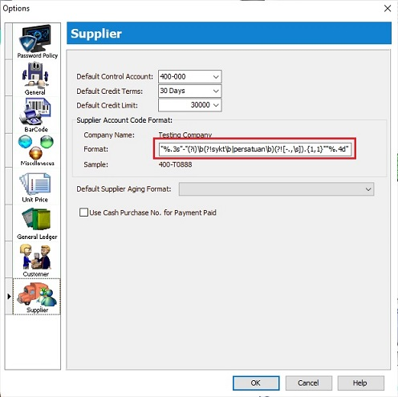

**Example 1:**

1. Supplier Name: SYKT TAN & SON
2. Keyword excluded: **sykt** (non-case sensitive)
3. Supplier Code= **400-T0001**

**Example 2:**

1. Supplier Name: PERSATUAN BOLA SEPAK
2. Keyword excluded: persatuan (non-case sensitive)
3. Supplier Code= **400-B0001**

#### Default Supplier Aging Format

1. Set a default supplier aging format to show the aging result at **Inquiry | Account Inquiry (Supplier)**.
2. Supplier aging format list:

  - Supp-Multi-F1-06 Mths Statement-Current,1 Mth,...
  - Supp-Multi-F2-06 Mths Statement-Current,1 Mth,...
  - Supp-Multi-F1-12 Mths Statement-Current,1 Mth,...
  - Supp-Multi-F2-12 Mths Statement-Current,1 Mth,...

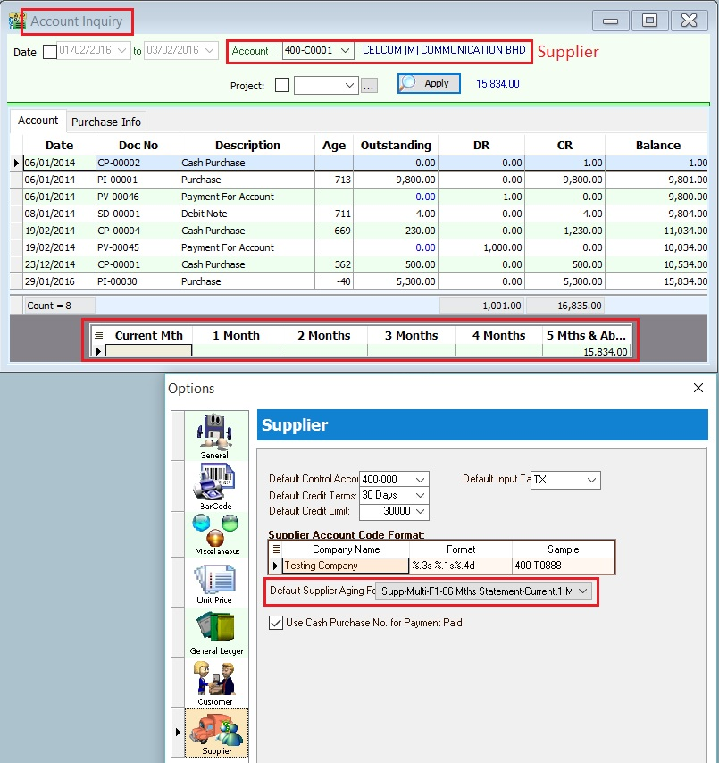

**Use Cash Purchase No. for Payment Paid**
   Use Cash Purchase No as the payment voucher no for cash purchase only.

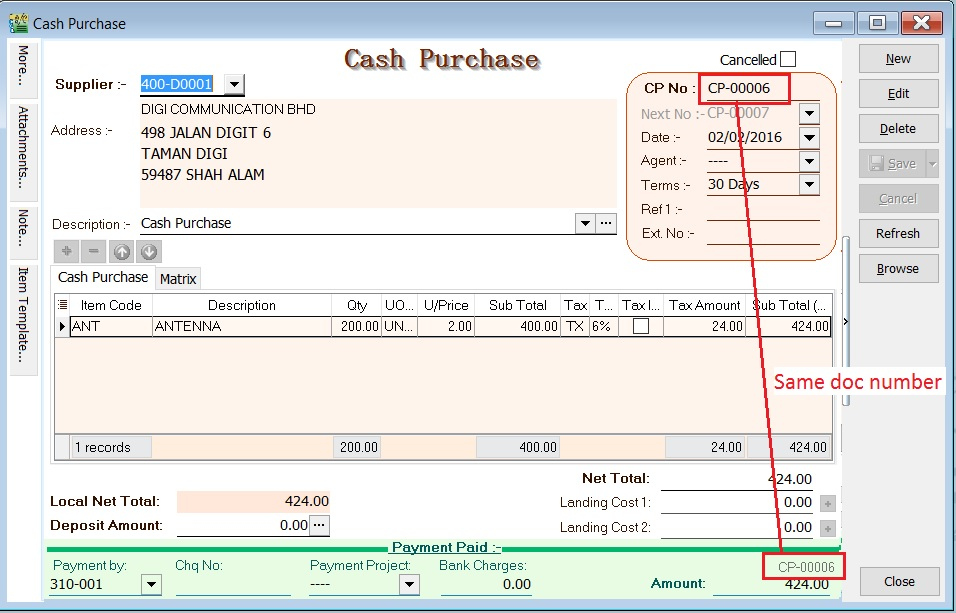

</details>

</details>

## Maintain DIY

*Menu: Tools | DIY | Maintain DIY...*

This Additional Module(DIY Fields & DIY Script Module)


| Function            | Description                                                       |
|---------------------|-------------------------------------------------------------------|
| Field and Quick Form | User can Self Create new User Define Field(s) & Design the Layout |
| Script              | Customise the Application                                         |
| Calculation         | Override the build in Calculation (SQL Payroll ONLY)              |
| View Template       | For Advance Form Mode                                             |
| Report Data         | Deprecated                                                        |

### Field and Quick Form

Below is Example are doing following actions

- Create UDF_JobTitle at Maintain User
- Create New Form at Maintain User

1. Right Click at User

   

2. Select New Field

   

3. Click **New** button

   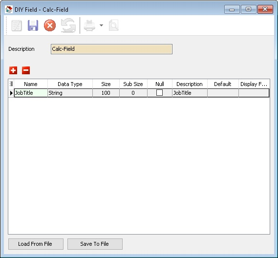

4. Enter any Description (eg Calc-Field) in the **Description** field (Only Alphanumeric & no spacing)
5. Click the + button to add the New UDF Field & Enter/Select the option as above picture
6. Click Save (the Blue Disc icon) after done
7. Close the windows.

   - Available Data Field Type

      | Field Type      | Definition                                                                                                  |
      |-----------------|-------------------------------------------------------------------------------------------------------------|
      | String          | Text data of a fixed length (up to 8192 bytes)                                                              |
      | Unicode String  | A field representing a Unicode (16 bits per character) string.                                              |
      | Boolean         | A Boolean value.                                                                                            |
      | Integer         | Whole numbers in the range of long integers (32 bits).                                                      |
      | Currency        | Currency values with the same range as the Real data type.                                                  |
      | Bcd             | Real numbers with a fixed number of digits after the decimal point.                                         |
      | Date            | A date value.                                                                                               |
      | Blob            | Binary data with no size limit (BLOB stands for binary large object). The theoretical maximum limit is 2 GB. |
      | Memo            | Text of arbitrary length.                                                                                   |

      :::warning  

      - Only String data can increase the field size so plan properly before add the field.
      - User can't change from 1 data type to another once it save.
      - Avoid create too many UDF field as it will reduce system performance & take longer time to save 1 data entry.

      :::

   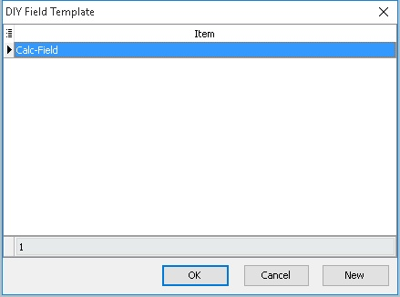

8. Select the Item just created (eg. Calc-Field)
9. Click Ok button
10. Right Click at User again

      

11. Select New Quick Form

      

12. Click New button

      

13. Enter any Description to be shown at Maintain User(eg Info) in the **Description** field (Only Alphanumeric & no spacing)
14. Click Customize button (Icon 1)
15. Drag the UDF Field from the **Available Items** (Icon 2) to empty space (Icon 3)
16. Click **Close** button to **Customize** windows
17. Click Save (Icon 4) after done
18. Close the windows.

      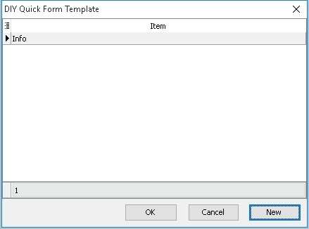

19. Select the Item just created (eg. Info)
20. Click Ok button

      

21. Done.

### Script

> This is Additional Module(DIY Script Module) which allow user to  
>
> override or customise the SQL System.
> The Language use is **Pascal**

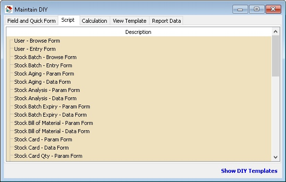

- Available forms to customise :

| Form Type  | Example               | Description                                       |
|------------|-----------------------|---------------------------------------------------|
| Browse Form | 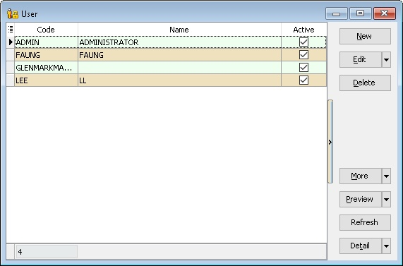 | Script Run/Execute when in Browse window form       |
| Entry Form  |   | Script Run/Execute when in Data Entry window form   |
| Param Form  | 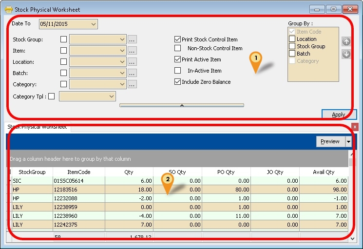  | Script Run/Execute when at in Icon 1 (Seldom use)   |
| Data Form   |    | Script Run/Execute when at in Icon 2 (Frequently use) |

- Available Action/Event

| Action/Event     | Description                                                                 |
|------------------|-----------------------------------------------------------------------------|
| OnOpenForm       | The script trigger On Open the Form (eg. On Open the Sales Invoice Form)    |
| OnApply          | The script trigger After Click Apply button (for Data Form)                 |
| OnBeforeOpen     | The script trigger On Before the Form Open                                  |
| OnAfterOpen      | The script trigger On After the Form Open                                   |
| OnNew            | The script trigger after the build-in New Button action Execute             |
| OnBeforeEdit     | The script trigger before the build-in Edit Button action Execute           |
| OnAfterEdit      | The script trigger after the build-in Edit Button action Execute            |
| OnBeforeDelete   | The script trigger before the build-in Delete Button action Execute         |
| OnAfterDelete    | The script trigger after the build-in Delete Button action Execute          |
| OnBeforeCancel   | The script trigger before the build-in Cancel Button action Execute         |
| OnAfterCancel    | The script trigger after the build-in Cancel Button action Execute          |
| OnBeforeSave     | The script trigger before the build-in Save Button action Execute           |
| OnAfterSave      | The script trigger after the build-in Save Button action Execute            |

#### Example 1 - List Serial Number in Stock Physical Worksheet

Below is Example are doing following actions

      - After apply **Stock Physical Worksheet** will auto Create New Tab
      - List all the Serial Number in the new Grid

**Level : Advance**

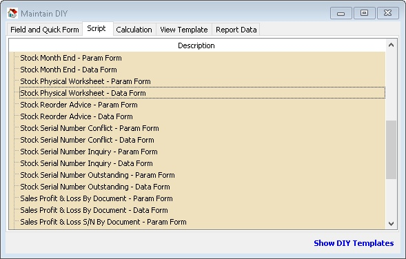

1. Right Click at Stock Physical Worksheet - Data Form

   

2. Select New Script

   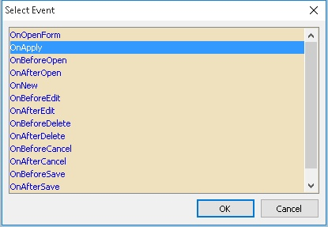

3. Select OnApply
4. Click OK button

   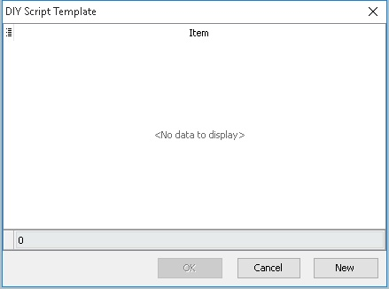

5. Click New Button

   

6. Enter any description (eg Stock_Physical_Worksheet-DataForm-OnApply) in the Description field (Only Alphanumeric & no spacing)
7. Copy below script & paste to the Script Field

   <details>
      <summary>DataForm-OnApply Script</summary>

         ```sql

         uses Forms, Dialogs, DataProcessor, DBClient, cxGridDBTableView, cxGrid, cxGridLevel,
            xQuery, Math, ComObj, SysUtils, DateUtils;

         var M, SN     : TDataSet;
            dsGrid    : TDatasource;
            FcxGrid   : TcxGrid;
            gvGrid    : TcxGridDBTableView;
            lTime     : TDateTime;
            cdsOutput : TClientDataset;
            lDisplayFormat, S : String;

         procedure SetNumericDisplayFormat(AClientDataSet: TClientDataSet);
         var f  : TFMTBCDField;
            f1 : TFloatField;
            i  : Integer;
            DT : TFieldType;
         begin
         for i := 0 to AClientDataSet.FieldCount - 1 do begin
            DT := AClientDataSet.FieldDefs.Items[i].DataType;
            if DT = ftFMTBcd then begin
               f := TFMTBCDField(AClientDataSet.Fields.Fields[i]);
               if not (f = nil) then f.DisplayFormat := lDisplayFormat;
            end;
            if DT = ftFloat then begin
               f1 := TFloatField(AClientDataSet.Fields.Fields[i]);
               if not (f1 = nil) then f1.DisplayFormat := lDisplayFormat;
            end;
         end;
         end;

         procedure PrepareNewTab;
         begin
         FcxGrid.RootLevelOptions.DetailTabsPosition := dtpTop;
         gvGrid := FcxGrid.CreateView('TcxGridDBTableView') as TcxGridDBTableView;
         with FcxGrid.Levels.Add do begin
            Caption  := 'Calc';
            GridView := TcxCustomGridView(gvGrid);
            Active   := True;
         end;

         with gvGrid do begin
            Name                             := 'Restricted_1';
            OptionsCustomize.ColumnFiltering := True;
            OptionsView.ColumnAutoWidth      := False;
            OptionsView.Footer               := True;
            OptionsView.GroupByBox           := False;
            OptionsBehavior.IncSearch        := True;
            DataController.DataSource        := dsGrid;
            OptionsData.Editing              := False;
         end;
         end;

         procedure TuneGrid;
         var i : integer;
            DT : TFieldType;
         begin
         SetNumericDisplayFormat(cdsOutput);
         with gvGrid.DataController do begin
            DataSource := dsGrid;
            CreateAllItems(False);
         end;
         with gvGrid do begin
            //Hide Columns
            //GetColumnByFieldName('DtlKey').Visible          := False;
            //Rename Columns Caption
            GetColumnByFieldName('ItemCode').Caption        :='Item Code';
         end;

         with gvGrid.DataController.Summary do begin
            BeginUpdate;
            try
               with TcxGridDBTableSummaryItem(FooterSummaryItems.Add) do begin
               Column   := gvGrid.Columns[0];
               Position := spFooter;
               Kind     := skCount;
               Format   := 'Count = #';
               end;
               for i := 0 to cdsOutput.FieldDefs.Count-1 do begin
               DT := cdsOutput.FieldDefs.Items[i].DataType;
               if (DT = ftFMTBcd) or (DT = ftFloat) then begin
                  with TcxGridDBTableSummaryItem(FooterSummaryItems.Add) do begin
                     Column   := gvGrid.Columns[i];
                     Position := spFooter;
                     Kind     := skSum;
                     Format   := lDisplayFormat;
                  end;
               end;
               end;
               finally
               EndUpdate;
            end;
         end;
         gvGrid.ApplyBestFit(nil, False, False);
         end;

         procedure CreateXMLTable;
         begin
         if Assigned(cdsOutput) then
            cdsOutput.Free;
         cdsOutput := TClientDataSet.Create(FcxGrid);
         cdsOutput.FieldDefs.Assign(SN.FieldDefs);
         cdsOutput.CreateDataSet;
         dsGrid.DataSet := cdsOutput;
         end;

         procedure AppendData;
         var i : integer;
         begin
         M.First;
         while not M.Eof do begin
            SN.DisableControls;
            SN.First;
            While not SN.Eof do begin
               cdsOutput.Append;
               for i:=0 to SN.FieldDefs.Count-1 do
               cdsOutput.FindField(SN.FieldDefs.Items[i].Name).Value := SN.FindField(SN.FieldDefs.Items[i].Name).Value;
               cdsOutput.Post;
               SN.Next;
            end;
            SN.EnableControls;
            M.Next;
         end;
         end;

         begin
         M       := Self_DataProcessor.GetDataSetByName('Main');
         SN      := Self_DataProcessor.GetDataSetByName('SerialNumber');
         FcxGrid := TcxGrid(Self.FindComponent('cxGrid1'));
         dsGrid  := TDataSource.Create(M);

         lTime := now;
         s := 'Stock Physical Worksheet';
         lDisplayFormat := '#,0.00;-#,0.00;-';


         try
            Self.Caption := s + '- Prepare Tab';
            PrepareNewTab;
            Self.Caption := s + '- Prepare XML';
            CreateXMLTable;
            Self.Caption := s + '- Append Data';
            AppendData;
            Self.Caption := s + '- Tuning Grid';
            TuneGrid;
         finally

            lTime := Now - lTime;
            Self.Caption := Format(s + ' - [Elapsed Time: %s ]',[FormatDateTime ('hh:nn:ss:zzz', lTime)]);    
         end;
         end.

         ```

   </details>

8. Click Save (the Blue Disc Icon)
9. Close the window.

   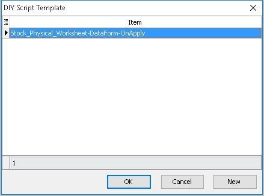

10. Select the Item just created (eg. Stock_Physical_Worksheet-DataForm-OnApply)
11. Click OK button

    

12. Click Stock | Print Stock Physical Worksheet | Apply

### Example 2 - Set Default Filtering for Sales

Below is Example are doing following actions

- Filter by Agent in Sales Profit & Loss By Document
- Disable Selection for Agent

**Leve l : Basic**

1. Right Click at **Sales Profit & Loss By Document - Param Form**
2. Select **New Script**
3. Select OnOpenForm
4. Click OK button
5. Click New Button
6. Enter any description (eg SL-PnL-ParamForm-OnOpen) in the Description field (Only Alphanumeric & no spacing)
7. Copy below script & paste to the Script Field

   <details>
      <summary>Param Form - OnOpenForm Script</summary>

         ```sql

         uses SysUtils, Dialogs, Forms;

         var C, D : TControl;
            L: TStringList;
         begin
         C := Self.FindChildControl('edAgent_Panel') as TWinControl;
         L := TStringList.Create;
         try
            if C <> nil then C.Enabled := False; // Disable Selection
            C := TWinControl(C).FindChildControl('edAgent_Edit') as TWinControl;
            L.Add('NF');
            L.Add('LF');
            (C as TControl).SetTextBuf(L.CommaText);//For Multi Records
         //    (C as TControl).SetTextBuf('LF');//For 1 record
         finally
            L.Free;
         end;
         end.

         ```

   </details>

8. Click Save (the Blue Disc Icon)
9. Close the window.
10. Select the Item just created (eg. SL-PnL-ParamForm-OnOpen)
11. Click OK button
12. Click Sales | Print Profit & Loss By Document...

### Example 3 - Drop Down List at Maintain User

Below is Example are doing following actions

- Create a drop down list of Project List at Maintain User for UDF_Project
**Level : Advance**

1. Right Click at User - Entry Form
2. Select New Script
3. Select OnOpenForm
4. Click OK button
5. Click New Button
6. Enter any description (eg UserEntryForm-OnOpen) in the Description field (Only Alphanumeric & no spacing)
7. Copy below script & paste to the Script Field

   <details>
      <summary>Entry Form - OnOpen Script</summary>

         ```sql
         uses Forms, StdCtrls, DBCtrls, Dialogs, ComObj, DBClient;

         Var edProject     : TDBLookupComboBox;
            btnCPassword  : Tbutton;
            M, dsList     : TDataSource;
            lbProject     : TComponent;
            C             : TControl;
            FComServer    : Variant;
            cdsList       : TClientDataset;

         function ComServer: Variant;
         begin
         if FComServer = Null then begin
            FComServer := CreateOleObject('SQLAcc.BizApp');
         end;
         Result := FComServer;
         end;

         procedure GetList;
         var lSQL    : String;
         begin
         FComServer := null;
         cdsList := TClientDataset.Create(C);
         lSQL := 'SELECT Code, Description FROM Project WHERE IsActive=''T'' ';

         try
            cdsList.Data := ComServer.DBManager.Execute(lSQL);
            dsList.Dataset := cdsList;
         finally
            FComServer := null;
         end;
         end;

         begin
         M := TDataSource(Self.FindComponent('dsMain'));
         C := Self.FindChildControl('lbName');
         dsList := TDataSource.Create(C);
         GetList;
         if Assigned(C) then begin
            edProject   := TDBLookupComboBox.Create(C);
            lbProject  := TLabel.Create(C);

            with TLabel(lbProject) do begin
               Parent     := C.Parent;
               Caption    := '&1. Project :';
               Left       := 200;
               Top        := 68;
               FocusControl := edProject;
            end;

            with edProject do begin
               Parent  := C.Parent;
               Top     := 65;
               Left    := 260;
               Width   := 120;
               Name    := 'edProject'; 
               Datasource     := M;
               ListSource     := dsList;
               DataField      :='UDF_Project';
               DropDownWidth  := 500;
               KeyField       := 'Code';
               ListFieldIndex := 1; //Search By Description
               ListField      := 'Code;Description'; //Show 2 Column
            end;
         end;
         end.

         ```

   </details>

8. Click Save (the Blue Disc Icon)
9. Close the window.
10. Select the Item just created (eg. UserEntryForm-OnOpen)
11. Click OK button
12. Click Tools | Maintain User...

## SQL Control Center

*Menu: Tools | DIY | SQL Control Center...*

### Create new field (DIY Fields Module)

:::info DIY Fields
This is a paid module.
:::

- This Additional Module(DIY Fields Module) where user can self Create new User Define Field(s)

- Available Data Field Type

| Field Type | Definition |
|------------|------------|
| String     | Text data of a fixed length (up to 8192 bytes) |
| Boolean    | A Boolean value. |
| Integer    | Whole numbers in the range of long integers (32 bits). |
| Currency   | Currency values with the same range as the Real data type (Max 4 decimal point). |
| Float      | Real numbers with a fixed number of digits after the decimal point. |
| Date       | A date value. |
| Picture    | A Picture Value. |
| Memo       | Text of arbitrary length. |

- For Explanation for Each Data Type may refer to
[w3schools](http://www.w3schools.com/sql/sql_datatypes_general.asp)

:::warning

- Avoid use Picture data if can as it will cause your database size increase very fast.
- Only String data can increase the field size so plan properly before add the field.
- User can't change from 1 data type to another once it save.
- Avoid create too many UDF field as it will reduce system performance & take longer time to save 1 data entry. (Recommended Max is 30 UDF Fields)
- Avoid Create String data with too large size. (Recommended Max is 200)

:::

- User can create DIY Fields either at Header Fields or Item Fields
- In each Table had the below interface

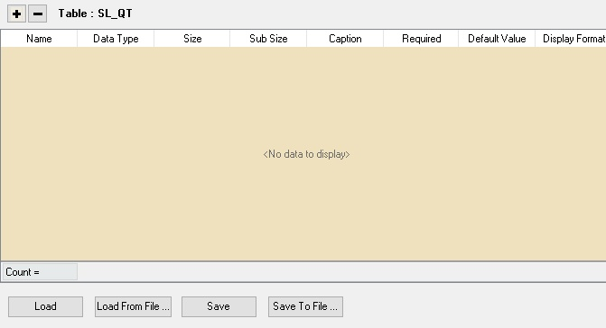

| Name          | Description |
|---------------|-------------|
| Name          | Field name. Only alphanumeric, no spacing. |
| Data Type     | Type of Field. |
| Size          | The Field Size. Only applicable for Float, Integer & String Data Type. |
| Sub Size      | The Field Sub Size (normally the decimal point). Only applicable for Float Data Type. |
| Caption       | Field name to be shown at user interface. |
| Required      | The current field MUST not be empty. |
| Default Value | Default value to insert on new record. |
| Display Format | Set display format for Float, Currency & Integer Data Type. |
| Load          | Reload the script from the Database (only for DIY Script). |
| Load From File | Load Script/Fields from a text file. **Be careful**: system will delete existing field before loading. |
| Save          | Save current Script/Field. Do not Delete, Rename & Insert at the same time (only for DIY Fields). |
| Save To File  | Save current Script/Fields to a text file. |
| + Button      | Add new field. |
| - Button      | Delete selected field. |

#### Header Fields

Below is the example for Sales Invoice

**Add New Fields**

 

1. At the left panel look for **Sales Invoice | Header Fields**
2. Click the + Button on top to add New fields as above picture
3. Click Save button

#### Design Layout

 They are 2 ways to creating the Layout for new fields added.

 

### Advance Form Design

 This mode is only for the user who known how to use the Delphi.

      * **Pros**

      - Freely adjust & place the component.

      * **Cons**

      - Not Easy to design
      - Not support Date & Picture Data Type

1. Select **New Advance Form Design**

    

2. Enter the name (eg Freight Info) this will shown in the Sales Invoice Data Entry
3. Click OK
4. Click the **Freight Info** (name create at **Step 3** above) on the left panel

      

      

      - This Standard component is just for Fixed labeling or decoration

      - The detail of each button can be refer to [delphibasics](http://www.delphibasics.co.uk/Article.asp?Name=Standard)

      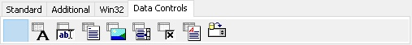

      - This Data Controls component is use for Variable data which can be use at Data Entry

      - Below is the detail of each button (From Left)

      | Component     | Purpose                                                                 |
      |---------------|-------------------------------------------------------------------------|
      | DBText        | Data-aware label that can display a field from a currently active record. |
      | DBEdit        | Data-aware edit box that can display or edit a field from a currently active record. |
      | DBMemo        | Data-aware memo box that can display or edit text BLOB data from a currently active record. |
      | DBImage       | Data-aware image box that can display, cut, or paste bitmapped BLOB images to and from a currently active record. |
      | DBListBox     | Data-aware list box that can display values from a column in a table. |
      | DBCheckBox    | Data-aware check box that can display or edit a Boolean data field from a currently active record. |
      | DBRichEdit    | Data-aware Rich Text Editor that can display or edit text BLOB data from a currently active record. |
      | cxDBSpinEdit  | Data-aware edit box that can display or edit Integer or Float data from a currently active record. |

      :::success Normally we only use
      **Standard** Tab component

      - Label - For Labeling each field
      **Data Controls** Tab component
      - DBEdit - For String Data
      - DBRichEdit - For Memo Data
      - cxDBSpinEdit - For Currency, Float or Integer Data
      :::

5. Click the **Standard** Tab & select Label button place on thee right panel
6. In the **Object Inspector** look for

      - Caption & set to the Caption you like (eg Container Number)
      - Font & set the Size to 12 or any size you prefer

      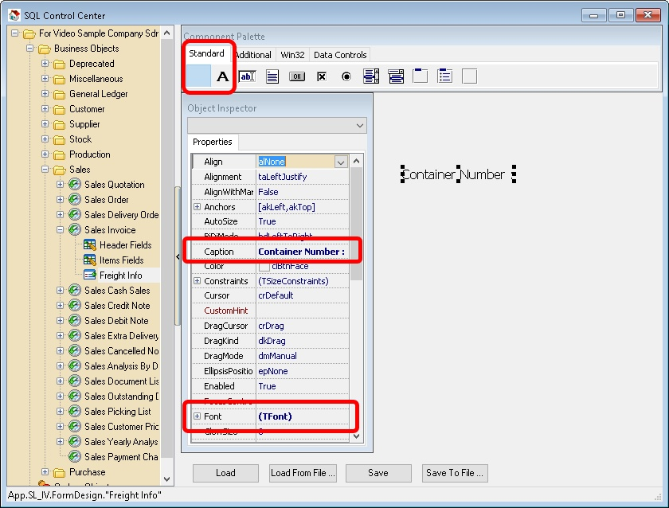

7. Click the **Data Controls** Tab & select DBEdit button place on thee right panel
8. In the **Object Inspector** look for

      - **DataField** & set to the UDF field name (normally is UDF_FieldName) (eg UDF_ContainerNo)
      - **Font** & set the **Size** to 12 or any size you prefer

      

9. Continue repeat Step 6 till Step 8 for rest of the UDF field.
10. Click Save button after done.

      - **Quick Form Design (Recommended)**

      - This mode is for the user who don't known how to use the Delphi.

      **Pros**
         - Easy to Design

      **Cons**
         - Unable to freely adjust & place the component.
         - Not support Rich Text Editor.

11. Select New Quick Form Design

      

12. Enter the name (eg Freight Info) this will shown in the Sales Invoice Data Entry
13. Click OK
14. Click the **Freight Info** (name create at **Step 3** above) on the left panel

      

15. Click Customise button.
16. Drag the UDF Field from the **Available Item** dialog box & drop to Right Panel
17. Continue repeat **Step 7** for rest of the UDF field.
18. Click Save button after done.

**Item Fields**
   There is no layout need to be design for Item Field UDF. You can drag out all the UDF field in the Field Chooser in the data Entry

- **Add New Fields**

1. At the left panel look for Sales Invoice | Item Fields
2. Click the + Button on top to add New fields as above picture
3. Click Save button

      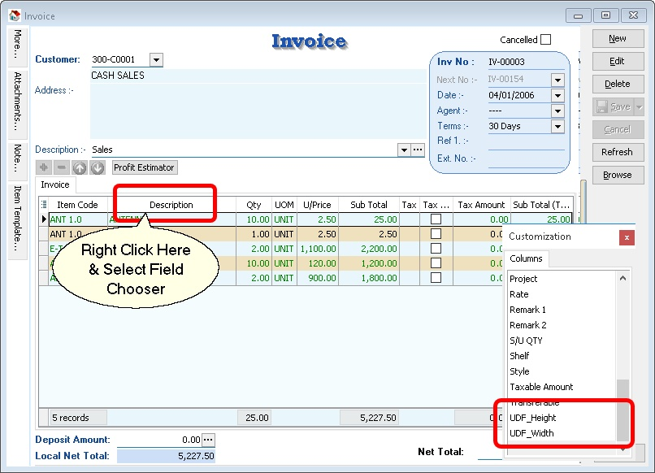

4. Drag the UDF field from the Customization Dialog
5. Drop it the column you wanted to shown (eg In between Description Column & Qty Column)

## DIY Authenticator

*Tools | DIY | DIY Authenticator...*

This function is use to **lock** the [Maintain DIY Module](#maintain-diy) so only **authorised person** allow to access.

#### Requirements

- Mobile Phone with Camera
- QR Reader Application
- Google Authenticator

#### Setup

1. Enter account name or use default name. This will be shown in Google Authenticator list.

   

2. Enter a Access ID. This use by the system to pairing with the Google Authenticator.

   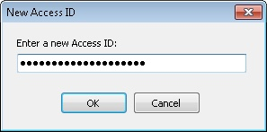

3. Select the Device you wanted to use to Scan with.

   

4. Use the Google Authenticator to scan the QR barcode.
5. Enter the Code generated by the Google Authenticator.
6. Click Pair.

   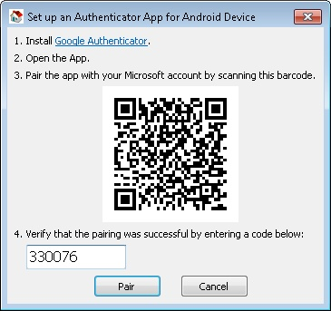

7. System will prompt below dialog if successfully pairing.

   

Each time user Click the [Maintain DIY](#maintain-diy) it will prompt below dialog for Verification Code.

   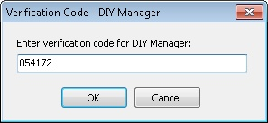

#### Remove Locking

1. Click Tools | DIY | DIY Authenticator....
2. Enter the Verification Code.

   

3. System will prompt below option.
4. Click Remove Access ID.

   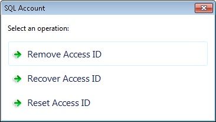

   | **Option Name**      | **Properties**                                |
   |-----------------------|-----------------------------------------------|
   | **Remove Access ID**  | To permanently unlock the Maintain DIY        |
   | **Recover Access ID** | To retrieve the current Access ID             |
   | **Reset Access ID**   | To recreate a new Access ID                   |

5. System will prompt below dialog if successfully unlock


:::warning
Make sure you had keep few copy of QRCode as once you lost all we not able to retrieve back the Access ID
:::

> More Customisations at [SQL Control Center](/usage/customisation/sqlControlCenter)