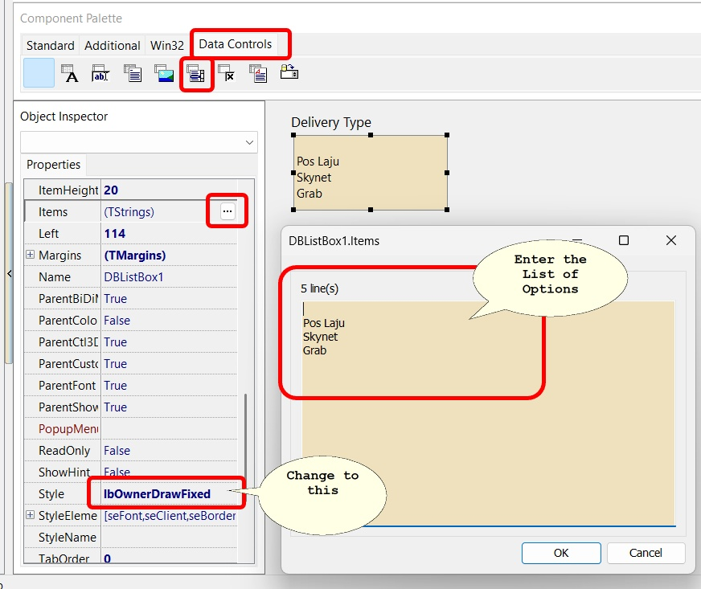

## Can I set my first year financial period longer than 12 months (e.g., 18 months)?

Yes. You can set your first financial period for more than 12 months (e.g., from 1st July 2014 to 31st December 2015).

[learn more here](#set-first-year-account-more-than-12-months)

## DIY Fields FAQ

  
DIY Fields FAQ - click to expand

### Can I show the detail fields in Header?

**Yes** , but with the following condition

* Only available in **Advance Form Design**
* The Data will change/run base on the last selected Record in the Detail Grid

1. Open the Form you want to Add (eg Sales > Sales Invoice)
2. Open the **Advance form**
3. Design as usual except you need to select **DataSource**

    

4. Select the XXXXX.YYYYY.dsDocDetail

### Can I have option selection for 1 UDF?

**Yes** , using **Advance Form Design**

Steps :

1. Open the Form you want to Add (eg Sales | Sales Delivery Order)
2. Open the Advance form
3. Design as usual for Label
4. For the UDF you wanted to have option

    

## Set First Year Account more than 12 Months

  
Set First Year Account more than 12 Months - click to expand

* This guideline is to guide how to setup your first year account if it is more than 12 month , below example given is first year account in 18 months.

* First financial period will in 18 month from 1st July 2014 to 31st December 2015.

:::warning CAUTION
You are advised to set your financial start period and system conversion date as below.
:::

**Setup**:

1. Go Tools > Option > General Ledger

    * Set your financial start period and system conversion date as 1/1/2014, so in the following year, you do not need to run year end to set again your financial start period & System conversion date.

    

2. Set profit & loss statement print in 18 months

    

   1. Right click as pointed

   2. Select 640 x 480 to make your SQL Screen smaller

   3. Highlight report name “this year-2column” click and drag it to desktop
       

   4. From desktop click the report “This Year-2Column” drag it back to SQL report section.

   5. Click ok
       

   6. Double click on the new report name “ This year 2 column” in blue color.

   7. Change Period Class to Fixed Date

       * Param 1 = Date from eg 1/7/2014
       * Param 2 = Date to eg 31/12/2015

   8. You can insert a report name for you easy to differentiate.

  

## Advanced Currency Module

  
Advanced Currency Module- click to expand

  :::info
  This module is required if you use foreign banks.

  Related: [Payment from Foreign Customer](../../usage/tools/guide#maintain-currency)
  :::

### Setup Foreign Currency Payment Method

#### Steps

1. GL > Maintain Account

    

2. Create your bank respectively

   

3. Tools > Maintain Payment Method

    

:::success Advanced Currency Module FAQ
 **How do I record transactions in a foreign bank account?**

 **Why can’t I receive payment from a foreign customer in their currency?**

 **How do I handle supplier payments in USD, EUR, etc.?**

 **Do I need to activate any module to use foreign currency in SQL Accounting?**

 **Why does my system show error when applying exchange rate in payment?**

These questions goes to one solution , which is
[Advanced Currency Module](/usage/tools/faq#advanced-currency-module)
:::

## Can I auto-post exchange gain/loss when using foreign banks?

Yes, via [Advanced Currency](#advanced-currency-module) Module and [Gain/Loss setup](../../usage/tools/guide#payment-from-foreign-customer)

**What is SQL Global Price Change and when should I use it?** → [SQL Global Price Change](/usage/tools/guide#sql-global-price-change)

**Can I update prices for only specific stock groups or categories?** → [SQL Global Price Change by category](/usage/tools/guide#sql-global-price-change)

## How to do Customer One Cent Rounding ?

One Cent (0.01$) difference Rounding(Local Currency Fields) for all AR/SL(Subsidiary Ledger) Documents

**Setup**:

1. Go to Tools > Option > Customer

    

    1. Tick One Cent Different Rounding (Local Currency Fields) for all /AR/SL Documents **(Recommend)**

    2. Press OK

2. Sales Invoice > New > Refer below screen

    

    :::caution
    But once you save you will notice the first line of the Tax Amount will be different, this is because system
    using Total Amount of IV to calculate 6%. Refer below Screen:
    :::

    

    Formula: Sum up SubTotal with Tax, Multiple with 6% **(Note : system will exclude the Subtotal if the Tax Rate is 0%)**

    Tax Amount Calc = RM 15.54 * 6% = 0.93, mostly system will reverse on first line of the Item.

    :::note
    If you don’t want system to help you to do the One Cent Rounding, please refer **Step 1** to **un-tick** the option will do.
    :::

## How to do Password Policy (with 2 Steps Verification) ?

### Password Policy Setup

Go to menu : **Tools > Options…** click on **Password Policy**.

  

 You can choose the following password requirements:

    * Maximum Password Age (days): number of days to **expire** and **change** password.
    * Minimum Password Length: password length **cannot less** than the minimum,eg. 8.
    * Save Password History (0-5): number of password history **not allow to re-use**
    * Password combination of
        * At least one Upper Case letter (A-Z)
        * At least one Lower Case letter (a-z)
        * At least one number (0-9)
        * At least one non-alphanumeric character \!\$\%\^\&\*\(\)_\-\+\=\@\~\#\<\,\>\.\?

## How to reset password for user ?

1. Go to menu : **Tools > Maintain User**.

2. Click on More (arrow key down), click **Reset Password**.

    

3. New password auto generated.

    

4. Press **Yes** (Copy password to clipboard = Tick).

5. You can press **Ctrl + V** to paste the New Password into an email and send to the new user.

## 2-Steps Verifications Login

1. Go to menu : **File > 2-Steps Verification**.

    

2. Enter your current password, press **Ok** to proceed.

3. Choose an Authenticator device.

    

4. Follow the instructions to install and setup the Authenticator on your hand-phone.

5. Each time login, you will be required to enter the verification code generated by the Authenticator in your mobile phone.

    

## How to set Running Document Number by Date/Year Format ?

:::tip Sample:
**PV0615/001** is actually (**PVmmyy/001**)
:::

1. Tools > Maintain Document No
2. Create New or amend from the existing

    

    :::caution
    make sure the format is follow the sample attached
    :::

3. Select to reset the running no. either Monthly / Yearly / Never.

    

    

    :::info
    We can also set default running no at for default payment method
    :::

4. Go to tools > Maintain Payment Method

    

    

    :::info note
    vice versa for Official Receipt
    :::
