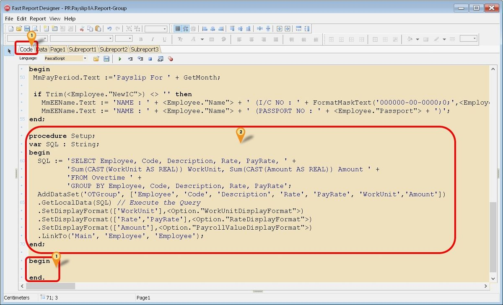
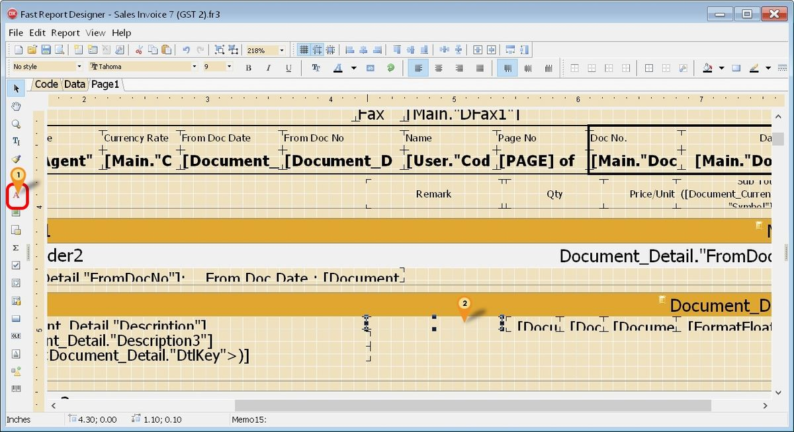
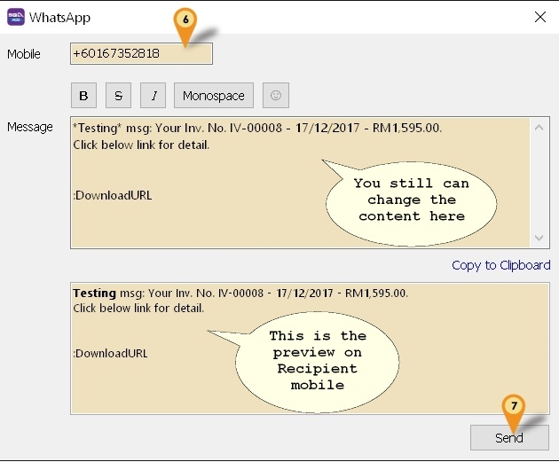

## Understanding the Toolbar

1. **Report Object**

    

2. **Align Toolbar**

    

## Sales Invoice Bands

1. Understanding Bands

   1. Group Header
      - Grouping Header
      - To Print on every page, right-click on ***Group Header Band***, select ***reprint on new page***

   2. Master Data
      - The ***Main*** Dataset of the report
      - Normally Bind to Main Dataset
      - Each Page allows to have 1 ***Main Dataset Only***

   3. Detail Data
      - To display ***all Item Details***

   4. Group Footer
      - Grouping Footer
      - Display on ***Last Page*** only

   5. Page Footer
      - Display on ***Every Page***

2. Sample Layout in Design Mode

    

3. Sample Layout on Preview Mode

    

4. Print Position

   - Group Footer content will be printed at the pixel value input.
   - Higher Value = Higher Footer
   - without setting the print position, the group footer will be printed after the document
   detail records.
   - Example Source Code:

        ```pascal
        if Engine.FreeSpace < (GroupFooter1.Height + PageFooter1.Height + 30) then Engine.NewPage;

        Engine.CurY := Engine.PageHeight - GroupFooter1.Height - PageFooter1.Height - **60** ;
        ```

        :::info[note]
        **60** -> Higher Value = Higher Footer
        :::

   1. How to do the Print Position setting in Report?

      1. Click on ***Group Footer*** -> Click on ***Properties*** -> ***Events*** Tab -> Double Click on ***OnbeforePrint*** event name

            

      2. Adjust the value

            

5. Stop Position vs Print Count

    | Stop Position | Print Count |
    | :---:          |    :----:   |
    | Details will stop at the input value| Details will stop by number of records inputs|
    | Recommended    | Not recommend if using More Description        |
    | Value in Pixels    | Number of Records |

   1. How to do the Stop Position in Report?

      1. Right click ***DetailData1*** -> Click on ***Events*** Tab -> Double click ***onAfterCalcHeight*** name

            

      2. Set the stop position

            

            :::tip[TIPS]
            1. Set Either Print Count or Stop Position
            2. use // to disable the command
            3. When you set both Print Count and Stop Position, the system will capture Print Count.
            :::

      3. Sample on Print Position / Stop Position

            

## How to design a Simple Sales Invoice?

- Preview Invoice
- Click on Report Name to enter Design Mode

1. **Add PICTURE**

   1. Click on Picture Object

        

   2. Place on Report Page

        

      - **Fix Picture**

         1. Click on Load

            

         2. Select the Picture from your local drive

         3. Click on 

            

         4. Adjust to the desired size

            

      - **Capture Picture from Report Dataset**

          

2. **Text Memo**

    **Add Customer Email Address**

      1. Click on Text Memo

          

      2. Place it on the Report Page

      3. Enter Text : Email

            

      4. Repeat Steps i & ii

      5. Select Document_CompanyBranch -> Email Expression

            

3. **Rich Text Object**

    **Add Note**

   1. Click on RichText Object

        

   2. Place on Report Page

   3. Select Main -> Note

        

4. **System Text**

    - **Add Sum Qty**

        1. Click on System Text Object

            

        2. Place it on the Report Page

        3. Select Aggregate value

            

5. **Draw Line**

   1. Click on Line

      

   2. Place it on the Report Page

   3. Draw a line

      

6. **Center Horizontally in Band**

   - Display the object in center horizontal

     1. Click on the Object you want to show in center horizontal

     2. Click on Center Horizontally In Band

         

7. **Align Left / Middle / Right**

   1. Click on the multiple Object to Align as same alignment. System will follow the first object as alignment

      

8. **Save the File**

   1. File -> Save As -> Enter Report Name -> Save

   2. Preview to see the result

   Result:

   

## How to create the Subreport in Report?

- Preview Invoice
- Click on ***Report Name*** to enter  Design Mode

   

  1. Click on **Subreport Object**

      

  2. Place on Report Page you want to show.

     

  3. System will prompt a new blank page for the Subreport

      

  4. Click on **Insert Band** to design the layout or insert data

      

## Check Box

1. **Simple CheckBox**

   1. Click on CheckBox object

      

   2. Place on the place you want to show.

      

   3. Press the button

      

   4. Select the frame design

      

   5. Change to False

      

   6. Save the File
      1. File -> Save As -> Enter Report Name -> Save
      2. Preview and see the result

   Result :

      

2. **Query to show Check Box either True to False**

   1. Click on CheckBox | Double Click OnBeforePrint

        

   2. Place a Query below

        

        Query:

        ```pascal
        procedure Check/box1OnBeforePRint(Sender: TfrxComponent);
        begin
            if (Main."UDF_updated") = 'T' then
                checkbox1.checked := true
            else
                checkbox1.checked := false;
        end;
        ```

## How to do Report Watermark?

1. Insert Band | Select Overlay

   

2. Insert Picture / Text to load in the water mark

   

3. Overlay size can drag the same size as A4/Letter, and place the watermark on the position you want to show.

   

4. File | Save As: Enter report name

5. Preview and see the Result :

   

## Fast Report - Doing Simple Calculation

- In Fast Report you can also do some simple calculation using the Memo (Red A Icon)

1. Below is an example using Sales Invoice to get Net Unit Price (after Discount)


1. Click the Red A Icon.
2. Click on the place to print/shown.

   

3. Click the ABC Icon

   

4. Scroll and look for Document_Detail Pipeline/Section & Double click the field to Insert (eg Amount & Qty)
5. Change the Expression or Formula here
6. Click Ok button.

   

7. Click Format tab
8. Set Category to Number & Format to 1,234.50
9. Click Ok button.
10. Click Ok button again to close the Memo dialog.
11. Right Click the Memo.

## Fast Report - Get Data Directly from DB

Sometime in the report you might want some extra information that you are not able to select in the report design. So you had to self query to get the extra information.

There are 2 ways to Get the data directly from the Database

- Cache Query
- Get DB Data Query

## Cache Query

<details>
  <summary>Cache Query - click to expand</summary>

> Only available SQL Accounting Version 723 & above

- Pros

1. Easy to write

2. Can direct filter data from the Local Pipeline

3. Less data Loading

- Cons

1. Unable to Total all result shown

2. Only support = in the Query

3. No pipeline is created

### Example 1 - Get Shelf Field from Maintain Item

 Below is Example are doing following actions :

- At Sales Invoice to get Shelf field from Maintain Item

   

1. Click the Red A Icon.
2. Click on the place to print/shown.
3. Right Click the Memo.

   

4. Select Stretch
5. Click on the Events tab
6. Double Click OnBeforePrint
7. Enter below script

    ```pascal
    procedure Memo18OnBeforePrint(Sender: TfrxComponent);
    var V : Variant;
    begin
      V := Null;
      //Get Shelf From ST_Item
      if Trim(<Document_Detail."ItemCode">) <> '' then
        V := CacheQuery_GetValue(pST_Item, [<Document_Detail."ItemCode">], 'Shelf');

      if not VarIsNull(V) then
        Memo18.Text := V else
        Memo18.Text := '';
    end;
    ```

   

8. Scroll up till the top of the Code
9. Enter below script at the First line

    ```pascal
    var pST_Item : pointer;
    ```

   

10. Scroll down till the end of the Code
11. Enter below script in between begin and end.

    ```pascal
    pST_Item := CacheQuery_New('SELECT Shelf FROM ST_ITEM WHERE Code=:Code');
    ```

12. Save the report.

### Example 2 - Get RefCost Field from Maintain Item

Below is Example are doing following actions

- Sales Invoice to get RefCost field from Maintain Item
- Use RefCost * Qty in Sales Invoice

1. Click the Red A Icon.
2. Click on the place to print/shown.
3. Right Click the Memo.
4. Select Stretch
5. Click on Events tab
6. Double Click OnBeforePrint
7. Enter below script

    ```pascal
    procedure Memo18OnBeforePrint(Sender: TfrxComponent);
    var V : Variant;
    begin
      V := Null;
      //Get RefCost*Qty
      if Trim(<Document_Detail."ItemCode">) <> '' then
        V := CacheQuery_GetValue(pST_Item_UOM, [<Document_Detail."ItemCode">, <Document_Detail."UOM">], 'RefCost');

      if not VarIsNull(V) then
        V := V * <Document_Detail."Qty"> else
        V := 0;
      Memo18.Text := FormatFloat(<Option."AccountingValueDisplayFormat">, V);
    end;
    ```

8. Scroll up till the top of the Code
9. Enter below script at the First line

    ```pascal
    var pST_Item_UOM : pointer;
    ```

10. Scroll down till the end of the Code
11. Enter below script in between begin and end.

    ```pascal
    pST_Item_UOM := CacheQuery_New('SELECT RefCost FROM ST_ITEM_UOM WHERE Code=:Code AND UOM=:UOM');
    ```

12. Save the report.

### Example 3 - Get Picture Field from Maintain Item

Below is Example are doing following actions

- Sales Invoice to get Picture field from Maintain Item

> This function only available on Version 730 & above

   

1. Click on Picture Icon (Below Red A icon)
2. Click on the place to print/shown.
3. Click on Event tab on Object Inspector
4. Double Click OnBeforePrint
5. Enter below script

    ```pascal
    procedure Picture1OnBeforePrint(Sender: TfrxComponent);
    var V : Variant;
    begin
      Picture1.Height := 0;    
      V := Null;
      V := CacheQuery_GetValue(pST_Item, [<Document_Detail."ItemCode">], 'Picture');
      if not VarIsNull(V) then begin                              
        Picture1.LoadPictureFromBytes(V);
        Picture1.Height := 48;                                            
      end;                
    end;
    ```

   

6. Scroll up till the top of the Code
7. Enter below script at the First line

    ```pascal
    var pST_Item : pointer;
    ```

    

8. Scroll down till the end of the Code
9. Enter below script in between begin and end.

    ```pascal
    pST_Item := CacheQuery_New('SELECT Picture FROM ST_ITEM WHERE Code=:Code');
    ```

10. Save the report.

### Example 4 - Get Document Created UserName from Audit

Below is Example is to Get the who created the Document from Audit Table.

1. Click the Red A Icon.
2. Click on the place to print/shown.
3. Right Click the Memo.
4. Select Stretch
5. Click on Events tab
6. Double Click OnBeforePrint
7. Enter below script

    ```pascal
    procedure Memo10OnBeforePrint(Sender: TfrxComponent);
    var V : Variant;
        p : Pointer;
        s : String;                              
    begin
      V := Null;
      if Trim(<Main."DocNo">) <> '' then begin
        //For AR, AP, SL & PH Only
        s := '%' + <Main."DocNo"> + '%Code: ' + <Main."Code"> + ',%';                                      
        //For JV & CB Only
        //s := '%' + <Main."DocNo"> + ',%';                                      
        V := CacheQuery_GetValue(p_Audit, [s], 'Code'); //for User Code
        //V := CacheQuery_GetValue(p_Audit, [s], 'Name'); //for User Name
      end;

      if not VarIsNull(V) then
        Memo10.Text := V else
        Memo10.Text := '';
    end;
    ```

8. Scroll up till the top of the Code
9. Enter below script at the First line

    ```pascal
    var p_Audit : pointer;
    ```

10. Scroll down till the end of the Code
11. Enter below script in between begin and end.

    ```pascal
    p_Audit := CacheQuery_New('SELECT CODE, NAME FROM SY_USER WHERE CODE = (SELECT First 1 UserName FROM AUDIT WHERE UPDATEKIND=''I'' AND REFERENCE LIKE :DocNo) ');
    ```

12. Save the report.

### Example 5 - Get Transfer Information - QT to DO to IV

Below is Example are doing following action

- Quotation Transfer to Delivery Order to Invoice.
- Get the Quotation number & Date in the Invoice Detail

1. Click the Red A Icon.
2. Click on the place to print/shown (In DetailData).
3. Right Click the Memo.
4. Select Stretch
5. Click on Events tab
6. Double Click OnBeforePrint
7. Enter below script (For DocNo)

    ```pascal
    procedure Memo10OnBeforePrint(Sender: TfrxComponent);
    var V : Variant;
    begin
      V := Null;
      if Trim(<Document_Detail."FromDocType">) <> '' then
        V := CacheQuery_GetValue(pSL_QT, [<Document_Detail."FromDtlKey">], 'DocNo');

      if not VarIsNull(V) then
        Memo10.Text := V else
        Memo10.Text := '';
    end;
    ```

8. Repeat again Steps 01 to 06
9. Enter below script (For DocDate)

    ```pascal
    procedure Memo18OnBeforePrint(Sender: TfrxComponent);
    var V : Variant;
    begin
      V := Null;
      if Trim(<Document_Detail."FromDocType">) <> '' then
        V := CacheQuery_GetValue(pSL_QT, [<Document_Detail."FromDtlKey">], 'DocDate');

      if not VarIsNull(V) then
        Memo18.Text := V else
        Memo18.Text := '';
    end;
    ```

10. Scroll up till the top of the Code
11. Enter below script at the First line

    ```pascal
    var pSL_QT : pointer;
    ```

12. Scroll down till the end of the Code
13. Enter below script in between begin and end.

    ```pascal
    pSL_QT := CacheQuery_New('SELECT A.DocNo, A.DocDate, B.Qty FROM SL_QT A '+
                              'INNER JOIN SL_QTDTL B ON (A.Dockey=B.Dockey) ' +
                              'WHERE B.Dockey=(SELECT FROMDOCKEY FROM SL_DODTL ' +
                              'WHERE Dtlkey=:Dtlkey) '+
                              'AND B.DtlKey=(SELECT FROMDTLKEY FROM SL_DODTL '+
                              'WHERE Dtlkey=:DtlKey)');
    ```

14. Save the report.

### Example 6 - Get Customer Branch Email & Attention

Below is Example are doing following actions

- Sales Invoice to get Branch Email field from Maintain Customer

1. Click the Red A Icon.
2. Click on the place to print/shown.
3. Right Click the Memo.
4. Select Stretch
5. Click on Events tab
6. Double Click OnBeforePrint
7. Enter below script

    ```vb
    procedure Memo18OnBeforePrint(Sender: TfrxComponent);
    var V : Variant;
    begin
      V := Null;
      //For Email
      V := CacheQuery_GetValue(pAR_Branch, [<Main."Code">, <Main."BranchName">], 'EMail');
      //For Attention
      //V := CacheQuery_GetValue(pAR_Branch, [<Main."Code">, <Main."BranchName">], 'Attention');

      if VarIsNull(V) then
        V := '';
      Memo18.Text := V;
    end;
    ```

8. Scroll up till the top of the Code
9. Enter below script at the First line

    ```pasacal
    var pAR_Branch : pointer;
    ```

10. Scroll down till the end of the Code
11. Enter below script in between begin and end.

    ```pascal
      pAR_Branch := CacheQuery_New('SELECT EMail, Attention FROM AR_CustomerBranch WHERE Code=:Code AND BranchName=:BranchName');
    ```

12. Save the report.

</details>

## Get DB Data Query

<details>
  <summary>Get DB Data Query - click to expand</summary>

User can use this function to query & add new pipeline & also join/link the new pipeline to the existing/local pipeline.
The Steps is 99% same like **Fast Report - Get Data from Available Pipeline** the only different is the Script part.

Pros

- Can write complex query

Cons

1. Not Easy to write
2. Unable to filter data from Local Pipeline (i.e. Had to Select ALL data from the Table)
3. Might slow or Out of Memory on Print/Preview report if not careful

### Example 1 - Get Maintain Batch Information

Below is Example doing following actions

- Get data information From Stock Batch


1. Click Code tab & scroll down look for procedure SetUp
2. Copy below script & paste it between the begin & end; in procedure SetUp

    ```pascal
      SQL := 'SELECT Code, Description, ExpDate, MfgDate, Remark1, Remark2 FROM ST_BATCH';
      AddDataSet('plST_Batch',['Code', 'Description', 'ExpDate', 'MfgDate', 'Remark1', 'Remark2'])
      .GetDBData(SQL)
      .LinkTo('Document_Detail', 'Batch', 'Code'); // Link to Detail
    ```

3. Click File | Save As... to save the file (eg Sales Invoice 7 (GST 2)-New)
4. Click File | Exit to exit the report design
5. Click Design again in the report designer for the file just save on Steps 3 (eg Sales Invoice 7 (GST 2)-New)

    

6. Click on Red A icon & click the place to print

7. Select the option for following setting

    - Dataset : plST_Batch
    - DataField : ExpDate

8. Repeat Steps 6 to 7 for other field if necessary
9. Save the Report

### Example 2 - Get Supplier Bank Information

Below is Example doing following actions

- Get Supplier Bank information From Maintain Supplier for Supplier Payment Voucher


1. Click Code tab & scroll down look for procedure SetUp
2. Copy below script & paste it above the procedure SetUp

  <details>
    <summary>Supplier Bank Info Script - click to expand</summary>

  ```pascal
      function FormatSQLDate(D: TDateTime): String;
      var AFormat: string;
      begin
        AFormat := 'dd mmm yyyy'; //'dd/mmm/yyyy' if can't
        Result := QuotedStr(FormatDateTime(AFormat, D));
      end;

      function GetBankName(const lCode:String):String;
      begin
        case lCode of
        'AIBBMY' : Result := 'Affin Bank Berhad';
        'RJHIMY' : Result := 'Al Rajhi Banking & Investment Corporation (Malaysia) Berhad';
        'MFBBMY' : Result := 'Alliance Bank Malaysia Berhad';
        'ARBKMY' : Result := 'AmBank (M) Berhad';
        'BNPAMY' : Result := 'BNP Paribas Malaysia Berhad';
        'BIMBMY' : Result := 'Bank Islam Malaysia Berhad';
        'BKRMMY' : Result := 'Bank Kerjasama Rakyat Malaysia Berhad';
        'BMMBMY' : Result := 'Bank Muamalat Malaysia Berhad';
        'BOFAMY' : Result := 'Bank of America Malaysia Berhad';
        'BOTKMY' : Result := 'Bank of Tokyo-Mitsubishi UFJ (Malaysia) Berhad';
        'AGOBMY' : Result := 'Bank Pertanian Malaysia Berhad';
        'BSNAMY' : Result := 'Bank Simpanan Nasional Berhad';
        'CIBBMY' : Result := 'CIMB Bank Berhad';
        'CITIMY' : Result := 'Citibank Berhad';
        'DEUTMY' : Result := 'Deutsche Bank (Malaysia) Berhad';
        'HLBBMY' : Result := 'Hong Leong Bank Berhad';
        'HBMBMY' : Result := 'HSBC Bank Malaysia Berhad';
        'ICBKMY' : Result := 'Industrial and Commercial Bank of China (Malaysia) Berhad';
        'CHASMY' : Result := 'J.P. Morgan Chase Bank Berhad';
        'KFHOMY' : Result := 'Kuwait Finance House (Malaysia) Berhad';
        'MBBEMY' : Result := 'Malayan Banking Berhad';
        'MHCBMY' : Result := 'Mizuho Bank (Malaysia) Berhad';
        'OCBCMY' : Result := 'OCBC Bank (Malaysia) Berhad';
        'PBBEMY' : Result := 'Public Bank Berhad';
        'RHBBMY' : Result := 'RHB Bank Berhad';
        'SCBLMY' : Result := 'Standard Chartered Bank Malaysia Berhad';
        'SMBCMY' : Result := 'Sumitomo Mitsui Banking Corporation Malaysia Berhad';
        'ABNAMY' : Result := 'The Royal Bank of Scotland Berhad';
        'UOVBMY' : Result := 'United Overseas Bank (Malaysia) Bhd';
        'ANZBSG' : Result := 'Australia and New Zealand Banking Group Limited';
        'BKKBSG' : Result := 'Bangkok Bank Public Company Limited';
        'BOFASG' : Result := 'Bank of America, National Association';
        'BKCHSG' : Result := 'Bank of China Limited';
        'BEASSG' : Result := 'The Bank of East Asia Limited';
        'BNINSG' : Result := 'P.T. Bank Negara Indonesia (Persero)';
        'BKIDSG' : Result := 'Bank of India';
        'BOTKSG' : Result := 'Bank Of Tokyo-Mitsubishi UFJ Limited';
        'BNPASG' : Result := 'BNP Paribas';
        'CTCBSG' : Result := 'Chinatrust Commercial Bank Corporation Limited';
        'CIBBSG' : Result := 'CIMB Bank Berhad';
        'CITISG' : Result := 'Citibank, National Association';
        'COBASG' : Result := 'Commerzbank AG';
        'AGRISG' : Result := 'Credit Agricole Corporate And Investment Bank';
        'DBSSSG' : Result := 'DBS Bank Limited';
        'DEUTSG' : Result := 'Deutsche Bank AG';
        'DNBASG' : Result := 'DNB Bank ASA';
        'FAEASG' : Result := 'Far Eastern Bank Limited';
        'FCBKSG' : Result := 'First Commercial Bank Limited';
        'HLBBSG' : Result := 'HL Bank';
        'HSBCSG' : Result := 'The Hongkong And Shanghai Banking Corporation Limited';
        'ICICSG' : Result := 'ICICI Bank Limited';
        'IDIBSG' : Result := 'Indian Bank';
        'IOBASG' : Result := 'Indian Overseas Bank';
        'iCBKSG' : Result := 'Industrial and Commercial Bank Of China';
        'BCITSG' : Result := 'Intesa Sanpaolo SpA';
        'CHASSG' : Result := 'JP Morgan Chase Bank, National Association';
        'KOEXSG' : Result := 'Korea Exchange Bank';
        'SOLASG' : Result := 'Landesbank Baden-Wurttemberg';
        'MBBESG' : Result := 'Malayan Banking Bhd';
        'MHCBSG' : Result := 'Mizuho Bank Limited';
        'NATASG' : Result := 'National Australia Bank Limited';
        'NDPBSG' : Result := 'Nordea Bank Finland PLC';
        'OCBCSG' : Result := 'Oversea-Chinese Banking Corporation Limited';
        'RHBBSG' : Result := 'RHB Bank Berhad';
        'ESSESG' : Result := 'Skandinaviska Enskilda Banken AB';
        'SOGESG' : Result := 'Societe Generale';
        'SBSASG' : Result := 'Standard Chartered Bank';
        'SBINSG' : Result := 'State Bank of India';
        'SMBCSG' : Result := 'Sumitomo Mitsui Banking Corporation';
        'HANDSG' : Result := 'Svenska Handelsbanken AB';
        'RBOSSG' : Result := 'The Royal Bank of Scotland PLC';
        'UBSWSG' : Result := 'UBS AG';
        'UCBASG' : Result := 'UCO Bank';
        'UOVBSG' : Result := 'United Overseas Bank Limited';
        end;
      end;

      procedure SetUp_BankInfo;
      var s : string;
      begin
        s := 'SELECT DocNo, BankAcc FROM AP_SP ';

        if <Parameter."SelectDate"> = True then
          s := Format(s, ['PostDate', FormatSQLDate(<Parameter."DateFrom">),
                                      FormatSQLDate(<Parameter."DateTo">)]) else
          s := Format(s, ['DocDate', FormatSQLDate(<Parameter."DocDateFrom">),
                                    FormatSQLDate(<Parameter."DocDateTo">)]);
        AddDataSet('pl_APPM', ['DocNo', 'BankAcc'])
        .GetDBData(s)
        .LinkTo('Main', 'DocNo', 'DocNo');

        s := 'SELECT * FROM AP_SUPPLIERBANKACC '+
              'WHERE IsActive=''T'' ';
        AddDataSet('pl_SUPPLIERBANKACC', ['Bank', 'AccNo', 'AccName'])
        .GetDBData(s)
        .LinkTo('pl_APPM', 'BankAcc', 'AutoKey');
      end;
    ```

  </details>

3. Copy below script & paste it between the begin & end; in procedure SetUp

    ```pascal
      SetUp_BankInfo;
    ```

4. Click File | Save As... to save the file (eg GL Payment Voucher - Detail - Full (GST)-v BankInfo)
5. Click File | Exit to exit the report design
6. Click Design again in the report designer for the file just save on Steps 4 (eg GL Payment Voucher - Detail - Full (GST)-v BankInfo)


7. Click on Red A icon & click the place to print
8. Select the option for following setting

- Dataset : pl_SUPPLIERBANKACC
- DataField : AccNo

9. Repeat Step 7


10. Copy below script & paste it in the Memo

    ```pascal
      [GetBankName(<pl_SUPPLIERBANKACC."Bank">)]
    ```

11. Click OK
12. Save the report

</details>

## Fast Report - Get Data from Available Pipeline

<details>
  <summary>Get Data from Available Pipeline - click to expand</summary>

- Sometime in the report you might wanted some extra information or further analysis from the report itself but you not able to select in the report design. So you had to self query to get the extra information or further analysis.

### Example 1 - Show GST Summary at Last Page

Below is Example doing following actions :

- Get data information (Tax, Tax rate, LocalAmount, LocalTaxAmt)
- Group the data by Tax code


1. Click Code tab & scroll down look for procedure SetUp
2. Copy below script & paste it between the begin & end; in procedure SetUp

    ```pascal
    SQL := 'SELECT Dockey, Tax, TaxRate, Sum(CAST(LocalTaxAmt AS REAL)) LocalTaxAmt, ' +
            'Sum(CAST(LocalAmount AS REAL)) LocalAmount '+
            'FROM Document_Detail ' +
            'WHERE Tax <> '''' ' +
            'GROUP BY Dockey, Tax, TaxRate';
      AddDataSet('GSTAmt', ['Tax', 'TaxRate', 'LocalTaxAmt', 'LocalAmount']) // Create New Pipeline (eg here is GSTAmt)
      .GetLocalData(SQL) // Execute the Query
      .SetDisplayFormat(['LocalTaxAmt', 'LocalAmount'],<Option."AccountingValueDisplayFormat">) // Set Display Format
      .LinkTo('Main', 'Dockey', 'Dockey'); // Link the New Pipeline (eg here is to link with Main Pipeline)
    ```

3. Click File | Save As... to save the file (eg Sales Invoice 7 (GST 2)-New)
4. Click File | Exit to exit the report design
5. Click Design again in the report designer for the file just save on Steps 3 (eg Sales Invoice 7 (GST 2)-New)

    

6. Click Subreport Icon
7. Click the place to print

    

8. Click Insert Band icon
9. Select Master Data

    

10. In the Dataset select the New Pipeline created at Step 2 (eg GSTAmt) & Click Ok
11. Repeat Steps 8 to add the Header & Footer

    

12. Click on Red A icon & click the place to print
13. Select the option for following setting

    - Dataset : GSTAmt
    - DataField : LocalAmount

14. Repeat Step 12 & 13 for other but DataField change to LocalTaxAmt
15. Click Sum Icon & click at the Footer

    

16. Select Aggregate value & set the option as following setting :

    - Function : SUM
    - Data band : MasterData2
    - DataSet : GSTAmt
    - DataField : LocalAmount

17. Click Ok
18. Repeat Step 16 & 17 for other but DataField change to LocalTaxAmt

    

19. Right Click & select DisplayFormat

    

20. Set the setting for following option :

    - Category : Number
    - Format : 1,234.50

21. Click OK
22. Repeat Steps 19 to 21 for other Total field (i.e. LocalTaxAmt)
23. Click on Red A icon & click the place to show tax code
24. Copy below script & paste in the memo :

    ```pascal
    [IIF(Trim(<GSTAmt."TaxRate">)='',<GSTAmt."Tax">,<GSTAmt."Tax"> +' @ ' + <GSTAmt."TaxRate">)]
    ```

    

25. Click OK.
26. For Label, Click on Red A icon, click the place to print & enter the Decription
27. Save the report.

### Example 2 - Show Show 1st FromDocNo at Header

Below is Example will get FromDocNo Field from the Detail Data

1. Click Code tab & scroll down look for procedure SetUp
2. Copy below script & paste it between the begin & end; in procedure SetUp

    ```pascal
    SQL := 'SELECT Dockey, Min(Seq) Seq, FromDocDate, FromDocNo FROM Document_Detail '+
            'WHERE FromDocType <> '''' ';
      AddDataSet('pl_FromDocInfo', ['Dockey', 'FromDocDate', 'FromDocNo'])
      .GetLocalData(SQL)
      .LinkTo('Main', 'Dockey', 'Dockey');
    ```

3. Click File | Save As... to save the file (eg Sales Invoice 7 (GST 2)-New)
4. Click File | Exit to exit the report design
5. Click Design again in the report designer for the file just save on Steps 3 (eg Sales Invoice 7 (GST 2)-New)
6. Click on Red A icon & click the place to print
7. Select the option for following setting

    - Dataset : pl_FromDocInfo
    - DataField : FromDocNo

8. Repeat Step 6 & 7 for other field
9. Save report

### Example 3 - Group Overtime in Payslip

Below is Example will group all the Overtime by Code, Description, Rate & PayRate.



1. Click Code tab & scroll look for begin & end.
2. Copy below script & paste it above the begin & end.

    ```pascal
    procedure Setup;
    var SQL : String;
    begin
      SQL := 'SELECT Employee, Code, Description, Rate, PayRate, ' +
            'Sum(CAST(WorkUnit AS REAL)) WorkUnit, Sum(CAST(Amount AS REAL)) Amount ' +
            'FROM Overtime ' +
            'GROUP BY Employee, Code, Description, Rate, PayRate';
      AddDataSet('OTGroup', ['Employee', 'Code', 'Description', 'Rate', 'PayRate', 'WorkUnit','Amount'])
      .GetLocalData(SQL) // Execute the Query
      .SetDisplayFormat(['WorkUnit'],<Option."WorkUnitDisplayFormat">)
      .SetDisplayFormat(['Rate','PayRate'],<Option."RateDisplayFormat">)
      .SetDisplayFormat(['Amount'],<Option."PayrollValueDisplayFormat">)
      .LinkTo('Main', 'Employee', 'Employee');
    end;
    ```

3. Click File | Save As... to save the file (eg PR.Payslip1A.Report-Group)
4. Click File | Exit to exit the report design
5. Click Design again in the report designer for the file just save on Steps 3 (eg SPR.Payslip1A.Report-Group)
6. Click Subreport3
7. Double Click MasterData4
8. Change the Dataset to OTGroup & Click OK
9. Change all the Field Data Set to OTGroup for all Component in MasterData4

### Example 4 - Show Total SVE at Footer

Below Example is to Get total SVE for 6%

1. Click Code tab & scroll down look for procedure SetUp
2. Copy below script & paste it between the begin & end; in procedure SetUp

    ```pascal
    SQL := 'SELECT DocKey, SUM(LocalAmount)*0.06 SVE FROM Document_Detail ' +
            'WHERE Tax=''SVE'' ' +
            'GROUP BY DocKey';
      AddDataSet('pl_TotSVE', ['Dockey', 'SVE'])
      .GetLocalData(SQL)
      .SetDisplayFormat(['SVE'],<Option."AccountingValueDisplayFormat">)
      .LinkTo('Main', 'Dockey', 'Dockey');
    ```

3. Click File | Save As... to save the file (eg Sales Invoice 8 (SST 2)-New)
4. Click File | Exit to exit the report design
5. Click Design again in the report designer for the file just save on Steps 3 (eg Sales Invoice 8 (SST 2)-New)
6. Click on Red A icon & click the place to print

    

7. Select the option for following setting
Dataset : pl_TotSVE
DataField : SVE
8. Repeat Step 6 & 7 for other field
9. Save report

</details>

## Fast Report - Shift Relative To Simulator

<details>
  <summary>Shift Relative To Simulator - click to expand</summary>

- In Fast Report there is **no** such function call Shit Relative To. This only available in Report Builder. So to **simulate** this function we had created the below script.

### Requirement

- Fast Report
- SQL Accounting Version 721 & above

1. Place all the component (eg TfrxMemoView or TfrxRichView) as following

    

2. Only TfrxMemoView component need to select Dataset & DataField

    

3. For TfrxRichView component must leave it empty for Dataset & DataField

    

4. For TfrxRichView double click & select the ABC icon & select the Data Field

    

5. Click Tick icon after select the Field
6. On each component(i.e. MmDesc, RichDesc3 & RichSN) set all the GapY to **0**

    

7. Click on the Empty place (see icon 1 below)

    

8. Double click OnBeforePrint (see icon 2 above)
9. Enter below script

    ```pascal
    procedure Page1OnBeforePrint(Sender: TfrxComponent);
    begin
      //For Version 721 & above
      ShiftRelative([MmDesc, RichDesc3, RichSN]); // ShiftRelative([ComponentName1, ComponentName2, ComponentName3]) // For DetailData1
      ShiftRelative([MmDescM, RichDesc3M]); // For DetailData2
    end;
    ```

10. Save the Report.

:::note Note
Fastest way to do (For Version 721 & above Only)

1. Copy from the build in report (Sales Invoice 7 (GST 1))
2. Paste to your report
3. Direct jump to Step 7
:::

### Video Guide

[Shift Relative To Simulator](https://youtu.be/4qEP_6kNHFE)

### FAQ

#### 1. Why it overlap when preview even at design time no overlap?

If preview shown something like below, try adjust the component to by add 0.01 for Top field


:::note Try Below Steps(in inch)

- Set all component Height = 0.1
- Set 2nd component Top = 0.1
- Set 3rd component Top = 0.2
- Tick the Shift When Overlapped option in right    click for both 2nd & 3rd component
:::

#### 2. Why it still same even after all the step above had follow & all scripts had copy?

Make sure the compoents width not overlap to next field


#### 3. Can my 2nd & 3rd field longer then 1st field?

Yes , just tick the **Shift When Overlapped** option in right click for both 2nd & 3rd component


</details>

## Fast Report - Down Then Across Column

<details>
  <summary>Down Then Across Column - click to expand</summary>

By default in Fast Report if you set 2 or more columns in detail it will shown the data Left Right.
In order to shown DownThenCross you need do some script as below.

### Requirement

- Fast Report
- SQL Accounting Version 722 & above

### Steps

Below is example using GL Official Receipt


1. Select DetailData Band
2. Click Properties Tab
3. Set the following setting

    | Setting      | Description                  |
    |--------------|------------------------------|
    | Columns      | Number of column(s) to shown |
    | ColumnWidth  | Width for each column        |

    

4. Click Events Tab
5. Double Click OnAfterPrint & enter below script

    ```pascal
    procedure DetailData3OnAfterPrint(Sender: TfrxComponent);
    begin
      DownThenAcross_After(Sender, 'FromDockey');
    end;
    ```

6. Repeat Step 5 again for OnBeforePrint & enter below script

    ```pascal
    procedure DetailData3OnBeforePrint(Sender: TfrxComponent);
    begin
    DownThenAcross_Before(Sender, 'FromDockey');
    end;
    ```

</details>

## Fast Report -  Continue Next Page & Continue From Previous Page

<details>
  <summary> Continue Next Page & Continue From Previous Page - click to expand</summary>

- Sometime we need to show or an indicator to let the person who received the Document know there is more then 1 page.
- There are 2 ways to show this
  - Header - Continue From Previous Page...
  - Footer - Continue Next Page...

Below is example using Sales Cash Sales


### Header - Continue From Previous Page

<details>
  <summary>Continue from Previos Page - click to expand</summary>


1. Click on Red A icon
2. Click at the place to print/shown in the GroupHeader band
3. Enter the text you like (eg Continue From Previous Page...)
4. Change the Name (eg MmContinueT)

    

5. Click Events tab
6. Double Click OnBeforePrint and enter below script

```pascal
procedure MmContinueTOnBeforePrint(Sender: TfrxComponent);
var B : Boolean;
begin
  B := (<Page> > 1);
  MmContinueT.Visible   := B;
  MmContinueT.Printable := B;
end;
```

</details>

### Footer - Continue Next Page

<details>
  <summary>Continue Next Page - click to expand</summary>


1. Click on Red A icon
2. Click at the place to print/shown in the Footer band
3. Enter the text you like (eg Continue Next Page...)
4. Change the Name (eg MmContinueB)

    

5. Click Events tab
6. Double Click OnBeforePrint and enter below script

    ```pascal
    procedure MmContinueBOnBeforePrint(Sender: TfrxComponent);
    var B : Boolean;
    begin
      B := <Page> < <TotalPages>;
      MmContinueB.Visible   := B;
      MmContinueB.Printable := B;
    end;
    ```

</details>

</details>

## Fast Report - E-Mail Client (Batch) & E-Mail (Native)

  <details>
    <summary>E-Mail Client (Batch) & E-Mail (Native) - click to expand</summary>

  By default we got **3** types of Export to E Mail for Fast Report

  E-Mail Client

- Pros

  - User still can change the E-Mail address, Subject & body (E-Mail Content) before Sent
  - Send E-Mail will keep in the Client E-Mail
  - Support HTML format
  - Can Attach more then 1 format
  - Can use without E-Mail Script

- Cons

  - Not easy to setup
  - Only For Single Document E-Mail
  - Attachment only Support pdf, Excel & HTML format

  E-Mail Client (Batch)

- Pros
  - Can use for Batch & Single Document E-Mail
  - Send E-Mail will keep in the Client E-Mail

- Cons

  - Not easy to setup
  - Only support pdf attachment
  - E-Mail Content only support plain text
  - User can't change the E-Mail address, Subject & body (E-Mail Content) before Sent
  - Must load the E-Mail Script

  E-Mail (Native)

- Pros

  - Easy to Setup
  - Support many attachment format
  - User still can change the E-Mail address, Subject & body (E-Mail Content) before Sent
  - Can use without E-Mail Script

- Cons

  - No record is keeped for Sended E-Mail
  - Only For Single Document E-Mail
  - E-Mail Content only support plain text
  - Only support Single Attachment

### Requirements

- Fast Report
- Client E-Mail (eg Mozilla Thunderbird-Recommended) for E-Mail Client & E-Mail Client (Batch) Only
- An E-Mail Account (eg GMail)
- SQL Accounting Version 731 & above

### Setting

  Below is example using Sales Invoice

  

  1. Click the Code Tab
  2. Enter below Script at the First line

      <details>
        <summary>E-Mail Script 1 (Last Script Update : 21 Apr 2016) - click to expand</summary>

      ```pascal
      //const MaxInt = 2147483647;
      var lSQL : String;

      function StringReplace(const S, OldPattern, NewPattern: string;
        iReplaceAll: boolean=true; iIgnoreCase :boolean=true): string;
      var
        SearchStr, Patt, NewStr: string;
        Offset: Integer;
      begin
      // Usage StringReplace(<Main."DOB">,'/','')
        if iIgnoreCase then begin
          SearchStr := UpperCase(S);
          Patt := UpperCase(OldPattern);
        end else begin
          SearchStr := S;
          Patt := OldPattern;
        end;
        NewStr := S;
        Result := '';
        while SearchStr <> '' do begin
          Offset := Pos(Patt, SearchStr);
          if Offset = 0 then begin
            Result := Result + NewStr;
            Break;
          end;
          Result := Result + Copy(NewStr, 1, Offset - 1) + NewPattern;
          NewStr := Copy(NewStr, Offset + Length(OldPattern), MaxInt);
          if not iReplaceAll then begin
            Result := Result + NewStr;
            Break;
          end;
          SearchStr := Copy(SearchStr, Offset + Length(Patt), MaxInt);
        end;
      end;

      procedure GetEMailTpl;
      var D  : TfrxDataSet;
        lFN : String;
      begin
        lFN := Trim(Report.ReportOptions.Name);
        lFN := StringReplace(lFN,'.fr3','');
        D := Report.GetDataSet('plEMailTpl');
        D.First;
        While not D.Eof do begin
          if Trim(D.Value('ReportName')) = lFN then
            Break;
          D.Next;
        end;
      end;

      function GetFldInfo(const AStr:String):String;
      var D : TfrxDataSet;
          nStr : String;
          lSL,lPL : TStringList;
          i, j : integer;
      begin
        nStr := AStr;
        lSL := TStringList.Create;
        lPL := TStringList.Create;
        with lPL do begin //Available Pipeline
          Add('Main');
          Add('Profile');
        end;
        try
          for j:=0 to lPL.Count -1 do begin
            D := Report.GetDataSet(lPL[j]);
            D.GetFieldList(lSL);
            for i:=0 to lSL.Count -1 do begin
              if D.IsBlobField(lSL[i]) then
                nStr := StringReplace(nStr, '<'+ lPL[j] + '.' + lSL[i] + '>',D.Value(lSL[i])) else
              nStr := StringReplace(nStr, '<'+ lPL[j] + '.' + lSL[i] + '>',D.DisplayText(lSL[i]));
            end;
          end;
          Result := nStr;
        finally
          lSL.Free;
          lPL.Free;
        end;
      end;

      //For E-Mail Client (Batch)
      procedure OnGetEmailSettings(EmailSettings: TStrings);
      var vEmail, vName: Variant;
      begin
        GetEMailTpl;
        vEmail := Trim(<Document_CompanyBranch."Email">);
        vName := Trim(<Main."CompanyName">);

        if (vName <> '' ) and (vEmail <> '') then begin
          EmailSettings.Values['Recipients'] := vEmail;
          EmailSettings.Values['Subject']    := GetFldInfo(<plEMailTpl."Subject">);
          EmailSettings.Values['Body']       := GetFldInfo(RichTextToPlainText(<plEMailTpl."Body">));
        end;
        //ID uses for display on progress dialog
        EmailSettings.Values['ID']        := vName;
      end;

      //For E-Mail (Native)
      function SQL_Email_GetInfo(Info: Integer): string;
      var vEmail, vName: Variant;
      begin
        GetEMailTpl;
        Result := '';
        vEmail := Trim(<Document_CompanyBranch."Email">);
        vName := Trim(<Main."CompanyName">);

        if (vName <> '' ) and (vEmail <> '') then begin
          case Info of
            SQL_Email_Address: Result := vEmail;
            SQL_Email_Subject: Result := GetFldInfo(<plEMailTpl."Subject">);
            SQL_Email_Content: Result := GetFldInfo(RichTextToPlainText(<plEMailTpl."Body">));
          end;
        end;
      end;
      ```

      </details>

      <details>
        <summary>E-Mail Script 2 (Last Script Update : 22 Dec 2017) - click to expand</summary>

        ```pascal
        //const MaxInt = 2147483647; // Only Available in Version 752 & above
        var lSQL : String;

        function StringReplace(const S, OldPattern, NewPattern: string;
          iReplaceAll: boolean=true; iIgnoreCase :boolean=true): string;
        var
          SearchStr, Patt, NewStr: string;
          Offset: Integer;
        begin
        // Usage StringReplace(<Main."DOB">,'/','')
          if iIgnoreCase then begin
            SearchStr := UpperCase(S);
            Patt := UpperCase(OldPattern);
          end else begin
            SearchStr := S;
            Patt := OldPattern;
          end;
          NewStr := S;
          Result := '';
          while SearchStr <> '' do begin
            Offset := Pos(Patt, SearchStr);
            if Offset = 0 then begin
              Result := Result + NewStr;
              Break;
            end;
            Result := Result + Copy(NewStr, 1, Offset - 1) + NewPattern;
            NewStr := Copy(NewStr, Offset + Length(OldPattern), MaxInt);
            if not iReplaceAll then begin
              Result := Result + NewStr;
              Break;
            end;
            SearchStr := Copy(SearchStr, Offset + Length(Patt), MaxInt);
          end;
        end;

        procedure GetEMailTpl;
        var D  : TfrxDataSet;
          lFN : String;
        begin
          lFN := Trim(Report.ReportOptions.Name);
          lFN := StringReplace(lFN,'.fr3','');
          D := Report.GetDataSet('plEMailTpl');
          D.First;
          While not D.Eof do begin
            if Trim(D.Value('ReportName')) = lFN then
              Break;
            D.Next;
          end;
        end;

        function GetPassword:String;
        begin
          if Trim(<Document_Company."Remark">) <> '' then
            Result := <Document_Company."Remark"> else
            Result := <plEMailTpl."PDFPassWord">;
        end;

        function GetFldInfo(const AStr:String):String;
        var D : TfrxDataSet;
            nStr : String;
            lSL,lPL : TStringList;
            i, j : integer;
        begin
          nStr := AStr;
          lSL := TStringList.Create;
          lPL := TStringList.Create;
          with lPL do begin //Available Pipeline
            Add('Main');
            Add('Profile');
            Add('plEMailTpl');
          end;
          try
            for j:=0 to lPL.Count -1 do begin
              D := Report.GetDataSet(lPL[j]);
              D.GetFieldList(lSL);
              for i:=0 to lSL.Count -1 do begin
                if D.IsBlobField(lSL[i]) then
                  nStr := StringReplace(nStr, '<'+ lPL[j] + '.' + lSL[i] + '>',D.Value(lSL[i])) else
                nStr := StringReplace(nStr, '<'+ lPL[j] + '.' + lSL[i] + '>',D.DisplayText(lSL[i]));
              end;
            end;
            Result := nStr;
          finally
            lSL.Free;
            lPL.Free;
          end;
        end;

        //For E-Mail Client (Batch)
        procedure OnGetEmailSettings(EmailSettings: TStrings);
        var vEmail, vName: Variant;
        begin
          GetEMailTpl;
          vEmail := Trim(<Document_CompanyBranch."Email">);
          vName  := Trim(<Main."CompanyName">);

          if (vName <> '' ) and (vEmail <> '') then begin
            EmailSettings.Values['Recipients']  := vEmail;
            EmailSettings.Values['CC']          := <plEMailTpl."CC">;
            EmailSettings.Values['BCC']         := <plEMailTpl."BCC">;
            EmailSettings.Values['Subject']     := GetFldInfo(<plEMailTpl."Subject">);
            EmailSettings.Values['Body']        := GetFldInfo(RichTextToPlainText(<plEMailTpl."Body">));
            if Trim(<plEMailTpl."PDFFileName">) <> '' then
              EmailSettings.Values['FileName']    := GetFldInfo(<plEMailTpl."PDFFileName">);
            if Trim(GetPassword) <> '' then
              EmailSettings.Values['PDFPassword'] := GetPassword;
          end;
          //ID uses for display on progress dialog
          EmailSettings.Values['ID']        := vName;
        end;

        //For E-Mail (Native)
        function SQL_Email_GetInfo(Info: Integer): string;
        var vEmail, vName: Variant;
        begin
          GetEMailTpl;
          Result := '';
          vEmail := Trim(<Document_CompanyBranch."Email">);
          vName := Trim(<Main."CompanyName">);

          if (vName <> '' ) and (vEmail <> '') then begin
            case Info of
              SQL_Email_Address: Result := vEmail;
              SQL_Email_Subject: Result := GetFldInfo(<plEMailTpl."Subject">);
              SQL_Email_Content: Result := GetFldInfo(RichTextToPlainText(<plEMailTpl."Body">));
            end;
          end;
        end;
        ```

      </details>

    

  1. Scroll down look for procedure SetUp
  2. Copy below script & paste it between the begin & end; in procedure SetUp

      ```pascal
      SQL := 'SELECT B.Description As ReportName, B.Description2 As Subject, B.Description3 As Body, '+
              'A.Address1 As CC, A.Address2 As BCC, B.Remark1 As PDFPassWord, B.Remark2 As PDFFileName ' +
              'FROM SL_QT A ' +
              'INNER JOIN SL_QTDTL B ON (A.Dockey=B.Dockey) ' +
              'WHERE A.DocNo=''EMAIL'' ' +
              'ORDER BY B.Seq ';
        AddDataSet('plEMailTpl', ['ReportName', 'Subject', 'Body', 'PDFPassWord', 'PDFFileName', 'CC', 'BCC'])
        .GetDBData(SQL);
      ```

  3. Click File | Save As... to save the file (eg Sales Invoice 7 (GST 2)-Email)
  4. Click File | Exit to exit the report design
  5. Click Design again in the report designer for the file just save on Steps 5 (eg Sales Invoice 7 (GST 2)-Email)
  6. Click the Code Tab
  7. Remove the // at the First line of the Script
  8. Click File | Save to save the file
  9. Click File | Exit to exit the report design

### Quotation

  <details>
    <summary>Quotation - click to expand</summary>

  **Menu: Sales | Quotation...**

- SQL Accounting can E Mail by different Subject & E Mail Content by report name

  

  | Field Name                         | Description                     |
  |------------------------------------|---------------------------------|
  | Address1                           | CC E-Mail Address               |
  | Address2                           | BCC E-Mail Address              |
  | Description                        | Fast Report Name                |
  | Description2                       | E-Mail Subject                  |
  | Description3 (More Description)    | E-Mail Content/Body             |
  | Remark1                            | Global PDF Password             |
  | Remark2                            | PDF FileName                    |
  | Remark (Maintain Customer/Supplier)| Private/Individual PDF Password |

  1. Create New Quotation
  2. Copy below Sample E-Mail Template

      <details>
        <summary>Sample E-Mail Template - click to expand</summary>

      ```pascal
      <?xml version="1.0" standalone="yes"?>
      <DATAPACKET Version="2.0">
        <METADATA>
          <FIELDS>
            <FIELD attrname="DOCKEY" fieldtype="i4"/>
            <FIELD attrname="DOCNO" fieldtype="string.uni" WIDTH="40"/>
            <FIELD attrname="DOCNOEX" fieldtype="string.uni" WIDTH="40"/>
            <FIELD attrname="DOCDATE" fieldtype="date"/>
            <FIELD attrname="POSTDATE" fieldtype="date"/>
            <FIELD attrname="TAXDATE" fieldtype="date"/>
            <FIELD attrname="CODE" fieldtype="string.uni" WIDTH="20"/>
            <FIELD attrname="COMPANYNAME" fieldtype="string.uni" WIDTH="200"/>
            <FIELD attrname="ADDRESS1" fieldtype="string.uni" WIDTH="120"/>
            <FIELD attrname="ADDRESS2" fieldtype="string.uni" WIDTH="120"/>
            <FIELD attrname="ADDRESS3" fieldtype="string.uni" WIDTH="120"/>
            <FIELD attrname="ADDRESS4" fieldtype="string.uni" WIDTH="120"/>
            <FIELD attrname="PHONE1" fieldtype="string.uni" WIDTH="400"/>
            <FIELD attrname="FAX1" fieldtype="string.uni" WIDTH="400"/>
            <FIELD attrname="ATTENTION" fieldtype="string.uni" WIDTH="140"/>
            <FIELD attrname="AREA" fieldtype="string.uni" WIDTH="20"/>
            <FIELD attrname="AGENT" fieldtype="string.uni" WIDTH="20"/>
            <FIELD attrname="PROJECT" fieldtype="string.uni" WIDTH="40"/>
            <FIELD attrname="TERMS" fieldtype="string.uni" WIDTH="20"/>
            <FIELD attrname="CURRENCYCODE" fieldtype="string.uni" WIDTH="12"/>
            <FIELD attrname="CURRENCYRATE" fieldtype="fixedFMT" DECIMALS="8" WIDTH="19"/>
            <FIELD attrname="SHIPPER" fieldtype="string.uni" WIDTH="60"/>
            <FIELD attrname="DESCRIPTION" fieldtype="string.uni" WIDTH="400"/>
            <FIELD attrname="COUNTRY" fieldtype="string.uni" WIDTH="100"/>
            <FIELD attrname="CANCELLED" fieldtype="string.uni" WIDTH="2"/>
            <FIELD attrname="DOCAMT" fieldtype="fixedFMT" DECIMALS="2" WIDTH="19"/>
            <FIELD attrname="LOCALDOCAMT" fieldtype="fixedFMT" DECIMALS="2" WIDTH="19"/>
            <FIELD attrname="VALIDITY" fieldtype="string.uni" WIDTH="400"/>
            <FIELD attrname="DELIVERYTERM" fieldtype="string.uni" WIDTH="400"/>
            <FIELD attrname="CC" fieldtype="string.uni" WIDTH="400"/>
            <FIELD attrname="DOCREF1" fieldtype="string.uni" WIDTH="50"/>
            <FIELD attrname="DOCREF2" fieldtype="string.uni" WIDTH="50"/>
            <FIELD attrname="DOCREF3" fieldtype="string.uni" WIDTH="50"/>
            <FIELD attrname="DOCREF4" fieldtype="string.uni" WIDTH="50"/>
            <FIELD attrname="BRANCHNAME" fieldtype="string.uni" WIDTH="200"/>
            <FIELD attrname="DADDRESS1" fieldtype="string.uni" WIDTH="120"/>
            <FIELD attrname="DADDRESS2" fieldtype="string.uni" WIDTH="120"/>
            <FIELD attrname="DADDRESS3" fieldtype="string.uni" WIDTH="120"/>
            <FIELD attrname="DADDRESS4" fieldtype="string.uni" WIDTH="120"/>
            <FIELD attrname="DATTENTION" fieldtype="string.uni" WIDTH="140"/>
            <FIELD attrname="DPHONE1" fieldtype="string.uni" WIDTH="400"/>
            <FIELD attrname="DFAX1" fieldtype="string.uni" WIDTH="400"/>
            <FIELD attrname="ATTACHMENTS" fieldtype="bin.hex" SUBTYPE="Binary" WIDTH="8"/>
            <FIELD attrname="NOTE" fieldtype="bin.hex" SUBTYPE="Binary" WIDTH="8"/>
            <FIELD attrname="TRANSFERABLE" fieldtype="string.uni" WIDTH="2"/>
            <FIELD attrname="UPDATECOUNT" fieldtype="i4"/>
            <FIELD attrname="PRINTCOUNT" fieldtype="i4"/>
            <FIELD attrname="DOCNOSETKEY" fieldtype="i8"/>
            <FIELD attrname="NEXTDOCNO" fieldtype="string.uni" WIDTH="40"/>
            <FIELD attrname="CHANGED" fieldtype="string.uni" WIDTH="2"/>
            <FIELD attrname="sdsDocDetail" fieldtype="nested">
              <FIELDS>
                <FIELD attrname="DTLKEY" fieldtype="i4" required="true"/>
                <FIELD attrname="DOCKEY" fieldtype="i4" required="true"/>
                <FIELD attrname="SEQ" fieldtype="i4"/>
                <FIELD attrname="STYLEID" fieldtype="string.uni" WIDTH="10"/>
                <FIELD attrname="NUMBER" fieldtype="string.uni" WIDTH="10"/>
                <FIELD attrname="ITEMCODE" fieldtype="string.uni" WIDTH="60"/>
                <FIELD attrname="LOCATION" fieldtype="string.uni" WIDTH="40"/>
                <FIELD attrname="BATCH" fieldtype="string.uni" WIDTH="60"/>
                <FIELD attrname="PROJECT" fieldtype="string.uni" WIDTH="40"/>
                <FIELD attrname="DESCRIPTION" fieldtype="string.uni" WIDTH="400"/>
                <FIELD attrname="DESCRIPTION2" fieldtype="string.uni" WIDTH="400"/>
                <FIELD attrname="DESCRIPTION3" fieldtype="bin.hex" SUBTYPE="Binary" WIDTH="8"/>
                <FIELD attrname="PERMITNO" fieldtype="string.uni" WIDTH="40"/>
                <FIELD attrname="QTY" fieldtype="fixedFMT" DECIMALS="4" WIDTH="19"/>
                <FIELD attrname="UOM" fieldtype="string.uni" WIDTH="20"/>
                <FIELD attrname="RATE" fieldtype="fixedFMT" DECIMALS="4" WIDTH="19"/>
                <FIELD attrname="SQTY" fieldtype="fixedFMT" DECIMALS="4" WIDTH="19"/>
                <FIELD attrname="SUOMQTY" fieldtype="fixedFMT" DECIMALS="4" WIDTH="19"/>
                <FIELD attrname="UNITPRICE" fieldtype="fixedFMT" DECIMALS="8" WIDTH="19"/>
                <FIELD attrname="DELIVERYDATE" fieldtype="date"/>
                <FIELD attrname="DISC" fieldtype="string.uni" WIDTH="40"/>
                <FIELD attrname="TAX" fieldtype="string.uni" WIDTH="20"/>
                <FIELD attrname="TAXRATE" fieldtype="string.uni" WIDTH="40"/>
                <FIELD attrname="TAXAMT" fieldtype="fixedFMT" DECIMALS="2" WIDTH="19"/>
                <FIELD attrname="LOCALTAXAMT" fieldtype="fixedFMT" DECIMALS="2" WIDTH="19"/>
                <FIELD attrname="TAXINCLUSIVE" fieldtype="i2"/>
                <FIELD attrname="AMOUNT" fieldtype="fixedFMT" DECIMALS="2" WIDTH="19"/>
                <FIELD attrname="LOCALAMOUNT" fieldtype="fixedFMT" DECIMALS="2" WIDTH="19"/>
                <FIELD attrname="PRINTABLE" fieldtype="string.uni" WIDTH="2"/>
                <FIELD attrname="TRANSFERABLE" fieldtype="string.uni" WIDTH="2"/>
                <FIELD attrname="REMARK1" fieldtype="string.uni" WIDTH="400"/>
                <FIELD attrname="REMARK2" fieldtype="string.uni" WIDTH="400"/>
                <FIELD attrname="INITIALPURCHASECOST" fieldtype="fixedFMT" DECIMALS="2" WIDTH="19"/>
                <FIELD attrname="CHANGED" fieldtype="string.uni" required="true" WIDTH="2"/>
                <FIELD attrname="CompanyItemCode" fieldtype="string.uni" WIDTH="60"/>
              </FIELDS>
              <PARAMS/>
            </FIELD>
          </FIELDS>
          <PARAMS/>
        </METADATA>
        <ROWDATA>
          <ROW DOCKEY="76" DOCNO="EMAIL" DOCDATE="20171212" POSTDATE="20171212" TAXDATE="20171212" ADDRESS1="CC@mail.com.my,CC2@mail.com.my" ADDRESS2="BCC@mail.com.my,BCC2@mail.com.my" ADDRESS4="" AREA="----" AGENT="----" PROJECT="----" CURRENCYCODE="----" CURRENCYRATE="1.00000000" SHIPPER="----" DESCRIPTION="Quotation" CANCELLED="T" DOCAMT="0.00" LOCALDOCAMT="0.00" TRANSFERABLE="T" UPDATECOUNT="13" PRINTCOUNT="0" DOCNOSETKEY="0" CHANGED="F">
            <sdsDocDetail>
              <ROWsdsDocDetail DTLKEY="77" DOCKEY="76" SEQ="1" LOCATION="----" BATCH="" PROJECT="----" DESCRIPTION="Fast Report Name" DESCRIPTION2="E-Mail Subject" DESCRIPTION3="e1xydGYxXGFuc2lcYW5zaWNwZzEyNTJcZGVmZjBcbm91aWNvbXBhdHtcZm9udHRibHtcZjBcZm5pbFxmY2hhcnNldDAgVGFob21hO317XGYxXGZuaWwgVGFob21hO319DQp7XCpcZ2VuZXJhdG9yIFJpY2hlZDIwIDEwLjAuMTA1ODZ9XHZpZXdraW5kNFx1YzEgDQpccGFyZFxmMFxmczE4XGxhbmcxMDMzIEUtTWFpbCBCb2R5XHBhcg0KT25seSBQbGFpbiBUZXh0XGYxXHBhcg0KfQ0KAA==" QTY="0.0000" RATE="1.0000" SQTY="0.0000" SUOMQTY="0.0000" UNITPRICE="0.00000000" DELIVERYDATE="20160416" DISC="" TAX="" TAXAMT="0.00" LOCALTAXAMT="0.00" TAXINCLUSIVE="0" AMOUNT="0.00" LOCALAMOUNT="0.00" PRINTABLE="T" TRANSFERABLE="T" REMARK1="Global PDF Password" REMARK2="PDF FileName" INITIALPURCHASECOST="0.00" CHANGED="F"/>
              <ROWsdsDocDetail DTLKEY="78" DOCKEY="76" SEQ="2" LOCATION="----" BATCH="" PROJECT="----" DESCRIPTION="Sales Invoice 7 (GST 1)" DESCRIPTION2="Invoice :  &lt;Main.DocNo&gt; - &lt;Main.CompanyName&gt;" DESCRIPTION3="e1xydGYxXGFuc2lcYW5zaWNwZzEyNTJcZGVmZjBcbm91aWNvbXBhdHtcZm9udHRibHtcZjBcZm5pbFxmY2hhcnNldDAgVGFob21hO317XGYxXGZzd2lzc1xmY2hhcnNldDEzNCBNaWNyb3NvZnQgWWFIZWk7fX0NCntcKlxnZW5lcmF0b3IgUmljaGVkMjAgMTAuMC4xNDM5M31cdmlld2tpbmQ0XHVjMSANClxwYXJkXGYwXGZzMThcbGFuZzEwMzMgRGVhciA8TWFpbi5BdHRlbnRpb24+LFxwYXINCihcZjFcJ2NjXCdlY1wnYjNcJ2NmXGYwIClccGFyDQpUaGlzIGlzIGFuIGF1dG8tZ2VuZXJhdGVkIGVtYWlsLCBwbGVhc2UgZG8gbm90IHJlcGx5IHRvIHRoaXMgZW1haWwuXHBhcg0KXHBhcg0KUGxlYXNlIGNoZWNrIHRoZSBhdHRhY2htZW50IGZvciBvdXIgVGF4IEludm9pY2UgOi0gPE1haW4uRG9jTm8+XHBhcg0KXHBhcg0KXHBhcg0KQmVzdCBSZWdhcmRzLFxwYXINCjxQcm9maWxlLkNvbXBhbnlOYW1lPlxwYXINCn0NCgA=" QTY="0.0000" RATE="1.0000" SQTY="0.0000" SUOMQTY="0.0000" UNITPRICE="0.00000000" DELIVERYDATE="20160416" DISC="" TAX="" TAXAMT="0.00" LOCALTAXAMT="0.00" TAXINCLUSIVE="0" AMOUNT="0.00" LOCALAMOUNT="0.00" PRINTABLE="T" TRANSFERABLE="T" REMARK1="" INITIALPURCHASECOST="0.00" CHANGED="F"/>
              <ROWsdsDocDetail DTLKEY="83" DOCKEY="76" SEQ="3" LOCATION="----" BATCH="" PROJECT="----" DESCRIPTION="Sales Invoice 7 (GST 2)" DESCRIPTION2="Invoice :  &lt;Main.DocNo&gt; - &lt;Main.CompanyName&gt;" DESCRIPTION3="e1xydGYxXGFuc2lcYW5zaWNwZzEyNTJcZGVmZjBcbm91aWNvbXBhdHtcZm9udHRibHtcZjBcZm5pbFxmY2hhcnNldDAgVGFob21hO319DQp7XCpcZ2VuZXJhdG9yIFJpY2hlZDIwIDEwLjAuMTA1ODZ9XHZpZXdraW5kNFx1YzEgDQpccGFyZFxmMFxmczE4XGxhbmcxMDMzIERlYXIgPE1haW4uQXR0ZW50aW9uPixccGFyDQpccGFyDQpUaGlzIGlzIGFuIGF1dG8tZ2VuZXJhdGVkIGVtYWlsLCBwbGVhc2UgZG8gbm90IHJlcGx5IHRvIHRoaXMgZW1haWwuXHBhcg0KXHBhcg0KUGxlYXNlIGNoZWNrIHRoZSBhdHRhY2htZW50IGZvciBvdXIgVGF4IEludm9pY2UgOi0gPE1haW4uRG9jTm8+XHBhcg0KXHBhcg0KXHBhcg0KQmVzdCBSZWdhcmRzLFxwYXINCjxQcm9maWxlLkNvbXBhbnlOYW1lPlxwYXINCn0NCgA=" QTY="0.0000" RATE="1.0000" SQTY="0.0000" SUOMQTY="0.0000" UNITPRICE="0.00000000" DELIVERYDATE="20160416" DISC="" TAX="" TAXAMT="0.00" LOCALTAXAMT="0.00" TAXINCLUSIVE="0" AMOUNT="0.00" LOCALAMOUNT="0.00" PRINTABLE="T" TRANSFERABLE="T" REMARK1="" INITIALPURCHASECOST="0.00" CHANGED="F"/>
              <ROWsdsDocDetail DTLKEY="79" DOCKEY="76" SEQ="4" LOCATION="----" BATCH="" PROJECT="----" DESCRIPTION="Cust Statement 06 Mths 1" DESCRIPTION2="Statement : &lt;Main.CompanyName&gt; - [&lt;Parameter.StatementDate&gt;]" DESCRIPTION3="e1xydGYxXGFuc2lcYW5zaWNwZzEyNTJcZGVmZjBcbm91aWNvbXBhdHtcZm9udHRibHtcZjBcZm5pbFxmY2hhcnNldDAgVGFob21hO317XGYxXGZuaWwgVGFob21hO319DQp7XCpcZ2VuZXJhdG9yIFJpY2hlZDIwIDEwLjAuMTA1ODZ9XHZpZXdraW5kNFx1YzEgDQpccGFyZFxmMFxmczE4XGxhbmcxMDMzIERlYXIgPENvbXBhbnkuQXR0ZW50aW9uPixccGFyDQpccGFyDQpUaGlzIGlzIGFuIGF1dG8tZ2VuZXJhdGVkIGVtYWlsLCBwbGVhc2UgZG8gbm90IHJlcGx5IHRvIHRoaXMgZW1haWwuXHBhcg0KXHBhcg0KUGxlYXNlIGNoZWNrIHRoZSBhdHRhY2htZW50IGZvciBzdGF0ZW1lbnQgb2YgPFBhcmFtZXRlci5TdGF0ZW1lbnREYXRlPlxwYXINClxwYXINClxwYXINCkJlc3QgUmVnYXJkcyxccGFyDQo8UHJvZmlsZS5Db21wYW55TmFtZT5ccGFyDQpcZjFccGFyDQp9DQoA" QTY="0.0000" RATE="1.0000" SQTY="0.0000" SUOMQTY="0.0000" UNITPRICE="0.00000000" DELIVERYDATE="20160416" DISC="" TAX="" TAXAMT="0.00" LOCALTAXAMT="0.00" TAXINCLUSIVE="0" AMOUNT="0.00" LOCALAMOUNT="0.00" PRINTABLE="T" TRANSFERABLE="T" INITIALPURCHASECOST="0.00" CHANGED="F"/>
              <ROWsdsDocDetail DTLKEY="84" DOCKEY="76" SEQ="5" LOCATION="----" BATCH="" PROJECT="----" DESCRIPTION="GL Official Receipt - Detail - Half (GST)" DESCRIPTION2="Official Receipt : &lt;Main.DocNo&gt; - &lt;Document_Detail.Description&gt;" DESCRIPTION3="e1xydGYxXGFuc2lcYW5zaWNwZzEyNTJcZGVmZjBcbm91aWNvbXBhdHtcZm9udHRibHtcZjBcZm5pbFxmY2hhcnNldDAgVGFob21hO317XGYxXGZuaWwgVGFob21hO319DQp7XCpcZ2VuZXJhdG9yIFJpY2hlZDIwIDEwLjAuMTA1ODZ9XHZpZXdraW5kNFx1YzEgDQpccGFyZFxmMFxmczE4XGxhbmcxMDMzIERlYXIgPENvbXBhbnlfSW5mby5BdHRlbnRpb24+LFxwYXINClxwYXINClRoaXMgaXMgYW4gYXV0by1nZW5lcmF0ZWQgZW1haWwsIHBsZWFzZSBkbyBub3QgcmVwbHkgdG8gdGhpcyBlbWFpbC5ccGFyDQpccGFyDQpQbGVhc2UgY2hlY2sgdGhlIGF0dGFjaG1lbnQgZm9yIG91ciBPZmZpY2lhbCBSZWNlaXB0IDotIDxNYWluLkRvY05vPlxwYXINClxwYXINClxwYXINCkJlc3QgUmVnYXJkcyxccGFyDQo8UHJvZmlsZS5Db21wYW55TmFtZT5ccGFyDQpcZjFccGFyDQp9DQoA" QTY="0.0000" RATE="1.0000" SQTY="0.0000" SUOMQTY="0.0000" UNITPRICE="0.00000000" DELIVERYDATE="20160825" DISC="" TAX="" TAXAMT="0.00" LOCALTAXAMT="0.00" TAXINCLUSIVE="0" AMOUNT="0.00" LOCALAMOUNT="0.00" PRINTABLE="T" TRANSFERABLE="T" REMARK1="" REMARK2="" INITIALPURCHASECOST="0.00" CHANGED="F"/>
              <ROWsdsDocDetail DTLKEY="1075" DOCKEY="76" SEQ="6" LOCATION="----" BATCH="" PROJECT="----" DESCRIPTION="Sales Invoice 7 (GST 1)-Mail" DESCRIPTION2="Invoice :  &lt;Main.DocNo&gt; - &lt;Main.CompanyName&gt;" DESCRIPTION3="e1xydGYxXGFuc2lcYW5zaWNwZzEyNTJcZGVmZjBcbm91aWNvbXBhdHtcZm9udHRibHtcZjBcZm5pbFxmY2hhcnNldDAgVGFob21hO317XGYxXGZzd2lzc1xmY2hhcnNldDEzNCBNaWNyb3NvZnQgWWFIZWk7fX0NCntcKlxnZW5lcmF0b3IgUmljaGVkMjAgMTAuMC4xNDM5M31cdmlld2tpbmQ0XHVjMSANClxwYXJkXGYwXGZzMThcbGFuZzEwMzMgRGVhciA8TWFpbi5BdHRlbnRpb24+LFxwYXINCihcZjFcJ2NjXCdlY1wnYjNcJ2NmXGYwIClccGFyDQpUaGlzIGlzIGFuIGF1dG8tZ2VuZXJhdGVkIGVtYWlsLCBwbGVhc2UgZG8gbm90IHJlcGx5IHRvIHRoaXMgZW1haWwuXHBhcg0KXHBhcg0KUGxlYXNlIGNoZWNrIHRoZSBhdHRhY2htZW50IGZvciBvdXIgVGF4IEludm9pY2UgOi0gPE1haW4uRG9jTm8+XHBhcg0KXHBhcg0KXHBhcg0KQmVzdCBSZWdhcmRzLFxwYXINCjxQcm9maWxlLkNvbXBhbnlOYW1lPlxwYXINCn0NCgA=" QTY="0.0000" RATE="1.0000" SQTY="0.0000" SUOMQTY="0.0000" UNITPRICE="0.00000000" DELIVERYDATE="20160416" DISC="" TAX="" TAXAMT="0.00" LOCALTAXAMT="0.00" TAXINCLUSIVE="0" AMOUNT="0.00" LOCALAMOUNT="0.00" PRINTABLE="T" TRANSFERABLE="T" REMARK1="12@Abc" REMARK2="&lt;plEMailTpl.ReportName&gt; - &lt;Main.DocNo&gt; - &lt;Main.CompanyName&gt;" INITIALPURCHASECOST="0.00" CHANGED="F"/>
              <ROWsdsDocDetail DTLKEY="82" DOCKEY="76" SEQ="7" LOCATION="----" BATCH="" PROJECT="----" DESCRIPTION="Default Template" DESCRIPTION2="&lt;Main.DocNo&gt;" DESCRIPTION3="e1xydGYxXGFuc2lcYW5zaWNwZzEyNTJcZGVmZjBcbm91aWNvbXBhdHtcZm9udHRibHtcZjBcZm5pbFxmY2hhcnNldDAgVGFob21hO319DQp7XCpcZ2VuZXJhdG9yIFJpY2hlZDIwIDEwLjAuMTA1ODZ9XHZpZXdraW5kNFx1YzEgDQpccGFyZFxmMFxmczE4XGxhbmcxMDMzIERlYXIgU2lyL01hZGFtLFxwYXINClNlZSBhdHRhY2htZW50Li4uXHBhcg0KXHBhcg0KVGhpcyBpcyBhbiBhdXRvLWdlbmVyYXRlZCBlbWFpbCwgcGxlYXNlIGRvIG5vdCByZXBseSB0byB0aGlzIGVtYWlsLlxwYXINClxwYXINClxwYXINCkJlc3QgUmVnYXJkcyxccGFyDQo8UHJvZmlsZS5Db21wYW55TmFtZT5ccGFyDQpccGFyDQp9DQoA" QTY="0.0000" RATE="1.0000" SQTY="0.0000" SUOMQTY="0.0000" UNITPRICE="0.00000000" DELIVERYDATE="20160418" DISC="" TAX="" TAXAMT="0.00" LOCALTAXAMT="0.00" TAXINCLUSIVE="0" AMOUNT="0.00" LOCALAMOUNT="0.00" PRINTABLE="T" TRANSFERABLE="T" INITIALPURCHASECOST="0.00" CHANGED="F"/>
            </sdsDocDetail>
          </ROW>
        </ROWDATA>
      </DATAPACKET>
      ```

      </details>

  3. Right Click at the empty space below the Browse button
  4. Select Paste Quotation
  5. Set the Quot No to EMAIL
  6. Click Save after done change the E-Mail Subject/Content/Body & other fields

</details>

:::note

- User can use eg `<Main.DocNo>` (`<Pipeline.FieldName>`) to show variable data
(eg Document Number) in the E-Mail Subject & Body.

- The Pipeline name & FieldName is from the Report Designer Pipeline name & Field Name

- Default Template(Must set at last Row) is use if system can't find the Report Name in the
Description field.

:::

### Maintain Employee

**Menu: Human Resource | Employee...**

Version 1.2020.182.158 & above

- Only available in Version 1.2020.182.158 & above.


| Field Name                  | Description                   |
|-----------------------------|-------------------------------|
| Phone1                      | CC E-Mail Address             |
| Phone2                      | BCC E-Mail Address            |
| Address4                    | PDF FileName                  |
| Mobile                      | E-Mail Subject                |
| Note                        | E-Mail Content/Body           |
| Name2                       | Global PDF Password           |
| Name2 (For Each Employee)   | Private/Individual PDF Password |

Version 1.2021.196.166 & above


| Section Name            | Description                                             |
|-------------------------|---------------------------------------------------------|
| [CC]                    | CC E-Mail Address                                       |
| [BCC]                   | BCC E-Mail Address                                      |
| [PDFFileName]           | PDF FileName                                            |
| [Subject]               | E-Mail Subject                                          |
| [Body]                  | E-Mail Content/Body                                     |
| [GlobalPassword]        | Global PDF Password                                     |
| [PrivatePassword]       | For Each Employee Private/Individual PDF Password        |
| [EmployeeCode=Password] | Example: For employee code `0004` with password `test 123`  `0004="test 123"` |
| [UseName2]              | To use Employee Name 2 as password. Available in Version **1.2021.206.174 & above**. `1 = Enable`, `0 = Disable` |

:::warning
or Version 1.2021.196.166 & above
Avoid use following character

- [
- ]
- "
- =

:::

| Available Function | Description                                                                                                                                                                                                                   | Available Report |
|--------------------|-------------------------------------------------------------------------------------------------------------------------------------------------------------------------------------------------------------------------------|------------------|
| GetTitle           | Get report title                                                                                                                                                                                                              | Payslip, EA, EC  |
| GetMonth           | Get Process Month & Year                                                                                                                                                                                                      | Payslip          |
| Function      | Description | Available Report |
|---------------|-------------|------------------|
| UseNameICPass | **For PDF password (can be applied to Global/Private Password).**  The first character of Employee Name (in uppercase);  Second character is `@`;  The subsequent 6 characters are the last 6 digits of NRIC or Passport No. **Example:** Name: *Erza Scarlet*; NRIC: *800818-10-4858*; Output: `E@104858`. *Available in Version 1.2022.214.179 & above* | Payslip, EA, EC |

1. Create New Employee
2. Copy below Sample E-Mail Template

<details>
  <summary>Sample E-Mail Template (Version 1.2020.182.158 & above) - click to expand</summary>

```pascal
<?xml version="1.0" standalone="yes"?>
<DATAPACKET Version="2.0">
  <METADATA>
    <FIELDS>
      <FIELD attrname="AUTOKEY" fieldtype="i8" required="true"/>
      <FIELD attrname="CODE" fieldtype="string.uni" required="true" WIDTH="60"/>
      <FIELD attrname="NAME" fieldtype="string.uni" WIDTH="320"/>
      <FIELD attrname="NAME2" fieldtype="string.uni" WIDTH="320"/>
      <FIELD attrname="GENDER" fieldtype="string.uni" required="true" WIDTH="2"/>
      <FIELD attrname="DOB" fieldtype="date"/>
      <FIELD attrname="ADDRESS1" fieldtype="string.uni" WIDTH="120"/>
      <FIELD attrname="ADDRESS2" fieldtype="string.uni" WIDTH="120"/>
      <FIELD attrname="ADDRESS3" fieldtype="string.uni" WIDTH="120"/>
      <FIELD attrname="ADDRESS4" fieldtype="string.uni" WIDTH="120"/>
      <FIELD attrname="PHONE1" fieldtype="string.uni" WIDTH="400"/>
      <FIELD attrname="PHONE2" fieldtype="string.uni" WIDTH="400"/>
      <FIELD attrname="MOBILE" fieldtype="string.uni" WIDTH="400"/>
      <FIELD attrname="EMAIL" fieldtype="string.uni" WIDTH="400"/>
      <FIELD attrname="NEWIC" fieldtype="string.uni" WIDTH="40"/>
      <FIELD attrname="OLDIC" fieldtype="string.uni" WIDTH="40"/>
      <FIELD attrname="PASSPORT" fieldtype="string.uni" WIDTH="40"/>
      <FIELD attrname="IMMIGRATIONNO" fieldtype="string.uni" WIDTH="40"/>
      <FIELD attrname="BRANCH" fieldtype="string.uni" required="true" WIDTH="40"/>
      <FIELD attrname="HRGROUP" fieldtype="string.uni" required="true" WIDTH="40"/>
      <FIELD attrname="DEPARTMENT" fieldtype="string.uni" required="true" WIDTH="40"/>
      <FIELD attrname="CATEGORY" fieldtype="string.uni" required="true" WIDTH="40"/>
      <FIELD attrname="PROJECT" fieldtype="string.uni" required="true" WIDTH="40"/>
      <FIELD attrname="JOB" fieldtype="string.uni" required="true" WIDTH="40"/>
      <FIELD attrname="TASK" fieldtype="string.uni" required="true" WIDTH="40"/>
      <FIELD attrname="COUNTRY" fieldtype="string.uni" required="true" WIDTH="4"/>
      <FIELD attrname="RACE" fieldtype="string.uni" required="true" WIDTH="40"/>
      <FIELD attrname="CALENDAR" fieldtype="string.uni" required="true" WIDTH="40"/>
      <FIELD attrname="oISMANAGER" fieldtype="i2"/>
      <FIELD attrname="oMGRAPPROVAL" fieldtype="i2"/>
      <FIELD attrname="JOBTITLE" fieldtype="string.uni" WIDTH="120"/>
      <FIELD attrname="JOINDATE" fieldtype="date"/>
      <FIELD attrname="CONFIRMDATE" fieldtype="date"/>
      <FIELD attrname="RESIGNDATE" fieldtype="date"/>
      <FIELD attrname="MARITALSTATUS" fieldtype="string.uni" WIDTH="2"/>
      <FIELD attrname="oISACTIVE" fieldtype="i2"/>
      <FIELD attrname="WAGESTYPE" fieldtype="string.uni" required="true" WIDTH="40"/>
      <FIELD attrname="WAGES" fieldtype="fixedFMT" DECIMALS="4" WIDTH="19"/>
      <FIELD attrname="CONTRIB" fieldtype="string.uni" required="true" WIDTH="40"/>
      <FIELD attrname="FREQUENCY" fieldtype="string.uni" required="true" WIDTH="40"/>
      <FIELD attrname="PAYMENTMETHOD" fieldtype="string.uni" required="true" WIDTH="40"/>
      <FIELD attrname="BANK" fieldtype="string.uni" WIDTH="12"/>
      <FIELD attrname="BANKACCNO" fieldtype="string.uni" WIDTH="40"/>
      <FIELD attrname="EPFNO" fieldtype="string.uni" WIDTH="40"/>
      <FIELD attrname="NK" fieldtype="string.uni" WIDTH="2"/>
      <FIELD attrname="INITIAL" fieldtype="string.uni" WIDTH="6"/>
      <FIELD attrname="SOCSONO" fieldtype="string.uni" WIDTH="40"/>
      <FIELD attrname="SOCSOTYPE" fieldtype="i4"/>
      <FIELD attrname="EISTYPE" fieldtype="i4"/>
      <FIELD attrname="EISCATEGORY" fieldtype="i4"/>
      <FIELD attrname="TAXCATEGORY" fieldtype="string.uni" WIDTH="20"/>
      <FIELD attrname="TAXBRANCH" fieldtype="string.uni" WIDTH="80"/>
      <FIELD attrname="TAXNO" fieldtype="string.uni" WIDTH="40"/>
      <FIELD attrname="oDISABLED" fieldtype="i2"/>
      <FIELD attrname="oRESIDENT" fieldtype="i2"/>
      <FIELD attrname="EASERIALNO" fieldtype="string.uni" WIDTH="40"/>
      <FIELD attrname="SPOUSENAME" fieldtype="string.uni" WIDTH="320"/>
      <FIELD attrname="SPOUSEADDRESS1" fieldtype="string.uni" WIDTH="120"/>
      <FIELD attrname="SPOUSEADDRESS2" fieldtype="string.uni" WIDTH="120"/>
      <FIELD attrname="SPOUSEADDRESS3" fieldtype="string.uni" WIDTH="120"/>
      <FIELD attrname="SPOUSEADDRESS4" fieldtype="string.uni" WIDTH="120"/>
      <FIELD attrname="SPOUSEPHONE1" fieldtype="string.uni" WIDTH="400"/>
      <FIELD attrname="SPOUSEPHONE2" fieldtype="string.uni" WIDTH="400"/>
      <FIELD attrname="SPOUSEMOBILE" fieldtype="string.uni" WIDTH="400"/>
      <FIELD attrname="SPOUSETAXBRANCH" fieldtype="string.uni" WIDTH="80"/>
      <FIELD attrname="SPOUSETAXNO" fieldtype="string.uni" WIDTH="40"/>
      <FIELD attrname="SPOUSEICNO" fieldtype="string.uni" WIDTH="40"/>
      <FIELD attrname="oSPOUSEWORKING" fieldtype="i2"/>
      <FIELD attrname="oSPOUSEDISABLED" fieldtype="i2"/>
      <FIELD attrname="LEAVEGROUP" fieldtype="string.uni" required="true" WIDTH="40"/>
      <FIELD attrname="PHOTO" fieldtype="bin.hex" SUBTYPE="Binary" WIDTH="8"/>
      <FIELD attrname="NOTE" fieldtype="bin.hex" SUBTYPE="Binary" WIDTH="8"/>
      <FIELD attrname="ATTACHMENTS" fieldtype="bin.hex" SUBTYPE="Binary" WIDTH="8"/>
      <FIELD attrname="ROWVER" fieldtype="i4"/>
      <FIELD attrname="DocNoSetKey" fieldtype="i8"/>
      <FIELD attrname="Disabled" fieldtype="boolean"/>
      <FIELD attrname="Resident" fieldtype="boolean"/>
      <FIELD attrname="SpouseWorking" fieldtype="boolean"/>
      <FIELD attrname="SpouseDisabled" fieldtype="boolean"/>
      <FIELD attrname="IsActive" fieldtype="boolean"/>
      <FIELD attrname="IsManager" fieldtype="boolean"/>
      <FIELD attrname="MgrApproval" fieldtype="boolean"/>
      <FIELD attrname="OverrideTaxCategory" fieldtype="boolean"/>
      <FIELD attrname="SysCalcTaxCategory" fieldtype="string.uni" WIDTH="20"/>
      <FIELD attrname="Dirty" fieldtype="boolean"/>
      <FIELD attrname="Manager" fieldtype="nested">
        <FIELDS>
          <FIELD attrname="AUTOKEY" fieldtype="i8" required="true"/>
          <FIELD attrname="CODE" fieldtype="string.uni" required="true" WIDTH="60"/>
          <FIELD attrname="BRANCH" fieldtype="string.uni" WIDTH="40"/>
          <FIELD attrname="DEPARTMENT" fieldtype="string.uni" WIDTH="40"/>
          <FIELD attrname="ROWVER" fieldtype="i4"/>
        </FIELDS>
        <PARAMS/>
      </FIELD>
      <FIELD attrname="History" fieldtype="nested">
        <FIELDS>
          <FIELD attrname="AUTOKEY" fieldtype="i8" required="true"/>
          <FIELD attrname="CODE" fieldtype="string.uni" required="true" WIDTH="60"/>
          <FIELD attrname="POSTDATE" fieldtype="date" required="true"/>
          <FIELD attrname="HISTORYTYPE" fieldtype="string.uni" required="true" WIDTH="40"/>
          <FIELD attrname="DESCRIPTION" fieldtype="string.uni" WIDTH="320"/>
          <FIELD attrname="ROWVER" fieldtype="i4"/>
        </FIELDS>
        <PARAMS/>
      </FIELD>
      <FIELD attrname="Child" fieldtype="nested">
        <FIELDS>
          <FIELD attrname="AUTOKEY" fieldtype="i8" required="true"/>
          <FIELD attrname="CODE" fieldtype="string.uni" required="true" WIDTH="60"/>
          <FIELD attrname="NAME" fieldtype="string.uni" WIDTH="320"/>
          <FIELD attrname="DOB" fieldtype="date"/>
          <FIELD attrname="RATE" fieldtype="fixedFMT" DECIMALS="1" WIDTH="9"/>
          <FIELD attrname="TAXCODE" fieldtype="string.uni" WIDTH="40"/>
          <FIELD attrname="ROWVER" fieldtype="i4"/>
          <FIELD attrname="NumOfChildren" fieldtype="fixed" DECIMALS="4" WIDTH="32"/>
        </FIELDS>
        <PARAMS/>
      </FIELD>
      <FIELD attrname="Deduction" fieldtype="nested">
        <FIELDS>
          <FIELD attrname="AUTOKEY" fieldtype="i8" required="true"/>
          <FIELD attrname="CODE" fieldtype="string.uni" required="true" WIDTH="60"/>
          <FIELD attrname="PICODE" fieldtype="string.uni" required="true" WIDTH="40"/>
          <FIELD attrname="DESCRIPTION" fieldtype="string.uni" WIDTH="320"/>
          <FIELD attrname="WORKUNIT" fieldtype="fixedFMT" DECIMALS="8" WIDTH="19"/>
          <FIELD attrname="RATE" fieldtype="fixedFMT" DECIMALS="8" WIDTH="19"/>
          <FIELD attrname="CONTRIBATTR" fieldtype="i4"/>
          <FIELD attrname="DEDUCTATTR" fieldtype="i4"/>
          <FIELD attrname="DEDUCTTYPE" fieldtype="string.uni" WIDTH="4"/>
          <FIELD attrname="DATEFROM" fieldtype="date"/>
          <FIELD attrname="DATETO" fieldtype="date"/>
          <FIELD attrname="ROWVER" fieldtype="i4"/>
          <FIELD attrname="EPF" fieldtype="boolean"/>
          <FIELD attrname="SOCSO" fieldtype="boolean"/>
          <FIELD attrname="PCB" fieldtype="boolean"/>
          <FIELD attrname="OT" fieldtype="boolean"/>
          <FIELD attrname="EA" fieldtype="boolean"/>
          <FIELD attrname="HRDF" fieldtype="boolean"/>
          <FIELD attrname="PA" fieldtype="boolean"/>
          <FIELD attrname="EIS" fieldtype="boolean"/>
          <FIELD attrname="Zakat" fieldtype="boolean"/>
        </FIELDS>
        <PARAMS/>
      </FIELD>
      <FIELD attrname="Allowance" fieldtype="nested">
        <FIELDS>
          <FIELD attrname="AUTOKEY" fieldtype="i8" required="true"/>
          <FIELD attrname="CODE" fieldtype="string.uni" required="true" WIDTH="60"/>
          <FIELD attrname="PICODE" fieldtype="string.uni" required="true" WIDTH="40"/>
          <FIELD attrname="DESCRIPTION" fieldtype="string.uni" WIDTH="320"/>
          <FIELD attrname="WORKUNIT" fieldtype="fixedFMT" DECIMALS="8" WIDTH="19"/>
          <FIELD attrname="RATE" fieldtype="fixedFMT" DECIMALS="8" WIDTH="19"/>
          <FIELD attrname="CONTRIBATTR" fieldtype="i4"/>
          <FIELD attrname="TAXCODE" fieldtype="string.uni" WIDTH="40"/>
          <FIELD attrname="DATEFROM" fieldtype="date"/>
          <FIELD attrname="DATETO" fieldtype="date"/>
          <FIELD attrname="ROWVER" fieldtype="i4"/>
          <FIELD attrname="EPF" fieldtype="boolean"/>
          <FIELD attrname="SOCSO" fieldtype="boolean"/>
          <FIELD attrname="PCB" fieldtype="boolean"/>
          <FIELD attrname="OT" fieldtype="boolean"/>
          <FIELD attrname="EA" fieldtype="boolean"/>
          <FIELD attrname="HRDF" fieldtype="boolean"/>
          <FIELD attrname="PA" fieldtype="boolean"/>
          <FIELD attrname="EIS" fieldtype="boolean"/>
        </FIELDS>
        <PARAMS/>
      </FIELD>
    </FIELDS>
    <PARAMS MD_SEMANTICS="3">
      <PARAM Name="KeyField" Value="QXV0b0tleQ==" Roundtrip="True"/>
      <PARAM Name="CanInsert" Value="TRUE" Type="boolean" Roundtrip="True"/>
      <PARAM Name="CanEdit" Value="TRUE" Type="boolean" Roundtrip="True"/>
      <PARAM Name="CanDelete" Value="TRUE" Type="boolean" Roundtrip="True"/>
      <PARAM Name="Generate_History" Value="TRUE" Type="boolean" Roundtrip="True"/>
      <PARAM Name="Main" Value="V2FnZXMsSm9iVGl0bGU=" Roundtrip="True"/>
      <PARAM Name="More" Value="QnJhbmNoLEhSR3JvdXAsRGVwYXJ0bWVudCxDYXRlZ29yeSxQcm9qZWN0LEpvYixUYXNrLENvdW50cnksV2FnZXNUeXBlLExlYXZlR3JvdXAsTWFyaXRhbFN0YXR1cyxDb250cmliLEZyZXF1ZW5jeQ==" Roundtrip="True"/>
      <PARAM Name="ID" Value="SFJfRU1Q" Roundtrip="True"/>
      <PARAM Name="DatabaseBrand" Value="RmlyZWJpcmQ=" Roundtrip="True"/>
    </PARAMS>
  </METADATA>
  <ROWDATA>
    <ROW AUTOKEY="18" CODE="EMAIL" NAME2="Global PDF Password" GENDER="M" ADDRESS1="" ADDRESS2="" ADDRESS3="" ADDRESS4="EA-&lt;Employee.Code&gt;-2019" PHONE1="CC@mail.com.my,CC2@mail.com.my" PHONE2="BCC@mail.com.my,BCC2@mail.com.my" MOBILE="&lt;Employee.Code&gt; - Statement Of Remuneration From Employment For The Year 2019" EMAIL="" BRANCH="----" HRGROUP="----" DEPARTMENT="----" CATEGORY="----" PROJECT="----" JOB="----" TASK="----" COUNTRY="MY" RACE="----" CALENDAR="----" oISMANAGER="0" oMGRAPPROVAL="0" JOBTITLE="" MARITALSTATUS="S" oISACTIVE="0" WAGESTYPE="----" WAGES="0.0000" CONTRIB="----" FREQUENCY="----" PAYMENTMETHOD="----" SOCSOTYPE="1" EISTYPE="1" EISCATEGORY="0" oDISABLED="0" oRESIDENT="1" oSPOUSEWORKING="0" oSPOUSEDISABLED="0" LEAVEGROUP="----" NOTE="e1xydGYxXGFuc2lcYW5zaWNwZzEyNTJcZGVmZjBcZGVmbGFuZzEwMzN7XGZvbnR0Ymx7XGYwXGZuaWxcZmNoYXJzZXQwIFRhaG9tYTt9fQ0KXHZpZXdraW5kNFx1YzFccGFyZFxmMFxmczE0IERlYXIgPEVtcGxveWVlLk5hbWU+LFxwYXINClxwYXINClxwYXINClBsZWFzZSBjaGVjayB0aGUgYXR0YWNobWVudCBmb3IgLi4uXHBhcg0KXHBhcg0KQmVzdCBSZWdhcmRzLFxwYXINCjxQcm9maWxlLkNvbXBhbnlOYW1lPlxwYXINCn0NCgA=" ROWVER="40" Disabled="FALSE" Resident="TRUE" SpouseWorking="FALSE" SpouseDisabled="FALSE" IsActive="FALSE" IsManager="FALSE" MgrApproval="FALSE" OverrideTaxCategory="FALSE" Dirty="FALSE">
      <Manager/>
      <History/>
      <Child/>
      <Deduction/>
      <Allowance/>
    </ROW>
  </ROWDATA>
</DATAPACKET>
```

</details>

  <details>

  <summary>Sample E-Mail Template (Version 1.2021.196.166 & above) - click to expand</summary>

      ```pascal
      <?xml version="1.0" standalone="yes"?> <DATAPACKET Version="2.0">

      <METADATA>
        <FIELDS>
          <FIELD attrname="AUTOKEY" fieldtype="i8" required="true"/>
          <FIELD attrname="CODE" fieldtype="string.uni" required="true" WIDTH="60"/>
          <FIELD attrname="NAME" fieldtype="string.uni" WIDTH="320"/>
          <FIELD attrname="NAME2" fieldtype="string.uni" WIDTH="320"/>
          <FIELD attrname="GENDER" fieldtype="string.uni" required="true" WIDTH="2"/>
          <FIELD attrname="DOB" fieldtype="date"/>
          <FIELD attrname="ADDRESS1" fieldtype="string.uni" WIDTH="120"/>
          <FIELD attrname="ADDRESS2" fieldtype="string.uni" WIDTH="120"/>
          <FIELD attrname="ADDRESS3" fieldtype="string.uni" WIDTH="120"/>
          <FIELD attrname="ADDRESS4" fieldtype="string.uni" WIDTH="120"/>
          <FIELD attrname="PHONE1" fieldtype="string.uni" WIDTH="400"/>
          <FIELD attrname="PHONE2" fieldtype="string.uni" WIDTH="400"/>
          <FIELD attrname="MOBILE" fieldtype="string.uni" WIDTH="400"/>
          <FIELD attrname="EMAIL" fieldtype="string.uni" WIDTH="400"/>
          <FIELD attrname="NEWIC" fieldtype="string.uni" WIDTH="40"/>
          <FIELD attrname="OLDIC" fieldtype="string.uni" WIDTH="40"/>
          <FIELD attrname="PASSPORT" fieldtype="string.uni" WIDTH="40"/>
          <FIELD attrname="IMMIGRATIONNO" fieldtype="string.uni" WIDTH="40"/>
          <FIELD attrname="BRANCH" fieldtype="string.uni" required="true" WIDTH="40"/>
          <FIELD attrname="HRGROUP" fieldtype="string.uni" required="true" WIDTH="40"/>
          <FIELD attrname="DEPARTMENT" fieldtype="string.uni" required="true" WIDTH="40"/>
          <FIELD attrname="CATEGORY" fieldtype="string.uni" required="true" WIDTH="40"/>
          <FIELD attrname="PROJECT" fieldtype="string.uni" required="true" WIDTH="40"/>
          <FIELD attrname="JOB" fieldtype="string.uni" required="true" WIDTH="40"/>
          <FIELD attrname="TASK" fieldtype="string.uni" required="true" WIDTH="40"/>
          <FIELD attrname="NATIONALITY" fieldtype="string.uni" required="true" WIDTH="4"/>
          <FIELD attrname="RACE" fieldtype="string.uni" required="true" WIDTH="40"/>
          <FIELD attrname="CALENDAR" fieldtype="string.uni" required="true" WIDTH="40"/>
          <FIELD attrname="oISMANAGER" fieldtype="i2"/>
          <FIELD attrname="oMGRAPPROVAL" fieldtype="i2"/>
          <FIELD attrname="oMGRREVIEW" fieldtype="i2"/>
          <FIELD attrname="JOBTITLE" fieldtype="string.uni" WIDTH="120"/>
          <FIELD attrname="JOINDATE" fieldtype="date"/>
          <FIELD attrname="CONFIRMDATE" fieldtype="date"/>
          <FIELD attrname="RESIGNDATE" fieldtype="date"/>
          <FIELD attrname="RESIGNATTR" fieldtype="i4"/>
          <FIELD attrname="MARITALSTATUS" fieldtype="string.uni" WIDTH="2"/>
          <FIELD attrname="oISACTIVE" fieldtype="i2"/>
          <FIELD attrname="WAGESTYPE" fieldtype="string.uni" required="true" WIDTH="40"/>
          <FIELD attrname="WAGES" fieldtype="fixedFMT" DECIMALS="4" WIDTH="18"/>
          <FIELD attrname="CONTRIB" fieldtype="string.uni" required="true" WIDTH="40"/>
          <FIELD attrname="FREQUENCY" fieldtype="string.uni" required="true" WIDTH="40"/>
          <FIELD attrname="PAYMENTMETHOD" fieldtype="string.uni" required="true" WIDTH="40"/>
          <FIELD attrname="BANK" fieldtype="string.uni" WIDTH="12"/>
          <FIELD attrname="BANKACCNO" fieldtype="string.uni" WIDTH="40"/>
          <FIELD attrname="EPFNO" fieldtype="string.uni" WIDTH="40"/>
          <FIELD attrname="NK" fieldtype="string.uni" WIDTH="2"/>
          <FIELD attrname="INITIAL" fieldtype="string.uni" WIDTH="6"/>
          <FIELD attrname="SOCSONO" fieldtype="string.uni" WIDTH="40"/>
          <FIELD attrname="SOCSOTYPE" fieldtype="i4"/>
          <FIELD attrname="EISTYPE" fieldtype="i4"/>
          <FIELD attrname="EISCATEGORY" fieldtype="i4"/>
          <FIELD attrname="TAXCATEGORY" fieldtype="string.uni" WIDTH="20"/>
          <FIELD attrname="TAXBRANCH" fieldtype="string.uni" WIDTH="80"/>
          <FIELD attrname="TAXNO" fieldtype="string.uni" WIDTH="40"/>
          <FIELD attrname="oDISABLED" fieldtype="i2"/>
          <FIELD attrname="oTAXRESIDENT" fieldtype="i2"/>
          <FIELD attrname="EASERIALNO" fieldtype="string.uni" WIDTH="40"/>
          <FIELD attrname="THNO" fieldtype="string.uni" WIDTH="40"/>
          <FIELD attrname="SPOUSENAME" fieldtype="string.uni" WIDTH="320"/>
          <FIELD attrname="SPOUSEADDRESS1" fieldtype="string.uni" WIDTH="120"/>
          <FIELD attrname="SPOUSEADDRESS2" fieldtype="string.uni" WIDTH="120"/>
          <FIELD attrname="SPOUSEADDRESS3" fieldtype="string.uni" WIDTH="120"/>
          <FIELD attrname="SPOUSEADDRESS4" fieldtype="string.uni" WIDTH="120"/>
          <FIELD attrname="SPOUSEPHONE1" fieldtype="string.uni" WIDTH="400"/>
          <FIELD attrname="SPOUSEPHONE2" fieldtype="string.uni" WIDTH="400"/>
          <FIELD attrname="SPOUSEMOBILE" fieldtype="string.uni" WIDTH="400"/>
          <FIELD attrname="SPOUSETAXBRANCH" fieldtype="string.uni" WIDTH="80"/>
          <FIELD attrname="SPOUSETAXNO" fieldtype="string.uni" WIDTH="40"/>
          <FIELD attrname="SPOUSEICNO" fieldtype="string.uni" WIDTH="40"/>
          <FIELD attrname="oSPOUSEWORKING" fieldtype="i2"/>
          <FIELD attrname="oSPOUSEDISABLED" fieldtype="i2"/>
          <FIELD attrname="LEAVEGROUP" fieldtype="string.uni" required="true" WIDTH="40"/>
          <FIELD attrname="PHOTO" fieldtype="bin.hex" SUBTYPE="Binary" WIDTH="8"/>
          <FIELD attrname="NOTE" fieldtype="bin.hex" SUBTYPE="Binary" WIDTH="8"/>
          <FIELD attrname="ATTACHMENTS" fieldtype="bin.hex" SUBTYPE="Binary" WIDTH="8"/>
          <FIELD attrname="ROWVER" fieldtype="i4"/>
          <FIELD attrname="DocNoSetKey" fieldtype="i8"/>
          <FIELD attrname="Disabled" fieldtype="boolean"/>
          <FIELD attrname="TaxResident" fieldtype="boolean"/>
          <FIELD attrname="SpouseWorking" fieldtype="boolean"/>
          <FIELD attrname="SpouseDisabled" fieldtype="boolean"/>
          <FIELD attrname="IsActive" fieldtype="boolean"/>
          <FIELD attrname="IsManager" fieldtype="boolean"/>
          <FIELD attrname="MgrApproval" fieldtype="boolean"/>
          <FIELD attrname="MgrReview" fieldtype="boolean"/>
          <FIELD attrname="OverrideTaxCategory" fieldtype="boolean"/>
          <FIELD attrname="SysCalcTaxCategory" fieldtype="string.uni" WIDTH="20"/>
          <FIELD attrname="LeaveMY" fieldtype="boolean"/>
          <FIELD attrname="Dirty" fieldtype="boolean"/>
          <FIELD attrname="TaxBenefit" fieldtype="nested">
            <FIELDS>
              <FIELD attrname="AUTOKEY" fieldtype="i8" required="true"/>
              <FIELD attrname="CODE" fieldtype="string.uni" required="true" WIDTH="60"/>
              <FIELD attrname="PICODE" fieldtype="string.uni" required="true" WIDTH="40"/>
              <FIELD attrname="DESCRIPTION" fieldtype="string.uni" WIDTH="320"/>
              <FIELD attrname="REF1" fieldtype="string.uni" WIDTH="40"/>
              <FIELD attrname="REF2" fieldtype="string.uni" WIDTH="40"/>
              <FIELD attrname="AMOUNT" fieldtype="fixedFMT" DECIMALS="2" WIDTH="18"/>
              <FIELD attrname="CONTRIBATTR" fieldtype="i4"/>
              <FIELD attrname="DATEFROM" fieldtype="date"/>
              <FIELD attrname="DATETO" fieldtype="date"/>
              <FIELD attrname="ROWVER" fieldtype="i4"/>
              <FIELD attrname="PCB" fieldtype="boolean"/>
            </FIELDS>
            <PARAMS/>
          </FIELD>
          <FIELD attrname="Claim" fieldtype="nested">
            <FIELDS>
              <FIELD attrname="AUTOKEY" fieldtype="i8" required="true"/>
              <FIELD attrname="CODE" fieldtype="string.uni" required="true" WIDTH="60"/>
              <FIELD attrname="PICODE" fieldtype="string.uni" required="true" WIDTH="40"/>
              <FIELD attrname="DESCRIPTION" fieldtype="string.uni" WIDTH="320"/>
              <FIELD attrname="YEARLYLIMIT" fieldtype="fixedFMT" DECIMALS="2" WIDTH="18"/>
              <FIELD attrname="MONTHLYLIMIT" fieldtype="fixedFMT" DECIMALS="2" WIDTH="18"/>
              <FIELD attrname="ROWVER" fieldtype="i4"/>
            </FIELDS>
            <PARAMS/>
          </FIELD>
          <FIELD attrname="Manager" fieldtype="nested">
            <FIELDS>
              <FIELD attrname="AUTOKEY" fieldtype="i8" required="true"/>
              <FIELD attrname="CODE" fieldtype="string.uni" required="true" WIDTH="60"/>
              <FIELD attrname="BRANCH" fieldtype="string.uni" WIDTH="40"/>
              <FIELD attrname="DEPARTMENT" fieldtype="string.uni" WIDTH="40"/>
              <FIELD attrname="ROWVER" fieldtype="i4"/>
            </FIELDS>
            <PARAMS/>
          </FIELD>
          <FIELD attrname="History" fieldtype="nested">
            <FIELDS>
              <FIELD attrname="AUTOKEY" fieldtype="i8" required="true"/>
              <FIELD attrname="CODE" fieldtype="string.uni" required="true" WIDTH="60"/>
              <FIELD attrname="POSTDATE" fieldtype="date" required="true"/>
              <FIELD attrname="HISTORYTYPE" fieldtype="string.uni" required="true" WIDTH="40"/>
              <FIELD attrname="DESCRIPTION" fieldtype="string.uni" WIDTH="320"/>
              <FIELD attrname="ROWVER" fieldtype="i4"/>
            </FIELDS>
            <PARAMS/>
          </FIELD>
          <FIELD attrname="Child" fieldtype="nested">
            <FIELDS>
              <FIELD attrname="AUTOKEY" fieldtype="i8" required="true"/>
              <FIELD attrname="CODE" fieldtype="string.uni" required="true" WIDTH="60"/>
              <FIELD attrname="NAME" fieldtype="string.uni" WIDTH="320"/>
              <FIELD attrname="DOB" fieldtype="date"/>
              <FIELD attrname="RATE" fieldtype="fixedFMT" DECIMALS="1" WIDTH="9"/>
              <FIELD attrname="TAXCODE" fieldtype="string.uni" WIDTH="40"/>
              <FIELD attrname="ROWVER" fieldtype="i4"/>
              <FIELD attrname="NumOfChildren" fieldtype="fixed" DECIMALS="4" WIDTH="32"/>
            </FIELDS>
            <PARAMS/>
          </FIELD>
          <FIELD attrname="Deduction" fieldtype="nested">
            <FIELDS>
              <FIELD attrname="AUTOKEY" fieldtype="i8" required="true"/>
              <FIELD attrname="CODE" fieldtype="string.uni" required="true" WIDTH="60"/>
              <FIELD attrname="PICODE" fieldtype="string.uni" required="true" WIDTH="40"/>
              <FIELD attrname="DESCRIPTION" fieldtype="string.uni" WIDTH="320"/>
              <FIELD attrname="DEDUCTIONTYPE" fieldtype="i4"/>
              <FIELD attrname="DEDUCTIONATTR" fieldtype="i4"/>
              <FIELD attrname="WORKUNIT" fieldtype="fixedFMT" DECIMALS="8" WIDTH="18"/>
              <FIELD attrname="RATE" fieldtype="fixedFMT" DECIMALS="8" WIDTH="18"/>
              <FIELD attrname="CONTRIBATTR" fieldtype="i4"/>
              <FIELD attrname="DATEFROM" fieldtype="date"/>
              <FIELD attrname="DATETO" fieldtype="date"/>
              <FIELD attrname="ROWVER" fieldtype="i4"/>
              <FIELD attrname="EPF" fieldtype="boolean"/>
              <FIELD attrname="SOCSO" fieldtype="boolean"/>
              <FIELD attrname="PCB" fieldtype="boolean"/>
              <FIELD attrname="OT" fieldtype="boolean"/>
              <FIELD attrname="EA" fieldtype="boolean"/>
              <FIELD attrname="HRDF" fieldtype="boolean"/>
              <FIELD attrname="PA" fieldtype="boolean"/>
              <FIELD attrname="EIS" fieldtype="boolean"/>
            </FIELDS>
            <PARAMS/>
          </FIELD>
          <FIELD attrname="Allowance" fieldtype="nested">
            <FIELDS>
              <FIELD attrname="AUTOKEY" fieldtype="i8" required="true"/>
              <FIELD attrname="CODE" fieldtype="string.uni" required="true" WIDTH="60"/>
              <FIELD attrname="PICODE" fieldtype="string.uni" required="true" WIDTH="40"/>
              <FIELD attrname="DESCRIPTION" fieldtype="string.uni" WIDTH="320"/>
              <FIELD attrname="ALLOWANCETYPE" fieldtype="i4"/>
              <FIELD attrname="WORKUNIT" fieldtype="fixedFMT" DECIMALS="8" WIDTH="18"/>
              <FIELD attrname="RATE" fieldtype="fixedFMT" DECIMALS="8" WIDTH="18"/>
              <FIELD attrname="CONTRIBATTR" fieldtype="i4"/>
              <FIELD attrname="TAXCODE" fieldtype="string.uni" WIDTH="40"/>
              <FIELD attrname="DATEFROM" fieldtype="date"/>
              <FIELD attrname="DATETO" fieldtype="date"/>
              <FIELD attrname="ROWVER" fieldtype="i4"/>
              <FIELD attrname="EPF" fieldtype="boolean"/>
              <FIELD attrname="SOCSO" fieldtype="boolean"/>
              <FIELD attrname="PCB" fieldtype="boolean"/>
              <FIELD attrname="OT" fieldtype="boolean"/>
              <FIELD attrname="EA" fieldtype="boolean"/>
              <FIELD attrname="HRDF" fieldtype="boolean"/>
              <FIELD attrname="PA" fieldtype="boolean"/>
              <FIELD attrname="EIS" fieldtype="boolean"/>
            </FIELDS>
            <PARAMS/>
          </FIELD>
        </FIELDS>
        <PARAMS MD_SEMANTICS="3">
          <PARAM Name="KeyField" Value="QXV0b0tleQ==" Roundtrip="True"/>
          <PARAM Name="CanInsert" Value="TRUE" Type="boolean" Roundtrip="True"/>
          <PARAM Name="CanEdit" Value="TRUE" Type="boolean" Roundtrip="True"/>
          <PARAM Name="CanDelete" Value="TRUE" Type="boolean" Roundtrip="True"/>
          <PARAM Name="ID" Value="SFJfRU1Q" Roundtrip="True"/>
          <PARAM Name="DatabaseBrand" Value="RmlyZWJpcmQ=" Roundtrip="True"/>
          <PARAM Name="Dummy_0" Value="0" Type="i4"/>
          <PARAM Name="Dummy_1" Value="0" Type="i4"/>
        </PARAMS>
      </METADATA>
      <ROWDATA>
        <ROW AUTOKEY="34" CODE="EMAIL" NAME="Version 1.2021.196.166 & above" NAME2="" GENDER="M" ADDRESS1="" ADDRESS2="" ADDRESS3="" ADDRESS4="" PHONE1="" PHONE2="" MOBILE="" EMAIL="" BRANCH="----" HRGROUP="----" DEPARTMENT="----" CATEGORY="----" PROJECT="----" JOB="----" TASK="----" NATIONALITY="MY" RACE="----" CALENDAR="----" oISMANAGER="0" oMGRAPPROVAL="0" oMGRREVIEW="0" JOBTITLE="" RESIGNATTR="0" MARITALSTATUS="S" oISACTIVE="0" WAGESTYPE="----" WAGES="0.0000" CONTRIB="----" FREQUENCY="----" PAYMENTMETHOD="----" SOCSOTYPE="1" EISTYPE="1" EISCATEGORY="0" oDISABLED="0" oTAXRESIDENT="1" oSPOUSEWORKING="0" oSPOUSEDISABLED="0" LEAVEGROUP="----" NOTE="e1xydGYxXGFuc2lcYW5zaWNwZzEyNTJcZGVmZjBcbm91aWNvbXBhdFxkZWZsYW5nMTAzM3tcZm9udHRibHtcZjBcZm5pbFxmY2hhcnNldDAgVGFob21hO319DQp7XCpcZ2VuZXJhdG9yIFJpY2hlZDIwIDEwLjAuMjI2MjF9XHZpZXdraW5kNFx1YzEgDQpccGFyZFxmMFxmczE0IFtVc2VOYW1lMl1ccGFyDQowXHBhcg0KXHBhcg0KW0dsb2JhbFBhc3N3b3JkXVxwYXINClVzZU5hbWVJQ1Bhc3NccGFyDQpccGFyDQpccGFyDQpbUHJpdmF0ZVBhc3N3b3JkXVxwYXINCkVtcGxveWVlQ29kZT1QYXNzd29yZFxwYXINClxwYXINCltDQ11ccGFyDQpccGFyDQpbQkNDXVxwYXINClxwYXINCltQREZGaWxlTmFtZV1ccGFyDQpFQS08RW1wbG95ZWUuQ29kZT4tR2V0VGl0bGVccGFyDQpccGFyDQpbU3ViamVjdF1ccGFyDQpccGFyDQpccGFyDQpbQm9keV1ccGFyDQpEZWFyIDxFbXBsb3llZS5OYW1lPixccGFyDQpUaGlzIGlzIHlyIHNhbGFyeSBHZXRNb250aFxwYXINCkdldFRpdGxlXHBhcg0KXHBhcg0KUGxlYXNlIGNoZWNrIHRoZSBhdHRhY2htZW50IGZvciAuLi5ccGFyDQpccGFyDQpCZXN0IFJlZ2FyZHMsXHBhcg0KPFByb2ZpbGUuQ29tcGFueU5hbWU+XHBhcg0KfQ0KAA==" ROWVER="6" Disabled="FALSE" TaxResident="TRUE" SpouseWorking="FALSE" SpouseDisabled="FALSE" IsActive="FALSE" IsManager="FALSE" MgrApproval="FALSE" MgrReview="FALSE" OverrideTaxCategory="FALSE" LeaveMY="FALSE" Dirty="FALSE">
          <TaxBenefit/>
          <Claim/>
          <Manager/>
          <History/>
          <Child/>
          <Deduction/>
          <Allowance/>
        </ROW>
      </ROWDATA>
      </DATAPACKET> </syntaxhighlight>
      ```

      </details>

3. Click **More | Paste Employee**
4. Make sure Code is **EMAIL**
5. Click **Save** after done change the

- E-Mail Subject/Content/Body & other fields (Version 1.2020.182.158 & above)
- Note field (Version 1.2021.196.166 & above)

### Example Using Sales Invoice

**Menu: Sales | Invoice...**

1. Press **F6**
2. Select the Build-in/Customise **Fast Report** (eg Sales Invoice 7 (GST 2)-Email)
3. Click **OK**

    

4. Select either 1 of other following from the list

- Export to E-Mail Client
- Export to E-Mail Client (Batch)
- Export to E-Mail (Native)

</details>

## Fast Report - DSQL Lite Functions Commonly Use

<details>
  <summary>SQL Lite Functions Commonly Use - click to expand</summary>

### Useful Link

[Date and Time Functions](https://www.sqlite.org/lang_datefunc.html)

### How to get date difference results in days using SQL Lite?

#### Example 1: Date different in between the Payment Date and Invoice Date

Payment Date = 05/05/2016
Invoice Date = 15/03/2016

| Month        | Days | Description                                   |
|--------------|------|-----------------------------------------------|
| Mar 2016     | 16   | Date from Invoice Date, i.e., 16/03/2016      |
| April 2016   | 30   | April month, i.e., 01/04/2016 - 30/04/2016    |
| May 2016     | 5    | Date to Payment Date, i.e., 05/05/2016        |
| Date Diff.   | 51   |                                               |

| Julianday(Date2) - Julianday(Date1) |
|-------------------------------------|
| (julianday(Date(PaymentDate)) - julianday(Date(InvoiceDate))) |

#### Example 2: Date different in between the Payment Date and the month end of the Invoice Date

Payment Date = 05/05/2016
Invoice Date = 15/03/2016 (31/03/2016)

| Month            | Days | Description                                      |
|------------------|------|--------------------------------------------------|
| April 2016       | 30   | Date from Invoice Date, ie. 01/04/2016           |
| May 2016         | 5    | Date to payment date, ie. 05/05/2016             |
| Date differences | 35   |                                                  |

| Julianday(Date2) - Julianday(Date1, start of month, 1 month,-1 day))|
|-------------------------------------|
| (julianday(Date(PaymentDate))-julianday(DATE(InvoiceDate, start of month, 1 month, -1 day))) |

### Why in Query for Float or Currency type Field (eg DocAmt) the result becomes Integer ?

Try use **CAST**

```pascal
SELECT SUM(CAST(DocAmt AS REAL)) DocAmt FROM Main
```

### Why in Query for Float or Currency type Field and SetDisplayFormat already set but still detected as not set yet ?

Try use **CASE WHEN... THEN... ELSE... END**

```pascal
SELECT CAST(CASE WHEN C1 IS NULL THEN 0.00 ELSE C1 END AS REAL) C1 FROM Main
```

### Why in Query for Date type field (eg DocDate) the date is in yyyymmdd format ?

Try use **strftime**

```pascal
 SELECT strftime(''%d/%m/%Y'', A.DocDate) AS DocDate FROM Main
 ```

### How to Select with condition on Date ?

Try use **DATE**

```pascal
SELECT * FROM MAIN WHERE DOCDATE BETWEEN DATE(''2017-12-17'') AND DATE(''2017-12-31'')
```

### How to Filter by Day

Below example is filter below and equal 11th

```pascal
SELECT Employee, TransDate, Amount FROM WAGES WHERE strftime(''%d'', TransDate) <= ''11''
```

### How to Filter by Data with NULL ?

Below example is filter ItemCode not equal to RTN5Cents

```pascal
SELECT * FROM Document_Detail WHERE (COALESCE(ITEMCODE, '''','''')) <> ''RTN5Cents'''
```

### How to Top 5 rows Data ?

Try use **Limit**

```pascal
SELECT * FROM Main Order By DocAmt Desc Limit 5
```

</details>

## Fast Report - Get CSV Data from Memo Field

<details>
  <summary>Get CSV Data from Memo Field - click to expand</summary>

Below is example on how to get CSV data from Maintain Agent UDF_AList field

```pascal
    ProjectCode;Remark
    P12W5;Rmakr 1
    P13W4;Note 1234
```

1. Enter below script in the Code Tab

      <details>
      <summary>Get CSV Data Script - click to expand</summary>

      ```pascal
        function SetStrictDelimiter(const AStr:String):string;
        var i, x, ALength  : integer;
            s, s1 : string;
            OrigList, MasterList, Row : TStringList;
        begin
          OrigList   := TStringList.Create;
          MasterList := TStringList.Create;
          Row        := TStringList.Create;
          Row.Delimiter := ';';
          try
            OrigList.Text := RichTextToPlainText(AStr);
            for I := 0 to OrigList.Count - 1 do
              begin
                Row.Clear;
                s1 := '';
                x := 1;
                s := OrigList[I];
                ALength := Length(s);
                while (x <= ALength) do begin
                  if x = ALength then begin
                    s1 := s1 + s[x];
                    Row.Add(Trim(s1));
                  end;
                  if (s[x] = ';') then begin
                      Row.Add(Trim(s1));
                      s1 := '';
                    end else
                    s1 := s1 + s[x];
                  inc(x);
                end;
              MasterList.Add(Row.DelimitedText);
            end;
            Result := MasterList.Text;
          finally
            OrigList.Free;
            MasterList.Free;
            Row.Free;
          end;
        end;

        function ValueOfSemiColonStrEx(const AStr: string; const AIndex: integer): string;
        var S: TStringList;
        begin
          S := TStringList.Create;
          try
            S.Delimiter       := ';';
            S.DelimitedText   := AStr;
            if AIndex < S.Count then Result := S[AIndex]
            else Result := '';
          finally
            S.Free;
          end;
        end;

        function GetAgentData(const AProject:String):String;
        var S: TStringList;
            i: integer;
        begin
          S := TStringList.Create;
          try
            S.Text := SetStrictDelimiter(<Document_Agent."UDF_AList">);
            for I := 0 to S.Count - 1 do begin
              if ValueOfSemiColonStrEx(S[i], 0) = AProject then //Same as Project Code CSV Column 1
                Result := ValueOfSemiColonStrEx(S[i], 1);       //Show CSV Column 2
            end;
          finally
            s.Free;
          end;
        end;
        ```

      </details>

    

2. Click the Red A Icon.

3. Click on the place to print/shown.

    

4. Enter below Script in the memo

    ```pascal
    [GetAgentData(<Document_Detail."Project">)]
    ```

5. Click Ok button.
6. Right Click the Memo

    

7. Select Stretch
8. File | Save As & enter New report Name after done.

</details>

## Fast Report - Share Text Message - WhatsApp

<details>
  <summary>Share Text Message - WhatsApp - click to expand</summary>

From Version 849.768 & above user can Share the report to WhatsApp, Skype, Line & etc

### Requirement

- Fast Report
- WhatsApp, Skype, Line & etc Login
- SQL Accounting Version 849.768 & above

### Setting

Below is example using Sales Invoice


1. Click the Code Tab
2. Scroll down look for procedure SetUp
3. Copy below script & paste it between the begin & end; in procedure SetUp

    ```pascal
    SQL := 'SELECT B.Description As ReportName, B.Description3 As Body '+
            'FROM SL_QT A ' +
            'INNER JOIN SL_QTDTL B ON (A.Dockey=B.Dockey) ' +
            'WHERE A.DocNo=''WHATSAPP'' ' +
            'ORDER BY B.SEQ';
      AddDataSet('plShareMsg', ['ReportName', 'Body'])
      .GetDBData(SQL);
    ```

4. Click File | Save As... to save the file (eg Sales Invoice 8 (SST 2)-WhatApp)
5. Click File | Exit to exit the report design
6. Click Design again in the report designer for the file just save on Steps 5 (eg Sales Invoice 8 (SST 2)-WhatApp)
7. Click the Code Tab

    

8. Scroll down look for function StrToFloatDef(const lFld:Variant):string
9. Copy below script & paste it above the function

    <details>
      <summary>WhatsApp Script (Last Script Update : 05 Nov 2018)- click to expand</summary>

      ```pascal
      procedure GetShareMsg;
      var D  : TfrxDataSet;
        lFN : String;
      begin
        lFN := Trim(Report.ReportOptions.Name);
        lFN := StringReplace(lFN,'.fr3','');
        D := Report.GetDataSet('plShareMsg');
        D.First;
        While not D.Eof do begin
          if Trim(D.Value('ReportName')) = lFN then
            Break;
          D.Next;
        end;
      end;

      function GetShareText: string;
      begin
        GetShareMsg;
        Result := GetFldInfo(RichTextToPlainText(<plShareMsg."Body">))
      end;
      ```

    </details>

    

10. Scroll up again look for function GetFldInfo(const AStr:String):String;
11. Copy below script & paste it between the Add('plEMailTpl'); & end;

    ```pascal
    Add('Document_Currency');
    ```

12. Click File | Save to save the file
13. Click File | Exit to exit the report design

### Quotation

Menu: Sales | Quotation...

SQL Accounting can Share message by different Content by report name


| Field Name  | Description          |
|-------------|----------------------|
| Description | Fast Report Name     |
| Description3 (More Description) | Message Content |

1. Create New Quotation
02. Copy below Sample E-Mail Template

    <details>
      <summary>Sample Share Message Template - click to expand</summary>

    ```pascal
    <?xml version="1.0" standalone="yes"?>
    <DATAPACKET Version="2.0">
      <METADATA>
        <FIELDS>
          <FIELD attrname="DOCKEY" fieldtype="i4"/>
          <FIELD attrname="DOCNO" fieldtype="string.uni" WIDTH="40"/>
          <FIELD attrname="DOCNOEX" fieldtype="string.uni" WIDTH="40"/>
          <FIELD attrname="DOCDATE" fieldtype="date"/>
          <FIELD attrname="POSTDATE" fieldtype="date"/>
          <FIELD attrname="TAXDATE" fieldtype="date"/>
          <FIELD attrname="CODE" fieldtype="string.uni" WIDTH="20"/>
          <FIELD attrname="COMPANYNAME" fieldtype="string.uni" WIDTH="200"/>
          <FIELD attrname="ADDRESS1" fieldtype="string.uni" WIDTH="120"/>
          <FIELD attrname="ADDRESS2" fieldtype="string.uni" WIDTH="120"/>
          <FIELD attrname="ADDRESS3" fieldtype="string.uni" WIDTH="120"/>
          <FIELD attrname="ADDRESS4" fieldtype="string.uni" WIDTH="120"/>
          <FIELD attrname="PHONE1" fieldtype="string.uni" WIDTH="400"/>
          <FIELD attrname="MOBILE" fieldtype="string.uni" WIDTH="400"/>
          <FIELD attrname="FAX1" fieldtype="string.uni" WIDTH="400"/>
          <FIELD attrname="ATTENTION" fieldtype="string.uni" WIDTH="140"/>
          <FIELD attrname="AREA" fieldtype="string.uni" WIDTH="20"/>
          <FIELD attrname="AGENT" fieldtype="string.uni" WIDTH="20"/>
          <FIELD attrname="PROJECT" fieldtype="string.uni" WIDTH="40"/>
          <FIELD attrname="TERMS" fieldtype="string.uni" WIDTH="20"/>
          <FIELD attrname="CURRENCYCODE" fieldtype="string.uni" WIDTH="12"/>
          <FIELD attrname="CURRENCYRATE" fieldtype="fixedFMT" DECIMALS="8" WIDTH="19"/>
          <FIELD attrname="SHIPPER" fieldtype="string.uni" WIDTH="60"/>
          <FIELD attrname="DESCRIPTION" fieldtype="string.uni" WIDTH="400"/>
          <FIELD attrname="COUNTRY" fieldtype="string.uni" WIDTH="100"/>
          <FIELD attrname="CANCELLED" fieldtype="string.uni" WIDTH="2"/>
          <FIELD attrname="DOCAMT" fieldtype="fixedFMT" DECIMALS="2" WIDTH="19"/>
          <FIELD attrname="LOCALDOCAMT" fieldtype="fixedFMT" DECIMALS="2" WIDTH="19"/>
          <FIELD attrname="VALIDITY" fieldtype="string.uni" WIDTH="400"/>
          <FIELD attrname="DELIVERYTERM" fieldtype="string.uni" WIDTH="400"/>
          <FIELD attrname="CC" fieldtype="string.uni" WIDTH="400"/>
          <FIELD attrname="DOCREF1" fieldtype="string.uni" WIDTH="50"/>
          <FIELD attrname="DOCREF2" fieldtype="string.uni" WIDTH="50"/>
          <FIELD attrname="DOCREF3" fieldtype="string.uni" WIDTH="50"/>
          <FIELD attrname="DOCREF4" fieldtype="string.uni" WIDTH="50"/>
          <FIELD attrname="BRANCHNAME" fieldtype="string.uni" WIDTH="200"/>
          <FIELD attrname="DADDRESS1" fieldtype="string.uni" WIDTH="120"/>
          <FIELD attrname="DADDRESS2" fieldtype="string.uni" WIDTH="120"/>
          <FIELD attrname="DADDRESS3" fieldtype="string.uni" WIDTH="120"/>
          <FIELD attrname="DADDRESS4" fieldtype="string.uni" WIDTH="120"/>
          <FIELD attrname="DATTENTION" fieldtype="string.uni" WIDTH="140"/>
          <FIELD attrname="DPHONE1" fieldtype="string.uni" WIDTH="400"/>
          <FIELD attrname="DMOBILE" fieldtype="string.uni" WIDTH="400"/>
          <FIELD attrname="DFAX1" fieldtype="string.uni" WIDTH="400"/>
          <FIELD attrname="TAXEXEMPTNO" fieldtype="string.uni" WIDTH="100"/>
          <FIELD attrname="ATTACHMENTS" fieldtype="bin.hex" SUBTYPE="Binary" WIDTH="8"/>
          <FIELD attrname="NOTE" fieldtype="bin.hex" SUBTYPE="Binary" WIDTH="8"/>
          <FIELD attrname="TRANSFERABLE" fieldtype="string.uni" WIDTH="2"/>
          <FIELD attrname="UPDATECOUNT" fieldtype="i4"/>
          <FIELD attrname="PRINTCOUNT" fieldtype="i4"/>
          <FIELD attrname="DOCNOSETKEY" fieldtype="i8"/>
          <FIELD attrname="NEXTDOCNO" fieldtype="string.uni" WIDTH="40"/>
          <FIELD attrname="CHANGED" fieldtype="string.uni" WIDTH="2"/>
          <FIELD attrname="sdsDocDetail" fieldtype="nested">
            <FIELDS>
              <FIELD attrname="DTLKEY" fieldtype="i4" required="true"/>
              <FIELD attrname="DOCKEY" fieldtype="i4" required="true"/>
              <FIELD attrname="SEQ" fieldtype="i4"/>
              <FIELD attrname="STYLEID" fieldtype="string.uni" WIDTH="10"/>
              <FIELD attrname="NUMBER" fieldtype="string.uni" WIDTH="10"/>
              <FIELD attrname="ITEMCODE" fieldtype="string.uni" WIDTH="60"/>
              <FIELD attrname="LOCATION" fieldtype="string.uni" WIDTH="40"/>
              <FIELD attrname="BATCH" fieldtype="string.uni" WIDTH="60"/>
              <FIELD attrname="PROJECT" fieldtype="string.uni" WIDTH="40"/>
              <FIELD attrname="DESCRIPTION" fieldtype="string.uni" WIDTH="400"/>
              <FIELD attrname="DESCRIPTION2" fieldtype="string.uni" WIDTH="400"/>
              <FIELD attrname="DESCRIPTION3" fieldtype="bin.hex" SUBTYPE="Binary" WIDTH="8"/>
              <FIELD attrname="PERMITNO" fieldtype="string.uni" WIDTH="40"/>
              <FIELD attrname="QTY" fieldtype="fixedFMT" DECIMALS="4" WIDTH="19"/>
              <FIELD attrname="UOM" fieldtype="string.uni" WIDTH="20"/>
              <FIELD attrname="RATE" fieldtype="fixedFMT" DECIMALS="4" WIDTH="19"/>
              <FIELD attrname="SQTY" fieldtype="fixedFMT" DECIMALS="4" WIDTH="19"/>
              <FIELD attrname="SUOMQTY" fieldtype="fixedFMT" DECIMALS="4" WIDTH="19"/>
              <FIELD attrname="UNITPRICE" fieldtype="fixedFMT" DECIMALS="8" WIDTH="19"/>
              <FIELD attrname="DELIVERYDATE" fieldtype="date"/>
              <FIELD attrname="DISC" fieldtype="string.uni" WIDTH="40"/>
              <FIELD attrname="TAX" fieldtype="string.uni" WIDTH="20"/>
              <FIELD attrname="TARIFF" fieldtype="string.uni" WIDTH="40"/>
              <FIELD attrname="TAXRATE" fieldtype="string.uni" WIDTH="40"/>
              <FIELD attrname="TAXAMT" fieldtype="fixedFMT" DECIMALS="2" WIDTH="19"/>
              <FIELD attrname="LOCALTAXAMT" fieldtype="fixedFMT" DECIMALS="2" WIDTH="19"/>
              <FIELD attrname="TAXINCLUSIVE" fieldtype="i2"/>
              <FIELD attrname="AMOUNT" fieldtype="fixedFMT" DECIMALS="2" WIDTH="19"/>
              <FIELD attrname="LOCALAMOUNT" fieldtype="fixedFMT" DECIMALS="2" WIDTH="19"/>
              <FIELD attrname="PRINTABLE" fieldtype="string.uni" WIDTH="2"/>
              <FIELD attrname="TRANSFERABLE" fieldtype="string.uni" WIDTH="2"/>
              <FIELD attrname="REMARK1" fieldtype="string.uni" WIDTH="400"/>
              <FIELD attrname="REMARK2" fieldtype="string.uni" WIDTH="400"/>
              <FIELD attrname="INITIALPURCHASECOST" fieldtype="fixedFMT" DECIMALS="2" WIDTH="19"/>
              <FIELD attrname="CHANGED" fieldtype="string.uni" required="true" WIDTH="2"/>
              <FIELD attrname="CompanyItemCode" fieldtype="string.uni" WIDTH="60"/>
            </FIELDS>
            <PARAMS/>
          </FIELD>
        </FIELDS>
        <PARAMS/>
      </METADATA>
      <ROWDATA>
        <ROW DOCKEY="22" DOCNO="WHATSAPP" DOCDATE="20181103" POSTDATE="20181103" TAXDATE="20181103" AREA="----" AGENT="----" PROJECT="----" CURRENCYCODE="----" CURRENCYRATE="1.00000000" SHIPPER="----" DESCRIPTION="Quotation" CANCELLED="T" DOCAMT="0.00" LOCALDOCAMT="0.00" TRANSFERABLE="T" UPDATECOUNT="19" PRINTCOUNT="0" DOCNOSETKEY="0" CHANGED="F">
          <sdsDocDetail>
            <ROWsdsDocDetail DTLKEY="24" DOCKEY="22" SEQ="1" LOCATION="----" BATCH="" PROJECT="----" DESCRIPTION="Fast Report Name" DESCRIPTION3="e1xydGYxXGFuc2lcZGVmZjBcbm91aWNvbXBhdHtcZm9udHRibHtcZjBcZm5pbFxmY2hhcnNldDAgVGFob21hO317XGYxXGZuaWwgVGFob21hO319DQp7XCpcZ2VuZXJhdG9yIFJpY2hlZDIwIDEwLjAuMTcxMzR9XHZpZXdraW5kNFx1YzEgDQpccGFyZFxmMFxmczIwXGxhbmcxMDMzICpGb3IgQm9sZCpccGFyDQpfRm9yIEl0YWxpY19ccGFyDQp+Rm9yIFN0cmlrZU91dH5cZjFccGFyDQp9DQoA" QTY="0.0000" RATE="1.0000" SQTY="0.0000" SUOMQTY="0.0000" UNITPRICE="0.00000000" DELIVERYDATE="20181103" DISC="" TAX="" TARIFF="" TAXAMT="0.00" LOCALTAXAMT="0.00" TAXINCLUSIVE="0" AMOUNT="0.00" LOCALAMOUNT="0.00" PRINTABLE="T" TRANSFERABLE="T" INITIALPURCHASECOST="0.00" CHANGED="F"/>
            <ROWsdsDocDetail DTLKEY="27" DOCKEY="22" SEQ="2" LOCATION="----" BATCH="" PROJECT="----" DESCRIPTION="Sales Quotation 7 (GST 1)" DESCRIPTION3="e1xydGYxXGFuc2lcZGVmZjBcbm91aWNvbXBhdHtcZm9udHRibHtcZjBcZm5pbFxmY2hhcnNldDAgVGFob21hO317XGYxXGZuaWwgVGFob21hO319DQp7XCpcZ2VuZXJhdG9yIFJpY2hlZDIwIDEwLjAuMTcxMzR9XHZpZXdraW5kNFx1YzEgDQpccGFyZFxmMFxmczI0XGxhbmcxMDMzICo8UHJvZmlsZS5cZjEgQWxpYXNcZjAgPipcZjEgIG1zZzogWW91ciBcZjAgUXVvdGF0aW9uXGYxIC4gTm8uIFxmMCA8TWFpbi5cZjEgRG9jTm9cZjAgPlxmMSAgLSBcZjAgPE1haW4uXGYxIERvY0RhdGVcZjAgPlxmMSAgLSBcZjAgPERvY3VtZW50X0N1cnJlbmN5LlN5bWJvbD48TWFpbi5cZjEgRG9jQW10XGYwID5cZjEgLlxwYXINCkNsaWNrIGJlbG93IGxpbmsgZm9yIGRldGFpbFxmMCAuXGYxXHBhcg0KDQpccGFyZFxmczE4XHBhcg0KfQ0KAA==" QTY="0.0000" RATE="1.0000" SQTY="0.0000" SUOMQTY="0.0000" UNITPRICE="0.00000000" DELIVERYDATE="20181103" DISC="" TAX="" TARIFF="" TAXAMT="0.00" LOCALTAXAMT="0.00" TAXINCLUSIVE="0" AMOUNT="0.00" LOCALAMOUNT="0.00" PRINTABLE="T" TRANSFERABLE="T" INITIALPURCHASECOST="0.00" CHANGED="F"/>
            <ROWsdsDocDetail DTLKEY="30" DOCKEY="22" SEQ="3" LOCATION="----" BATCH="" PROJECT="----" DESCRIPTION="Sales Delivery Order 1" DESCRIPTION3="e1xydGYxXGFuc2lcZGVmZjBcbm91aWNvbXBhdHtcZm9udHRibHtcZjBcZm5pbFxmY2hhcnNldDAgVGFob21hO317XGYxXGZuaWwgVGFob21hO319DQp7XCpcZ2VuZXJhdG9yIFJpY2hlZDIwIDEwLjAuMTcxMzR9XHZpZXdraW5kNFx1YzEgDQpccGFyZFxmMFxmczI0XGxhbmcxMDMzIFRoaXMgRE8gTm8uIDxNYWluLlxmMSBEb2NOb1xmMCA+XGYxICAtIFxmMCA8TWFpbi5cZjEgRG9jRGF0ZVxmMCA+XGYxICBcZjAgZnJvbSAqPFByb2ZpbGUuQ29tcGFueU5hbWU+Ki5cZjFccGFyDQpDbGljayBvbiB0aGUgbGluayBiZWxvdyB0byB2aWV3IGRvY3VtZW50LlxwYXINCg0KXHBhcmRcZnMxOFxwYXINCn0NCgA=" QTY="0.0000" RATE="1.0000" SQTY="0.0000" SUOMQTY="0.0000" UNITPRICE="0.00000000" DELIVERYDATE="20181105" DISC="" TAX="" TARIFF="" TAXAMT="0.00" LOCALTAXAMT="0.00" TAXINCLUSIVE="0" AMOUNT="0.00" LOCALAMOUNT="0.00" PRINTABLE="T" TRANSFERABLE="T" INITIALPURCHASECOST="0.00" CHANGED="F"/>
            <ROWsdsDocDetail DTLKEY="23" DOCKEY="22" SEQ="4" LOCATION="----" BATCH="" PROJECT="----" DESCRIPTION="Sales Invoice 8 (SST 1)" DESCRIPTION3="e1xydGYxXGFuc2lcYW5zaWNwZzEyNTJcZGVmZjBcbm91aWNvbXBhdHtcZm9udHRibHtcZjBcZm5pbFxmY2hhcnNldDAgVGFob21hO317XGYxXGZuaWwgVGFob21hO319DQp7XCpcZ2VuZXJhdG9yIFJpY2hlZDIwIDEwLjAuMTcxMzR9XHZpZXdraW5kNFx1YzEgDQpccGFyZFxmMFxmczI0XGxhbmcxMDMzICo8UHJvZmlsZS5cZjEgQWxpYXNcZjAgPipcZjEgIG1zZzogWW91ciBJbnYuIE5vLiBcZjAgPE1haW4uXGYxIERvY05vXGYwID5cZjEgIC0gXGYwIDxNYWluLlxmMSBEb2NEYXRlXGYwID5cZjEgIC0gXGYwIDxEb2N1bWVudF9DdXJyZW5jeS5TeW1ib2w+PE1haW4uXGYxIERvY0FtdFxmMCA+XGYxIC5ccGFyDQpDbGljayBiZWxvdyBsaW5rIGZvciBkZXRhaWxcZjAgLlxmMVxwYXINCn0NCgA=" QTY="0.0000" RATE="1.0000" SQTY="0.0000" SUOMQTY="0.0000" UNITPRICE="0.00000000" DELIVERYDATE="20181103" DISC="" TAX="" TARIFF="" TAXAMT="0.00" LOCALTAXAMT="0.00" TAXINCLUSIVE="0" AMOUNT="0.00" LOCALAMOUNT="0.00" PRINTABLE="T" TRANSFERABLE="T" INITIALPURCHASECOST="0.00" CHANGED="F"/>
            <ROWsdsDocDetail DTLKEY="25" DOCKEY="22" SEQ="5" LOCATION="----" BATCH="" PROJECT="----" DESCRIPTION="Sales Invoice 8 (SST 2)" DESCRIPTION3="e1xydGYxXGFuc2lcZGVmZjBcbm91aWNvbXBhdHtcZm9udHRibHtcZjBcZm5pbFxmY2hhcnNldDAgVGFob21hO317XGYxXGZuaWwgVGFob21hO319DQp7XCpcZ2VuZXJhdG9yIFJpY2hlZDIwIDEwLjAuMTcxMzR9XHZpZXdraW5kNFx1YzEgDQpccGFyZFxmMFxmczI0XGxhbmcxMDMzIFRoaXMgSW52b2ljZSBOby4gPE1haW4uXGYxIERvY05vXGYwID5cZjEgIC0gXGYwIDxNYWluLlxmMSBEb2NEYXRlXGYwID5cZjEgIC0gXGYwIDxEb2N1bWVudF9DdXJyZW5jeS5TeW1ib2w+PE1haW4uXGYxIERvY0FtdFxmMCA+IGZyb20gKjxQcm9maWxlLkNvbXBhbnlOYW1lPiouXGYxXHBhcg0KQ2xpY2sgb24gdGhlIGxpbmsgYmVsb3cgdG8gdmlldyBkb2N1bWVudC5ccGFyDQoNClxwYXJkXGZzMThccGFyDQp9DQoA" QTY="0.0000" RATE="1.0000" SQTY="0.0000" SUOMQTY="0.0000" UNITPRICE="0.00000000" DELIVERYDATE="20181103" DISC="" TAX="" TARIFF="" TAXAMT="0.00" LOCALTAXAMT="0.00" TAXINCLUSIVE="0" AMOUNT="0.00" LOCALAMOUNT="0.00" PRINTABLE="T" TRANSFERABLE="T" INITIALPURCHASECOST="0.00" CHANGED="F"/>
            <ROWsdsDocDetail DTLKEY="29" DOCKEY="22" SEQ="6" LOCATION="----" BATCH="" PROJECT="----" DESCRIPTION="Purchase Order 8 (SST 1)" DESCRIPTION3="e1xydGYxXGFuc2lcZGVmZjBcbm91aWNvbXBhdHtcZm9udHRibHtcZjBcZm5pbFxmY2hhcnNldDAgVGFob21hO317XGYxXGZuaWwgVGFob21hO319DQp7XCpcZ2VuZXJhdG9yIFJpY2hlZDIwIDEwLjAuMTcxMzR9XHZpZXdraW5kNFx1YzEgDQpccGFyZFxmMFxmczI0XGxhbmcxMDMzIFRoaXMgUE8gTm8uIDxNYWluLlxmMSBEb2NOb1xmMCA+XGYxICAtIFxmMCA8TWFpbi5cZjEgRG9jRGF0ZVxmMCA+XGYxICAtIFxmMCA8RG9jdW1lbnRfQ3VycmVuY3kuU3ltYm9sPjxNYWluLlxmMSBEb2NBbXRcZjAgPiBmcm9tICo8UHJvZmlsZS5Db21wYW55TmFtZT4qLlxmMVxwYXINCkNsaWNrIG9uIHRoZSBsaW5rIGJlbG93IHRvIHZpZXcgZG9jdW1lbnQuXHBhcg0KDQpccGFyZFxmczE4XHBhcg0KfQ0KAA==" QTY="0.0000" RATE="1.0000" SQTY="0.0000" SUOMQTY="0.0000" UNITPRICE="0.00000000" DELIVERYDATE="20181105" DISC="" TAX="" TARIFF="" TAXAMT="0.00" LOCALTAXAMT="0.00" TAXINCLUSIVE="0" AMOUNT="0.00" LOCALAMOUNT="0.00" PRINTABLE="T" TRANSFERABLE="T" INITIALPURCHASECOST="0.00" CHANGED="F"/>
            <ROWsdsDocDetail DTLKEY="28" DOCKEY="22" SEQ="7" LOCATION="----" BATCH="" PROJECT="----" DESCRIPTION="Cust Statement 06 Mths 1" DESCRIPTION3="e1xydGYxXGFuc2lcYW5zaWNwZzEyNTJcZGVmZjBcbm91aWNvbXBhdHtcZm9udHRibHtcZjBcZm5pbFxmY2hhcnNldDAgVGFob21hO317XGYxXGZuaWwgVGFob21hO319DQp7XCpcZ2VuZXJhdG9yIFJpY2hlZDIwIDEwLjAuMTcxMzR9XHZpZXdraW5kNFx1YzEgDQpccGFyZFxmMFxmczI0XGxhbmcxMDMzICo8UHJvZmlsZS5cZjEgQWxpYXNcZjAgPipcZjEgIG1zZzogV2UgYXJlIHBsZWFzZWQgdG8gZW5jbG9zZSB5b3VyIGVTdGF0ZW1lbnQgZm9yIHlvdXIgYWNjb3VudCBkYXRlZCBcZjAgPFBhcmFtZXRlci5TdGF0ZW1lbnREYXRlPlxmMSAuXHBhcg0KQ2xpY2sgYmVsb3cgbGluayBmb3IgZGV0YWlsXGYwIC5cZjFccGFyDQpcZnMxOFxwYXINCn0NCgA=" QTY="0.0000" RATE="1.0000" SQTY="0.0000" SUOMQTY="0.0000" UNITPRICE="0.00000000" DELIVERYDATE="20181103" DISC="" TAX="" TARIFF="" TAXAMT="0.00" LOCALTAXAMT="0.00" TAXINCLUSIVE="0" AMOUNT="0.00" LOCALAMOUNT="0.00" PRINTABLE="T" TRANSFERABLE="T" INITIALPURCHASECOST="0.00" CHANGED="F"/>
            <ROWsdsDocDetail DTLKEY="26" DOCKEY="22" SEQ="8" LOCATION="----" BATCH="" PROJECT="----" DESCRIPTION="Default Template" DESCRIPTION3="e1xydGYxXGFuc2lcZGVmZjBcbm91aWNvbXBhdHtcZm9udHRibHtcZjBcZm5pbFxmY2hhcnNldDAgVGFob21hO317XGYxXGZuaWwgVGFob21hO319DQp7XCpcZ2VuZXJhdG9yIFJpY2hlZDIwIDEwLjAuMTcxMzR9XHZpZXdraW5kNFx1YzEgDQpccGFyZFxmMFxmczI0XGxhbmcxMDMzICo8UHJvZmlsZS5cZjEgQWxpYXNcZjAgPipcZjEgIG1zZzogXHBhcg0KQ2xpY2sgYmVsb3cgbGluayBmb3IgZGV0YWlsXGYwIC5cZjFccGFyDQoNClxwYXJkXGZzMThccGFyDQp9DQoA" QTY="0.0000" RATE="1.0000" SQTY="0.0000" SUOMQTY="0.0000" UNITPRICE="0.00000000" DELIVERYDATE="20181103" DISC="" TAX="" TARIFF="" TAXAMT="0.00" LOCALTAXAMT="0.00" TAXINCLUSIVE="0" AMOUNT="0.00" LOCALAMOUNT="0.00" PRINTABLE="T" TRANSFERABLE="T" INITIALPURCHASECOST="0.00" CHANGED="F"/>
          </sdsDocDetail>
        </ROW>
      </ROWDATA>
    </DATAPACKET>
    ```

    </details>

3. Right Click at the empty space below the Browse button
4. Select Paste Quotation
5. Set the Quot No to WHATSAPP
6. Click Save after done change the Content

:::note

- User can use eg ` <Main.DocNo> `(` <Pipeline.FieldName> `) to show variable data
(eg Document Number) in the E-Mail Subject & Body.
- The Pipeline name & FieldName is from the Report Designer Pipeline name & Field Name
- Default Template(Must set at last Row) is use if system can't find the Report Name in the Description field.

:::

### Example using Sales Invoice

**Menu: Sales | Invoice...**

1. Press F6
2. Select the Build-in/Customise Fast Report (eg Sales Invoice 8 (SST 2)-Email)
3. Click OK

    

4. Select WhatsApp icon PDF

    

5. Enter the Mobile No
6. Click Send

:::note
 You can leave empty for Mobile No. if you wanted select from you Mobile Contact list.
:::

</details>
