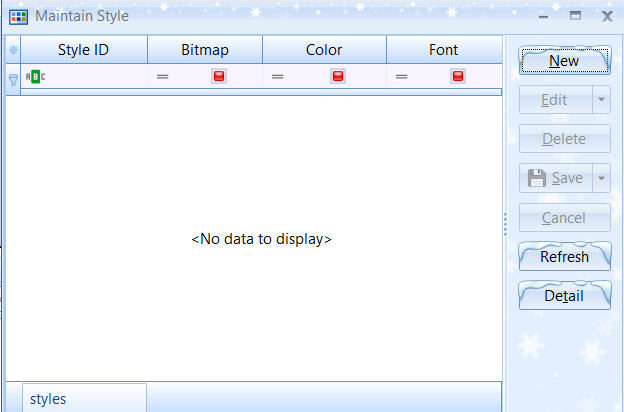
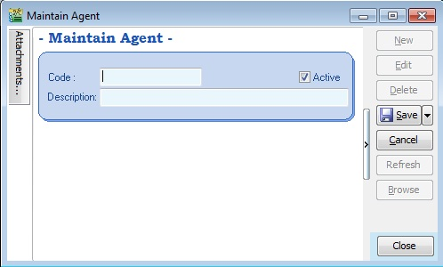
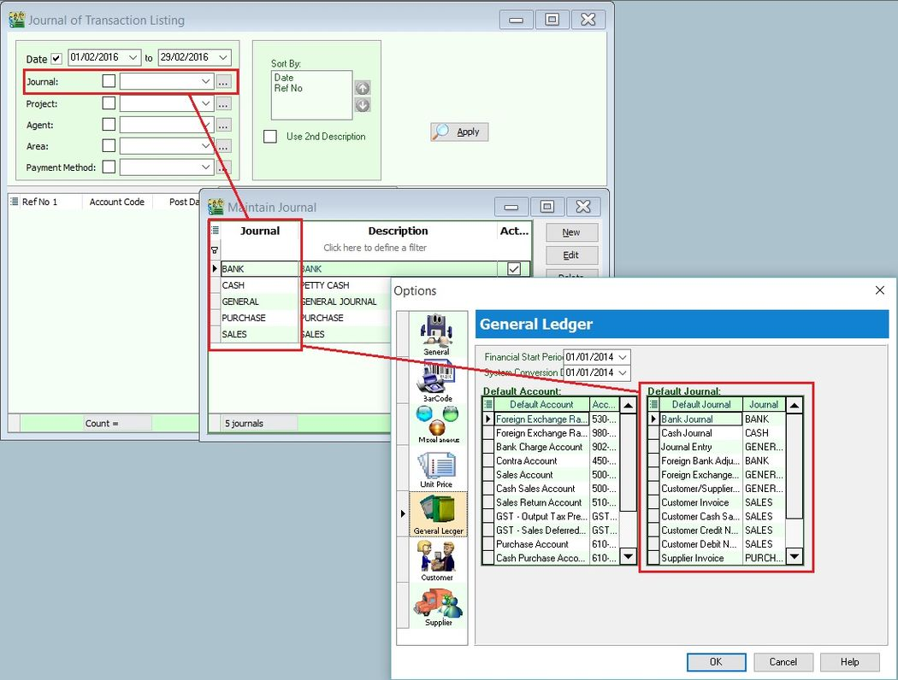

## Maintain User

### Create New User

1. Select **Tools > Maintain User > New**.

2. Enter the **Code** and **Name** (both can be the same, e.g., **Code** = ALI, **Name** = ALI).

3. Click on **More** and select **Change Password**.

    

4. Click **Save**. Your new user account is now created.

:::info info
SQL User license is on a concurrent basis (i.e., how many users can login to the system at the same time). This means that if you have 5 staff in the office who can access SQL but you only have 3 licenses for 3 concurrent users, you can still maintain all 5 users in the system, but only 3 users can login and access it at the same time.
:::

### User Access Right

:::info Video Guide
Watch the tutorial video here: [Youtube](https://www.youtube.com/watch?v=t_TJKdOihfw&feature=youtu.be)
:::

Not every user will have the same access rights as ADMIN, and the ADMIN user might want to set security control settings in the system.

1. Select **Tools > Maintain User > Edit** for the user you want to set the access rights for.

2. Click on **More** and select **Access Right**.

3. Check the transactions/functions (row), compare with the user (column), and **tick = Allowed** or **untick = Disallowed** the action for a particular user for specific transactions. For example, based on the settings in the following images, the user is not allowed to delete Customers or to view Customer Payments.

    

### Bar Navigator

**Tools > Maintain User > More > Bar Navigator**:

Use this function to **customize** the buttons in the Main Application by user.


| **Field Name**   | **Properties**                                                                  |
| ---------------- | ------------------------------------------------------------------------------- |
| **Description**  | Definition: Navigator Full Description; Field Type: Alphanumerical; Length: 160 |
| **Reset Button** | To restore to Default Layout                                                    |

1. Right-click here:

    

2. Select **Customize...**.

    

    | **Field Name**      | **Properties**                  |
    | ------------------- | ------------------------------- |
    | **Toolbars**        | Show list of available Toolbars |
    | **New...** button   | Create New Toolbar              |
    | **Rename...**button | Rename the highlighted Toolbar  |
    | **Delete**          | Delete highlighted Toolbar      |

3. Select the **Commands** tab.

    

    | **Field Name** | **Properties**                                     |
    | -------------- | -------------------------------------------------- |
    | **Categories** | List of Available Buttons Category                 |
    | **Commands**   | List of Available Buttons on the Selected Category |

    

4. Select **Categories** (e.g., **Sales**).
5. Select **Commands** (e.g., **Invoice...**).
6. Drag from Step 5 to here.
7. Click **Close**.
8. Click **Save**.
9. Click **Browse**.
10. Click **More > Navigator vs User**.

    

    | **Options** | **Properties**                                 |
    | ----------- | ---------------------------------------------- |
    | –           | No setting is set                              |
    | **Default** | Set the setting                                |
    | **Deny**    | Not allowed to use (Not used in this function) |

11. Set the **User** to use the **Toolbar**.
12. Click **Save** (Blue Disc Icon button).

## Maintain Document Number

Use this function to maintain document number formats and next numbers.

:::info
Watch the tutorial video here: [Youtube](https://www.youtube.com/watch?v=hFR6TfqxnRU&feature=youtu.be)
:::

1. **Tools > Maintain Document Number**.

2. Insert a **Description** for the particular set of documents and select a **Document Type** (e.g., **Payment Voucher**).

3. The system’s default is the **Format** `%.5d`, where `%` is the formula that enables the function to auto-run for the document number, while `5d` stands for 5 digits.

    

4. You can select the **Frequency** option as **Never Reset** or others.

5. Set the **Next Number** for this document.

    

## Maintain Acceptable Transaction Date

:::info
SQL does not need to perform a year-end; it will cut off automatically. Once the account is closed, if you wish to block the period to avoid users changing the account figures, you may apply this setting.
:::

**Maintain Acceptable Transaction Date** enables you to control which documents you are allowed to maintain (**New**, **Edit**) based on their dates.

- Any document whose date falls **within** the allowed transaction dates **can** be edited.

- Any document whose date falls **outside** the allowed transaction dates **cannot** be edited/created.

### New Acceptable Transaction Date

1. **Tools > Maintain Acceptable Transaction Date**.

    

2. Click on **Append** (Icon with **+** symbol).

    

3. Choose the period for which you want to **allow transactions**.

4. Click **Save**.

    

5. Result:

    The system will show a message if users try to save a document that is not in the acceptable transaction period.

    

    If the user clicks **Yes**, a dialogue box will request override permission by ID/PW with rights to override it.

    :::info
    The default setting grants users override permission. Refer to the following section for instructions on revoking this privilege from a specific user.
    :::

### Override Acceptable Transaction Date

To override (i.e., save a document that falls outside the acceptable transaction dates), you will need to be logged in as a user with the right to override acceptable transaction dates.

1. **Tools > Maintain User**. Double-click on the user you want to **Edit**.

    

2. Click on **More > Access Control**.

    

3. Under **Group Tools**, tick or untick the option **Override Acceptable Transaction Date** to allow or deny the user from having the overriding right to save a document outside of the acceptable transaction period.

4. **Save** the access rights.

    

5. Result:

    If the user is not permitted to override, the system will prompt the following dialog, and you can choose either:

    - **OK** = cancel saving
    - **Override** = Enter the ID and password of a user who can override, then save the transaction.

    

    

### SQL Global Price Change

SQL Global Price Change helps you **mark down prices** for all items with a few clicks.

:::info
This is a **paid module**. Contact your SQL Service provider to get this standalone application.
:::


### Setup

1. Select your group of items:

    1. You can select a certain **Stock Group** or **Category**. If you want all items, leave **Stock Group** and **Category** blank.
    2. You can also choose only **Active** items.
    3. Once your group of items is selected, click on **Get Stock Items List**.

    

2. Setting the value to be adjusted:

:::info note
Scenario: You are trying to reduce prices due to the removal of GST (6% > 0%).
:::

    

    - **Rounding Method** (Assuming **Round Decimal** is 2):
      1. **Normal**: Example: 0.1234 => 0.12
      2. **Round Up**: Example: 0.1234 => 0.13
      3. **Round Down**: Example: 0.1274 => 0.12

    - **Input Value** = Sample Value
    - **Output Result** = Sample Result
    - **Round decimal** = Number of Decimal Points

    It may look like a **6%** reduction, but it is actually **5.66%**.

    Example:

    Item price = RM 100

    With 6% GST = RM 100 * 1.06 = RM 100 + 6% = RM 106
    Removal of 6% GST = RM 106 / 1.06 = RM 106 - 5.66% = RM 100

    - **Mark down** = 5.66%
    - Why 5.66% instead of 6%?
    - 30 May 2018 selling price = RM 106 GST Inclusive
    - 01 June 2018 selling Price RM 106 – 5.66% = RM 100
    - **NOT RM 106 – 6% = RM 99.64**

- sfds
- sdfds
- sdfsd

1. Select fields to be updated:

    

    - Tick the option you want to adjust/update, e.g., **Reference Price**.
    - You can also tick **Record change history**, and the system will update this change history in your notes.
    - Once you complete the settings, click on **Change**.

2. Check & Post


## Maintain Form Mode

**Form Mode** helps filter data based on defined criteria. It is used to restrict users to viewing only specific sets of data for a certain document. For example, agent **Lip Fong can view and access the sales invoices belonging to his agent code** LF ONLY.

### New Form Mode

:::info
Watch the tutorial video here: [Youtube](https://www.youtube.com/watch?v=bqSDZlAhM5I&feature=youtu.be)
:::

1. **Tools > Maintain Form Mode > New**.

2. **Enter Code** and **Select the document** form you want to filter, e.g., **Invoice**.

    

3. Click on **Customize Filter** and then click the button to **add a new condition**.

    

4. Change **SL_IV.DOCKEY** to **SL_IV.Agent** because you need to filter based on the sales invoice agent field. Then change **= equals** to **like**, enter the **Agent Code** you want to filter, and click **OK**.

    

5. Ensure the info is updated correctly, then click **Save**.

    

6. Other optional settings:

    

    

7. If you have set **more than 1 form mode**, once you click **Sales > Invoice**, you will get a prompt to choose which **Form Mode** you want to apply.

    

### Form Mode VS User

How do I apply the form mode to a specific user?

1. **Tools > User Access Right Assignment…**

2. Under the list of security, click on **Form Mode**.

3. Select the user, e.g., user code: **LF** (Lip Fong).

4. Tick to apply the **Form Mode**, e.g., tick **Form Mode: IV-LF** and click **Save**.

    

## Maintain Terms

**Maintain Terms** enables users to maintain their Customer and Supplier terms. In SQL, there are 3 different types of terms you can assign.

1. **Tools > Maintain Terms > New**.

2. **Insert Code, Description, and allocated Term Type.**
   

    - **Due in number of days** – Specifies how many days until the document is due. For example, if you set 30 days, the document will be due on the 30th day from the document date.

    

    - **Due on specific day of the month** – Specifies the month and day the document is due. For example, if you set it as 1 Month 6 Days, the document will be due on the 6th of the next month.

    

    - **Due in the month end** – Specifies how many months until the document is due at the end of the final month. For example, if you set it as 2 months, the document will be due at the end of the 2nd month.

## Maintain Currency

### New Foreign Currency

:::info
Watch the tutorial video here: [Youtube](https://www.youtube.com/watch?v=qfhtlAjW4As&feature=youtu.be)
:::

You can bill overseas customers and suppliers in foreign currencies (e.g., USD, SGD, Euro, etc.). **(Prof Package Inclusive)**

1. **Tools > Maintain Currency > New**.

    

2. **Maintain Customer / Supplier to assign the currency.**

    

3. Sales document, select the customer, sample as below:

    1. **Currency Rate** will follow your settings from **Tools > Maintain Currency**, but it is still changeable in this invoice.

    2. **Unit Price** entered is based on the Customer’s currency (e.g., this customer is in USD).

    3. The system will automatically convert this into the default currency (RM) in the **Local Net Total** column at the bottom right.

        

### Payment from Foreign Customer

#### Scenario 1

:::note
Customer Invoice **billing in USD**, but **payment paid in your local RM bank**.
:::

1. **Customer > Customer Payment > New**.

2. Select your **Customer**.

3. Choose your **RM Bank**.

4. Enter your **RM Amount**.

5. Knock off the invoice, and the **Rate** will be updated automatically by the system. Foreign gain/loss will be automatically calculated and posted to the account accordingly. (You can call out the **Rate** and **Gain Loss** columns from the hidden fields).

    

#### Scenario 2

:::info note
Customer Invoice **billing in USD, Payment paid in your Foreign USD Bank**.

_([Advance Currency](../../usage/tools/faq#advanced-currency-module) module required)_
:::

1. Go to **Tools > Maintain Payment > Edit** your **USD Bank**.

2. **Currency**: You can assign the currency for the particular payment method so that the payment method will be in foreign currency payment.

3. **Bank Charge Acc**: You can pre-set the bank charges account for the payment method accordingly.

4. **OR & PV Number Set**: Set the default running document number for the particular payment method (optional).

5. **Bank Info**: Enables you to set Giro info and make payments through Giro (refer to the [Interbank Giro](../../additional-module/interbank-giro.md) topic for more details).

    

    Select your payment received in your **Foreign USD Bank**, enter your **paid Amount in USD**, enter your **USD Rate**, and knock off the invoice. Foreign gain/loss will be automatically calculated by the system.

    

#### Scenario 3

:::info note
Customer Invoice **billing in USD**, but **payment in another currency** (e.g., SGD / RMB / EURO).
:::

1. Select your bank (e.g., you received payment in an **SGD Bank**), enter your **SGD Amount** and **SGD Rate**.

2. Knock off your **USD Invoice**.

3. The **USD Rate** will be automatically calculated, and foreign gain/loss will be automatically calculated and posted to the account accordingly.

    

## Maintain Project (Required Project Module)

:::info note
This is an extra module that must be purchased. You may contact customer support to purchase it.
:::

This module enables users to maintain project accounting on a branch or departmental basis. Users can use this module for simple construction businesses to view **Profit and Loss** / **Balance Sheet** by **Project**.

1. Click on **Tools > Maintain Project**.

    

2. Insert the **Project Code** and **Description**. **Project Value** and **Project Cost** are not compulsory fields; if filled in, they serve as remarks.

    

3. Click on **Tools > Options**.

    

4. Look for **Miscellaneous** and ensure the option **Show Document Project** is ticked.

    

5. During **Sales** and **Purchase** transactions, ensure you can see the **Project** column, then update it accordingly.

    

    When keying in a transaction, some users may ask why there is a project at the item detail level and another beside the Customer. Is it a duplicate tab?

    **What is the difference between More > Project (Document Project) and Item Detail > Project (Item Project)?**

    

    

    

    **The project feature is also available for GL > Cash Book Entry.**

    After updating the document with a project, how do you view reports by project and compare them? For example: **GL > Print Profit & Loss Statement**.

6. Filter by the date you want to view for the P&L report. If you want to perform a project-to-project comparison, choose **Comparison – Project (6 columns)**.

    

    :::info note

    6 Columns = up to 6 projects

    10 Columns = up to 10 projects

    19 Columns = up to 19 projects.

    :::

7. Criteria:

    1. After selecting the report you need, ensure you tick **Show Column Options**. The top of the report will then show column options.

    2. You may change the period you want to view; by default, it will be **Current Month**.

        If you want to view the whole year's figures, change it to **Current Year**.

        

8. After changing the column options, tick **Print Project Comparison**. The **Project** tab will appear on the right-hand side. Select the project you want to view and click **Add**.

    

9. Click **Apply** to see the result. The P&L report will compare each project you selected.

    

### 5 Cents Rounding

You can pre-set the system to automatically round your invoice or cash sales amounts to the nearest 5 cents.

:::info

Watch the tutorial video here: [Youtube](https://www.youtube.com/watch?v=VSnX55l_3xw&feature=youtu.be)

:::

1. **Tools > Options > Customer**.

2. **Tick 5 Cents Rounding** for **Sales Invoice** / **Cash Sales**.

    

    

### Online Mobile Approval

### How it works?

For example: If we set a **Credit Limit** over RM30,000, an override will be required.

1. A dialog box will be prompted after clicking **Save Invoice**: **"Do you want to override?"** > Click **Yes**.

    

2. Click on **Online Approval**.

    

    1. Tick the **ID** you choose to get approval from.

    2. You can choose to send via **WhatsApp**, **Email**, or **WhatsApp & Email**.

        

3. You will receive a message via **WhatsApp** or an **Email** sent by the system.

    - **Scenario 1: Send By WhatsApp**

        You will receive a message > Click the link.

        

    - **Scenario 2: Send By Email**

        You will receive an email > Click **'CLICK HERE FOR MORE ACTIONS'**.

        

4. Login with the **Gmail Address** you set in **Maintain User > Open ID (Google)**.

    :::info[note]

    - This step is for those who send via **WhatsApp** and do **not** use Gmail to receive notifications.
    - Those who use a **Gmail Address** to receive notifications and approve can skip to **Step 6**.

    :::

    

5. Enter your **Gmail Password**.

    

6. After logging into Gmail, you will see this window:

    

7. You can click on **Doc Detail** and **ScreenShot** to see the details.

    1. **Doc Detail**: Shows the **Customer Code** and the reason why an override is needed.

    2. **ScreenShot**: Shows the transaction screen.

    3. **Reply**: You can leave a message and click **Approve** or **Reject**.

        

    :::info[note]
    After clicking **Approve** or **Reject**, return to SQL Accounting. You will see one of the following scenarios:
    :::

    - **Scenario 1: Approve Override**

        > a. Message: Approve Message
        >
        > b. A green tick will appear after approval.
        >
        > c. Click **OK** to save the transaction.

        

    - **Scenario 2: Reject Override**

        > a. Message: Reject Message
        >
        > b. A cross will appear after rejection.
        >
        > c. The **OK** button is disabled after rejection; click **Cancel**.

        

        After clicking **Cancel**, the system will prompt this dialog box again:

        

### When to use?

**Online Approval** can be used for the following actions:

| Module           | Action                                                                        |
| ---------------- | ----------------------------------------------------------------------------- |
| Logon Screen     | - No access right to change password                                          |
| All Module       | - All Document entry without Execute / Print / Preview / Export access rights |
|                  | - Unable to Save and Manage Grid Layout                                       |
|                  | - Unable to Grid Export                                                       |
|                  | - Save Document Fall Outside Acceptable Trans Date                            |
| Customer Invoice | - Fast entry save Invoice                                                     |
| SL&PH            | - Prompt Stock Qty Control Dialog                                             |
|                  | - Prompt change unit price                                                    |
|                  | - Save price below cost (fmSLPriceControl)                                    |
|                  | - Override Credit Control                                                     |
| GL               | - Bank Recon Entry form to Check Bank Recon Listing                           |
| Stock            | - Update GL stock value from other stock month end report                     |
|                  | - Stock Report with Execute access right but without Process right            |
| Inquiry          | - Hide Dashboard                                                              |

### 1. Maintain User

1. **Tools > Maintain User**.

    

### 2. Edit User

1. Double-click the user you want to set up > **Edit**.

    

    

### 3. Set Approval Person

- Set the details for the **Approval Person** (ONLY GMAIL CAN LOGIN TO APPROVE OR REJECT).

    1. **Mobile number**: The WhatsApp number to receive notifications for approval.

    2. **Email**: The email address to receive notifications for approval.

    3. **Open ID (Google)**: The Gmail account used to approve or reject.

    :::info[note]
    If the notification email and approval email are both Gmail, configure only **Open ID (Google)** and leave the **Email** column blank.
    :::

    

    For Example:

             - **Scenario 1: Use the Same Gmail to Receive Notifications and Give Approval**

                  Your Gmail address is: `XXXXXX@gmail.com`

                  1. **Open ID (Google)**: `XXXXXX@gmail.com`
                  2. **Email**: **Leave blank**

               

              - **Scenario 2: Use Different Emails to Receive Notifications and Give Approval**

                  - Gmail Address for Approval: `XXXXXX@gmail.com`
                  - Email Address for Notifications: `XXXXXX@estream.com`

                     1. **Open ID (Google)**: Put your Gmail address `XXXXXX@gmail.com`
                     2. **Email**: `XXXXXX@estream.com`

                

### 4. Setting SMTP

:::info[note]

- This setting is for users who want to **use Email to send notifications**.
- If using WhatsApp to send approvals, you can skip this step.

:::

1. Ensure you have created an **App Password**.

    - If you are using Gmail, you can [click this link](https://support.google.com/accounts/answer/185833?hl=en) to follow the steps to create your **App Password**.
    - After obtaining your **App Password**, return to SQL Accounting.

2. Click on **Email Setting**.
3. Enter your **Email SMTP Host**.
4. Enter your **Email SMTP Port**.
5. Enter your **Email SMTP Connection Security**.
6. Enter your **Email Address**.
7. Enter your **App Password**.
8. Enter your **Email Sender Name**.
9. After completing the settings, click **Save**.

    

## Maintain Journal

**Journal** is primarily used to categorize document types while analyzing reports by journal.


### Create New Journal


| **Field Name** | **Explanation & Properties**     |
| -------------- | -------------------------------- |
| **Journal**    | - Input the new **Journal** code |

- **Field type:** Alphanumerical
- **Length:** 10 |
    | **Description** | - Input the **Journal** description
- **Field type:** Alphanumerical
- **Length:** 80 |
    | **Active** | - **Checked** = Active
- **Unchecked** = Inactive | |

### Journal Setting

1. Let's say you have created a new **Journal** named **Sales-DN**. See the screenshot below.

    

2. You must set the **Journal** at **Tools > Options...**.
3. In the **General Ledger** tab, you can link the **Journal** to a default **Journal**.
4. For example, link the **Sales-DN** **Journal** to a default **Journal** like **Customer Debit Note**. See the screenshot below.


### Reporting by Journal

**GL > Print Journal of Transaction Listing...** See the screenshot below:


1. You can select the **Journal** lookup as shown in the screenshot above.
2. The system will list the double entries posted from the **Sales** / **Customer Debit Note**.

## Maintain Style

Menu: Tools > Maintain Style

Use this to display document details in different font types (currently not supported) and sizes. For example, if the document detail font size is 10, see the screenshot below:


### Create New Style




| Field Name             | Explanation & Properties                                                                                |
| ---------------------- | ------------------------------------------------------------------------------------------------------- |
| **Style ID**           | - Input the new **Style ID**.<br />- **Field type:** Alphanumerical<br />- **Length:** 5                |
| **Font**               | - Always tick and click on the **Font** button to select the font size.<br />- **Field type:** Checkbox |
| **Background - Color** | - Not supported                                                                                         |
| **Background - Image** | - Not supported                                                                                         |

## Maintain Commission

**Menu: Tools > Maintain Commission Script...**

1. Execute a simple commission script to determine the commission rate based on the payment age (**Payment Date** - **Invoice Date**).
2. The **Sales Commission Script** module is required.

Browse mode in **Maintain Style**. See the screenshot below:


### Create New Commission Script

1. Click on **NEW**. See the screenshot below.


      | Field Name      | Explanation                              |
      | --------------- | ---------------------------------------- |
      | **Code**        | Input the new code.                      |
      | **Description** | Input the commission script description. |
      | **Script**      | Load the commission script.              |

2. Example of the scripts:

    a. Script 1

<details>
   <summary>Commission Script</summary>

```sql
procedure CalculateCommission(AKODocAmt, AAge: variant; var Value: variant);
begin
  if AAge < 10 then
    Value := AKODocAmt * 0.05
  else if AAge < 20 then
    Value := AKODocAmt * 0.03
  else if AAge < 30 then
    Value := AKODocAmt * 0.02
  else
    Value := AKODocAmt * 0.005;
end;
```

</details>

## Maintain Agent

**Menu: Tools > Maintain Agent...**

1. An **Agent** is a sales person or sales representative.
2. This is very useful when applying reports by an **Agent**.
3. You can create or edit the **Agent** or sales person code here.


### Create New Agent



| Field Name      | Explanation & Properties                                                 |
| --------------- | ------------------------------------------------------------------------ |
| **Code**        | - Input the new **Agent** code - Field type: Alphanumerical - Length: 10 |
| **Description** | - Input the **Agent Name** - Field type: Alphanumerical - Length: 80     |
| **Active**      | - **Checked** = Active - **Unchecked** = Inactive                        |

## Maintain Area

**Menu: Tools > Maintain Area...**

> 1. **Area** can represent states, countries, or regions.
> 2. This is very useful when applying reports by **Area**.
> 3. You can create or edit the area or country code here.


### Create New Area

Below is the **Area** entry form:


## Maintain Withholding Tax

**Menu: Tools > Maintain Withholding Tax...**

### Create Withholding Tax Code

1. Click **New**.
2. Input the following data:

    | Field Name           | Explanation                             | Remark                                                                                                 |
    | -------------------- | --------------------------------------- | ------------------------------------------------------------------------------------------------------ |
    | **Code**             | Set a code                              | WTH-TAX15                                                                                              |
    | **Description**      | Describe the meaning/usage of this code | Withholding Tax 15%                                                                                    |
    | **Tax Rate**         | Withholding Tax Rate                    | 15%                                                                                                    |
    | **Tax Account (DR)** | Set to Withholding Tax Expense account  | At **GL > Maintain Account**, create the Withholding Tax Expense account under **Expenses**            |
    | **Tax Account (CR)** | Set to Withholding Tax Payable account  | At **GL > Maintain Account**, create the Withholding Tax Payable account under **Current Liabilities** |

    

3. Click **Save**.

## Maintain Company Category

**Menu: Tools > Maintain Company Category...**

1. **Company Category** is usually used to categorize customers/suppliers. For example: **3rd Parties-Domestic**, **3rd Parties-Export**, **Intercompany**, etc.
2. This is very useful when applying reports by **Company Category**.
3. You can create or edit the **Company Category** or sales person code here.


### Create New Company Category

The screenshot below shows the **Company Category** entry form.


| Field Name      | Explanation & Properties                                                          |
| --------------- | --------------------------------------------------------------------------------- |
| **Code**        | Input the new **Company Category** code _Field type:_ Alphanumerical _Length:_ 10 |
| **Description** | Input the **Company Category Name**. _Field type:_ Alphanumerical _Length:_ 80    |
| **Active**      | **Checked** = Active **Unchecked** = Inactive                                     |

### Use of Company Category

You can link the **Company Category** to a **Customer** or **Supplier**.


Reports by Company Category

1. You can apply the following reports by **Company Category**:

    <details>
    <summary><b>Customer</b></summary>

    a. **Print Customer Document Listing...**

    b. **Print Customer Balance Report...**

    c. **Print Customer Due Document...**

    d. **Print Customer Aging Report...**

    e. **Print Customer Statement...**

    f. **Print Customer Post Dated Cheque Listing...**

    g. **Print Customer Analysis By Document...**

    h. **Print Customer Sales and Collection Analysis...**

    </details>

    <details>
    <summary><b>Supplier</b></summary>

    a. **Print Supplier Document Listing...**

    b. **Print Supplier Balance Report...**

    c. **Print Supplier Due Document...**

    d. **Print Supplier Aging Report...**

    e. **Print Supplier Statement...**

    f. **Print Supplier Post Dated Cheque Listing...**

    g. **Print Supplier Analysis By Document...**

    h. **Print Supplier Sales and Collection Analysis...**

    </details>

    <details>
       <summary><b>Sales</b></summary>

    a. **Print Sales Document Listing...**

    b. **Print Outstanding Sales Document Listing...**

    c. **Print Sales Price History...**

    d. **Print Profit & Loss by Document...**

    e. **Print Sales Analysis by Document...**

    f. **Print Yearly Sales Analysis...**

    </details>

    <details>
       <summary><b>Purchase</b></summary>

    a. **Print Purchase Document Listing...**

    b. **Print Outstanding Purchase Document Listing...**

    c. **Print Purchase Price History...**

    d. **Print Purchase Analysis by Document...**

    e. **Print Yearly Purchase Analysis...**

    </details>

2. Example of the **Print Customer Aging Report** screenshot:


## Maintain Shipper

**Menu: Tools > Maintain Shipper...**

1. Maintain the shipper profile, such as **Name**, **Address**, **Phone**, **Account**, etc. This makes it easy to trace the shipper who shipped the goods or services.
2. Sometimes, you can use this as a **"Global Delivery"** where you can apply it to both sales and purchase documents.


### Create New Shipper


<details>
  <summary><b>Shipper Fields</b></summary>

| **Field Name**  | **Explanation**                                | **Properties**                      |
| --------------- | ---------------------------------------------- | ----------------------------------- |
| **Code**        | Input the new **Shipper** code                 | Alphanumerical, Length: 30          |
| **Description** | Input the **Shipper** name                     | Alphanumerical, Length: 160         |
| **Address**     | Input the **Shipper Address**                  | Alphanumerical, Length: 60 per line |
| **Phone**       | Input the **Shipper Phone**                    | Alphanumerical, Length: 20 per line |
| **Account**     | Input the **Shipper Account**                  | Alphanumerical, Length: 40          |
| **Remark 1**    | Input any remark (free field)                  | Alphanumerical, Length: 200         |
| **Remark 2**    | Input any remark (free field)                  | Alphanumerical, Length: 200         |
| **Active**      | **Checked** = Active, **Unchecked** = Inactive | Boolean                             |

</details>

### Use of Shipper

1. In both **Sales** and **Purchase** documents, you can select the shipper by clicking on the **MORE** tab (left sidebar).
2. Example of the **Sales Delivery Order** screenshot:


### Report by Shipper

1. You can apply the **Sales** report by **Shipper**, especially reports from **Sales > Print Sales Price History**.
2. Example of the **Sales Price History** report screenshot:


## Maintain Tariff

**Menu: Tools > Maintain Tariff...**

- Tariff classification is a complex yet extremely important aspect of **cross-border trading**.

- **Goods imported** from or to Malaysia are classified by the Harmonized Tariff Schedule (HTS), commonly referred to as **HS Codes**.

- These codes, created by the World Customs Organization (WCO), categorize up to 5,000 commodities. **HS Codes** consist of **6-digit numbers** recognized internationally, although different countries can extend the numbers by two or four digits to define commodities at a more detailed level.

[Click here to search for tariff rates on products](https://ezhs.customs.gov.my/) to search the tariff code list from the Kastam system.

### Create New Tariff


| **Field Name**  | **Explanation**                                | **Properties**              |
| --------------- | ---------------------------------------------- | --------------------------- |
| **Code**        | Input the new **Tariff Code**                  | Alphanumerical, Length: 20  |
| **Description** | Input the **Tariff Description**               | Alphanumerical, Length: 160 |
| **Active**      | **Checked** = Active, **Unchecked** = Inactive | Boolean                     |

## Print Audit Trail

**Menu: Tools > Print Audit Trail...**

> All questions regarding who created, edited, or deleted data, and when, can be answered through the **Print Audit Trails**.


| Field Name    | Explanation & Properties                                                                                                                                     |
| ------------- | ------------------------------------------------------------------------------------------------------------------------------------------------------------ |
| **Date**      | Input the date range to be audited.                                                                                                                          |
| **User**      | Select the user to be audited.                                                                                                                               |
| **Event**     | **Insert** = Check who/when the data was created.<br/>**Edit** = Check who/when the data was modified.<br/>**Delete** = Check who/when the data was deleted. |
| **Where**     | Tick the modules to be audited.                                                                                                                              |
| **Find Text** | Input a specific keyword to be audited, e.g., invoice no., customer code, etc.                                                                               |

### Advanced Options

> If you wish to audit **Sales** / **Purchase** / **Stock** document details, you must enable **Post Audit Trail for Stock/Sales/Purchase Detail**. See the screenshot below:


## Analyse Data Integrity

**Menu: Tools > Analyse Data Integrity...**

:::warning
RUN **Analyse Data Integrity** ONLY when you have at least **1-3 hours** for operations and SQL Account is **fully stopped**.
:::

Use this to perform a data integrity check. It is recommended to perform this action **weekly** or **monthly** (before month-end closing).

Reasons to run this may include unpredictable matters such as:

> 1. Hardware malfunctions/glitches (e.g., network switch, computer, server).
> 2. Network instability (e.g., wireless connection loss).
> 3. Power failure.
> 4. Operating System failure.

<details>
  <summary>Parts of Analyse Data Integrity - click to expand</summary>

There are 3 parts to **Analyse Data Integrity**:

a. **Regular Data Integrity** (Default)

- Check AP Knock Off Integrity
- Check AR Knock Off Integrity
- Update Customer Outstanding
- Check Document Integrity
- Check Document Transfer Integrity
- Check Delivery Order/Invoice/Cash Sales to Credit Note Posting Date
- Check Production Document Transfer Integrity
- Check GL Opening Balance
- Check GST DO -> IV Posting Integrity
- Repost Stock Transactions
- Calculate Stock Costing
- Compress Stock Item Pictures
- Update Stock Balance Quantity
- Update Supplier Outstanding
- Resequence Table Fields
- Regenerate Views
- Remove Temporary Table

b. **Reposting** (Optional)

- Repost AR Documents
- Repost AP Documents
- Repost GL Documents
- Repost PH Documents
- Repost SL Documents

</details>

:::info NOTE:

1. Reposting might take a longer time to perform for the selected documents.

2. It is recommended to run this on the server side.
   :::


### To Start Analyse

1. Tick the **Analyse Items** required, otherwise skip this step.
2. Click on **Start Analyse**.

    

3. A message will inform you when the total tasks ticked have completed analysis.

    

4. You can copy the analysis log details by clicking **Copy to Clipboard**.

    

5. Open Notepad or Microsoft Word and paste it.

    

## Print Bar Code (Direct Printer)

**Menu: Tools > Print Bar Code (Direct Printer)**

Use this to print barcode labels using a Special Bar Code Printer for items created in **Maintain Stock Item**.


### Bar Code Printer Setting

**Menu: Tools > Options... (BarCode)**

1. Insert the new barcode printer settings and template.

    

2. Click **OK** to exit.

### Print the Bar Code Label

1. Click the arrow key down beside the **Print** button. See the screenshot below.
2. You can choose either **Print to Printer** (barcode printer) or **Print To File** (output as a text file).


## Print Bar Code (Windows Printer)

Menu: Tools > Print Bar Code (Windows Printer)

Use this to print barcode labels using a Windows Printer for items created in **Maintain Stock Item**.


### Update Item Bar Code Listing

1. First, update the item barcode in **Maintain Stock Item**.

    

2. Click the **+** button to insert items. See the screenshot below.

    

3. Click the **SAVE** button to save the item barcode listing. Type a file name (e.g., **BarCode_Items_31122015**) to save. See the screenshot below.

    

4. A message will be prompted. Click **OK**.


### Load the Previous Item Bar Code Listing

1. Click the **Cabinet** button to load a previous file for the item barcode listing (e.g., **BarCode_Items_31122015**). Click **OPEN**.

    

2. A confirmation message will be prompted. Click **OK** to load it or **NO** to cancel.

    

3. A "Load success" message will be prompted. Click **OK** to proceed.


### Preview/Print the Bar Code Level

1. Click **Preview** or **Printer** (to skip the preview).

    

2. After the preview, click the **Printer** button to print.

### How to Change the Label Size (mm) Measurement for the Bar Code Label

1. Click on the **Report Name**. See the screenshot below.

    

2. To change the paper unit measurement, click **Report > Units** and choose **Millimeters**.

    

3. To change the paper size, click **File > Page Setup...**.

    

4. Click the **Paper Size** tab and change the **Width** and **Height** to 35 and 25 respectively (mm). For example, the label paper size is 35mm x 25mm.

    

5. Check the **Layout** tab to ensure **Columns** is set to **1**.

    

6. Check the **Margin** tab to ensure all (**Top**, **Bottom**, **Left**, **Right**) are set to **0**. Click **OK** to exit **Page Setup**.

    

7. To ensure each page contains 1 barcode of an item, right-click on the **Detail** band and select **Position**.

    

8. Set **Print Count** to **1**. Click **OK** to confirm.

    

9. Save the report with **another name**.

## Options

<details>
   <summary>Options (Acc) - click to expand</summary>

**Menu: Tools > Options...**

Settings for the following:

1. **General**
2. **BarCode**
3. **Miscellaneous**
4. **Unit Price**
5. **General Ledger**
6. **Customer**
7. **Supplier**


### General

- **Automation Server Registration**: Use this to register/communicate with external applications via the Windows platform.


### Bar Code

- Define the **Cash Drawer** settings with a compatible device.


- Define the **Barcode** settings with a compatible device (e.g., barcode printer).


### Miscellaneous

Other settings.


#### To set the display format

- To understand the display format, see the picture below:


| Numbering Type                | Display Format  | Example                                                                                              |
| ----------------------------- | --------------- | ---------------------------------------------------------------------------------------------------- |
| Accounting Value              | #,0.00;(#,0.00) | <div>Amount/DR/CR display format<br/>Positive value = 1,000.00<br/>Negative value = (1,000.00)</div> |
| Currency Rate                 | #,0.0000        | <div>Exchange Rate display format, e.g. 1 USD = 4.2334 MYR</div>                                     |
| Stock Quantity                | #,0.00;-#,0.00  | <div>Qty display format<br/>Qty In = 2.00 units<br/>Qty Out = -2.00 units</div>                      |
| Item Selling Price            | #,0.00;-#,0.00  | <div>Sales Unit Price display format, e.g. unit selling price = 25.53</div>                          |
| Item Purchase Price / Costing | #,0.00;-#,0.00  | <div>Purchase Unit Price and Total Cost display format, e.g. unit purchase price = 15.33</div>       |

#### Merge Same Item Code

1. Tick this option to merge the same items' quantity and amount when printing documents (e.g., **Sales Invoice**, **Cash Sales**, etc.).
2. Conditions:

- a. Same **Item Code**;
- b. Same **UOM**;
- c. Same **Unit Price**;
- d. Same **Disc**;
- e. Same **Tax Code**.


#### Prompt Negative Stock Quantity Dialog Box

- Tick this option, and the system will prompt an alert message if stock falls below the quantity on hand, re-order level, or minimum quantity in sales documents.


#### Show Document Project

1. Tick this option to enable the selection of a **Document Project**.
2. See the example in the screenshot below.


#### Runtime Stock Costing Calculation for Stock Document

1. Enable this to execute costing calculations when printing stock document reports (report names ending with **Actual Cost**) in **Stock Issue**, **Stock Adjustment**, and **Stock Transfer** (available in the multiple warehouse module).
2. See the example of a **Stock Issue** in the screenshot below.


#### Prompt Duplicate Cheque Number

- Alert a message if a duplicate cheque number is saved in a **Payment Voucher** or **Official Receipt**.


#### Use Doc Date For Acceptable Transactions Date Checking

1. The system will use the document date instead of the post date to check and allow saving based on the dates set in **Maintain Acceptable Transaction Date**.
2. For instance, if the document date is 01/01/2016 and the post date is 17/02/2016, the system will not allow saving if it falls outside the acceptable transaction date range (e.g., 01/02/2016 - 29/02/2016). See the screenshot below.


#### Post Audit Trail for Stock/Sales/Purchase Detail

- Audit log the changes made in **Sales** and **Purchase** details.


#### Default UOM

- Set the default base **UOM** when creating a new item in **Maintain Stock Item**.


### Unit Price

- Set the unit price priority applied to **Sales** / **Purchase** / **Stock** documents when selecting an item code for a customer/supplier.

- **Sales**


- **Purchase**


- **Stock**


- **Cash Sales**


- **Cash Purchase**


### General Ledger (GL)

- It is important to define these settings correctly in a new database.


**Financial Start Period**
Define the company's **Financial Start Date** (e.g., 01/01/2016). The system will notify you of the **New Financial Start Date** on January 1st every year.

**System Conversation Date**
The date of conversion from another system or new company database setup.

**Default Account**
Default accounts used for automatic posting by the system.

| Default Account                    | Account    | Explanation                                                                                                          |
| ---------------------------------- | ---------- | -------------------------------------------------------------------------------------------------------------------- |
| Foreign Exchange Rate Gain Account | 530-000    | Foreign Exchange Rate Gain auto posting from Customer and Supplier Payment.                                          |
| Foreign Exchange Rate Loss Account | 980-000    | Foreign Exchange Rate Loss auto posting from Customer and Supplier Payment.                                          |
| Bank Charge Account                | 902-000    | Bank charge auto posting from GL Cash Book Entry, Customer and Supplier Payment if entered in the bank charge field. |
| Contra Account                     | 450-000    | Applicable to Customer and Supplier Contra.                                                                          |
| Sales Account                      | 500-000    | Default sales account in Sales Invoice and Debit Note if empty item code.                                            |
| Cash Sales Account                 | 500-000    | Default cash sales account in Sales Cash Sales if empty item code.                                                   |
| Sales Returns Account              | 510-000    | Default sales returns account in Sales Credit Note if empty item code.                                               |
| GST-Output Tax Prepaid             | GST-103    | Applicable to 21 Days Rules and Non-Refundable Deposit.                                                              |
| GST-Sales Deferred Tax             | GST-202    | Applicable to Bad Debt Relief and Bad Debt Recovered related to Customer.                                            |
| Purchase Account                   | 610-000    | Default purchase account in Purchase Invoice and Debit Note if empty item code.                                      |
| Cash Purchase Account              | 610-000    | Default cash purchase account in Purchase Cash Purchase if empty item code.                                          |
| Purchase Return Account            | 612-000    | Default purchase returns account in Purchase Returns if empty item code.                                             |
| GST-Purchase Deferred Tax          | GST-102    | Applicable to Bad Debt Relief and Bad Debt Recovered related to Supplier.                                            |
| GST-Payable (Kastam)               | GST-KASTAM | RMCD accounts.                                                                                                       |
| Unclaimable GST Account            | GST-301    | Applicable to Mixed Supplies only.                                                                                   |

#### Default Journal

1. Classify transactions into the **Journal** created in **Maintain Journal**. Usually left as default.
2. This is very useful for applying the **Journal of Transactions Listing** and **Summary** reports.

    

3. Below is the default journal list:

| Default Journal                 | Journal  |
| ------------------------------- | -------- |
| Bank Journal                    | BANK     |
| Cash Journal                    | CASH     |
| Journal Entry                   | GENERAL  |
| Foreign Bank Adjustment         | BANK     |
| Foreign Exchange Rate Gain/Loss | GENERAL  |
| Customer/Supplier Contra        | GENERAL  |
| Customer Invoice                | SALES    |
| Customer Cash Sales             | SALES    |
| Customer Credit Note            | SALES    |
| Customer Debit Note             | SALES    |
| Supplier Invoice                | PURCHASE |
| Supplier Cash Purchase          | PURCHASE |
| Supplier Credit Note            | PURCHASE |
| Supplier Debit Note             | PURCHASE |

### Customer

- It is important to define the **Customer** settings in a new database.


**Default Control Account**
The default control account used when creating a new customer in **Maintain Customer**.


**Default Credit Terms**
The default credit terms used when creating a new customer in **Maintain Customer**.


**Default Credit Limit**
The default credit limit value used when creating a new customer in **Maintain Customer**.


**Default Output Tax**
The default output tax code used when creating a new customer or sales document entry (e.g., **Customer Invoice**, **Customer Debit Note**, etc.).


#### **Customer Account Code Format**

1. Define the customer code format.
2. Format explanation:


| Ref | Code Format | Explanation                                                    |
| --- | ----------- | -------------------------------------------------------------- |
| A   | %.3s-     | First number of digits from **Customer Control Account** code. |
| B   | %.1s        | First character from **Customer Name**.                        |
| C   | %.4d        | Sequence running number.                                       |

**Example 1:**
a. **Customer Control Account** = 300-000
b. **Customer Name** = ALI BABA SDN BHD

      | Code Format | Result |
      | ----------- | ------ |
      | %.3s-     | 300- |
      | %.1s        | A      |
      | %.4d        | 0001   |

c. **Customer Code** = 300-A0001

**Example 2:**
a. **Customer Control Account** = 3001-0000
b. **Customer Name** = ALI BABA SDN BHD

      | Code Format | Result |
      | ----------- | ------ |
      | %.4s/       | 3001/  |
      | %.2s        | AL     |
      | %.2d        | 01     |

c. **Customer Code** = 3001-AL01

#### **Exceptional Customer Code Format (Regular Expression)**

1. Copy and paste the regular expression line below into the **Customer Format** field (see the screenshot below).

         ```sql

         "%.3s"-"(?i)\b(?!sykt\b|persatuan\b)(?![-.,\s]).{1,1}""%.4d"

         ```


**Example 1:**
a. **Customer Name**: SYKT ALI
b. Keyword excluded: **sykt** (non-case sensitive)
c. **Customer Code** = 300-A0001

**Example 2:**
a. **Customer Name**: PERSATUAN KLANG
b. Keyword excluded: **persatuan** (non-case sensitive)
c. **Customer Code** = 300-K0001

#### Default Customer Aging Format

1. Set a default customer aging format to show the aging result at **Inquiry > Account Inquiry (Customer)**.

2. Customer aging format list:
   a. Cust-Multi-F1-06 Mths Statement-Current,1 Mth,...
   b. Cust-Multi-F2-06 Mths Statement-Current,1 Mth,...
   c. Cust-Multi-F1-12 Mths Statement-Current,1 Mth,...
   d. Cust-Multi-F2-12 Mths Statement-Current,1 Mth,...


**Use Cash Sales No. for Payment Received**
Use the **Cash Sales No.** as the official receipt number for cash sales only.


#### Perform Tax / Local Amount Rounding

1. Choose a method to calculate the tax amount consistently.
2. By default, this is **unticked**.
    A. **One Cent Difference: Untick** (Default)

          Calculated as the **total of tax amounts from each detail amount** multiplied by GST 6%.
          **Total Tax Amount** = 20.00 + 24.62 + 0.73 + 7.39 + 1.94 = 54.68

          | Items  | Amount | Tax | Tax Amount | Total  |

    |--------|--------|-----|------------|--------|
    | Item 1 | 333.33 | SR | 20.00 | 353.33 |
    | **Item 2** | **410.37** | **SR** | **24.62** | **434.99** |
    | Item 3 | 12.13 | SR | 0.73 | 12.86 |
    | Item 4 | 123.15 | SR | 7.39 | 130.54 |
    | Item 5 | 32.26 | SR | 1.94 | 34.20 |
    | **Total** | **911.24** | | **54.68** | **965.92** |

B. **One Cent Difference: Tick**
Based on the **total document amount** multiplied by GST 6%.
**Total Tax Amount based on itemized** = 20.00 + 24.62 + 0.73 + 7.39 + 1.94 = **54.68**
**Total Tax Amount based on total amount** = 911.24 x 6% = 54.67
Difference = 54.68 - 54.67 = **0.01**
Therefore, the system will perform an **auto rounding mechanism** on the largest value (i.e., item 2 = 24.62 - 0.01 = **24.61**).

| Items      | Amount     | Tax    | Tax Amount | Total      |
| ---------- | ---------- | ------ | ---------- | ---------- |
| Item 1     | 333.33     | SR     | 20.00      | 353.33     |
| **Item 2** | **410.37** | **SR** | **24.61**  | **434.98** |
| Item 3     | 12.13      | SR     | 0.73       | 12.86      |
| Item 4     | 123.15     | SR     | 7.39       | 130.54     |
| Item 5     | 32.26      | SR     | 1.94       | 34.20      |
| **Total**  | **911.24** |        | **54.67**  | **965.91** |

**5 Cents Rounding (Sales Invoice)**
This option will automatically insert an item code **RTN5Cents** to adjust the total invoice amount if the total amount is not in simple rounding.


**5 Cents Rounding (Cash Sales)**
This option will automatically insert an item code **RTN5Cents** to adjust the total cash sales amount if the total amount is not in simple rounding.


### Supplier

<details>
   <summary>Supplier - click to expand</summary>

- It is important to define the **Supplier** settings in a new database.


**Default Control Account**
The default control account used when creating a new supplier in **Maintain Supplier**.


**Default Credit Terms**
The default credit terms used when creating a new supplier in **Maintain Supplier**.


**Default Credit Limit**
The default credit limit value used when creating a new supplier in **Maintain Supplier**.


**Default Input Tax**
The default input tax code used when creating a new supplier or purchase document entry (e.g., **Supplier Invoice**, **Supplier Debit Note**, etc.).


#### Supplier Account Code Format

1. Define the supplier code format.
2. Format explanation:


| Ref | Code Format | Explanation                                                    |
| --- | ----------- | -------------------------------------------------------------- |
| A   | %.3s-     | First number of digits from **Supplier Control Account** code. |
| B   | %.1s        | First number of characters from **Supplier Name**.             |
| C   | %.4d        | Sequence running number.                                       |

**Example 1:**

1. **Supplier Control Account** = **400-000**
2. **Supplier Name** = **ALI BABA SDN BHD**

    | Code Format | Result |
    | ----------- | ------ |
    | %.3s-     | 400- |
    | %.1s        | A      |
    | %.4d        | 0001   |

3. **Supplier Code** = **400-A0001**

**Example 2:**

1. **Supplier Control Account** = **4001-0000**
2. **Supplier Name** = **ALI BABA SDN BHD**

    | Code Format | Result |
    | ----------- | ------ |
    | %.4s/       | 4001/  |
    | %.2s        | AL     |
    | %.2d        | 01     |

3. **Supplier Code** = **4001-AL01**

#### Exceptional Supplier Code Format (Regular Expression)

1. Copy and paste the regular expression line below into the **Supplier Format** field (see the screenshot below).

          ```sql
             "%.3s"-"(?i)\b(?!sykt\b|persatuan\b)(?![-.,\s]).{1,1}""%.4d"
          ```


**Example 1:**

1. **Supplier Name**: SYKT TAN & SON
2. Keyword excluded: **sykt** (non-case sensitive)
3. **Supplier Code** = **400-T0001**

**Example 2:**

1. **Supplier Name**: PERSATUAN BOLA SEPAK
2. Keyword excluded: **persatuan** (non-case sensitive)
3. **Supplier Code** = **400-B0001**

#### Default Supplier Aging Format

1. Set a default supplier aging format to show the aging result at **Inquiry > Account Inquiry (Supplier)**.
2. Supplier aging format list:

- Supp-Multi-F1-06 Mths Statement-Current,1 Mth,...
- Supp-Multi-F2-06 Mths Statement-Current,1 Mth,...
- Supp-Multi-F1-12 Mths Statement-Current,1 Mth,...
- Supp-Multi-F2-12 Mths Statement-Current,1 Mth,...


**Use Cash Purchase No. for Payment Paid**
Use the **Cash Purchase No.** as the payment voucher number for cash purchase only.


</details>

</details>

## Maintain DIY

**Menu: Tools > DIY > Maintain DIY...**

This additional module includes **DIY Fields** and the **DIY Script Module**.


| Function                 | Description                                                                |
| ------------------------ | -------------------------------------------------------------------------- |
| **Field and Quick Form** | Users can self-create new **User Defined Field(s)** and design the layout. |
| **Script**               | Customize the application.                                                 |
| **Calculation**          | Override the built-in calculation (SQL Payroll ONLY).                      |
| **View Template**        | For advanced **Form Mode**.                                                |
| **Report Data**          | Deprecated.                                                                |

### Field and Quick Form

The following example demonstrates these actions:

- Create **UDF_JobTitle** in **Maintain User**.
- Create a **New Form** in **Maintain User**.

1. Right-click on **User**.

    

2. Select **New Field**.

    

3. Click the **New** button.

    

4. Enter a description (e.g., **Calc-Field**) in the **Description** field (Alphanumeric only, no spaces).
5. Click the **+** button to add a new **UDF Field** and enter/select the options as shown in the image above.
6. Click **Save** (the Blue Disc icon) when finished.
7. Close the window.

    - Available Data Field Types:

        | Field Type         | Definition                                                                                                   |
        | ------------------ | ------------------------------------------------------------------------------------------------------------ |
        | **String**         | Text data of a fixed length (up to 8192 bytes).                                                              |
        | **Unicode String** | A field representing a Unicode (16 bits per character) string.                                               |
        | **Boolean**        | A Boolean value.                                                                                             |
        | **Integer**        | Whole numbers in the range of long integers (32 bits).                                                       |
        | **Currency**       | Currency values with the same range as the Real data type.                                                   |
        | **Bcd**            | Real numbers with a fixed number of digits after the decimal point.                                          |
        | **Date**           | A date value.                                                                                                |
        | **Blob**           | Binary data with no size limit (BLOB stands for binary large object). The theoretical maximum limit is 2 GB. |
        | **Memo**           | Text of arbitrary length.                                                                                    |

        :::warning

        - Only **String** data can increase the field size, so plan properly before adding the field.
        - Users cannot change from one data type to another once saved.
        - Avoid creating too many **UDF** fields as it will reduce system performance and take longer to save data entries.

        :::

    

8. Select the item just created (e.g., **Calc-Field**).
9. Click the **OK** button.
10. Right-click on **User** again.

    

11. Select **New Quick Form**.

    

12. Click the **New** button.

    

13. Enter a description to be shown in **Maintain User** (e.g., **Info**) in the **Description** field (Alphanumeric only, no spaces).
14. Click the **Customize** button (Icon 1).
15. Drag the **UDF Field** from **Available Items** (Icon 2) to the empty space (Icon 3).
16. Click the **Close** button in the **Customize** window.
17. Click **Save** (Icon 4) when finished.
18. Close the window.

    

19. Select the item just created (e.g., **Info**).
20. Click the **OK** button.

    

21. Done.

### Script

> This is an additional module (**DIY Script Module**) that enables users to override or customize the SQL system. The language used is **Pascal**.


- Available forms to customize:

| Form Type       | Example                                                                                                     | Description                                                  |
| --------------- | ----------------------------------------------------------------------------------------------------------- | ------------------------------------------------------------ |
| **Browse Form** |                                          | Script runs/executes when in the **Browse** window form.     |
| **Entry Form**  |                              | Script runs/executes when in the **Data Entry** window form. |
| **Param Form**  |  | Script runs/executes when at Icon 1 (seldom used).           |
| **Data Form**   |  | Script runs/executes when at Icon 2 (frequently used).       |

- Available Actions/Events:

| Action/Event       | Description                                                                            |
| ------------------ | -------------------------------------------------------------------------------------- |
| **OnOpenForm**     | The script triggers on opening the form (e.g., on opening the **Sales Invoice** form). |
| **OnApply**        | The script triggers after clicking the **Apply** button (for **Data Form**).           |
| **OnBeforeOpen**   | The script triggers before the form opens.                                             |
| **OnAfterOpen**    | The script triggers after the form opens.                                              |
| **OnNew**          | The script triggers after the built-in **New** button action executes.                 |
| **OnBeforeEdit**   | The script triggers before the built-in **Edit** button action executes.               |
| **OnAfterEdit**    | The script triggers after the built-in **Edit** button action executes.                |
| **OnBeforeDelete** | The script triggers before the built-in **Delete** button action executes.             |
| **OnAfterDelete**  | The script triggers after the built-in **Delete** button action executes.              |
| **OnBeforeCancel** | The script triggers before the built-in **Cancel** button action executes.             |
| **OnAfterCancel**  | The script triggers after the built-in **Cancel** button action executes.              |
| **OnBeforeSave**   | The script triggers before the built-in **Save** button action executes.               |
| **OnAfterSave**    | The script triggers after the built-in **Save** button action executes.                |

#### Example 1 - List Serial Number in Stock Physical Worksheet

The following example demonstrates these actions:

      - After applying the **Stock Physical Worksheet**, a new tab will be automatically created.
      - List all serial numbers in the new grid.

**Level: Advanced**:


1. Right-click on **Stock Physical Worksheet - Data Form**.

    

2. Select **New Script**.

    

3. Select **OnApply**.
4. Click the **OK** button.

    

5. Click the **New** button.

    

6. Enter a description (e.g., **Stock_Physical_Worksheet-DataForm-OnApply**) in the **Description** field (Alphanumeric only, no spaces).
7. Copy the script below and paste it into the **Script** field.

    <details>
       <summary>DataForm-OnApply Script</summary>

          ```sql

          uses Forms, Dialogs, DataProcessor, DBClient, cxGridDBTableView, cxGrid, cxGridLevel,
             xQuery, Math, ComObj, SysUtils, DateUtils;

          var M, SN     : TDataSet;
             dsGrid    : TDatasource;
             FcxGrid   : TcxGrid;
             gvGrid    : TcxGridDBTableView;
             lTime     : TDateTime;
             cdsOutput : TClientDataset;
             lDisplayFormat, S : String;

          procedure SetNumericDisplayFormat(AClientDataSet: TClientDataSet);
          var f  : TFMTBCDField;
             f1 : TFloatField;
             i  : Integer;
             DT : TFieldType;
          begin
          for i := 0 to AClientDataSet.FieldCount - 1 do begin
             DT := AClientDataSet.FieldDefs.Items[i].DataType;
             if DT = ftFMTBcd then begin
                f := TFMTBCDField(AClientDataSet.Fields.Fields[i]);
                if not (f = nil) then f.DisplayFormat := lDisplayFormat;
             end;
             if DT = ftFloat then begin
                f1 := TFloatField(AClientDataSet.Fields.Fields[i]);
                if not (f1 = nil) then f1.DisplayFormat := lDisplayFormat;
             end;
          end;
          end;

          procedure PrepareNewTab;
          begin
          FcxGrid.RootLevelOptions.DetailTabsPosition := dtpTop;
          gvGrid := FcxGrid.CreateView('TcxGridDBTableView') as TcxGridDBTableView;
          with FcxGrid.Levels.Add do begin
             Caption  := 'Calc';
             GridView := TcxCustomGridView(gvGrid);
             Active   := True;
          end;

          with gvGrid do begin
             Name                             := 'Restricted_1';
             OptionsCustomize.ColumnFiltering := True;
             OptionsView.ColumnAutoWidth      := False;
             OptionsView.Footer               := True;
             OptionsView.GroupByBox           := False;
             OptionsBehavior.IncSearch        := True;
             DataController.DataSource        := dsGrid;
             OptionsData.Editing              := False;
          end;
          end;

          procedure TuneGrid;
          var i : integer;
             DT : TFieldType;
          begin
          SetNumericDisplayFormat(cdsOutput);
          with gvGrid.DataController do begin
             DataSource := dsGrid;
             CreateAllItems(False);
          end;
          with gvGrid do begin
             //Hide Columns
             //GetColumnByFieldName('DtlKey').Visible          := False;
             //Rename Columns Caption
             GetColumnByFieldName('ItemCode').Caption        :='Item Code';
          end;

          with gvGrid.DataController.Summary do begin
             BeginUpdate;
             try
                with TcxGridDBTableSummaryItem(FooterSummaryItems.Add) do begin
                Column   := gvGrid.Columns[0];
                Position := spFooter;
                Kind     := skCount;
                Format   := 'Count = #';
                end;
                for i := 0 to cdsOutput.FieldDefs.Count-1 do begin
                DT := cdsOutput.FieldDefs.Items[i].DataType;
                if (DT = ftFMTBcd) or (DT = ftFloat) then begin
                   with TcxGridDBTableSummaryItem(FooterSummaryItems.Add) do begin
                      Column   := gvGrid.Columns[i];
                      Position := spFooter;
                      Kind     := skSum;
                      Format   := lDisplayFormat;
                   end;
                end;
                end;
                finally
                EndUpdate;
             end;
          end;
          gvGrid.ApplyBestFit(nil, False, False);
          end;

          procedure CreateXMLTable;
          begin
          if Assigned(cdsOutput) then
             cdsOutput.Free;
          cdsOutput := TClientDataSet.Create(FcxGrid);
          cdsOutput.FieldDefs.Assign(SN.FieldDefs);
          cdsOutput.CreateDataSet;
          dsGrid.DataSet := cdsOutput;
          end;

          procedure AppendData;
          var i : integer;
          begin
          M.First;
          while not M.Eof do begin
             SN.DisableControls;
             SN.First;
             While not SN.Eof do begin
                cdsOutput.Append;
                for i:=0 to SN.FieldDefs.Count-1 do
                cdsOutput.FindField(SN.FieldDefs.Items[i].Name).Value := SN.FindField(SN.FieldDefs.Items[i].Name).Value;
                cdsOutput.Post;
                SN.Next;
             end;
             SN.EnableControls;
             M.Next;
          end;
          end;

          begin
          M       := Self_DataProcessor.GetDataSetByName('Main');
          SN      := Self_DataProcessor.GetDataSetByName('SerialNumber');
          FcxGrid := TcxGrid(Self.FindComponent('cxGrid1'));
          dsGrid  := TDataSource.Create(M);

          lTime := now;
          s := 'Stock Physical Worksheet';
          lDisplayFormat := '#,0.00;-#,0.00;-';


          try
             Self.Caption := s + '- Prepare Tab';
             PrepareNewTab;
             Self.Caption := s + '- Prepare XML';
             CreateXMLTable;
             Self.Caption := s + '- Append Data';
             AppendData;
             Self.Caption := s + '- Tuning Grid';
             TuneGrid;
          finally

             lTime := Now - lTime;
             Self.Caption := Format(s + ' - [Elapsed Time: %s ]',[FormatDateTime ('hh:nn:ss:zzz', lTime)]);
          end;
          end.

          ```

    </details>

8. Click **Save** (the Blue Disc icon).
9. Close the window.

    

10. Select the item just created (e.g., **Stock_Physical_Worksheet-DataForm-OnApply**).
11. Click the **OK** button.

    

12. Click **Stock > Print Stock Physical Worksheet > Apply**.

### Example 2 - Set Default Filtering for Sales

The following example demonstrates these actions:

- Filter by **Agent** in **Sales Profit & Loss By Document**.
- Disable selection for **Agent**.

**Level: Basic**:

1. Right-click on **Sales Profit & Loss By Document - Param Form**.
2. Select **New Script**.
3. Select **OnOpenForm**.
4. Click the **OK** button.
5. Click the **New** button.
6. Enter a description (e.g., **SL-PnL-ParamForm-OnOpen**) in the **Description** field (Alphanumeric only, no spaces).
7. Copy the script below and paste it into the **Script** field.

    <details>
       <summary>Param Form - OnOpenForm Script</summary>

          ```sql

          uses SysUtils, Dialogs, Forms;

          var C, D : TControl;
             L: TStringList;
          begin
          C := Self.FindChildControl('edAgent_Panel') as TWinControl;
          L := TStringList.Create;
          try
             if C <> nil then C.Enabled := False; // Disable Selection
             C := TWinControl(C).FindChildControl('edAgent_Edit') as TWinControl;
             L.Add('NF');
             L.Add('LF');
             (C as TControl).SetTextBuf(L.CommaText);//For Multi Records
          //    (C as TControl).SetTextBuf('LF');//For 1 record
          finally
             L.Free;
          end;
          end.

          ```

    </details>

8. Click **Save** (the Blue Disc icon).
9. Close the window.
10. Select the item just created (e.g., **SL-PnL-ParamForm-OnOpen**).
11. Click the **OK** button.
12. Click **Sales > Print Profit & Loss By Document...**.

### Example 3 - Drop Down List at Maintain User

The following example demonstrates these actions:

- Create a dropdown list of the **Project List** in **Maintain User** for **UDF_Project**.

**Level: Advanced**:

1. Right-click on **User - Entry Form**.
2. Select **New Script**.
3. Select **OnOpenForm**.
4. Click the **OK** button.
5. Click the **New** button.
6. Enter a description (e.g., **UserEntryForm-OnOpen**) in the **Description** field (Alphanumeric only, no spaces).
7. Copy the script below and paste it into the **Script** field.

    <details>
       <summary>Entry Form - OnOpen Script</summary>

          ```sql
          uses Forms, StdCtrls, DBCtrls, Dialogs, ComObj, DBClient;

          Var edProject     : TDBLookupComboBox;
             btnCPassword  : Tbutton;
             M, dsList     : TDataSource;
             lbProject     : TComponent;
             C             : TControl;
             FComServer    : Variant;
             cdsList       : TClientDataset;

          function ComServer: Variant;
          begin
          if FComServer = Null then begin
             FComServer := CreateOleObject('SQLAcc.BizApp');
          end;
          Result := FComServer;
          end;

          procedure GetList;
          var lSQL    : String;
          begin
          FComServer := null;
          cdsList := TClientDataset.Create(C);
          lSQL := 'SELECT Code, Description FROM Project WHERE IsActive=''T'' ';

          try
             cdsList.Data := ComServer.DBManager.Execute(lSQL);
             dsList.Dataset := cdsList;
          finally
             FComServer := null;
          end;
          end;

          begin
          M := TDataSource(Self.FindComponent('dsMain'));
          C := Self.FindChildControl('lbName');
          dsList := TDataSource.Create(C);
          GetList;
          if Assigned(C) then begin
             edProject   := TDBLookupComboBox.Create(C);
             lbProject  := TLabel.Create(C);

             with TLabel(lbProject) do begin
                Parent     := C.Parent;
                Caption    := '&1. Project :';
                Left       := 200;
                Top        := 68;
                FocusControl := edProject;
             end;

             with edProject do begin
                Parent  := C.Parent;
                Top     := 65;
                Left    := 260;
                Width   := 120;
                Name    := 'edProject';
                Datasource     := M;
                ListSource     := dsList;
                DataField      :='UDF_Project';
                DropDownWidth  := 500;
                KeyField       := 'Code';
                ListFieldIndex := 1; //Search By Description
                ListField      := 'Code;Description'; //Show 2 Column
             end;
          end;
          end.

          ```

    </details>

8. Click **Save** (the Blue Disc icon).
9. Close the window.
10. Select the item just created (e.g., **UserEntryForm-OnOpen**).
11. Click the **OK** button.
12. Click **Tools > Maintain User...**.

## SQL Control Center

**Menu: Tools > DIY > SQL Control Center...**

### Create new field (DIY Fields Module)

:::info DIY Fields
This is a paid module.
:::

This additional module (**DIY Fields Module**) enables users to self-create new **User Defined Field(s)**.

- Available Data Field Types:

| Field Type   | Definition                                                                        |
| ------------ | --------------------------------------------------------------------------------- |
| **String**   | Text data of a fixed length (up to 8192 bytes).                                   |
| **Boolean**  | A Boolean value.                                                                  |
| **Integer**  | Whole numbers in the range of long integers (32 bits).                            |
| **Currency** | Currency values with the same range as the Real data type (Max 4 decimal points). |
| **Float**    | Real numbers with a fixed number of digits after the decimal point.               |
| **Date**     | A date value.                                                                     |
| **Picture**  | A picture value.                                                                  |
| **Memo**     | Text of arbitrary length.                                                         |

- For an explanation of each data type, refer to [w3schools](http://www.w3schools.com/sql/sql_datatypes_general.asp).

:::warning

- Avoid using **Picture** data if possible, as it will cause your database size to increase rapidly.
- Only **String** data can increase the field size, so plan properly before adding the field.
- Users cannot change from one data type to another once saved.
- Avoid creating too many **UDF** fields as it will reduce system performance and take longer to save data entries. (Recommended maximum is 30 **UDF** fields).
- Avoid creating **String** data with an excessively large size. (Recommended maximum is 200).

:::

- Users can create **DIY Fields** in either **Header Fields** or **Item Fields**.
- Each table has the following interface:


| Name               | Description                                                                                                  |
| ------------------ | ------------------------------------------------------------------------------------------------------------ |
| **Name**           | Field name. Alphanumeric only, no spaces.                                                                    |
| **Data Type**      | Type of field.                                                                                               |
| **Size**           | The field size. Only applicable for **Float**, **Integer**, and **String** data types.                       |
| **Sub Size**       | The field sub-size (normally the decimal point). Only applicable for the **Float** data type.                |
| **Caption**        | Field name to be shown in the user interface.                                                                |
| **Required**       | The current field MUST not be empty.                                                                         |
| **Default Value**  | Default value to insert on a new record.                                                                     |
| **Display Format** | Set the display format for **Float**, **Currency**, and **Integer** data types.                              |
| **Load**           | Reload the script from the database (only for **DIY Script**).                                               |
| **Load From File** | Load script/fields from a text file. **Be careful**: the system will delete existing fields before loading.  |
| **Save**           | Save the current script/field. Do not delete, rename, and insert at the same time (only for **DIY Fields**). |
| **Save To File**   | Save the current script/fields to a text file.                                                               |
| **+** Button       | Add a new field.                                                                                             |
| **-** Button       | Delete the selected field.                                                                                   |

#### Header Fields

The following example is for **Sales Invoice**:

**Add New Fields**:


1. In the left panel, look for **Sales Invoice > Header Fields**.
2. Click the **+** button on top to add new fields as shown in the image above.
3. Click the **Save** button.

#### Design Layout

There are 2 ways to create the layout for new fields added.


### Advanced Form Design

This mode is only for users who know how to use Delphi.

      * **Pros**

      - Freely adjust and place components.

      * **Cons**

      - Not easy to design.
      - Does not support **Date** and **Picture** data types.

1. Select **New Advanced Form Design**.

    

2. Enter the name (e.g., **Freight Info**); this will be shown in the **Sales Invoice** data entry.
3. Click **OK**.
4. Click **Freight Info** (the name created in **Step 3** above) in the left panel.

    

    

    - This **Standard** component is just for fixed labeling or decoration.

    - Details for each button can be found at [delphibasics](http://www.delphibasics.co.uk/Article.asp?Name=Standard).

    

    - This **Data Controls** component is used for variable data that can be used in data entry.

    - Below are the details for each button (from left):

    | Component        | Purpose                                                                                                           |
    | ---------------- | ----------------------------------------------------------------------------------------------------------------- |
    | **DBText**       | Data-aware label that can display a field from a currently active record.                                         |
    | **DBEdit**       | Data-aware edit box that can display or edit a field from a currently active record.                              |
    | **DBMemo**       | Data-aware memo box that can display or edit text BLOB data from a currently active record.                       |
    | **DBImage**      | Data-aware image box that can display, cut, or paste bitmapped BLOB images to and from a currently active record. |
    | **DBListBox**    | Data-aware list box that can display values from a column in a table.                                             |
    | **DBCheckBox**   | Data-aware check box that can display or edit a Boolean data field from a currently active record.                |
    | **DBRichEdit**   | Data-aware Rich Text Editor that can display or edit text BLOB data from a currently active record.               |
    | **cxDBSpinEdit** | Data-aware edit box that can display or edit **Integer** or **Float** data from a currently active record.        |

    :::success Normally we only use
    **Standard** tab components:

    - **Label**: For labeling each field.
      **Data Controls** tab components:
    - **DBEdit**: For **String** data.
    - **DBRichEdit**: For **Memo** data.
    - **cxDBSpinEdit**: For **Currency**, **Float**, or **Integer** data.
      :::

5. Click the **Standard** tab and select the **Label** button to place it on the right panel.
6. In the **Object Inspector**, look for:

    - **Caption**: Set this to the caption you like (e.g., **Container Number**).
    - **Font**: Set the **Size** to 12 or any size you prefer.

    

7. Click the **Data Controls** tab and select the **DBEdit** button to place it on the right panel.
8. In the **Object Inspector**, look for:

    - **DataField**: Set this to the **UDF** field name (normally **UDF_FieldName**, e.g., **UDF_ContainerNo**).
    - **Font**: Set the **Size** to 12 or any size you prefer.

    

9. Repeat **Step 6** through **Step 8** for the rest of the **UDF** fields.
10. Click the **Save** button when finished.

    - **Quick Form Design (Recommended)**

    - This mode is for users who do not know how to use Delphi.

    **Pros**: Easy to design.

    **Cons**: Unable to freely adjust and place components. Does not support **Rich Text Editor**.

11. Select **New Quick Form Design**.

    

12. Enter the name (e.g., **Freight Info**); this will be shown in the **Sales Invoice** data entry.
13. Click **OK**.
14. Click **Freight Info** (the name created in **Step 3** above) in the left panel.

    

15. Click the **Customize** button.
16. Drag the **UDF Field** from the **Available Item** dialog box and drop it onto the right panel.
17. Repeat **Step 7** for the rest of the **UDF** fields.
18. Click the **Save** button when finished.

**Item Fields**
No layout design is needed for **Item Field UDFs**. You can drag all **UDF** fields from the **Field Chooser** in the data entry.

- **Add New Fields**

1. In the left panel, look for **Sales Invoice > Item Fields**.
2. Click the **+** button on top to add new fields as shown in the image above.
3. Click the **Save** button.

    

4. Drag the **UDF** field from the **Customization** dialog.
5. Drop it into the column you want it to be shown in (e.g., between the **Description** column and the **Qty** column).

## DIY Authenticator

**Tools > DIY > DIY Authenticator...**

This function is used to **lock** the [Maintain DIY Module](#maintain-diy) so that only **authorized persons** are allowed to access it.

### Requirements

- Mobile phone with a camera.
- QR Reader application.
- Google Authenticator.

### Setup Authenticator

1. Enter an account name or use the default name. This will be shown in the Google Authenticator list.

    

2. Enter an **Access ID**. This is used by the system to pair with Google Authenticator.

    

3. Select the device you want to use for scanning.

    

4. Use Google Authenticator to scan the QR barcode.
5. Enter the code generated by Google Authenticator.
6. Click **Pair**.

    

7. The system will prompt the dialog below if pairing is successful.

    

Each time a user clicks [Maintain DIY](#maintain-diy), the dialog below will prompt for a **Verification Code**.


#### Remove Locking

1. Click **Tools > DIY > DIY Authenticator...**.
2. Enter the **Verification Code**.

    

3. The system will prompt the options below.
4. Click **Remove Access ID**.

    

    | **Option Name**       | **Properties**                       |
    | --------------------- | ------------------------------------ |
    | **Remove Access ID**  | Permanently unlock **Maintain DIY**. |
    | **Recover Access ID** | Retrieve the current **Access ID**.  |
    | **Reset Access ID**   | Recreate a new **Access ID**.        |

5. The system will prompt the dialog below if successfully unlocked.


:::warning
Ensure you keep several copies of the QR code, as once lost, we are unable to retrieve the **Access ID**.
:::

> More customisations at [SQL Control Center](../customization/sql-control-center.md)
