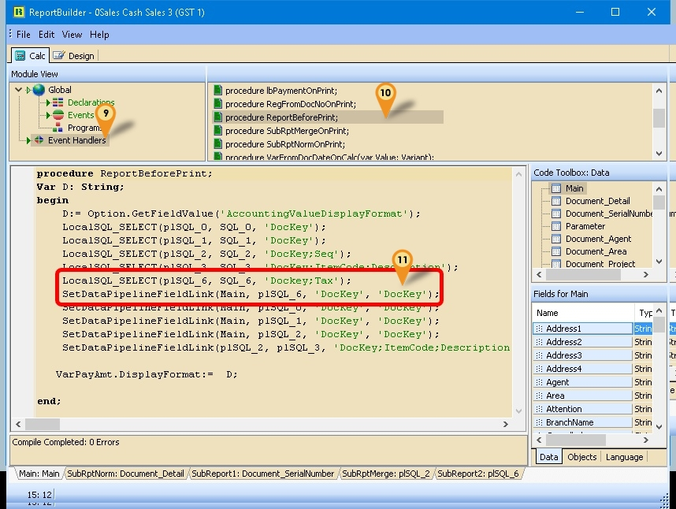

## Load Report Template

1. **Tools** > **Report Designer**

   

2. Press on **IMPORT**

   

3. Follow the steps below :

   1. Change the report type to **SQL Report(rtm)**

   2. Select your **Report**

   3. Press **OPEN**

   

## Simple Calculation

* In Report Builder, you can also do some simple calculation using the Variable (The Calculator Icon)


1. Click on SubRptNorm: Document_Detail
2. Select the Variable button (the Calculator icon)
3. Click on the place to be print/shown.
4. Click on Calc Tab

   

5. Right click here & Select Event & find the component just now we had placed (eg Variable2)
6. Click OnCalc
7. Click here & enter the script below:

   <details>
      <summary>Script</summary>

      ```pascal
      procedure Variable2OnCalc(var value: Variant);

      begin

      Variable2.DisplayFormat := Option.GetFieldValue('StockPriceDisplayFormat'); // Set Display Format

      Value := Document_Detail.GetFieldValue('Amount')/Document_Detail.GetFieldValue('Qty');

      end;
      ```

   </details>

8. Click File > Save As & enter New report Name after done

## Get Data Directly from DB

* Sometime in the report you might wanted some extra information but you not able to select in the report design. So you had to self query to get the extra information.

### Get Single Field

* Example 1 - Get Shelf Field from Maintain Item

  * Below is Example are doing following actions using Variable
  * At Sales Invoice, get the Shelf field from Maintain Item

   

1. Click on SubRptNorm: Document_Detail
2. Select the Variable button (the Calculator icon)
3. Click on the place to be print/shown.
4. Click on Calc Tab

   

5. Right click here & Select Event & find the component just now we had placed (eg Variable2)
6. Click OnCalc
7. Click here & enter the script below:

   <details>
      <summary>Script</summary>

      ```pascal
      procedure Variable2OnCalc(var value: Variant);

      var s: string;

      begin

      s := 'SELECT Shelf FROM ST_ITEM ' +

            'WHERE CODE=' + QuotedStr(Document_Detail.GetFieldValue('ItemCode'));

      Value := Trim(DBSQL_GetFieldValue(s));

      end;
      ```

   </details>

8. Click File > Save As & enter New report Name after done

### Example 2 - Get Picture Field from Maintain Item

Below is Example are doing following actions using Image

At Sales Invoice, get the Picture field from Maintain Item

* Steps

1. Click on SubRptNorm: Document_Detail
2. Select the Image button (the Mountain & sun icon)
3. Click on the place to be print/shown.
4. Click on Calc Tab
5. Right click here & Select Event & find the component just now we had placed (eg Image1)
6. Click OnPrint
7. Click here & enter the below script

   <details>
      <summary>Script</summary>

   ```pascal
   procedure Image1OnPrint;
   var s: string;
   begin
   s := 'SELECT Picture FROM ST_ITEM ' +
            'WHERE Code='+ QuotedStr(Document_Detail.GetFieldValue('ItemCode'));
   Image1.Visible := DBSQL_GetPicture(s, Image1.Picture);
   end;
   ```

   </details>

8. Click File > Save As & enter New report Name after done

### Example 3 - Get Document Created UserName from Audit

Below is Example is to Get the who created the Document from Audit Table.

* Steps

1. Select the Variable button (the Calculator icon)
2. Click on the place to be print/shown.
3. Click on Calc Tab
4. Right click here & Select Event & find the component just now we had placed (eg Variable2)
5. Click OnCalc
6. Click here & enter the below script:

   <details>
      <summary>Script</summary>

      ```pascal
      procedure Variable2OnCalc(var value: Variant);
      var s: string;
      begin
      s := 'SELECT UserName FROM AUDIT WHERE UPDATEKIND=''I'' ' +
            'AND REFERENCE LIKE ' +
            QuotedStr('%'+
            Main.GetFieldValue('DocNo')+
            '%Code: '+ //Delete this line for JV & CB
            Main.GetFieldValue('Code')+ //Delete this line for JV & CB
            ',%');
      Value := Trim(DBSQL_GetFieldValue(s));
      end;
      ```

   </details>

7. Click File > Save As & enter New report Name after done

### Example 4 - Get From Doc No. in Sales Invoice

Below is Example is to Get the From Document Number at Invoice Header.

* Steps

1. Select the Variable button (the Calculator icon)
2. Click on the place to be print/shown.
3. Click on Calc Tab
4. Right click here & Select Event & find the component just now we had placed (eg Variable2)
5. Click OnCalc
6. Click here & enter the below script

   <details>
      <summary>Script</summary>

      ```pascal
      procedure Variable2OnCalc(var value: Variant);
      var s, V : string;
      begin
      s := 'SELECT First 1 FromDocType FROM SL_IVDTL '+
            'WHERE Dockey=' + Main.GetFieldValue('Dockey') +
            ' AND FROMDOCTYPE IS NOT NULL';
      V := Trim(DBSQL_GetFieldValue(s));
      if Trim(V) \<> '' then begin
         s := 'SELECT DocNo FROM SL_' + v +
               ' WHERE DocKey=(SELECT First 1 FromDockey FROM SL_IVDTL '+
               'WHERE Dockey=' + Main.GetFieldValue('Dockey') +
               ' AND FROMDOCTYPE IS NOT NULL)';
         Value := Trim(DBSQL_GetFieldValue(s));
      end else
         Value := '';
      end;
      ```

   </details>

7. Click File > Save As & enter New report Name after done

## Get Whole Table

<details>
    <summary>Get Whole Table - click to expand</summary>

### Example 1 - Get Maintain Batch Information

Below is Example doing following actions

* Get data information From Stock Batch


1. Click on Calc Tab
2. Right click here & Select Module
3. Select Declarations
4. Select Variables
5. Add new/to existing as below variable

   ```pascal
   var
      SQL_Batch: String;
   ```

   

6. Select Events
7. Select OnCreate
8. Copy below script & paste to here

   ```pascal
   SQL_Batch := 'SELECT Code, Description, ExpDate, MfgDate, Remark1, Remark2 FROM ST_BATCH';
   DBSQL_SELECT(plSQL_Batch, SQL_Batch, 'Code');
   SetDataPipelineFieldLink(Document_Detail, plSQL_Batch, 'Batch', 'Code');
   ```

9. Click File > Save As... to save the file (eg Sales Invoice 1)
10. Click File > Exit to exit the report design
11. Click Design again in the report designer for the file just save on Steps 9 (eg Sales Invoice 1)

      

12. Click SubRptNorm:Document_Detail tab
13. Click DBText icon
14. Click the place you wanted to show/print
15. Select plSQL_Batch pipeline
16. Type ExpDate (eg to get expired Date)
17. Save the report

### Example 2 - Row Number Query

Below is Example Create SEQ Field base on SQL

* Steps

1. Click on Calc Tab
2. Right click here & Select Module
3. Select Declarations
4. Select Variables
5. Add new/to existing as below variable

   ```pascal
   var
      **SQL_1: String;
   ```

6. Select Events
7. Select OnCreate
8. Copy below script & paste to here

   ```pascal
   SQL_1 := 'SELECT DOCKEY, DTLKEY, SEQ, ROW_NUMBER() OVER (PARTITION BY DOCKEY ORDER BY SEQ) AS NSEQ '+
      'FROM SL_IVDTL ' +
      'WHERE NOT (DESCRIPTION LIKE ''R-%'' ' +
      'OR DESCRIPTION LIKE ''T-%'') '+
      'AND DOCKEY IN (SELECT DOCKEY FROM SL_IV '+
      '               WHERE DOCDATE BETWEEN ' + FormatSQLDate(Parameter.GetFieldValue('DateFrom')) +
      '               AND ' + FormatSQLDate(Parameter.GetFieldValue('DateTo')) +
      ') ORDER BY DocKey, NSeq';
   DBSQL_SELECT(plSQL_1, SQL_1, 'Dockey;NSeq');
   SetDataPipelineFieldLink(Document_Detail, plSQL_1, 'Dockey;Seq', 'Dockey;Seq');
   ```

   

9. Select Programs
10. Right Click > New Function
11. Copy Function Script

      ``` pascal
      function FormatSQLDate(D: TDateTime): String;
         var AFormat: string;
         begin
         AFormat := 'dd mmm yyyy'; //'dd/mmm/yyyy' if can't
         Result := QuotedStr(FormatDateTime(AFormat, D));
      end;
      ```

12. Click File > Save As... to save the file (eg Sales Invoice 1)
13. Click File > Exit to exit the report design
14. Click Design again in the report designer for the file just save on Steps 12 (eg Sales Invoice 3 (SubTotal)-New)
15. Click SubRptNorm:Document_Detail tab
16. Click DBText icon
17. Click the place you wanted to show/print
18. Select plSQL_1pipeline
19. Type NSeq
20. Save the report

:::warning
Preview/Print/Export will delay/slow a bit if compare with build in Preview/Print/Export report
:::

</details>

## Get Data from Available Pipeline

Sometime in the report you might wanted some extra information or further analysis from the report itself but you not able to select in the report design. So you had to self query to get the extra information or further analysis.

### Example 1 - Show GST Summary at Last Page

Below is Example doing following actions

* Get data information (Tax, Tax rate, LocalAmount, LocalTaxAmt)
* Group the data by Tax code


1. Click on Calc Tab
2. Right click here & Select Module
3. Select Declarations
4. Select Variables
5. Add new/to existing as below variable

   ```pascal
   var
      SQL_6: String;
   ```

   

6. Select Events
7. Select OnCreate
8. Copy below script & paste to here

   <details>
      <summary>Script</summary>

      ```sql
      SQL_6 := 'SELECT DocKey,  Tax, TaxRate, Sum(LocalAmount) LocalAmount, Sum(LocalTaxAmt) localTaxAmt, '+ 

      'Description  FROM Document_Detail ' +

      'Where Tax \<> ''''' +

      'GROUP BY Dockey, Tax, TaxRate';
      ```

   </details>

   

9. Select Event Handlers
10. Select procedure ReportBeforePrint
11. Copy below script & paste to here

      <details>
         <summary>Script</summary>

      ```sql
      LocalSQL_SELECT(plSQL_6, SQL_6, 'Dockey;Tax'); //Create New pipeline

         SetDataPipelineFieldLink(Main, plSQL_6, 'DocKey', 'DocKey'); //Link with Main
      ```

      </details>

12. Click File > Save As... to save the file (eg 0Sales Cash Sales 3 (GST 1))
13. Click File > Exit to exit the report design
14. Click Design again in the report designer for the file just save on Steps 12 (eg 0Sales Cash Sales 3 (GST 1))

      

15. Click Subreport icon
16. Click the place you wanted to show/print

      

17. Right click the Sub report
18. Untick the ParentWitdh & manual adjust the sub report width to the width you wanted
19. Select the Pipeline just create (eg plSQL_6)
20. Scroll till end
21. Click SubReport2:plSQL_6 tab

      

22. Click Report & set the following setting

      * Title - Select
      * Summary - Select
      * Header - UnSelect
      * Footer - UnSelect

      

23. Click DBText icon
24. Click the place you wanted to show/print (in between Title & Detail Band)
25. Select LocalAmount field
26. Repeat Step 23 to 25 for LocalTaxAmt field
27. Click DBCalc icon
28. Click the place you wanted to show/print (in between Detail & Summary Band)
29. Select LocalAmount field (See Step 25)
30. Repeat Step 27 to 29 for LocalTaxAmt field
31. Click Variable icon
32. Click the place you wanted to show/print (in between Title & Detail Band)
33. Right Click the variable

      

34. Copy below script & paste to here

      <details>
      <summary>Script</summary>

      ```sql
      if Trim(plsql_6.getfieldvalue('TaxRate')) \<> '' then

         Value := plsql_6.getfieldvalue('Tax') + ' @ ' + plsql_6.getfieldvalue('TaxRate') else

         Value := plsql_6.getfieldvalue('Tax');
      ```

      </details>

35. Click Ok
36. For label can Click Label icon
37. Save the report after done

### Example 2 - Show 1st FromDocNo at Header

Below is Example will get FromDocNo Field from the Detail Data

1. Click on Calc Tab
2. Right click here & Select Module
3. Select Declarations
4. Select Variables
5. Add new/to existing as below variable

      ```sql
      var
         SQL_6: String;
      ```

6. Select Events
7. Select OnCreate
8. Copy below script & paste to here

      ```sql
      SQL_6 := 'SELECT Dockey, Min(Seq) Seq, FromDocDate, FromDocNo FROM Document_Detail '+
               'WHERE FromDocType \<> ''''  ';
      ```

9. Select Event Handlers
10. Select procedure ReportBeforePrint
11. Copy below script & paste to here

      ```sql
      LocalSQL_SELECT(plSQL_6, SQL_6, 'Dockey'); //Create New pipeline
         SetDataPipelineFieldLink(Main, plSQL_6, 'DocKey', 'DocKey'); //Link with Main
      ```

12. Click File > Save As... to save the file (eg 0Sales Cash Sales 3 (GST 1))
13. Click File > Exit to exit the report design
14. Click Design again in the report designer for the file just save on Steps 12 (eg 0Sales Cash Sales 3 (GST 1))
15. Click DBText icon
16. Click the place you wanted to show/print at the Header
17. Select FromDocNo field
18. For label can Click Label icon
19. Save the report after done

### Example 3 - Show Total SVE at Footer

Below Example is to Get total SVE for 6%

1. Click on Calc Tab
2. Right click here & Select Module
3. Select Declarations
4. Select Variables
5. Add new/to existing as below variable

   ```sql
   var
      SQL_6: String;
   ```

6. Select Events
7. Select OnCreate
8. Copy below script & paste to here

   ```sql
   SQL_6 := 'SELECT DocKey, SUM(LocalAmount)*0.06 SVE FROM Document_Detail ' +
            'WHERE Tax=''SVE'' ' +
            'GROUP BY DocKey';
   ```

9. Select Event Handlers
10. Select procedure ReportBeforePrint
11. Copy below script & paste to here

      ```sql
      LocalSQL_SELECT(plSQL_6, SQL_6, 'Dockey'); //Create New pipeline
         SetDataPipelineFieldLink(Main, plSQL_6, 'DocKey', 'DocKey'); //Link with Main
      ```

12. Click File > Save As... to save the file (eg Sales Invoice 1-New)
13. Click File > Exit to exit the report design
14. Click Design again in the report designer for the file just save on Steps 12 (eg Sales Invoice 1-New)
15. Click DBText icon
16. Click the place you wanted to show/print at the Header

       

17. Select plSQL_6 pipeline
18. Select SVE field
19. For label can Click Label icon
20. Save the report after done
