Use this guide to configure POS settings, payment methods, terminals, and masterdata export for X-Pos.

:::info[What is MasterData]
In X-Pos, masterdata is the setup data sent from SQL Account to a POS terminal so it can operate correctly.

It includes items, prices, payment methods, POS settings, customer and stock/location information. Synchronizing masterdata updates the terminal with the latest configuration; downloading masterdata creates a ZIP file for manual transfer.
:::

## Maintain POS Settings

Use **Maintain POS Settings** to create and manage POS configuration profiles. Each profile controls posting, payment, POS screen, customer display, receipt printer, and counter-closing behaviour.

### Access Maintain POS Settings

1. From the main menu, go to **POS**.
2. Click **Maintain POS Settings...**.
3. Open an existing profile to edit it, or click **New** to create a profile.

The browse screen displays the profile code, description, and active status. The default profile uses code `----`, which cannot be changed.

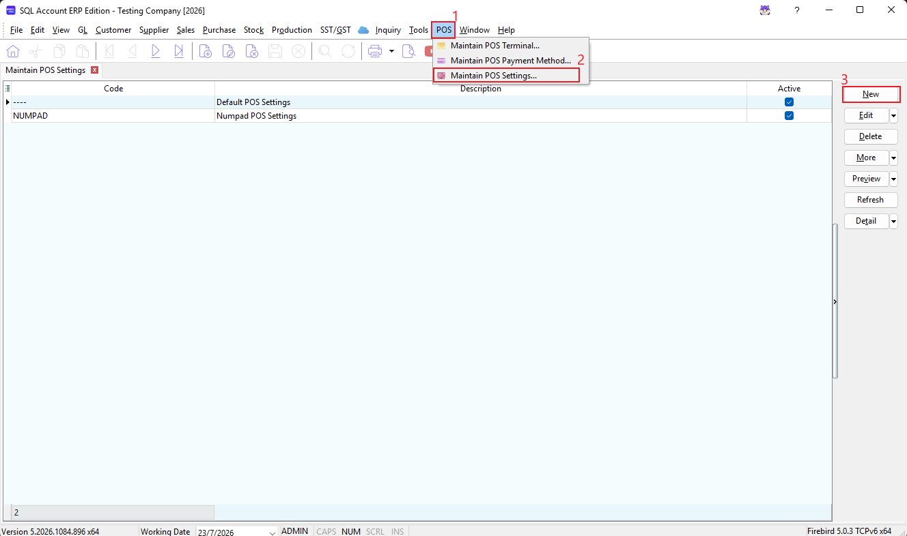

### Create or Edit a Profile

1. Enter a short **Code** for a new profile, such as `NUMPAD` or `RETAIL`.
2. Enter a meaningful **Description**.
3. Select **Active** when the profile is ready for use.
4. Configure the options in the settings grid.
5. Click **Save** to save the profile and its settings.

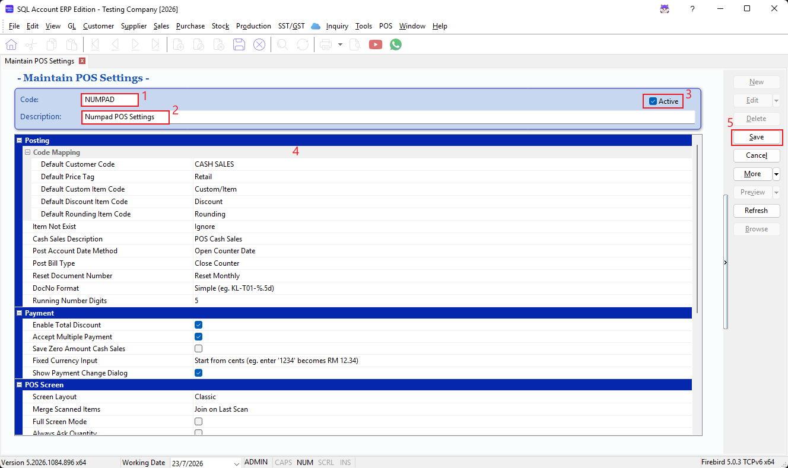

### Posting

#### Code Mapping

| Setting | Description |
| --- | --- |
| **Default Customer Code** | Customer code used for POS cash sales when no customer is selected. |
| **Default Price Tag** | Price tag used as the default selling price source. |
| **Default Custom Item Code** | Item code used when a cashier enters a custom or non-catalogue item. |
| **Default Discount Item Code** | Item code used to post POS discounts. |
| **Default Rounding Item Code** | Item code used to post rounding differences. |

#### Posting Behaviour

| Setting | Description |
| --- | --- |
| **Item Not Exist** | Choose whether an unknown scanned item is ignored or posted using the default custom item code. |
| **Cash Sales Description** | Description used for POS cash-sales documents. |
| **Post Account Date Method** | Select whether transactions are posted using the counter opening date or counter closing date. |
| **Post Bill Type** | Controls when bills are posted. The available method now is only **Close Counter**. |
| **Reset Document Number** | Select whether document numbers are <br/> 1. Never reset <br/> 2. Reset monthly <br/> 3. Reset yearly |
| **DocNo Format** | Select a document-number format. <br/> 1. Simple <br/> 2. Daily <br/> 3. Monthly <br/> 4. Yearly <br/> 5. Full date-and-time  |
| **Running Number Digits** | Enter the number of digits for the running number. The default is `5`. |

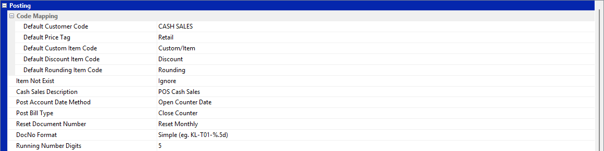

### Payment

| Setting | Description |
| --- | --- |
| **Enable Total Discount** | Allows a discount to be applied to the total bill. |
| **Accept Multiple Payment** | Allows a sale to be settled using more than one payment method. |
| **Save Zero Amount Cash Sales** | Saves cash-sales documents with a zero amount. |
| **Fixed Currency Input** | Sets currency input to two implied decimal places or zero implied decimal places. |
| **Show Payment Change Dialog** | Displays the change-due dialog after payment. |

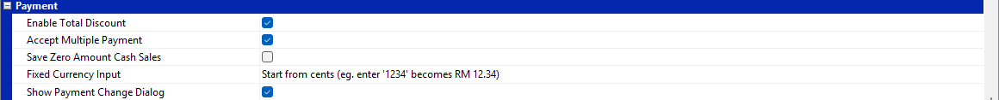

### POS Screen

| Setting | Description |
| --- | --- |
| **Screen Layout** | Select <br/> 1. Classic <br/> 2. Numpad <br/> 3. Catalogue <br/> 4. Simple Touch <br/> 5. Touch |
| **Merge Scanned Items** | Select whether repeated scans <br/> 1. Join the last line <br/> 2. Always join an existing line <br/> 3. Never join lines |
| **Full Screen Mode** | Opens POS in full-screen mode. |
| **Always Ask Quantity** | Prompts the cashier to enter a quantity during item entry. |
| **Always Ask Price on Zero Price Item** | Prompts for a price when a scanned item has a zero price. |
| **Always Ask Batch Selection** | Prompts the cashier to select a batch. |
| **After Quantity Change Always Reset Price** | Restores the item price after the quantity is changed. |
| **After Quantity Change Always Reset Discount** | Restores the item discount after the quantity is changed. |

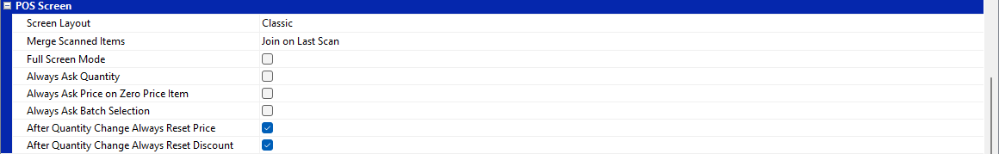

### Customer Display

Set the customer-facing display **Title**, **Background Color**, **Font Color**, and **Font Size** to match the outlet's display device and branding.

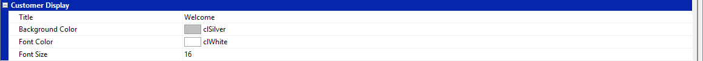

### Receipt Printer

| Setting | Description |
| --- | --- |
| **Auto Print Receipt** | Prints the receipt automatically after a sale. |
| **Cut Receipt Paper** | Sends the cut-paper instruction to a compatible receipt printer. |

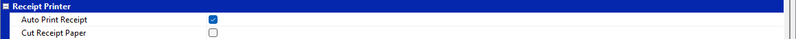

### Other

| Setting | Description |
| --- | --- |
| **Close Counter with Password** | Requires a password when closing a counter. |
| **Undo Counter Close Timeout (mins)** | Sets the period, from 1 to 60 minutes, during which a closed counter can be undone. |

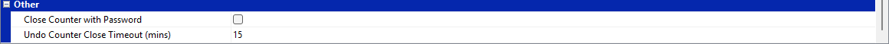

:::info[Settings Checklist]
- Complete the customer, item, discount, and rounding code mappings before processing sales.
- Choose a document-number reset rule and format that meet the outlet's audit and reporting requirements before the first live sale.
- Test the receipt printer before enabling **Cut Receipt Paper**, as this command depends on printer support.
- Restrict counter-close access and set a suitable undo timeout for the outlet's cash-control process.
:::

## Maintain POS Payment Method

Use **Maintain POS Payment Method** to configure the payment buttons available at the POS counter and map each payment type to the relevant SQL Account payment method.

### Access Maintain POS Payment Method

1. From the main menu, go to **POS**.
2. Click **Maintain POS Payment Method...**.
3. Click **New** to add a payment method, or open an existing record to edit it.

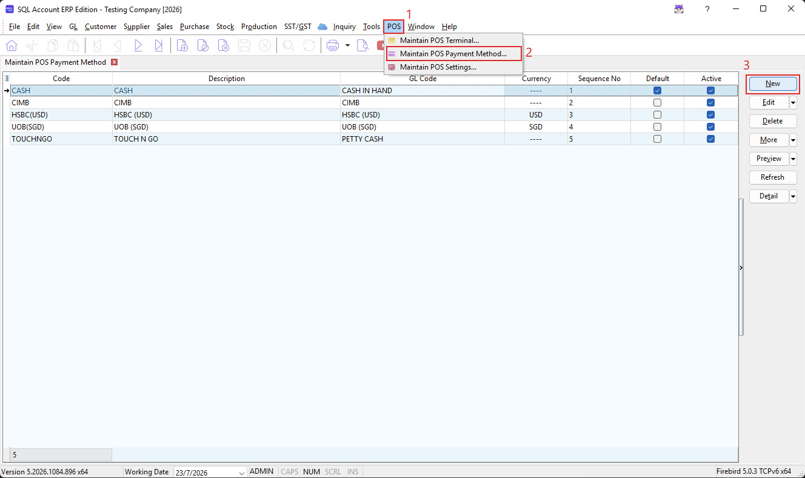

### Create a Payment Method

| Field | Description |
| --- | --- |
| **Code** | Enter a short, unique payment code, such as `CASH`, `VISA`, or `EWALLET`. |
| **Description** | Enter the payment method name to display to users, such as `Cash` or `Touch 'n Go`. |
| **GL Code** | Select the related SQL Account payment method or GL account. POS transactions made with this method are posted to the selected account. |
| **Default** | Select this option to make the payment method the default at checkout. Only one payment method should normally be used as the default. |
| **Active** | Select this option to make the payment method available at the POS counter. Clear it to keep the setup but prevent it from being used for new sales. |

### POS Payment Options

| Field | Description |
| --- | --- |
| **Type** | Select the payment category: <br /> 1. Cash <br /> 2. Bank <br /> 3. Card <br /> 4. E-Wallet |
| **Currency** | Select the payment currency. For foreign-currency payments, select the applicable currency; the displayed rate uses the current selling rate. |
| **Sequence No** | Controls the payment method display order. Use consecutive numbers, such as `1`, `2`, and `3`. |
| **Rounding** | Select **No rounding** or **5 cents rounding**. Use 5-cent rounding only when required for cash payments. |
| **Print Receipt (pcs)** | Enter the number of receipt copies to print. A maximum of three copies is allowed. |
| **Must Fill Ref. No** | Requires the cashier to enter a reference number before completing payment. This is useful for card, bank transfer, and e-wallet payments. |
| **Kick Drawer** | Opens the cash drawer when this payment method is used. This option should normally be enabled only for cash payments. |
| **Picture** | Optionally add an image or logo for the payment method. |

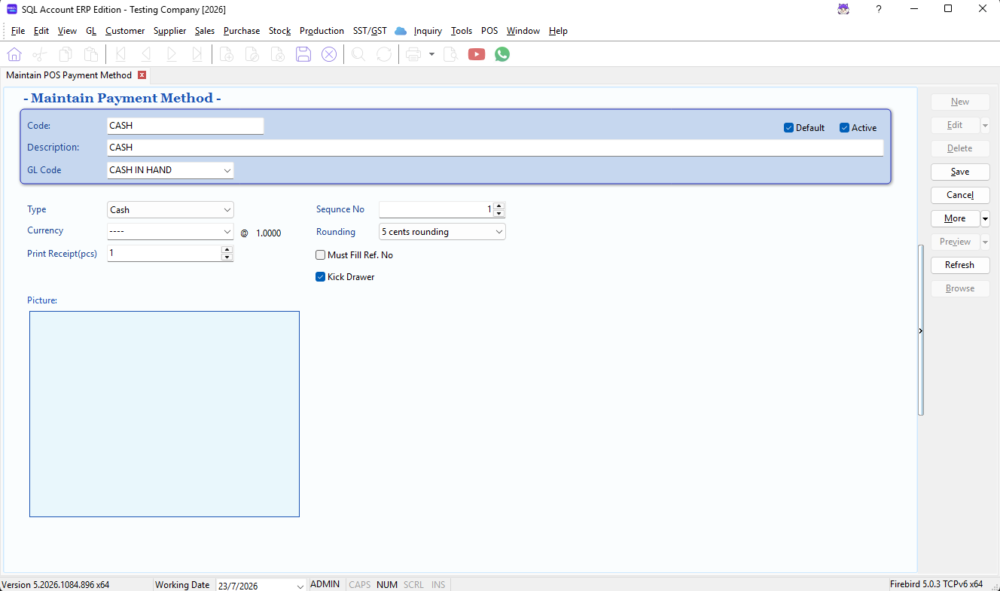

Click **Save** to save the payment method.

### Example Setup

| Payment Method | Type | GL Code | Suggested Setup |
| --- | --- | --- | --- |
| Cash | Cash | Cash-on-hand payment method | Set as active and default, assign sequence number `1`, and enable **Kick Drawer**. Enable 5-cent rounding only if applicable. |
| Card terminal | Card | Card or bank clearing payment method | Set as active, require a reference number, assign sequence number `2`, and leave **Kick Drawer** cleared. |
| E-wallet | E-Wallet | E-wallet clearing payment method | Set as active and assign sequence number `3`. Require a reference number when it is needed for reconciliation. |

:::info[Payment Method Checklist]
- Ensure every POS payment method is mapped to the correct **GL Code** before processing live sales.
- Keep only payment methods intended for cashier use marked as **Active**.
- Use **Sequence No** to place frequently used payment methods first.
- Test each payment method with a small transaction to verify the posting account, reference-number requirement, receipt copies, and cash-drawer behaviour.
:::

## Maintain POS Terminal

Use **Maintain POS Terminal** to register each POS device, assign its outlet location and POS settings profile, bind its API user, and synchronize its masterdata.

### Access Maintain POS Terminal

1. From the main menu, go to **POS**.
2. Click **Maintain POS Terminal...**.
3. Click **New** to create a terminal, or open an existing terminal to edit it.

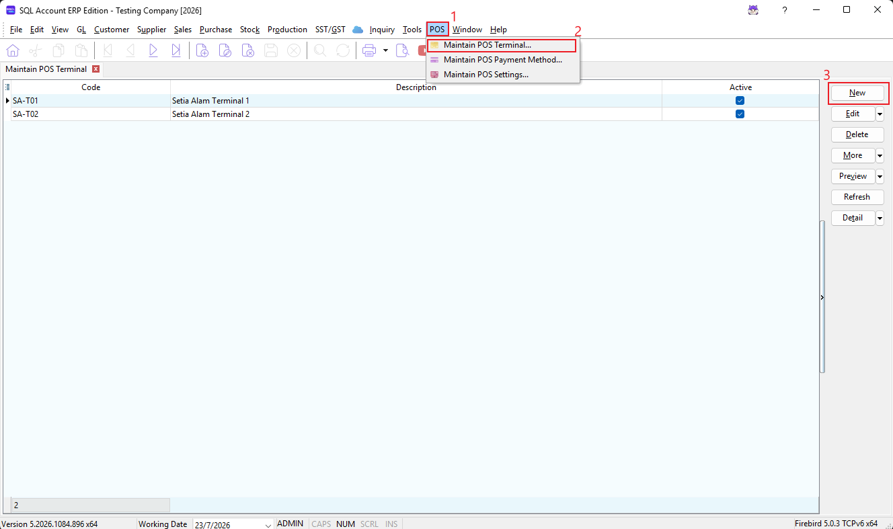

### Create a Terminal

| Field | Description |
| --- | --- |
| **Code** | Enter a unique terminal identifier, such as `COUNTER01`. Keep the code short and unchanged because it is used for terminal binding and masterdata export. |
| **Description** | Enter a clear device or counter name, such as `Main Counter`. |
| **Location** | Select the stock or outlet location served by this POS terminal. |
| **Settings** | Select the POS settings profile to apply to this terminal. Create the profile first in the [Maintain POS Settings](#maintain-pos-settings) section. |
| **Bind API User** | Displays the user account associated with the terminal for API use and masterdata synchronization. |
| **Active** | Makes the terminal available for operation and online masterdata synchronization. |
| **Last Sync** | Displays the date and time of the latest masterdata synchronization. |

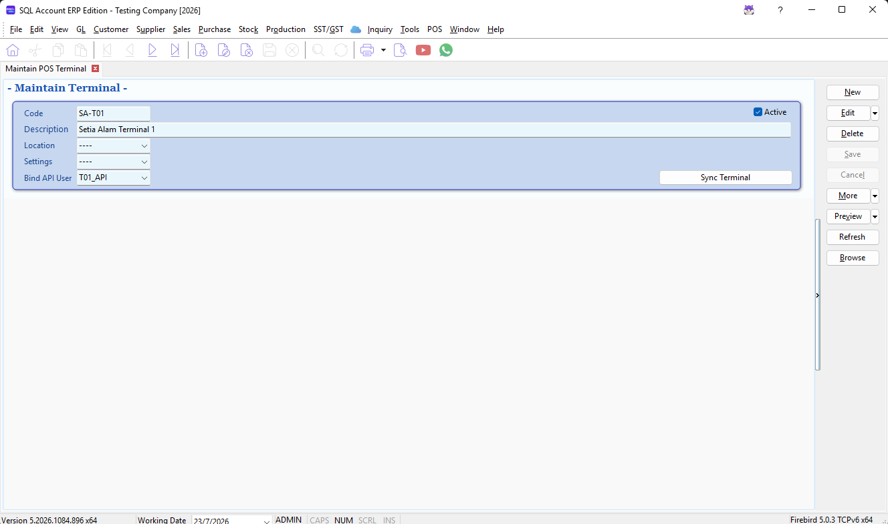

### Recommended Setup Order

1. Create the required POS payment methods.
2. Create and test the POS settings profile.
3. Create the terminal and assign its **Location** and **Settings** profile.
4. Select **Active** and save the terminal.
5. Bind an API user.
6. Synchronize masterdata before using the terminal.

### Bind an API User

With the saved terminal open, use **Bind API User** when no user is currently bound. The system creates or reuses a dedicated API user based on the terminal code and binds it to the terminal:

```text
<TERMINAL_CODE>_API
```

For example, terminal `COUNTER01` is bound to `COUNTER01_API`. The binding action also creates an API secret key if the user does not already have one.

:::warning
Do not use the system `ADMIN` account as the terminal API user.
:::

If the API user cannot be created, confirm that the application API host is configured and that your user has permission to maintain system users.

[How to setup SQL Account API](/integration/sql-account-api/setup-configuration)

### Sync Terminal

Click **Sync Terminal** on a saved terminal to access the following actions.

| Action | Description |
| --- | --- |
| **Sync** | Creates the masterdata package and uploads it to the POS masterdata service. A terminal UUID is created if one does not already exist. |
| **Download** | Creates the masterdata package locally and lets you choose a folder in which to save the ZIP file. Use this option for manual transfer or troubleshooting. |
| **Unbind** | Removes the terminal UUID binding. Use this only when the terminal must be connected as a new device. |

The terminal must be **Active** before online synchronization is available. Save or cancel any changes before starting a sync.

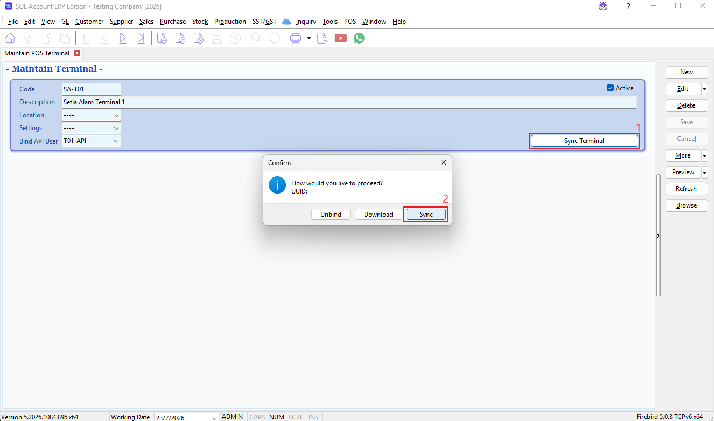

### Before Deploying the Device

- Confirm that the terminal has the correct **Location** and **Settings** profile.
- Confirm that the selected profile includes the required customer, item, discount, and rounding mappings.
- Bind a dedicated API user. Do not share a terminal identity between devices.
- Run a masterdata sync and record the generated PIN if the sync displays one.
- Complete a test sale on the POS device and verify its payment and accounting behaviour.

## Export POS masterdata

Export POS masterdata to prepare an X-Pos terminal with the required master data and configuration. You can upload the masterdata directly to the POS masterdata service or download it as a ZIP file for manual transfer.

### Before You Begin

1. Create the terminal in the [Maintain POS Terminal](#maintain-pos-terminal) section.
2. Assign its **Location** and **Settings** profile.
3. Select **Active** and save the terminal.
4. Ensure that the required POS settings, payment methods, items, customers, and stock or location information have been maintained.
5. Skip **Step 1** below if Bind API User in Maintain POS Terminal setup correctly.

### Step 1: Create and Bind the API User

1. Go to **POS** > **Maintain POS Terminal...**.
2. Open the required terminal.
3. Run **Bind API User** while the **Bind API User** field is empty.
4. Save the terminal if prompted.

The system creates or reuses a dedicated API user in the following format:

```text
<TERMINAL_CODE>_API
```

For example, terminal `COUNTER01` uses `COUNTER01_API`. The system binds the user to the terminal and generates an API secret key when one does not already exist.

:::warning
Do not bind the `ADMIN` user. If the system reports that the API application is not configured, configure the application API host before trying again.
:::


### Step 2: Sync masterdata for One Terminal

1. Open the terminal record.
2. Ensure that the terminal is saved, active, and not in edit mode.
3. Click **Sync Terminal**.
4. Click **Sync**.
5. Wait for the upload confirmation.

During the first successful export, the system assigns a UUID to the terminal. Later exports will update the **Last Sync** time.

If the service returns a PIN, record it immediately. The application displays the PIN and copies it to the clipboard for use when pairing or setting up the terminal.


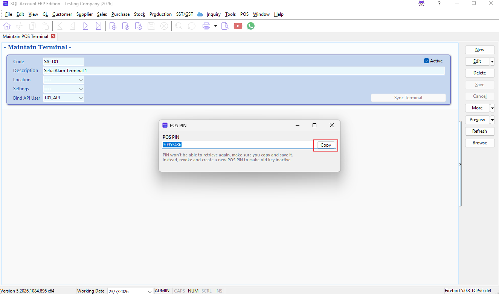

:::warning
The PIN cannot be retrieved again. If it is lost, revoke the current terminal binding and synchronize again to create a new PIN.
:::

### Step 3: Download masterdata for Manual Transfer

Use this option when the masterdata needs to be transferred manually instead of uploaded online.

1. Open the terminal record.
2. Click **Sync Terminal**.
3. Click **Download**.
4. Choose a destination folder.
5. Keep the generated ZIP file intact and transfer it using your approved deployment method.

The download process also creates a UUID when needed and updates the terminal's **Last Sync** time after the file is saved.

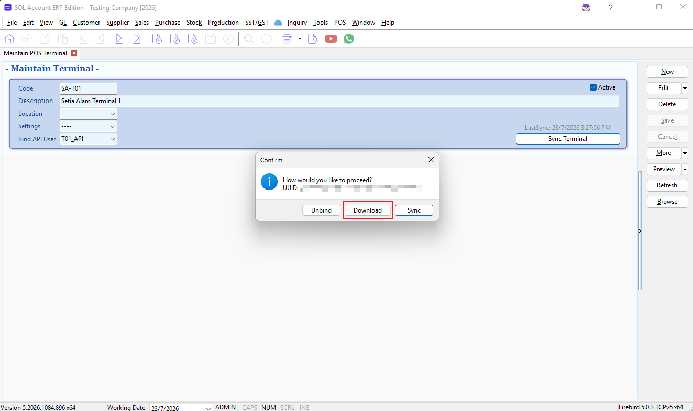

### Export masterdata for Multiple Terminals

From the terminal browse screen, click **More** > **Export Data**.

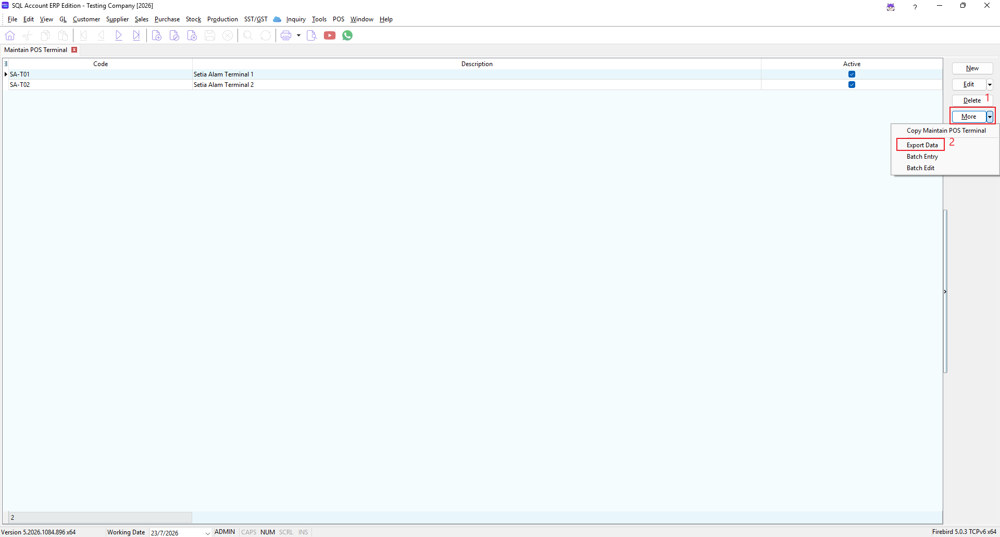

1. Select one or more terminals in the export list.
2. Click **Export**.
3. Review the completion message for the number of successful uploads and any failed terminal codes.

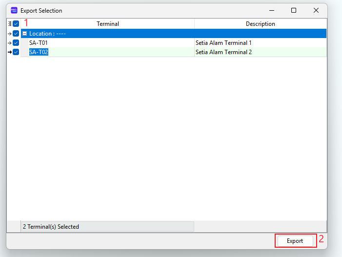

Only terminals that already have a UUID binding are shown in the multi-terminal export list.

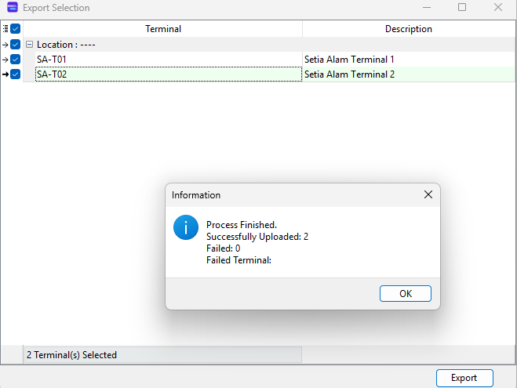

### Reset a Terminal Binding

Use this procedure only when the terminal must be connected as a new device.

1. Open the terminal record.
2. Click **Sync Terminal**.
3. Click **Unbind** and confirm the prompt.
4. Click **Sync** again to establish a new binding.

Unbinding clears the terminal UUID. It is not required for a normal masterdata refresh.

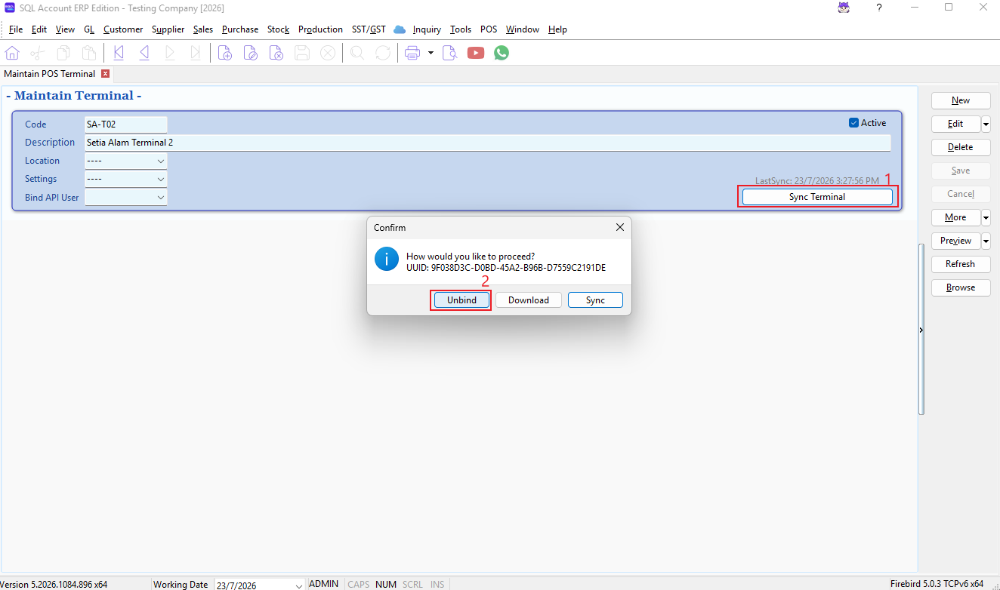

### Troubleshooting

| Issue | Action |
| --- | --- |
| Export cannot start | Save or cancel changes first. Export is unavailable while the terminal is in edit or insert mode. |
| Sync is disabled | Confirm that the terminal exists, is saved, and is **Active**. |
| Token or upload error | Check the API and service configuration, confirm internet connectivity, then try again. |
| Time lookup error | Check DNS and network connectivity, then try again when a trusted current time can be obtained. |
| Terminal masterdata is out of date | Verify the terminal location and settings assignment, save changes, then run **Sync** again. |
| A terminal is missing from batch export | Synchronize the terminal once individually to create its UUID binding, then reopen the batch export list. |
