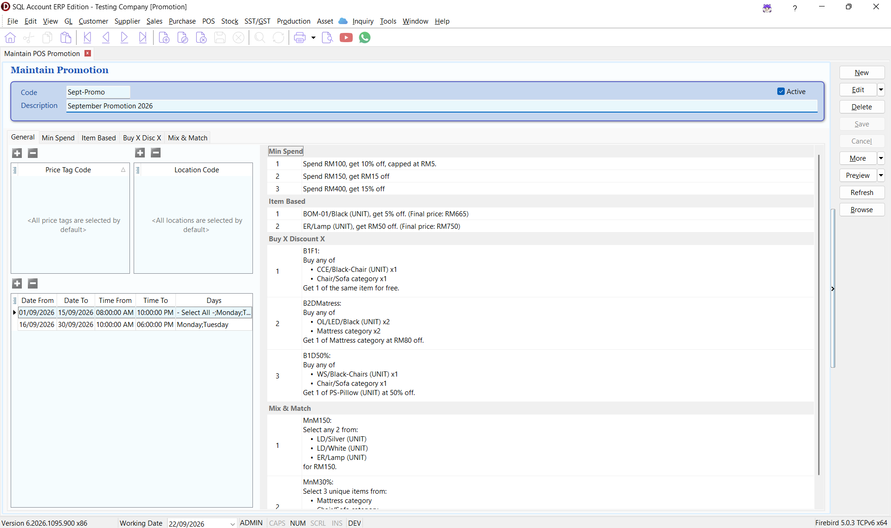
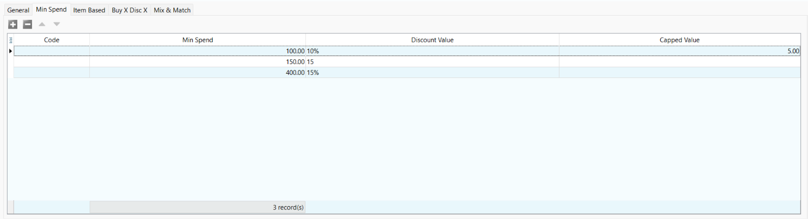
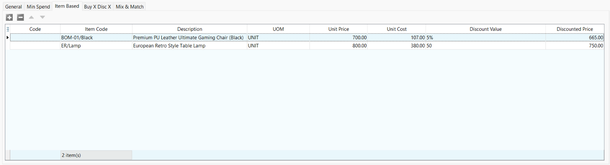
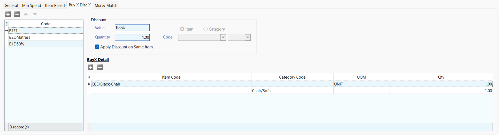
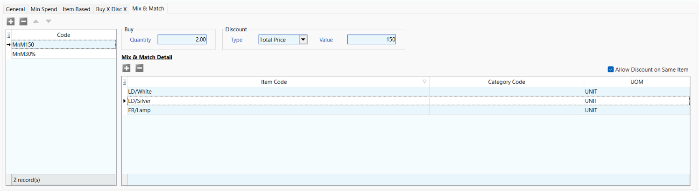

# Maintain Promotion

Use **Maintain POS Promotion** to configure discounts and special offers for X-Pos. A promotion can be limited by price tag, location, date, time, and day of the week.

## Promotion Types

| Type | Description | Example |
| --- | --- | --- |
| [Minimum Spend](#minimum-spend) | Applies a discount when the bill reaches a specified amount. | Spend RM100 and receive 10% off, capped at RM5. |
| [Item Based](#item-based) | Applies a discount to selected items. | Receive 5% off a selected item. |
| [Buy X Discount X](#buy-x-discount-x) | Applies a discount after the customer buys the required items or quantities. | Buy an eligible item and receive another unit free. |
| [Mix & Match](#mix--match) | Applies a promotional price or discount when the customer buys a qualifying combination of items. | Select any two eligible items for RM150. |

## Create a Promotion

1. From the main menu, go to **POS**.
2. Open **Maintain POS Promotion**.
3. Click **New**.
4. Enter a unique **Code** and a meaningful **Description**.
5. Select **Active** to make the promotion available for use.
6. Configure the price tags, locations, schedule, and promotion rules.
7. Review the promotion summary on the **General** tab.
8. Click **Save**.

## General Settings

The **General** tab controls where and when the promotion is available. It also displays a summary of all rules configured for the promotion.

### Price Tags and Locations

Use the **Price Tag Code** and **Location Code** sections to restrict the promotion.

| Setting | Description |
| --- | --- |
| **Price Tag Code** | Specifies the price tags that can use the promotion. If no price tag is added, all price tags are selected by default. |
| **Location Code** | Specifies the locations where the promotion is available. If no location is added, all locations are selected by default. |

### Promotion Schedule

Add one or more schedule rows to control when the promotion is active.

| Field | Description |
| --- | --- |
| **Date From** | First date on which the promotion is active. |
| **Date To** | Last date on which the promotion is active. |
| **Time From** | Time at which the promotion starts. |
| **Time To** | Time at which the promotion ends. |
| **Days** | Days of the week on which the promotion applies. |

:::tip
Use separate schedule rows when a promotion has different operating periods, such as weekday and weekend hours.
:::

### Promotion Overview

The right side of the **General** tab summarizes the rules entered under **Min Spend**, **Item Based**, **Buy X Disc X**, and **Mix & Match**. Review this summary before saving the promotion.

## Minimum Spend

Use **Min Spend** to apply a discount when the bill reaches a specified amount.

| Field | Description |
| --- | --- |
| **Code** | Optional code used to identify the promotion rule. If left blank, the rule can still be saved and applied. |
| **Min Spend** | Minimum bill amount required to qualify for the promotion. |
| **Discount Value** | Discount applied after the minimum spend is reached. Enter a percentage with `%`, or enter a value for a fixed discount. |
| **Capped Value** | Optional maximum discount amount for a percentage-based promotion. |

### Configure a Minimum Spend Promotion

1. Open the **Min Spend** tab.
2. Click the add button to create a minimum-spend rule.
3. Enter the qualifying bill amount under **Min Spend**.
4. Enter the **Discount Value**:
   - Include `%` to apply a percentage discount, such as `10%`; or
   - Enter a number without `%` to apply a fixed discount, such as `15`.
5. If using a percentage discount, enter a **Capped Value** to limit the maximum discount amount. Leave it blank if no limit is required.
6. Add more rows if the promotion has multiple spending tiers.

For example, enter `100` under **Min Spend**, `10%` under **Discount Value**, and `5` under **Capped Value** to give customers 10% off when they spend RM100, with the discount capped at RM5.

## Item Based

Use **Item Based** to apply a discount directly to selected items.

| Field | Description |
| --- | --- |
| **Code** | Optional code used to identify the promotion rule. If left blank, the rule can still be saved and applied. |
| **Item Code** | Item that receives the discount. |
| **Description** | Description of the selected item. This field is filled automatically. |
| **UOM** | Unit of measurement to which the promotion applies. |
| **Unit Price** | Current selling price of the selected item. This field is filled automatically. |
| **Unit Cost** | Current cost of the selected item, filled automatically and shown for reference. |
| **Discount Value** | Percentage or fixed discount applied to the item. |
| **Discounted Price** | Final unit price after the discount is applied. |

### Configure an Item-Based Promotion

1. Open the **Item Based** tab.
2. Click the add button.
3. Select the **Item Code** and **UOM**.
4. Enter the **Discount Value**.
5. Confirm the calculated **Discounted Price**.
6. Repeat the steps for any additional items.

For example, entering `5%` for an item priced at RM700 produces a discounted price of RM665.

## Buy X Discount X

Use **Buy X Disc X** to define the items a customer must buy and the discount they receive.

### Discount Settings

| Field | Description |
| --- | --- |
| **Code** | Unique code used to identify the promotion rule. |
| **Value** | Percentage or fixed discount applied when the rule is satisfied. |
| **Quantity** | Quantity that receives the discount. |
| **Item / Category** | Determines whether the discount applies to a selected item or item category. |
| **Apply Discount on Same Item** | Applies the discount to the qualifying item when selected. |

### Buy X Detail

Use the **Buy X Detail** section to define the qualifying items or categories.

| Field | Description |
| --- | --- |
| **Item Code** | Specific item that counts towards the required purchase. |
| **Category Code** | Item category that counts towards the required purchase. |
| **UOM** | Unit of measurement for the qualifying item. |
| **Qty** | Quantity the customer must buy. |

### Configure a Buy X Discount X Promotion

1. Open the **Buy X Disc X** tab.
2. Add a rule and enter its **Code**.
3. Enter the discount **Value** and discounted **Quantity**.
4. Choose where the discount applies:
   - Select **Apply Discount on Same Item** to discount the qualifying item; or
   - Clear **Apply Discount on Same Item**, select **Item** or **Category**, and then choose the item or category that receives the discount.
5. Under **Buy X Detail**, add the qualifying items or categories and their required quantities.

## Mix & Match

Use **Mix & Match** to create a promotion from a group of eligible items or categories.

| Field | Description |
| --- | --- |
| **Code** | Unique code used to identify the Mix & Match rule. |
| **Buy Quantity** | Number of eligible items required to qualify. |
| **Discount Type** | Select a calculation method:   **Total Price** — Sets a fixed combined price for the qualifying items.   **Percentage (%)** — Applies a percentage discount to the qualifying items. |
| **Value** | Promotional price or discount value, depending on the selected discount type. |
| **Allow Discount on Same Item** | Allows repeated units of the same eligible item to satisfy the promotion. |

### Mix & Match Detail

Add the items or categories that can be included in the promotion.

| Field | Description |
| --- | --- |
| **Item Code** | Specific item included in the promotion. |
| **Category Code** | Item category included in the promotion. |
| **UOM** | Unit of measurement for the eligible item. |

### Configure a Mix & Match Promotion

1. Open the **Mix & Match** tab.
2. Add a rule and enter its **Code**.
3. Enter the required **Buy Quantity**.
4. Select the **Discount Type** and enter its **Value**.
5. Add the eligible items or categories under **Mix & Match Detail**.
6. Select **Allow Discount on Same Item** if multiple units of one eligible item may satisfy the required quantity.

For example, set **Buy Quantity** to `2`, select **Total Price**, and enter `150` to let customers choose two eligible items for RM150.

## Before Using the Promotion

- Ensure the promotion is marked **Active**.
- Confirm that its date, time, and selected days are correct.
- Check whether it should apply to all or only selected price tags and locations.
- Review the promotion summary on the **General** tab.
- Test the promotion with a sample transaction before using it for live sales.