Create and design X-Pos report templates in SQL Account. When a terminal synchronizes, the latest templates are automatically sent to X-Pos as part of its metadata.

## Preview Report Templates

The print sections in SQL Account let you preview how each report will appear in X-Pos Terminal.

Enter sample values into the available datasets to create a mock transaction, then preview the report. These values are used only to test the report layout and do not create actual transactions.

After confirming the report design, synchronize the terminal metadata to send the latest template to X-Pos.

:::warning[Preview Values Are Not Calculated Automatically]
The report preview is intended only for visualizing the report layout. Discounts, taxes, totals, rounding, and other values are displayed exactly as entered.

Some information is retrieved automatically when you select an item, UOM, payment method, user, or location. Other calculations occur only when a formula or calculation has been configured in the report designer.
:::

:::tip
Use sample values that represent real scenarios, such as long item descriptions, multiple payments, discounts, taxes, and large amounts. This helps identify layout issues before the template is used at the terminal.
:::

## Print Sales Receipt

Use this section to preview a completed sales receipt. Enter sample values into the `Main`, `Document_Detail`, and `Payment` datasets to simulate a completed sale.

### How to Print Sales Receipt

1. From the main menu, go to **POS → Print Sales Receipt**.

   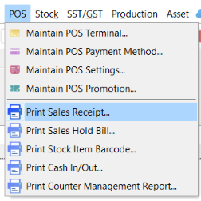

2. Select a **Location**. The default location code is `----`.

   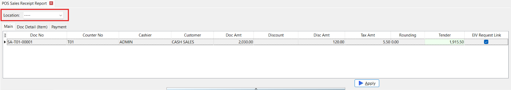

3. Enter sample transaction information in the **Main** tab.

   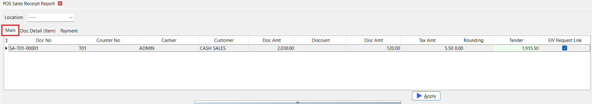

4. Add one or more item lines in the **DocDetail** tab.

   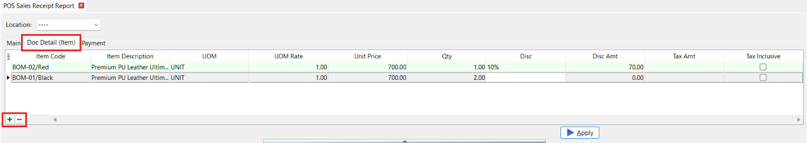

5. Add one or more payment records in the **Payment** tab.

   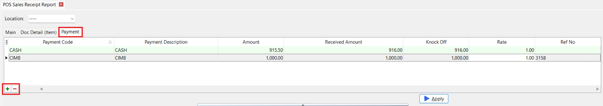

6. Click **Apply** to preview how the receipt will appear in X-Pos Terminal.

   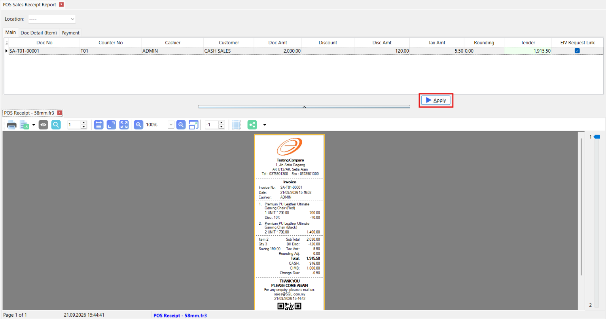

### Available Datasets

| Dataset | Description |
| --- | --- |
| `Main` | Contains one record with the receipt header, transaction totals, and status information. |
| `Document_Detail` | Contains one or more item-line records. It is displayed as **DocDetail** in the preview window. |
| `Payment` | Contains one or more payment records. |

The report can use selected **location code** to retrieve information configured in [**Maintain Location**](../stock/guide.md#maintain-location).

#### Main

| Field | Description |
| --- | --- |
| `DocNo` | Sales document number. |
| `DocDateTime` | Date and time of the transaction. |
| `DocType` | Sales document type. |
| `Cashier` | Cashier or user who processed the transaction. The current user is selected by default. |
| `CustID` | Customer identifier assigned to the transaction. |
| `Promoter` | Promoter assigned to the transaction. |
| `CounterNo` | Counter number from which the transaction was processed. |
| `PriceTag` | Price tag used to retrieve item prices and discounts in `Document_Detail`. |
| `DocAmt` | Final document amount entered for the preview. |
| `Disc` | Overall bill-discount value or expression. |
| `DiscAmt` | Total bill-discount amount entered for the preview. |
| `TaxAmt` | Total tax amount entered for the preview. |
| `Rounding` | Rounding adjustment entered for the preview. |
| `Tender` | Amount tendered by the customer. |
| `VoidAt` | Date and time at which the transaction was voided. |
| `VoidBy` | User who voided the transaction. |
| `VoidDesc` | Description or remark recorded for the voided transaction. |
| `Remark` | General transaction remark. |
| `Reason` | Reason recorded for the transaction or related action. |
| `RefDoc` | Reference document number. |
| `EIVRequestLink` | E-Invoice request value used to preview a link or QR code. Checked to generate a sample value. |

:::note
The generated `EIVRequestLink` is for previewing the report layout only. It does not create an actual E-Invoice request.
:::

#### Document_Detail

| Field | Description |
| --- | --- |
| `ItemCode` | Stock-item code. Selecting an item retrieves its item information and default pricing. |
| `ItemDesc` | Item description retrieved from the selected stock item. |
| `UOM` | Unit of measurement. The default sales UOM is selected automatically. |
| `UOMRate` | Conversion rate for the selected UOM. The default value is `1`. |
| `UnitPrice` | Selling price retrieved using the selected item, UOM, quantity, and price tag. |
| `BatchNo` | Batch number assigned to the item. |
| `SerialNumber` | Serial number assigned to the item. |
| `Group` | Stock group retrieved from the selected item. |
| `Remark2` | Additional description retrieved from **Description 2** of the selected item. |
| `Qty` | Item quantity. The default value is `1`. |
| `Disc` | Item-discount value or expression. An applicable price discount may be retrieved automatically. |
| `DiscAmt` | Item-discount amount entered for the preview. |
| `TaxId` | Tax code applied to the item line. |
| `TaxRate` | Tax rate entered for the item line. |
| `TaxAmt` | Tax amount entered for the item line. |
| `TaxInclusive` | Indicates whether tax is included in the item price. It is cleared by default. |
| `DiscountedPrice` | Item price after discount, entered for the preview. |
| `FinalPrice` | Final item price entered for the preview. |

:::info[Automatic Item Information]
Selecting an `ItemCode` retrieves the `ItemDesc`, `Remark2`, `Group`, `UOM`, `UOMRate`, `UnitPrice`, and `Disc`.

Changing the `UOM` refreshes its rate and selling price.
:::

#### Payment

| Field | Description |
| --- | --- |
| `PMCode` | Payment-method code. Selecting a payment method retrieves its description. |
| `PMDesc` | Payment-method description retrieved from the selected `PMCode`. |
| `DateTime` | Date and time at which the payment was recorded. |
| `Amount` | Payment amount in the selected payment currency. |
| `ReceivedAmount` | Amount received from the customer. |
| `KnockOff` | Payment amount applied against the sales document. |
| `Rate` | Currency exchange rate used for the payment. |
| `RefNo` | Payment reference number. |

## Print Sales Hold Bill

Use this section to preview a hold-bill receipt. Enter sample values into the `Main` and `Document_Detail` datasets to simulate a held transaction.

A hold bill has not been completed, so it does not contain a `Payment` dataset.

### How to Print Sales Hold Bill

1. From the main menu, go to **POS → Print Sales Hold Bill**.

   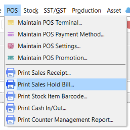

2. Select a **Location**. The default location code is `----`.

   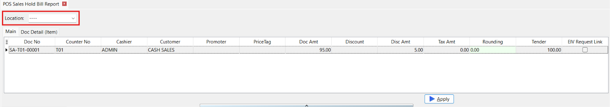

3. Enter sample transaction information in the **Main** tab.

   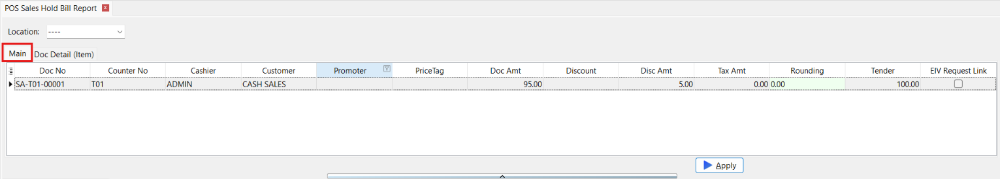

4. Add one or more item lines in the **DocDetail** tab.

   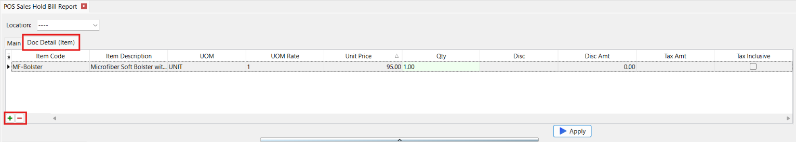

5. Click **Apply** to preview how the hold-bill receipt will appear in X-Pos Terminal.

   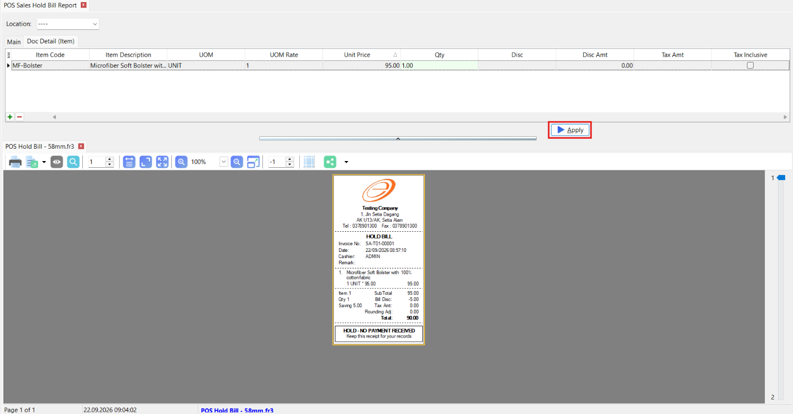

### Available Datasets

| Dataset | Description |
| --- | --- |
| `Main` | Contains one record with the hold-bill header, totals, and status information. |
| `Document_Detail` | Contains one or more item-line records. It is displayed as **DocDetail** in the preview window. |

The report can use selected **location code** to retrieve information configured in [**Maintain Location**](../stock/guide.md#maintain-location).

#### Main

| Field | Description |
| --- | --- |
| `DocNo` | Hold-bill document number. |
| `DocDateTime` | Date and time at which the bill was placed on hold. |
| `DocType` | Document type. |
| `Cashier` | Cashier or user who created the hold bill. The current user is selected by default. |
| `CustID` | Customer identifier assigned to the hold bill. |
| `Promoter` | Promoter assigned to the hold bill. |
| `CounterNo` | Counter number from which the hold bill was created. |
| `PriceTag` | Price tag used to retrieve item prices and discounts in `Document_Detail`. |
| `DocAmt` | Current document amount entered for the preview. |
| `Disc` | Overall bill-discount value or expression. |
| `DiscAmt` | Total bill-discount amount entered for the preview. |
| `TaxAmt` | Total tax amount entered for the preview. |
| `Rounding` | Rounding adjustment entered for the preview. |
| `Tender` | Tender amount entered for the preview. |
| `VoidAt` | Date and time at which the document was voided, if applicable. |
| `VoidBy` | User who voided the document, if applicable. |
| `VoidDesc` | Description or remark recorded for the voided document. |
| `Remark` | General hold-bill remark. |
| `Reason` | Reason recorded for the document or related action. |
| `RefDoc` | Reference document number. |
| `EIVRequestLink` | Sample E-Invoice request value used by the report template. |
| `RequestLink` | Indicates whether the report should display the E-Invoice request link or QR code. |

#### Document_Detail

| Field | Description |
| --- | --- |
| `ItemCode` | Stock-item code. Selecting an item retrieves its item information and default pricing. |
| `ItemDesc` | Item description retrieved from the selected stock item. |
| `UOM` | Unit of measurement. The default sales UOM is selected automatically. |
| `UOMRate` | Conversion rate for the selected UOM. The default value is `1`. |
| `UnitPrice` | Selling price retrieved using the selected item, UOM, quantity, and price tag. |
| `BatchNo` | Batch number assigned to the item. |
| `SerialNumber` | Serial number assigned to the item. |
| `Group` | Stock group retrieved from the selected item. |
| `Remark2` | Additional description retrieved from **Description 2** of the selected item. |
| `Qty` | Item quantity. The default value is `1`. |
| `Disc` | Item-discount value or expression. An applicable price discount may be retrieved automatically. |
| `DiscAmt` | Item-discount amount entered for the preview. |
| `TaxId` | Tax code applied to the item line. |
| `TaxRate` | Tax rate entered for the item line. |
| `TaxAmt` | Tax amount entered for the item line. |
| `TaxInclusive` | Indicates whether tax is included in the item price. It is cleared by default. |
| `DiscountedPrice` | Item price after discount, entered for the preview. |
| `FinalPrice` | Final item price entered for the preview. |

:::info[Automatic Item Information]
Selecting an `ItemCode` retrieves the `ItemDesc`, `Remark2`, `Group`, `UOM`, `UOMRate`, `UnitPrice`, and `Disc`.

Changing the `UOM` refreshes its rate and selling price.
:::

## Print Stock Item Barcode

Use this section to preview stock-item barcode labels. Add sample records to the `Main` dataset to check the barcode content and label layout.

### How to Print Stock Item Barcode

1. From the main menu, go to **POS → Print Stock Item Barcode**.

   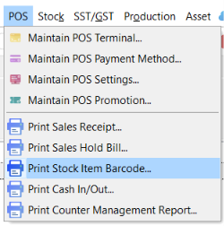

2. Add one or more rows to the item grid.

   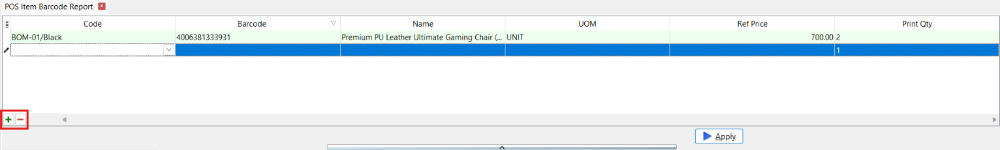

3. Select a stock item under `Code`.

   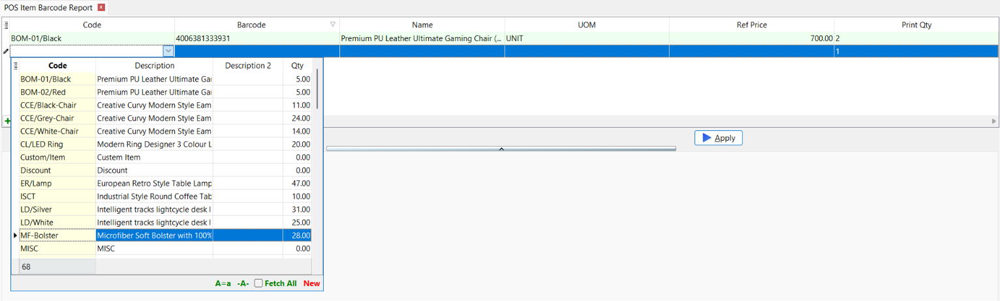

4. Confirm the automatically retrieved item information and default `UOM`.
5. Change the `UOM` if a barcode for another UOM is required.
6. Enter an `ExpiryDate`, if applicable.
7. Enter the number of labels under `PrintQty`. The default value is `1`.
8. Click **Apply** to preview how the barcode labels will appear in X-Pos Terminal.

   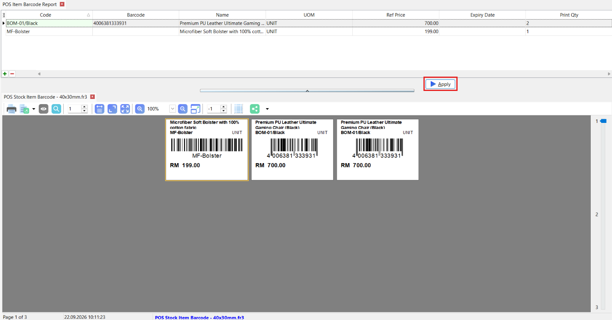

:::tip Manual Entry
Instead of selecting an existing stock item, you can manually enter the **Barcode**, **Name**, **Expiry Date**, **Ref Price** and **Print Qty** directly into the grid. This is useful for previewing a label before the item exists in the system, or for a one-off label that doesn't need a stock record.
:::

### Available Datasets

| Dataset | Description |
| --- | --- |
| `Main` | Contains one or more stock-item barcode records. |

#### Main

| Field | Description |
| --- | --- |
| `Barcode` | Barcode retrieved for the selected item and UOM. |
| `Code` | Stock-item code. Selecting an item retrieves its descriptions, remarks, default UOM, UOM rate, reference price, and barcode. |
| `Name` | Item name retrieved from the item's main description. |
| `Description2` | Second item description. |
| `Description3` | Third or extended item description. |
| `Remark1` | First item remark. |
| `Remark2` | Second item remark. |
| `UOM` | Unit of measurement represented by the barcode. The default sales UOM is selected automatically. |
| `Rate` | Conversion rate for the selected UOM. |
| `RefPrice` | Reference selling price for the selected UOM. |
| `ExpiryDate` | Expiry date to display on the barcode label. |
| `PrintQty` | Number of labels to print. The default value is `1`. |

:::info[Automatic Barcode Information]
Selecting a stock item retrieves the `Name`, `Description2`, `Description3`, `Remark1`, `Remark2`, `UOM`, `Rate`, `RefPrice`, and `Barcode`

Changing the `UOM` refreshes `Rate`, `RefPrice`, and `Barcode`. If more than one barcode exists for the selected item and UOM, the first available barcode is used.
:::

## Print Cash In / Cash Out

Use this section to preview a cash-in or cash-out receipt. Enter sample values into the `CashFlow` dataset to simulate a cash movement.

### How to Print Cash In / Cash Out

1. From the main menu, go to **POS → Print Cash In / Cash Out**.

   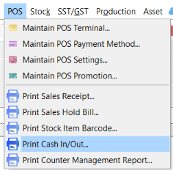

2. Select a **Location**. The default location code is `----`.

   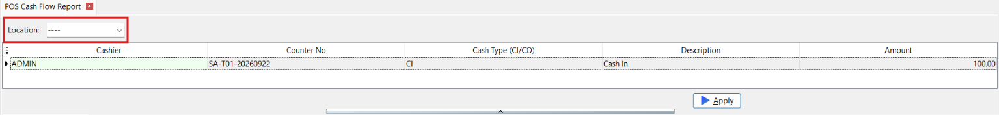

3. Select or enter the user under `Cashier`.

   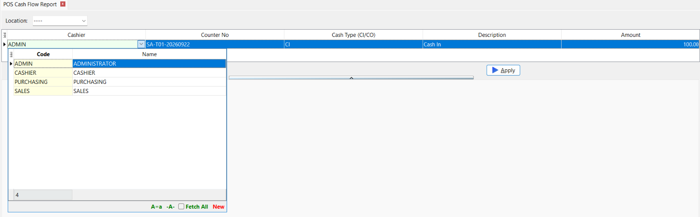

4. Enter the counter number.
5. Set the cash-flow `Type`, such as `CI` for Cash In or `CO` for Cash Out.
6. Enter a description and amount.
7. Click **Apply** to preview how the cash-in or cash-out receipt will appear in X-Pos Terminal.

   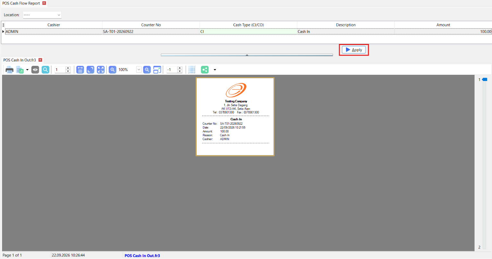

### Available Datasets

| Dataset | Description |
| --- | --- |
| `CashFlow` | Contains one record with the cash-movement details. |

The report can use selected **location code** to retrieve information configured in [**Maintain Location**](../stock/guide.md#maintain-location).

#### CashFlow

| Field | Description |
| --- | --- |
| `Code` | User or operator code associated with the cash movement. A user lookup is available for this field. |
| `CounterNo` | Counter number associated with the cash movement. |
| `DocDateTime` | Date and time at which the cash movement was recorded. |
| `Type` | Cash-flow type code, such as `CI` for Cash In or `CO` for Cash Out. |
| `Description` | Description or reason for the cash movement. |
| `Amount` | Amount added to or removed from the counter. |

## Print Counter Management Report

Use this section to preview counter-management reports. Select a report type, then enter sample values into the available datasets to simulate an open or closed counter session.

### How to Print a Counter Management Report

1. From the main menu, go to **POS → Print Counter Management Report**.

   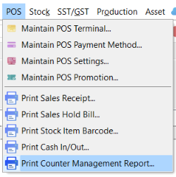

2. Select a **Report Type**:
   - **Open Counter**
   - **Close Counter by ID**
   - **Close Counter by Date**

   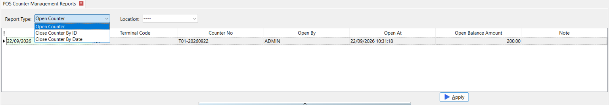

3. Select a **Location**. The default location code is `----`.

   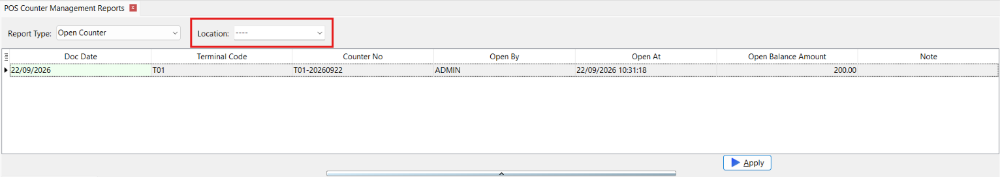

4. Enter sample values into the datasets displayed for the selected report type.
5. Add or update payment records where applicable.
6. Click **Apply** to preview how the counter-management report will appear in X-Pos Terminal.

   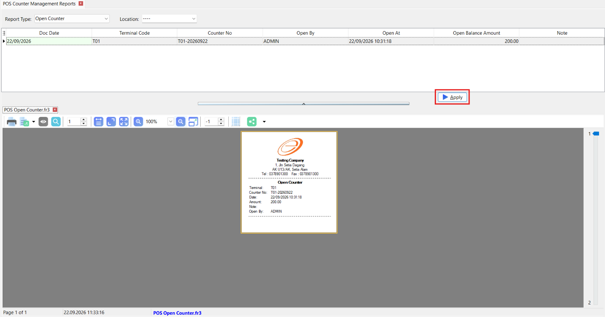

#### Report Types

| Report Type | Available Datasets | Description |
| --- | --- | --- |
| **Open Counter** | `CtrLog` | Previews the opening details of one counter session. |
| **Close Counter by ID** | `CtrLog`, `CtrPayment`, `DefaultCashDetail`, `Summary` | Previews the closing details of one counter session. |
| **Close Counter by Date** | `CtrLog`, `CtrPayment`, `DefaultCashDetail`, `Summary` | Previews a counter-closing summary for a date range. |

The report can use selected **location code** to retrieve information configured in [**Maintain Location**](../stock/guide.md#maintain-location).

### Open Counter Datasets

#### CtrLog

   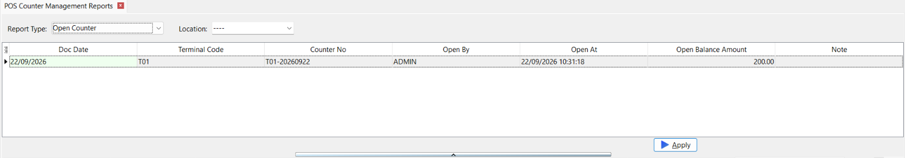

| Field | Description |
| --- | --- |
| `CounterNo` | Counter number. |
| `DocDate` | Counter-session date. |
| `TerminalCode` | Code of the terminal used to open the counter. |
| `OpenBy` | User who opened the counter. A user lookup is available for this field. |
| `OpenAt` | Date and time at which the counter was opened. |
| `OpenBal` | Opening cash balance. |
| `Note` | Note recorded when the counter was opened. |

### Close Counter by ID Datasets

#### CtrLog

   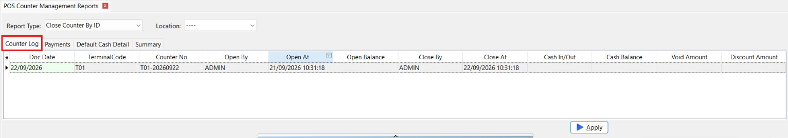

| Field | Description |
| --- | --- |
| `Autokey` | Internal identifier of the counter session. |
| `CounterNo` | Counter number. |
| `DocDate` | Counter-session date. |
| `TerminalCode` | Code of the terminal used for the counter session. |
| `OpenBy` | User who opened the counter. A user lookup is available for this field. |
| `OpenAt` | Date and time at which the counter was opened. |
| `OpenBal` | Opening cash balance. |
| `Note` | Note recorded for the counter session. |
| `CloseBy` | User who closed the counter. A user lookup is available for this field. |
| `CloseAt` | Date and time at which the counter was closed. |
| `CashInOut` | Net cash-in and cash-out amount for the counter session. |
| `CashBal` | Cash balance for the counter session. |
| `VoidAmt` | Total value of voided transactions. |
| `TaxAmt` | Total tax amount. |
| `DiscAmt` | Total discount amount. |
| `SalesReturnAmt` | Total sales-return amount. |
| `CountBill` | Number of sales bills processed. |
| `CountVoid` | Number of voided bills. |
| `CountCN` | Number of credit notes. |

#### CtrPayment

   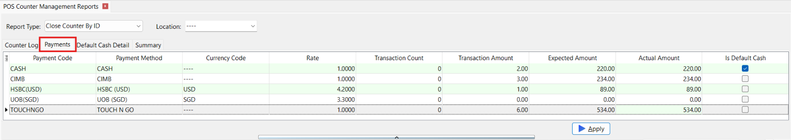

The `CtrPayment` dataset is automatically populated with the active X-Pos payment methods configured in SQL Account.

| Field | Description |
| --- | --- |
| `PMCode` | Payment-method code. |
| `PaymentMethod` | Payment-method description. |
| `CurrencyCode` | Currency assigned to the payment method. |
| `Rate` | Current selling rate for the payment currency. |
| `TransactionCount` | Number of transactions processed using the payment method. |
| `TransactionAmt` | Total transaction amount for the payment method. |
| `ExpectedAmt` | Amount expected according to the recorded transactions. |
| `ActualAmt` | Amount counted or entered when closing the counter. |
| `IsDefaultCash` | Indicates whether the payment method is the default cash method. `1` represents yes and `0` represents no. |

The payment code, description, currency, rate, and default-cash status are retrieved automatically. The transaction count and amounts default to zero for the preview.

#### DefaultCashDetail

   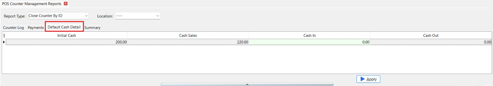

| Field | Description |
| --- | --- |
| `InitialCash` | Cash balance entered when the counter was opened. |
| `CashSales` | Total cash received from sales. |
| `CashIn` | Total cash added to the counter. |
| `CashOut` | Total cash removed from the counter. |

#### Summary

   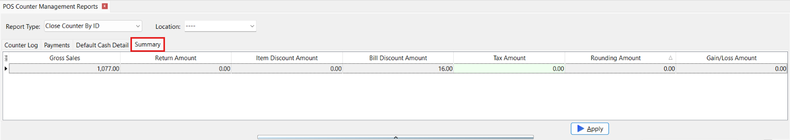

| Field | Description |
| --- | --- |
| `GrossSales` | Total sales amount before returns and discounts. |
| `ReturnAmt` | Total sales-return amount. |
| `ItemDiscAmt` | Total discount applied to individual items. |
| `BillDiscAmt` | Total discount applied to entire bills. |
| `TaxAmt` | Total tax amount. |
| `RoundingAmt` | Total rounding adjustment. |
| `GainLossAmt` | Total gain or loss for the counter session. |

### Close Counter by Date Datasets

#### CtrLog

   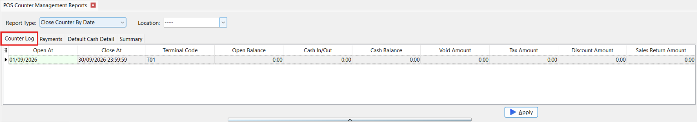

For this report type, `OpenAt` and `CloseAt` define the reporting period instead of the opening and closing times of one counter.

| Field | Description |
| --- | --- |
| `OpenAt` | Start date and time of the reporting period. The default is the start of the current month. |
| `CloseAt` | End date and time of the reporting period. The default is the end of the current month. |
| `TerminalCode` | Terminal code included in the preview. |
| `OpenBal` | Total opening balance for the report. |
| `CashInOut` | Net cash-in and cash-out amount for the reporting period. |
| `CashBal` | Cash balance for the reporting period. |
| `VoidAmt` | Total value of voided transactions. |
| `TaxAmt` | Total tax amount. |
| `DiscAmt` | Total discount amount. |
| `SalesReturnAmt` | Total sales-return amount. |
| `CountBill` | Number of sales bills processed. |
| `CountVoid` | Number of voided bills. |
| `CountCN` | Number of credit notes. |

#### CtrPayment

   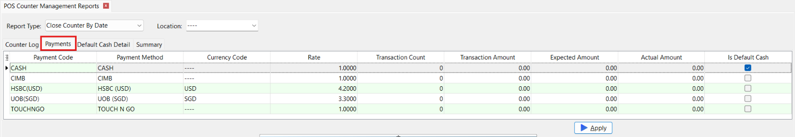

The `CtrPayment` dataset uses the same fields as **Close Counter by ID** and is automatically populated with the active X-Pos payment methods.

| Field | Description |
| --- | --- |
| `PMCode` | Payment-method code. |
| `PaymentMethod` | Payment-method description. |
| `CurrencyCode` | Currency assigned to the payment method. |
| `Rate` | Current selling rate for the payment currency. |
| `TransactionCount` | Number of transactions processed using the payment method. |
| `TransactionAmt` | Total transaction amount for the payment method. |
| `ExpectedAmt` | Amount expected according to the recorded transactions. |
| `ActualAmt` | Amount counted or entered when closing the counter. |
| `IsDefaultCash` | Indicates whether the payment method is the default cash method. `1` represents yes and `0` represents no. |

#### DefaultCashDetail

   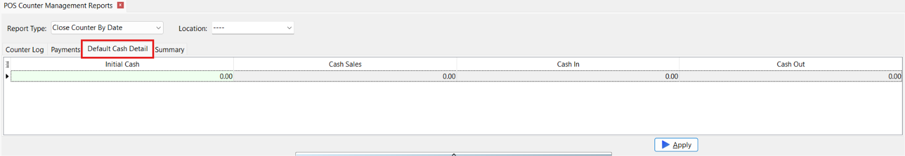

| Field | Description |
| --- | --- |
| `InitialCash` | Total opening cash balance. |
| `CashSales` | Total cash received from sales. |
| `CashIn` | Total cash added during the reporting period. |
| `CashOut` | Total cash removed during the reporting period. |

#### Summary

   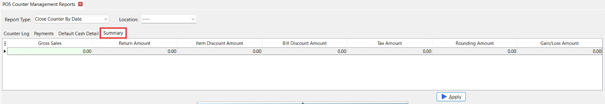

| Field | Description |
| --- | --- |
| `GrossSales` | Total gross sales for the reporting period. |
| `ReturnAmt` | Total sales-return amount. |
| `ItemDiscAmt` | Total item-discount amount. |
| `BillDiscAmt` | Total bill-discount amount. |
| `TaxAmt` | Total tax amount. |
| `RoundingAmt` | Total rounding adjustment. |
| `GainLossAmt` | Total gain or loss for the reporting period. |

## Report Template Checklist

Before synchronizing a report template to X-Pos:

- Select the correct report type.
- Preview the report using representative sample data.
- Test discounts, taxes, multiple payments, returns, voided transactions, and foreign currencies where applicable.
- Check long descriptions and large values for alignment or wrapping issues.
- Confirm the printer, paper size, and page layout.
- Synchronize the terminal metadata after creating or modifying the template.